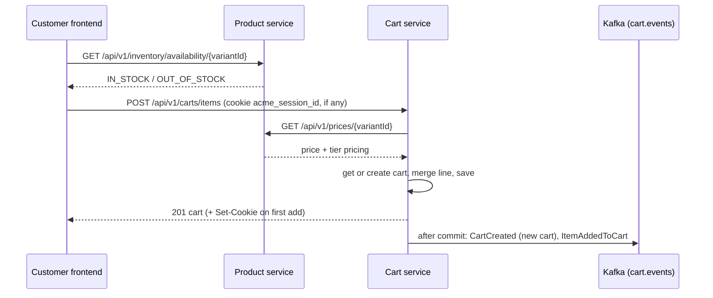

# Architecture Overview

## Patterns

### Microservices

- Decompose the application into small, independently deployable services
- Each service owns its data and business logic
- Services communicate via well-defined APIs (REST, gRPC) or asynchronous messaging
- Enable independent scaling, deployment, and technology choices per service
- Enforce loose coupling through clear service boundaries

### Service Discovery

- Services register themselves with a central registry on startup
- Clients query the registry to locate service instances dynamically
- Supports load balancing across multiple instances of a service
- Handles service health checks and automatic deregistration of unhealthy instances
- Enables zero-downtime deployments and elastic scaling

### Event-Driven Architecture

- Services communicate through asynchronous events rather than synchronous calls
- Events represent facts about what happened in the system
- Producers publish events without knowledge of consumers
- Enables temporal decoupling between services
- Supports replay and audit capabilities through event logs

### CQRS

- Separate read and write models for different optimization strategies
- Commands modify state through the write model
- Queries retrieve data through optimized read models
- Enables independent scaling of read and write workloads
- Supports different data stores optimized for each use case

### Event Sourcing

- Store all changes as a sequence of immutable events
- Reconstruct current state by replaying events
- Provides complete audit trail of all state changes
- Enables temporal queries to view state at any point in time
- Supports rebuilding read models from the event log

### Change Data Capture

- Capture row-level changes from database transaction logs
- Stream changes to downstream systems in near real-time
- Avoid polling and dual-write patterns
- Maintain data consistency across services and data stores
- Enable incremental data synchronization and replication

### Client-Side Resilience (Circuit Breaker)

A failing service should degrade a feature, not the page. The customer app guards calls it
can offer a fallback for with a client-side circuit breaker, so a dependency outage costs
the customer that one capability rather than blocking the journey.

The first application is product search (US-0004-09). Search and the product catalog are
both served by the product service, but they are separate code paths — search goes through
PostgreSQL full-text queries, category browsing reads the `products` table directly — so
category browsing stays usable when search is degraded.

**Implementation**: `frontend-apps/customer/src/lib/searchCircuitBreaker.ts`

```
                  failure #5
   ┌────────┐  ─────────────────►  ┌────────┐
   │ CLOSED │                      │  OPEN  │
   └────────┘  ◄─────────────────  └────────┘
        ▲        probe succeeds         │
        │                               │ 30s elapsed
        │                               ▼
        │         probe fails      ┌───────────┐
        └──────────────────────────│ HALF_OPEN │
                                   └───────────┘
```

| State | Behaviour |
| -- | -- |
| `CLOSED` | Calls pass through; consecutive failures are counted. |
| `OPEN` | Calls are rejected immediately with `CircuitOpenError`, without touching the network. |
| `HALF_OPEN` | A single probe is allowed through to test recovery. |

**Request flow when search is unavailable**:

```
┌──────────┐  search   ┌─────────────────┐   OPEN    ┌──────────────────────┐
│ Customer │ ────────► │ CircuitBreaker  │ ────────► │ CircuitOpenError     │
└──────────┘           └─────────────────┘           └──────────┬───────────┘
                                                                │
                              ┌─────────────────────────────────▼──────────┐
                              │ /search renders:                           │
                              │  • SearchUnavailableBanner (+ retry)       │
                              │  • CategoryFallbackBrowse                  │
                              │      GET /api/v1/categories                │
                              │      GET /api/v1/categories/{name}/products│
                              └────────────────────────────────────────────┘
```

**Configuration**: 5 consecutive failures to open, 30s before a probe, 2s request deadline.

**Design decisions**:

- **Only unhealthy-service errors count.** A 4xx means the service correctly rejected one
  request and says nothing about its health; 5xx, timeouts and network errors count. The
  predicate is passed per call, so the breaker stays generic.
- **`execute` rethrows rather than returning a fallback value.** The fallback renders a
  different component tree from a different endpoint, so routing it through the same typed
  promise as the primary response would misrepresent it. Callers catch and decide.
- **Probes are single-flight.** Concurrent calls arriving in `HALF_OPEN` share one probe
  instead of stampeding a service that may not have recovered.
- **Retries are disabled on guarded queries.** React Query's default `retry: 3` would spend
  four attempts per user action, making a "consecutive failures" threshold meaningless and
  amplifying load on a struggling service.
- **The fallback renders from the first failure**, not from the fifth. The breaker's job is
  to stop calling a service known to be down; leaving the customer with an empty results
  area until the threshold trips would be a worse experience, not a safer one.
- **Breaker state is per-tab and in-memory.** It resets on reload, and it is not currently
  exported to Prometheus — see PIN-270.

**Recovery**: the circuit reopens for probing 30s after it opens, and the next search
closes it if the service responds. Because React Query serves a cached failure for an
unchanged query key, the banner also carries an explicit retry control — otherwise a
customer re-submitting the same term would never trigger a probe.

### Shopping Cart Service

`backend-services/shopping-cart` (port 10304, database `acme_carts`) owns shopping carts
(Epic 009, US-0004-06 onward).

- **Cart identity**: a cart belongs to exactly one owner — a guest session
  (`carts.session_id`) or a signed-in user (`carts.user_id`, the access token's `sub`).
  Only `ACTIVE` carts are resolved; partial unique indexes allow one ACTIVE cart per
  session and per user, so a session whose cart was `MERGED` can start a new guest cart.
- **Signed-in callers (US-0004-08)**: the service verifies identity's `access_token`
  cookie against `GET /.well-known/jwks.json` (Spring OAuth2 resource server; signature,
  `exp`, `iss`, `aud`). Every endpoint stays open to guests: with a valid token the caller
  acts on their user cart, which follows them to any device; without one, on the session's.
  An expired token is `401 {"error":"TOKEN_EXPIRED"}`, which the customer app's API client
  answers by refreshing and retrying; any other bad token is `401 INVALID_TOKEN`.
- **One line per variant**: `cart_items` has a unique `(cart_id, variant_id)`, so adding a
  variant already in the cart increments its quantity rather than adding a line.
- **Product snapshot**: each line stores the product name, SKU, image and attributes as
  JSONB at the time of add, so later catalog changes do not alter what the cart shows.
- **Schema guard**: `SchemaValidationTest` boots Flyway and Hibernate `validate` against a
  Testcontainers Postgres, the same guard the customer and notification services use.

**Add to cart** (`POST /api/v1/carts/items`, US-0004-06):



- **Session cookie**: the cart service, not the browser, mints the session ID and returns
  it as `acme_session_id` (HttpOnly, SameSite=Lax, 30 days, `Secure` unless
  `ACME_CART_COOKIE_SECURE=false`). JavaScript can neither read nor forge it; the frontend
  sends it back with `credentials: "include"`. A cookie value that is not a UUID the
  service could have minted is ignored and replaced.
- **Server-side pricing**: the unit price comes from the product service at the line's new
  total quantity, so crossing a tier threshold reprices the whole line. The request carries
  no price. If the product service is unreachable the add fails with 503 rather than
  guessing a price.
- **Limits**: a variant's total quantity in one cart is capped by
  `acme.cart.max-order-quantity` (default 10); exceeding it is a 422 with the message the
  customer sees. Stock is checked by the frontend before the POST — the product service
  only knows in/out of stock, not quantities (see PIN-273).
- **Frontend**: one TanStack Query entry, `["cart"]` (`hooks/useCart.ts`), is the only
  cart state. The header `CartBadge` loads it with `GET /carts/current` on every page, so
  the count survives reloads and new tabs; `useAddToCart`, `useUpdateCartItem` and
  `useRemoveCartItem` write each response back with `setQueryData` (after cancelling any
  in-flight read, so a stale GET cannot overwrite it), so the badge and the `/cart` page
  update together without a refetch; a 404 on update or remove (the line is already gone,
  e.g. removed in another tab) refetches the cart instead. `useAddToCart` re-checks availability
  before it POSTs. An over-max update is retried at the service's `maxQuantity` and the
  line shows why (US-0004-07 AC-08).
- **Events are best-effort**: published directly to Kafka after the transaction commits,
  as the product service does. A Kafka failure is logged and does not fail the add; there
  is no outbox, so an event can be lost while the cart change is kept.

**Reading and changing the cart** (US-0004-07):

| Endpoint | Result | Event |
| -- | -- | -- |
| `GET /api/v1/carts/current` | 200 with the cart, or 204 when the session has none | — |
| `PATCH /api/v1/carts/{cartId}/items/{itemId}` `{quantity}` | 200 with the cart | `CartItemQuantityUpdated` |
| `DELETE /api/v1/carts/{cartId}/items/{itemId}` | 200 with the cart (possibly empty) | `CartItemRemoved` |

- **Ownership comes from the caller, not the URL**: the cart is looked up by the verified
  user or the session cookie, and a `cartId` in the path that is not that caller's cart is
  a 404 — the same answer as a missing item — so the API never confirms another cart exists.
- **Quantity changes reprice the line** at the new quantity, down a tier as well as up. An
  over-max quantity is a 422 whose body carries `maxQuantity`, so the client can clamp.
  Setting a line to the quantity it already has publishes no `CartItemQuantityUpdated`.
- **204 for "no cart yet"** keeps a first-time visitor's page load (which reads the cart
  for the header badge) free of error responses.

## Observability

### Distributed Tracing

- Propagate correlation IDs across service boundaries for end-to-end request tracking
- Capture spans for each service interaction to visualize request flow
- Measure latency at each hop to identify performance bottlenecks
- Support trace sampling strategies to balance insight with overhead
- Enable root cause analysis across distributed transactions

### Metrics

- Collect RED metrics (Rate, Errors, Duration) for all service endpoints
- Track USE metrics (Utilization, Saturation, Errors) for infrastructure resources
- Expose business metrics alongside technical metrics
- Support dimensional metrics with tags for flexible aggregation
- Enable real-time dashboards for operational visibility

### Logging

- Emit structured logs in a consistent format across all services
- Include correlation IDs to link logs with distributed traces
- Define log levels appropriately (DEBUG, INFO, WARN, ERROR)
- Centralize log aggregation for cross-service querying
- Implement log retention policies aligned with compliance requirements

### Alerting

- Define SLOs (Service Level Objectives) for critical user journeys
- Create alerts based on SLO burn rates rather than static thresholds
- Implement multi-window alerting to reduce false positives
- Establish clear escalation paths and runbooks for each alert
- Support alert suppression during maintenance windows

### Health Checks

- Implement liveness probes to detect crashed or deadlocked services
- Implement readiness probes to manage traffic routing during startup
- Include dependency health in readiness assessments
- Expose health endpoints in a standardized format
- Integrate health status with service discovery for automatic failover

## Authentication & Security

### Multi-Factor Authentication (MFA)

- Support multiple MFA methods (TOTP, SMS) for enhanced account security
- Challenge-based flow: signin returns MFA token, client submits MFA code
- Temporary MFA tokens expire after 5 minutes
- Rate limiting on MFA verification attempts to prevent brute force
- Event-driven audit trail for all MFA operations (MfaVerified, MfaFailed events)

### Device Trust (Remember Device)

Device trust allows users to bypass MFA for 30 days on trusted devices, improving UX while maintaining security.

**Architecture**:

```
┌─────────────┐
│   Browser   │
└──────┬──────┘
       │ 1. POST /signin (email, password, deviceFingerprint)
       │    Cookie: device_trust=trust_abc123
       ▼
┌─────────────────────────────────────────────────────────┐
│           AuthenticateUserUseCase                       │
│                                                         │
│  ┌──────────────────────────────────────────────────┐  │
│  │ 1. Verify email + password                       │  │
│  │ 2. Check if MFA enabled                          │  │
│  │ 3. If device_trust cookie present:              │  │
│  │    - DeviceTrustService.verifyTrust()           │  │
│  │    - Validate: fingerprint + userAgent + expiry │  │
│  │    - If valid: BYPASS MFA                       │  │
│  │    - If invalid: REQUIRE MFA                    │  │
│  │ 4. If no device trust: REQUIRE MFA              │  │
│  └──────────────────────────────────────────────────┘  │
└─────────────────────────────────────────────────────────┘
       │
       ▼
┌──────────────────┐         ┌─────────────────┐
│  Redis           │         │  Kafka          │
│                  │         │                 │
│ device_trusts:   │         │ DeviceRemembered│
│   trust_abc123   │◄────────│ DeviceRevoked   │
│                  │         │                 │
│ TTL: 30 days     │         └─────────────────┘
└──────────────────┘
```

**Device Trust Creation Flow** (after MFA verification with rememberDevice=true):

1. User completes MFA with `rememberDevice` flag set
2. `DeviceTrustService.createTrust()` creates Redis entry:
   - Token ID: UUID (e.g., `trust_abc123`)
   - Device fingerprint: SHA-256 hashed
   - User agent: Stored for validation
   - IP address: Logged but not enforced
   - TTL: 30 days (auto-expires via Redis `@TimeToLive`)
3. System sets `device_trust` cookie (HttpOnly, Secure, SameSite=Strict)
4. Publishes `DeviceRemembered` event to Kafka
5. Enforces max 10 devices per user (FIFO eviction)

**Device Trust Verification Flow** (signin with device_trust cookie):

1. Extract `device_trust` cookie from request
2. Look up token in Redis by ID
3. Validate:
   - Token exists and not expired
   - Fingerprint matches (SHA-256 hash comparison)
   - User agent matches (exact string match)
   - IP address NOT validated (mobile networks change IPs)
4. If all valid: Update `lastUsedAt` timestamp and bypass MFA
5. If any invalid: Silently fail and require MFA

**Device Management API**:

- `GET /api/v1/auth/devices` - List all trusted devices for user
- `DELETE /api/v1/auth/devices/{id}` - Revoke single device
- `DELETE /api/v1/auth/devices` - Revoke all devices
- Authentication: JWT from `access_token` cookie
- Authorization: Users can only manage their own devices

**Security Considerations**:

- **HttpOnly cookies**: Prevent XSS attacks by blocking JavaScript access
- **Fingerprint + User agent validation**: Prevent token theft across devices
- **SHA-256 hashing**: Protect fingerprints if Redis is compromised
- **30-day expiry**: Limit exposure window for compromised tokens
- **Max 10 devices**: Prevent unbounded token accumulation
- **Browser updates invalidate trust**: User agent changes force re-authentication
- **IP not enforced**: Mobile-friendly (VPNs, cell towers change IPs)
- **Password change revokes all**: Future integration (password change not yet implemented)
- **Event-driven audit**: Complete history for compliance and forensics

**Related ADRs**: See [ADR-0039](adrs/0039-device-trust-implementation.md) for detailed design decisions.

### Session Management

- JWT-based access tokens (15-minute expiry) and refresh tokens (7-day expiry)
- Tokens delivered via HttpOnly cookies to prevent XSS attacks
- Redis-backed session storage with automatic TTL expiration
- Maximum 5 concurrent sessions per user (oldest evicted when limit exceeded)
- Session invalidation on signout and password change
- Session metadata tracks: IP address, user agent, created/last accessed timestamps

### Token Security

- RSA-2048 asymmetric key pairs for JWT signing and verification
- Key rotation support through versioned key storage
- Tokens include: issuer, subject (userId), expiration, issued-at claims
- Refresh token rotation on use (single-use tokens)
- Token revocation through Redis blacklist for compromised tokens
- **Public keys for other services**: identity serves `GET /.well-known/jwks.json`
  (`api/JwksController.kt`) — the public halves of the current and retained previous
  signing keys, keyed by `kid`. Other services verify access tokens locally against it
  instead of calling identity per request. Because keys are regenerated on restart, a
  verifier must re-fetch the set when it meets an unknown `kid`.

### CORS and Browser-Facing Backend URLs

- The customer frontend calls the identity, customer, product and shopping cart services directly from the browser
- Backend URLs are baked in at build time via `VITE_*_SERVICE_URL` (see `frontend-apps/customer/src/services/api.ts`); unset means `http://localhost:<port>`
- Each service's `CorsConfig` allows the localhost frontend origins plus any comma-separated origins in `ACME_CORS_EXTRA_ORIGINS` (property `acme.cors.extra-origins`)
- To expose the frontend on a Tailscale tailnet, serve the frontend and each backend with `tailscale serve`, then rebuild with those URLs:

```bash
T=https://<host>.<tailnet>.ts.net
tailscale serve --bg 7600                    # customer frontend
tailscale serve --bg --https=8443 10300      # identity
tailscale serve --bg --https=8444 10301      # customer
tailscale serve --bg --https=8445 10303      # product
tailscale serve --bg --https=8446 10304      # shopping cart
export VITE_IDENTITY_SERVICE_URL=$T:8443 VITE_CUSTOMER_SERVICE_URL=$T:8444 \
       VITE_PRODUCT_SERVICE_URL=$T:8445 VITE_INVENTORY_SERVICE_URL=$T:8445 \
       VITE_PRICING_SERVICE_URL=$T:8445 VITE_CART_SERVICE_URL=$T:8446 \
       ACME_CORS_EXTRA_ORIGINS=$T
zsh scripts/docker-manage.sh apps-build && zsh scripts/docker-manage.sh apps-up
```
