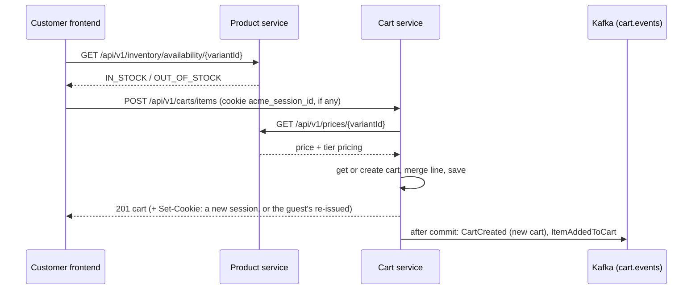

# Architecture Overview

## Patterns

### Microservices

- Decompose the application into small, independently deployable services
- Each service owns its data and business logic
- Services communicate via well-defined APIs (REST, gRPC) or asynchronous messaging
- Enable independent scaling, deployment, and technology choices per service
- Enforce loose coupling through clear service boundaries

### Service Discovery

- Services register themselves with a central registry on startup
- Clients query the registry to locate service instances dynamically
- Supports load balancing across multiple instances of a service
- Handles service health checks and automatic deregistration of unhealthy instances
- Enables zero-downtime deployments and elastic scaling

### Event-Driven Architecture

- Services communicate through asynchronous events rather than synchronous calls
- Events represent facts about what happened in the system
- Producers publish events without knowledge of consumers
- Enables temporal decoupling between services
- Supports replay and audit capabilities through event logs

### CQRS

- Separate read and write models for different optimization strategies
- Commands modify state through the write model
- Queries retrieve data through optimized read models
- Enables independent scaling of read and write workloads
- Supports different data stores optimized for each use case

### Event Sourcing

- Store all changes as a sequence of immutable events
- Reconstruct current state by replaying events
- Provides complete audit trail of all state changes
- Enables temporal queries to view state at any point in time
- Supports rebuilding read models from the event log

### Change Data Capture

- Capture row-level changes from database transaction logs
- Stream changes to downstream systems in near real-time
- Avoid polling and dual-write patterns
- Maintain data consistency across services and data stores
- Enable incremental data synchronization and replication

### Client-Side Resilience (Circuit Breaker)

A failing service should degrade a feature, not the page. The customer app guards calls it
can offer a fallback for with a client-side circuit breaker, so a dependency outage costs
the customer that one capability rather than blocking the journey.

The first application is product search (US-0004-09). Search and the product catalog are
both served by the product service, but they are separate code paths — search goes through
PostgreSQL full-text queries, category browsing reads the `products` table directly — so
category browsing stays usable when search is degraded.

**Implementation**: `frontend-apps/customer/src/lib/searchCircuitBreaker.ts`

```
                  failure #5
   ┌────────┐  ─────────────────►  ┌────────┐
   │ CLOSED │                      │  OPEN  │
   └────────┘  ◄─────────────────  └────────┘
        ▲        probe succeeds         │
        │                               │ 30s elapsed
        │                               ▼
        │         probe fails      ┌───────────┐
        └──────────────────────────│ HALF_OPEN │
                                   └───────────┘
```

| State | Behaviour |
| -- | -- |
| `CLOSED` | Calls pass through; consecutive failures are counted. |
| `OPEN` | Calls are rejected immediately with `CircuitOpenError`, without touching the network. |
| `HALF_OPEN` | A single probe is allowed through to test recovery. |

**Request flow when search is unavailable**:

```
┌──────────┐  search   ┌─────────────────┐   OPEN    ┌──────────────────────┐
│ Customer │ ────────► │ CircuitBreaker  │ ────────► │ CircuitOpenError     │
└──────────┘           └─────────────────┘           └──────────┬───────────┘
                                                                │
                              ┌─────────────────────────────────▼──────────┐
                              │ /search renders:                           │
                              │  • SearchUnavailableBanner (+ retry)       │
                              │  • CategoryFallbackBrowse                  │
                              │      GET /api/v1/categories                │
                              │      GET /api/v1/categories/{name}/products│
                              └────────────────────────────────────────────┘
```

**Configuration**: 5 consecutive failures to open, 30s before a probe, 2s request deadline.

**Design decisions**:

- **Only unhealthy-service errors count.** A 4xx means the service correctly rejected one
  request and says nothing about its health; 5xx, timeouts and network errors count. The
  predicate is passed per call, so the breaker stays generic.
- **`execute` rethrows rather than returning a fallback value.** The fallback renders a
  different component tree from a different endpoint, so routing it through the same typed
  promise as the primary response would misrepresent it. Callers catch and decide.
- **Probes are single-flight.** Concurrent calls arriving in `HALF_OPEN` share one probe
  instead of stampeding a service that may not have recovered.
- **Retries are disabled on guarded queries.** React Query's default `retry: 3` would spend
  four attempts per user action, making a "consecutive failures" threshold meaningless and
  amplifying load on a struggling service.
- **The fallback renders from the first failure**, not from the fifth. The breaker's job is
  to stop calling a service known to be down; leaving the customer with an empty results
  area until the threshold trips would be a worse experience, not a safer one.
- **Breaker state is per-tab and in-memory.** It resets on reload, and it is not currently
  exported to Prometheus — see PIN-270.

**Recovery**: the circuit reopens for probing 30s after it opens, and the next search
closes it if the service responds. Because React Query serves a cached failure for an
unchanged query key, the banner also carries an explicit retry control — otherwise a
customer re-submitting the same term would never trigger a probe.

### Shopping Cart Service

`backend-services/shopping-cart` (port 10304, database `acme_carts`) owns shopping carts
(Epic 009, US-0004-06 onward).

- **Cart identity**: a cart belongs to exactly one owner — a guest session
  (`carts.session_id`) or a signed-in user (`carts.user_id`, the access token's `sub`).
  Only the owner's *current* cart is resolved: `ACTIVE`, or `CHECKOUT` while locked for
  checkout (`CartStatus.CURRENT`, PIN-329). Partial unique indexes allow one current cart
  per session and per user, so a session whose cart was `MERGED` can start a new guest cart,
  but a cart in checkout can't have a second cart slipped in beside it.
- **Signed-in callers (US-0004-08)**: the service verifies identity's `access_token`
  cookie against `GET /.well-known/jwks.json` (Spring OAuth2 resource server; signature,
  `exp`, `iss`, `aud`, plus `token_use=access` and a UUID `sub`). Every endpoint stays open to guests: with a valid token the caller
  acts on their user cart, which follows them to any device; without one, on the session's.
  An expired token is `401 {"error":"TOKEN_EXPIRED"}`, which the customer app's API client
  answers by refreshing and retrying; any other bad token is `401 INVALID_TOKEN`.
- **One line per variant**: `cart_items` has a unique `(cart_id, variant_id)`, so adding a
  variant already in the cart increments its quantity rather than adding a line.
- **Product snapshot**: each line stores the product name, SKU, image and attributes as
  JSONB at the time of add, so later catalog changes do not alter what the cart shows.
- **Schema guard**: `SchemaValidationTest` boots Flyway and Hibernate `validate` against a
  Testcontainers Postgres, the same guard the customer and notification services use.

**Add to cart** (`POST /api/v1/carts/items`, US-0004-06):


```mermaid
sequenceDiagram
    participant FE as Customer frontend
    participant PS as Product service
    participant CS as Cart service
    participant K as Kafka (cart.events)

    FE->>PS: GET /api/v1/inventory/availability/{variantId}
    PS-->>FE: IN_STOCK / OUT_OF_STOCK
    FE->>CS: POST /api/v1/carts/items (cookie acme_session_id, if any)
    CS->>PS: GET /api/v1/prices/{variantId}
    PS-->>CS: price + tier pricing
    CS->>CS: get or create cart, merge line, save
    CS-->>FE: 201 cart (+ Set-Cookie: a new session, or the guest's re-issued)
    CS->>K: after commit: CartCreated (new cart), ItemAddedToCart
```

- **Session cookie**: the cart service, not the browser, mints the session ID and returns
  it as `acme_session_id` (HttpOnly, SameSite=Lax, 30 days, `Secure` unless
  `ACME_CART_COOKIE_SECURE=false`). JavaScript can neither read nor forge it; the frontend
  sends it back with `credentials: "include"`. A cookie value that is not a UUID the
  service could have minted is ignored and replaced.
- **Sliding expiry and session recovery** (US-0004-12): every cart request made as a guest
  with a valid session re-issues the same cookie with a fresh 30 days, so an active
  shopper's cart does not expire under them; signed-in requests never set it. One
  `GuestSessionInterceptor` on `/api/v1/carts/**` does this for every request that maps to
  a cart endpoint, before the handler runs, so a request rejected as invalid (400) is
  covered too, and no endpoint has to remember it (PIN-288). A path with no endpoint (404),
  or a request Spring rejects while choosing the endpoint (405, 415), gets neither the
  refresh nor the activity, which is safe because the two stay in step. It also records activity (next bullet): extending the cookie and recording
  activity always happen together. `GuestSessionCookies` is the only place the cookie is
  built, for a refresh or a newly minted session. Recovery
  from an expired session happens on the server with no client retry: the browser drops
  the cookie, so the next add mints a new session and cart, and the old items are not
  restored. A valid session with no ACTIVE cart (today, only after a merge) gets a new cart
  on its next add, logged at INFO by cart ID and counted as `cart.session.new_cart`
  (`cart_session_new_cart_total`). The session ID is never logged: it is the only key to a
  guest cart.
- **Idle guest carts expire** (PIN-287): `carts.last_active_at` records when the owner last
  used a cart. Every change sets it, and every guest cart request, including views and
  failed or invalid writes, runs `touchGuestCart` from the interceptor. The query only writes
  when the stored time is more than a day old, so the header badge's read on every page costs
  a no-op UPDATE rather than a row write. Anything that extends the cookie counts as
  activity. V3 backfilled existing carts with the migration time
  rather than `updated_at`, because views had already been extending cookies. Hourly,
  `CartExpiryScheduledTasks` runs `ExpireIdleGuestCartsUseCase`, which moves ACTIVE guest
  carts idle for longer than `acme.cart.guest-ttl` plus a day to `EXPIRED`. The extra day
  covers the daily refresh, so a cart never expires while its cookie could still be valid.
  One setting, `acme.cart.guest-ttl` (default `30d`; startup fails unless it is positive), is
  both the cookie's `Max-Age` and the idle limit. Each cart is expired by a conditional UPDATE that re-checks it is still idle,
  and `CartExpired` is published only for carts that run actually expired (counted as
  `cart.expired`). Rows are kept (Epic 009: soft delete with retention); user and MERGED
  carts never expire. `acme.cart.expiry.enabled=false` turns the job off. Because the cookie
  is always gone before the cart expires, a returning guest just gets a first-visit cart.
  The expiry UPDATE bumps the cart's version, so an add that loaded the cart just before
  the job expired it cannot save it back as ACTIVE; its retry starts a new cart (PIN-278).
- **Concurrent changes** (PIN-278): `carts.version` (V5) is an optimistic lock, mapped with
  `@Version` on `Cart`. Only the aggregate root is versioned: every change goes through
  `Cart.touch()`, so the row, and its version, moves even when only a line changed. Add,
  update, remove and merge are wrapped in `retryOnConflict`, which reruns the change once
  against a fresh read: the transaction only for add, update and remove (a line's price does
  not depend on the cart), the whole merge (its prices depend on the guest cart's lines).
  Hibernate inserts new rows before it checks the version, so two first adds that each create
  the cart, or two adds of the same new variant, lose on a unique key (SQLSTATE 23505)
  instead; `retryOnConflict` treats that as the same conflict. A PATCH that raced a DELETE of
  the same line then answers 404 `CART_ITEM_NOT_FOUND`, which the cart page reloads on
  quietly. A second conflict in a row is a 409 `CART_CONFLICT` (logged as a warning): the
  cart page, and an add to cart, reload the cart, and the message is shown. Events are
  published after the transaction, so a failed attempt publishes nothing. The once-a-day
  activity touch deliberately leaves the version alone, so a page view in one tab never
  conflicts with a change in another.
- **No open session outside a transaction** (PIN-296): `spring.jpa.open-in-view` is off, as
  in the customer, identity and notification services, so a read inside a use case's
  transaction is fresh rather than the copy the request loaded earlier. Every lookup used
  outside a transaction fetches the cart's lines with an entity graph, and
  `CartResponsesOutsideSessionTest` pins that the responses need no session.
- **Retention** (PIN-289): every 6 hours, `CartPurgeScheduledTasks` runs
  `PurgeFinalCartsUseCase`, which deletes EXPIRED and MERGED carts whose `updated_at` (set
  when they expired or merged) is older than `acme.cart.retention` (default `90d`). Their
  lines go too, through the `cart_items` foreign key's `ON DELETE CASCADE`. It is built like
  the expiry job: a projection scan (partial index `ix_carts_final`, V4) and a conditional
  DELETE per cart that re-checks it is still final and old enough, so a cart that is no
  longer final is kept. `CartPurged` is published only for carts it deleted (counted as
  `cart.purged`). ACTIVE carts are never deleted. `acme.cart.purge.enabled=false` turns the
  job off. Debezium only captures `acme_orders`, so these deletes emit no change events.
  The scheduler has two threads (`spring.task.scheduling.pool.size`), so a slow purge run
  never holds up expiry.
- **Error bodies**: `{"error": message, "code": ...}`. `CART_ITEM_NOT_FOUND` and
  `VARIANT_NOT_FOUND` are both 404s; the code lets the client reload quietly for a gone
  line but still explain a delisted variant whose line is still in the cart. A request body
  that fails `@Valid` (`"quantity": 0`) or can't be read (`"quantity": 2.9`, malformed JSON)
  is a 400 `INVALID_REQUEST` whose message names the failing field, e.g.
  `"Invalid request: quantity"`, and never echoes Jackson's own message (PIN-303). A cart or
  item ID in the path that is no UUID is the same 400, naming `cartId` or `itemId` (PIN-305).
  The product service answers an invalid search body or parameter the same way; see its
  **Error bodies** bullet.
- **Server-side pricing**: the unit price comes from the product service at the line's new
  total quantity, so crossing a tier threshold reprices the whole line. The request carries
  no price. If the product service is unreachable the add fails with 503 rather than
  guessing a price.
- **Limits**: a variant's total quantity in one cart is capped by
  `acme.cart.max-order-quantity` (default 10); exceeding it is a 422 with the message the
  customer sees. Stock is checked by the frontend before the POST — the product service
  only knows in/out of stock, not quantities (see PIN-273). A quantity must be a JSON
  integer of at least 1: `0`, `2.9` and even `2.0` are a 400, on add and on update (PIN-279,
  `spring.jackson.deserialization.accept-float-as-int: false`).
- **Frontend**: one TanStack Query entry, `["cart"]` (`hooks/useCart.ts`), is the only
  cart state. The header `CartBadge` loads it with `GET /carts/current` on every page, so
  the count survives reloads and new tabs; `useAddToCart`, `useUpdateCartItem` and
  `useRemoveCartItem` write each response back with `setQueryData` (after cancelling any
  in-flight read, so a stale GET cannot overwrite it), so the badge and the `/cart` page
  update together without a refetch; a 404 on update or remove (the line is already gone,
  e.g. removed in another tab or lost with an expired session) refetches the cart instead,
  without showing an error. `useAddToCart` re-checks availability
  before it POSTs. An over-max update is retried at the service's `maxQuantity` and the
  line shows why (US-0004-07 AC-08). The `/cart` page checks each line's stock with
  `GET /inventory/availability/{variantId}` under the product page's `["availability",
  variantId]` query key, so the two share a cache. An out-of-stock line is dimmed and gets a
  `role="alert"` warning and a labelled Remove button (US-0004-10 AC-05); a failed check
  flags nothing. The page's totals leave flagged lines out, computed in the frontend, and a
  flagged line's quantity can go down but not up (PIN-317). The cart service itself knows
  nothing about stock, so its `summary`, and the header `CartBadge`, still count them.
- **Events are best-effort**: published directly to Kafka after the transaction commits,
  as the product service does. A Kafka failure is logged and does not fail the add; there
  is no outbox, so an event can be lost while the cart change is kept.

**Reading and changing the cart** (US-0004-07):

| Endpoint | Result | Event |
| -- | -- | -- |
| `GET /api/v1/carts/current` | 200 with the cart, or 204 when the session has none | — |
| `PATCH /api/v1/carts/{cartId}/items/{itemId}` `{quantity}` | 200 with the cart | `CartItemQuantityUpdated` |
| `DELETE /api/v1/carts/{cartId}/items/{itemId}` | 200 with the cart (possibly empty) | `CartItemRemoved` |
| `DELETE /api/v1/carts/{cartId}/items` | 200 with the empty cart (PIN-294) | `CartCleared` |

- **Ownership comes from the caller, not the URL**: the cart is looked up by the verified
  user or the session cookie, and a `cartId` in the path that is not that caller's cart is
  a 404 — the same answer as a missing item — so the API never confirms another cart exists.
  Clearing has no item to be missing, so its 404 carries `CART_NOT_FOUND` rather than
  `CART_ITEM_NOT_FOUND`.
- **Clearing keeps the cart**: every line is deleted and the empty cart stays the caller's,
  as when the last line is removed. Clearing a cart that is already empty is not a change:
  nothing is saved and no `CartCleared` is published.
- **Quantity changes reprice the line** at the new quantity, down a tier as well as up. An
  over-max quantity is a 422 whose body carries `maxQuantity`, so the client can clamp.
  Setting a line to the quantity it already has publishes no `CartItemQuantityUpdated`.
- **204 for "no cart yet"** keeps a first-time visitor's page load (which reads the cart
  for the header badge) free of error responses.

**Merging on sign-in** (`POST /api/v1/carts/merge`, US-0004-08):

```mermaid
sequenceDiagram
    participant FE as Customer frontend
    participant CS as Cart service
    participant PS as Product service
    participant K as Kafka (cart.events)

    FE->>CS: POST /api/v1/carts/merge (cookies: access_token, acme_session_id)
    CS->>CS: verify token → user; session → ACTIVE guest cart
    alt no guest cart, or it is empty
        CS-->>FE: user cart unchanged, mergeResult null (204 if the user has no cart)
    else guest cart has lines
        CS->>PS: GET /api/v1/prices/{variantId} for each guest variant
        CS->>CS: sum lines per variant, cap at max, reprice, guest → MERGED (one transaction)
        CS-->>FE: merged user cart + mergeResult
        CS->>K: after commit: CartCreated (if the user had no cart), CartMerged
    end
```

- **Requires a signed-in caller** (401 `SIGN_IN_REQUIRED` otherwise); the guest cart comes
  from the session cookie, never from the request body, since that cookie is HttpOnly.
- **Idempotent**: a MERGED guest cart no longer resolves for its session, so repeating the
  call is a no-op, as is a missing or empty guest cart. No event is published for a no-op.
  The guest cart row is locked (`SELECT … FOR UPDATE`) inside the transaction, so two
  concurrent merges run in turn and the second sees no ACTIVE guest cart.
- **Capping is reported, not hidden**: `mergeResult.quantitiesAdjusted` lists each variant
  whose summed quantity exceeded `acme.cart.max-order-quantity`, for the customer notice.
- **A variant that is gone is left out, not fatal** (PIN-306): a guest line whose variant the
  product service answers 404 `VARIANT_NOT_FOUND` for (e.g. an archived product's) is not
  carried over; any other 404 counts as pricing unavailable and fails the merge. The rest
  merges, the guest cart is still `MERGED`, and `mergeResult.itemsUnavailable` lists each such
  line with its product snapshot, so the notice can name it. `itemsMerged` counts only the
  lines carried over. Any other pricing failure still fails the whole merge.
- The session cookie is left in place: after sign-out the same browser starts a fresh
  guest cart, which the ACTIVE-only unique index allows.
- **Frontend trigger**: `mergeCartAfterSignIn` (`hooks/useCart.ts`) runs after every
  sign-in path (`routes/signin.tsx`, `routes/mfa-verify.tsx`) and is awaited before
  navigating, so the destination never shows the guest cart or races the merge (a
  quantity edit on `/cart` against the old guest cart's id, or an add whose response the
  merge then overwrites). It never throws, so a failed merge does not block sign-in. The header badge has already cached the guest cart before sign-in,
  and the session cookie is HttpOnly, so that cache decides: no guest cart or an empty one
  sends no merge request (AC-09); otherwise it merges, writes the merged cart into
  `["cart"]`, and shows capped quantities and unavailable items in the `CartMergeNotice`
  banner under the header.
  A failed merge is logged and the cart reloads as the user; a merge that returns after
  sign-out is dropped. Sign-out resets `["cart"]`, so the badge falls back to the guest
  cart: none once merged, otherwise the unmerged (empty or failed-merge) guest cart.

**Starting checkout** (`POST /api/v1/carts/{cartId}/checkout`, PIN-329, journey 0005 step 1):

```mermaid
sequenceDiagram
    participant FE as Client
    participant CS as Cart service
    participant PS as Product service
    participant K as Kafka (cart.events)

    FE->>CS: POST /api/v1/carts/{cartId}/checkout
    CS->>CS: owner's cart; empty → 422 CART_EMPTY
    loop each distinct variant
        CS->>PS: GET /api/v1/inventory/availability/{variantId}
    end
    alt a line is OUT_OF_STOCK or NOT_AVAILABLE
        CS-->>FE: 422 CART_VALIDATION_FAILED, validationErrors per line
    else all available
        CS->>CS: re-read, ACTIVE → CHECKOUT, new checkout session (one transaction)
        CS-->>FE: 200 {checkoutSessionId, cartId, status: INITIATED, expiresAt, cart}
        CS->>K: after commit: CheckoutInitiated
    end
```

- **Locked, not hidden**: a `CHECKOUT` cart is still the owner's current cart, so `GET
  /carts/current` returns it with `"status": "CHECKOUT"`. Every change (add, update, remove,
  clear) is refused by `Cart` itself with 409 `CART_LOCKED`, rather than finding no cart and
  starting a second one. Merge on sign-in leaves a guest cart in checkout alone, and refuses
  to merge into an account cart in checkout (409 `CART_LOCKED`).
- **Stock is checked on the server here**, one call per distinct variant against the product
  service's availability endpoint. Its own `VARIANT_NOT_FOUND` 404 (a gone variant or an
  archived product, PIN-306) is `NOT_AVAILABLE`. Any other lookup failure refuses checkout
  with 503 `AVAILABILITY_UNAVAILABLE` rather than skipping the check. The service only knows
  in or out of stock, so there are no quantities and no reservation (PIN-56). The checks run
  outside the transaction, as add-to-cart's pricing does. The transaction's re-read is fresh,
  so it must still be at the version that was checked: a change that lands in between is a
  conflict, and the `retryOnConflict` retry checks the changed cart again.
- **The checkout session** (`carts.checkout_session_id`, `checkout_expires_at`, V6) lasts 30
  minutes and is the cart reference the order service will take. Starting again on a locked
  cart returns the same session, with no re-check and no new event.
- **Nothing unlocks yet**: the expiry job only touches ACTIVE guest carts and the purge job
  only final ones, so a locked cart is neither expired, touched nor purged. Unlocking after
  the 30 minutes, abandoning and resuming are PIN-330; converting the cart when the order is
  placed is PIN-331.

### Product Service

`backend-services/product` (port 10303, database `acme_products`) owns the catalog: products,
their variants, variant images and tier pricing. It serves search, category browsing and
product detail to the customer app, and prices to the cart. Every endpoint is public; there
is no authentication.

| Endpoint | Result |
| -- | -- |
| `POST /api/v1/search` | A page of published products matching the query, with category facets |
| `GET /api/v1/search/autocomplete?q=&limit=` | Up to 5 product and 3 category suggestions |
| `GET /api/v1/categories` | Every category with at least one published product, and its count |
| `GET /api/v1/categories/{name}/products?page=&pageSize=` | A page of the category's published products, newest first |
| `GET /api/v1/products/{slug}` | A published product with its variants and up to 4 in-stock related products; 404 otherwise |
| `GET /api/v1/prices/{variantId}` | `{variantId, price, originalPrice, tierPricing}`; 404 `VARIANT_NOT_FOUND` for an unknown variant or an archived product's |
| `GET /api/v1/inventory/availability/{variantId}` | `{variantId, availability}`, `IN_STOCK` or `OUT_OF_STOCK`; 404 `VARIANT_NOT_FOUND` for an unknown variant or an archived product's |

- **Search request rules** (`SearchRequest.kt`): `query` is required, not blank and at most
  200 characters; `page` ≥ 1 (default 1); `pageSize` 1–100 (default 24); the
  `filters.priceMin`/`priceMax` are ≥ 0. `page` and `pageSize` must be JSON integers, so
  `24.9` and even `24.0` are a 400 (PIN-302, `spring.jackson.deserialization.accept-float-as-int:
  false`). A category name must not contain a comma (`SearchFilters.kt`), since the filter
  is passed to SQL as one comma-joined string. `sort` is `relevance` (default), `price_asc`,
  `price_desc` or `newest`, case-insensitive; an unknown value falls back to `relevance`
  rather than failing.
- **Search** is PostgreSQL full text: `products.search_vector` is a generated `tsvector` over
  name (weight A), description (B) and category (C), matched with `plainto_tsquery('english', …)`
  and ranked by `ts_rank`. Only `PUBLISHED` products are searched (`status` is `PUBLISHED` or
  `ARCHIVED`). A search with no results gets a `spellingSuggestion`: the closest published
  product name by `pg_trgm` similarity, or none if no name scores above 0.1. Category facets
  count matches by query and price only, so they don't narrow as categories are selected;
  if computing them fails, search still answers with empty facets. Autocomplete is a prefix
  `ILIKE` on product names and categories, not full text; `q` must be 2–200 characters, and
  `limit` (1–20, default 8) caps the combined list, products first, so a limit under 8 can
  crowd out the categories.
- **Category browsing** reads `products` directly, never `search_vector`, so it keeps
  working when search is degraded; the customer app falls back to it (see
  [Client-Side Resilience](#client-side-resilience-circuit-breaker)). `page` ≥ 1 (default 1)
  and `pageSize` 1–100 (default 24).
- **Pricing**: a variant's price is its `price_override` if it has one, otherwise its
  product's price. `originalPrice` is the product's price only when the override is lower,
  i.e. the variant is on sale. `tierPricing` lists `{minQuantity, price}` entries in
  ascending `minQuantity`; the product service does not pick a tier, the caller does. The
  cart's `ProductPricingClient` uses this endpoint to price every add, quantity change and
  sign-in merge (see the cart's **Server-side pricing** bullet).
- **Inventory** is a per-variant `in_stock` flag: the service knows in or out of stock, not
  quantities (PIN-273). A product's own `availability` on the detail endpoint, which only
  returns published products, follows the summaries' rule: `IN_STOCK` when it has no
  variants or any variant is in stock, else `OUT_OF_STOCK` (PIN-318); per-variant stock is
  `variants[].inStock`. The price and availability lookups only find a variant whose
  product is `PUBLISHED` (`findByIdAndProductStatus`), so an archived product's variant is a
  404, like an unknown one (PIN-306).
- **Product summaries** (search, category browsing, related products) carry `inStock` and
  `imageUrl` (US-0004-10, PIN-273). A product is out of stock when it has variants and none is
  in stock; one without variants counts as in stock. `imageUrl` is the first image, by
  `display_order`, of the variant the product page opens on (the default, else the oldest).
  Both come from one `findStockSummaries` query per page, so the search queries are unchanged.
  That lookup is best-effort, like the facets: if it fails, it is logged and every product
  shows as in stock with no image, so search and the category fallback keep answering. Related
  products are in stock by query (`findInStockRelatedProducts`), newest first, up to 4, so they
  double as alternatives when the viewed variant is out of stock.
- **Events**: product views (`ProductViewed`) and searches (`SearchExecuted`, plus
  `FiltersApplied` when filters are set) are published to the `product.events` Kafka topic,
  keyed by aggregate ID (the product's ID for a view, a new random ID for each search event),
  with the caller's `X-Session-Id` and `X-Correlation-Id` (a missing or non-UUID correlation
  ID is replaced by a random one). Neither the customer app nor the cart sends these headers
  today, so events carry no session ID and a random correlation ID. The publish waits for
  Kafka's acknowledgement for up to `product.events.publish.timeout-seconds` (default 10),
  after `send` itself may block for Kafka's `max.block.ms` (60s by default; not set here)
  while it has no metadata for the topic, e.g. when the broker is down at startup. So a slow
  broker slows the request, once per event, and a search slower than the customer app's 2s
  deadline counts toward opening its circuit breaker; a failure is logged and never fails it.
- **Open session in view**: `spring.jpa.open-in-view` is on (Spring Boot's default; the cart
  turned it off in PIN-296). The product detail, price and availability controllers read lazy
  associations (variants, images, tier pricing, a variant's product) after the repository
  call returns, so turning it off means loading those inside a transaction first.
- **Error bodies** (`GlobalExceptionHandler`): a search body that fails `@Valid`
  (`"pageSize": 101`) or can't be read (`"pageSize": 24.9`) is a 400
  `{"error": "Invalid request: <field>", "code": "INVALID_REQUEST"}` naming the failing field,
  never Jackson's own message (PIN-303); top-level malformed JSON has no field to name, so its
  message is just `"Invalid request"`. An `IllegalArgumentException`, such as a comma in a
  category name, is a 400 with its own message and the same code. A missing product is a
  404 `{"error": message}`; a missing variant's 404 also carries `"code": "VARIANT_NOT_FOUND"`,
  which is the only 404 the cart treats as a variant that is gone (PIN-306). A path or query
  parameter of the wrong type (`?limit=abc`, a variant ID that is no UUID), outside its
  constraint (`?q=a`, `?limit=21`, `?pageSize=0`) or missing (autocomplete without `q`) is
  the same `INVALID_REQUEST` 400, naming the parameter as sent, e.g. `"Invalid request: q"`,
  never the parser's message (PIN-305).
- **Callers**: the customer app's `productApi`, `categoryApi`, `pricingApi` and
  `inventoryApi` (`services/api.ts`) use every endpoint above; its `VITE_PRODUCT_SERVICE_URL`,
  `VITE_PRICING_SERVICE_URL` and `VITE_INVENTORY_SERVICE_URL` all default to this service.
  The cart calls only `GET /api/v1/prices/{variantId}`.

## Observability

### Distributed Tracing

- Propagate correlation IDs across service boundaries for end-to-end request tracking
- Capture spans for each service interaction to visualize request flow
- Measure latency at each hop to identify performance bottlenecks
- Support trace sampling strategies to balance insight with overhead
- Enable root cause analysis across distributed transactions

### Metrics

- Collect RED metrics (Rate, Errors, Duration) for all service endpoints
- Track USE metrics (Utilization, Saturation, Errors) for infrastructure resources
- Expose business metrics alongside technical metrics
- Support dimensional metrics with tags for flexible aggregation
- Enable real-time dashboards for operational visibility

### Logging

- Emit structured logs in a consistent format across all services
- Include correlation IDs to link logs with distributed traces
- Define log levels appropriately (DEBUG, INFO, WARN, ERROR)
- Centralize log aggregation for cross-service querying
- Implement log retention policies aligned with compliance requirements

### Alerting

- Define SLOs (Service Level Objectives) for critical user journeys
- Create alerts based on SLO burn rates rather than static thresholds
- Implement multi-window alerting to reduce false positives
- Establish clear escalation paths and runbooks for each alert
- Support alert suppression during maintenance windows

### Health Checks

- Implement liveness probes to detect crashed or deadlocked services
- Implement readiness probes to manage traffic routing during startup
- Include dependency health in readiness assessments
- Expose health endpoints in a standardized format
- Integrate health status with service discovery for automatic failover

## Authentication & Security

### Multi-Factor Authentication (MFA)

- Support multiple MFA methods (TOTP, SMS) for enhanced account security
- Challenge-based flow: signin returns MFA token, client submits MFA code
- Temporary MFA tokens expire after 5 minutes
- Rate limiting on MFA verification attempts to prevent brute force
- Event-driven audit trail for all MFA operations (MfaVerified, MfaFailed events)

### Device Trust (Remember Device)

Device trust allows users to bypass MFA for 30 days on trusted devices, improving UX while maintaining security.

**Architecture**:

```
┌─────────────┐
│   Browser   │
└──────┬──────┘
       │ 1. POST /signin (email, password, deviceFingerprint)
       │    Cookie: device_trust=trust_abc123
       ▼
┌─────────────────────────────────────────────────────────┐
│           AuthenticateUserUseCase                       │
│                                                         │
│  ┌──────────────────────────────────────────────────┐  │
│  │ 1. Verify email + password                       │  │
│  │ 2. Check if MFA enabled                          │  │
│  │ 3. If device_trust cookie present:              │  │
│  │    - DeviceTrustService.verifyTrust()           │  │
│  │    - Validate: fingerprint + userAgent + expiry │  │
│  │    - If valid: BYPASS MFA                       │  │
│  │    - If invalid: REQUIRE MFA                    │  │
│  │ 4. If no device trust: REQUIRE MFA              │  │
│  └──────────────────────────────────────────────────┘  │
└─────────────────────────────────────────────────────────┘
       │
       ▼
┌──────────────────┐         ┌─────────────────┐
│  Redis           │         │  Kafka          │
│                  │         │                 │
│ device_trusts:   │         │ DeviceRemembered│
│   trust_abc123   │◄────────│ DeviceRevoked   │
│                  │         │                 │
│ TTL: 30 days     │         └─────────────────┘
└──────────────────┘
```

**Device Trust Creation Flow** (after MFA verification with rememberDevice=true):

1. User completes MFA with `rememberDevice` flag set
2. `DeviceTrustService.createTrust()` creates Redis entry:
   - Token ID: UUID (e.g., `trust_abc123`)
   - Device fingerprint: SHA-256 hashed
   - User agent: Stored for validation
   - IP address: Logged but not enforced
   - TTL: 30 days (auto-expires via Redis `@TimeToLive`)
3. System sets `device_trust` cookie (HttpOnly, Secure, SameSite=Strict)
4. Publishes `DeviceRemembered` event to Kafka
5. Enforces max 10 devices per user (FIFO eviction)

**Device Trust Verification Flow** (signin with device_trust cookie):

1. Extract `device_trust` cookie from request
2. Look up token in Redis by ID
3. Validate:
   - Token exists and not expired
   - Fingerprint matches (SHA-256 hash comparison)
   - User agent matches (exact string match)
   - IP address NOT validated (mobile networks change IPs)
4. If all valid: Update `lastUsedAt` timestamp and bypass MFA
5. If any invalid: Silently fail and require MFA

**Device Management API**:

- `GET /api/v1/auth/devices` - List all trusted devices for user
- `DELETE /api/v1/auth/devices/{id}` - Revoke single device
- `DELETE /api/v1/auth/devices` - Revoke all devices
- Authentication: JWT from `access_token` cookie
- Authorization: Users can only manage their own devices

**Security Considerations**:

- **HttpOnly cookies**: Prevent XSS attacks by blocking JavaScript access
- **Fingerprint + User agent validation**: Prevent token theft across devices
- **SHA-256 hashing**: Protect fingerprints if Redis is compromised
- **30-day expiry**: Limit exposure window for compromised tokens
- **Max 10 devices**: Prevent unbounded token accumulation
- **Browser updates invalidate trust**: User agent changes force re-authentication
- **IP not enforced**: Mobile-friendly (VPNs, cell towers change IPs)
- **Password change revokes all**: Future integration (password change not yet implemented)
- **Event-driven audit**: Complete history for compliance and forensics

**Related ADRs**: See [ADR-0039](adrs/0039-device-trust-implementation.md) for detailed design decisions.

### Session Management

- JWT-based access tokens (15-minute expiry) and refresh tokens (7-day expiry)
- Tokens delivered via HttpOnly cookies to prevent XSS attacks
- Redis-backed session storage with automatic TTL expiration
- Maximum 5 concurrent sessions per user (oldest evicted when limit exceeded)
- Session invalidation on signout and password change
- Session metadata tracks: IP address, user agent, created/last accessed timestamps

### Token Security

- RSA-2048 asymmetric key pairs for JWT signing and verification
- Key rotation support through versioned key storage
- Tokens include: issuer, subject (userId), expiration, issued-at claims
- Refresh token rotation on use (single-use tokens)
- Token revocation through Redis blacklist for compromised tokens
- **Public keys for other services**: identity serves `GET /.well-known/jwks.json`
  (`api/JwksController.kt`) — the public halves of the current and retained previous
  signing keys, keyed by `kid`. Other services verify access tokens locally against it
  instead of calling identity per request. Because keys are regenerated on restart, a
  verifier must re-fetch the set when it meets an unknown `kid`.

### CORS and Browser-Facing Backend URLs

- The customer frontend calls the identity, customer, product and shopping cart services directly from the browser
- Backend URLs are baked in at build time via `VITE_*_SERVICE_URL` (see `frontend-apps/customer/src/services/api.ts`); unset means `http://localhost:<port>`
- Each service's `CorsConfig` allows the localhost frontend origins plus any comma-separated origins in `ACME_CORS_EXTRA_ORIGINS` (property `acme.cors.extra-origins`)
- To expose the frontend on a Tailscale tailnet, serve the frontend and each backend with `tailscale serve`, then rebuild with those URLs:

```bash
T=https://<host>.<tailnet>.ts.net
tailscale serve --bg 7600                    # customer frontend
tailscale serve --bg --https=8443 10300      # identity
tailscale serve --bg --https=8444 10301      # customer
tailscale serve --bg --https=8445 10303      # product
tailscale serve --bg --https=8446 10304      # shopping cart
export VITE_IDENTITY_SERVICE_URL=$T:8443 VITE_CUSTOMER_SERVICE_URL=$T:8444 \
       VITE_PRODUCT_SERVICE_URL=$T:8445 VITE_INVENTORY_SERVICE_URL=$T:8445 \
       VITE_PRICING_SERVICE_URL=$T:8445 VITE_CART_SERVICE_URL=$T:8446 \
       ACME_CORS_EXTRA_ORIGINS=$T
zsh scripts/docker-manage.sh apps-build && zsh scripts/docker-manage.sh apps-up
```
