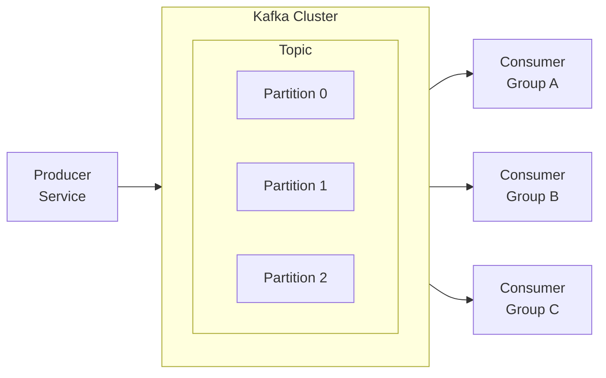

# ADR-0007: Apache Kafka for Event Streaming

## Status

Accepted

## Context

The event-driven architecture requires a messaging infrastructure that:

- Reliably delivers events between services with at-least-once guarantees
- Supports event replay for rebuilding read models and debugging
- Handles high throughput for peak e-commerce traffic (sales events, flash sales)
- Provides durable storage of events for configurable retention periods
- Enables multiple consumers to process the same events independently

Candidates considered:
- **Apache Kafka**: Distributed log with strong durability and replay capabilities
- **RabbitMQ**: Traditional message broker, less suited for event streaming patterns
- **Amazon SNS/SQS**: Managed but lacks replay and log semantics
- **NATS JetStream**: Lightweight streaming but less mature ecosystem
- **Pulsar**: Feature-rich but higher operational complexity

## Decision

We will use **Apache Kafka** as the event streaming platform for all inter-service communication and event distribution.

Topic design:
- **Domain Event Topics**: `{service}.{aggregate}.events` (e.g., `order.order.events`)
- **CDC Topics**: `{server}.{schema}.{table}` (Debezium convention)
- **Internal Topics**: `{service}.internal.{purpose}` for service-internal messaging

Key configuration:
- **Partitioning**: By aggregate ID to ensure ordered processing per aggregate
- **Replication Factor**: 3 for production durability
- **Retention**: 7 days for operational topics, 30 days for audit-relevant topics
- **Compression**: LZ4 for balance of speed and size reduction

Consumer patterns:
- **Consumer Groups**: Each logical consumer has a unique group ID
- **Exactly-Once Semantics**: Enable idempotent producers and transactional consumers
- **Schema Evolution**: All messages use Avro with Schema Registry

## Consequences

### Positive

- **Durability**: Events persist on disk with configurable retention
- **Replay**: Consumers can reprocess historical events from any offset
- **Ordering**: Per-partition ordering guarantees for aggregate event sequences
- **Throughput**: Handles millions of events per second with horizontal scaling
- **Decoupling**: Producers and consumers are temporally decoupled
- **Ecosystem**: Rich tooling, connectors, and stream processing options

### Negative

- **Operational Complexity**: Kafka clusters require significant expertise to operate
- **Resource Intensive**: Requires substantial memory and disk for durability
- **Latency**: Not suited for sub-millisecond latency requirements
- **Learning Curve**: Concepts like partitions, offsets, consumer groups require understanding

### Mitigations

- Use managed Kafka (Confluent Cloud, MSK) for production if operational capacity is limited
- Implement comprehensive monitoring with Prometheus metrics
- Use Schema Registry to manage message format evolution
- Provide team training on Kafka operational patterns
