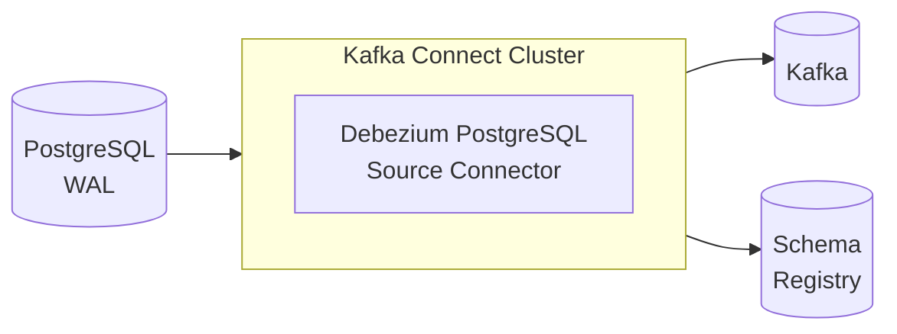

# ADR-0008: Debezium for Change Data Capture

## Status

Accepted

## Context

Our architecture requires streaming database changes to Kafka without the dual-write problem (see ADR-0004). We need a Change Data Capture solution that:

- Captures PostgreSQL changes reliably from the transaction log
- Publishes changes to Kafka in near real-time
- Handles schema changes gracefully
- Supports exactly-once delivery semantics
- Provides monitoring and management capabilities

Candidates considered:
- **Debezium**: Leading open-source CDC platform with broad database support
- **Maxwell**: MySQL-focused, limited PostgreSQL support
- **AWS DMS**: Managed but less flexible and AWS-specific
- **Custom WAL reader**: Maximum control but significant development effort

## Decision

We will use **Debezium** running on Kafka Connect for all Change Data Capture requirements.

Architecture:



Connector configuration principles:
- One connector per service database for isolation
- Use `pgoutput` logical decoding plugin (built into PostgreSQL)
- Enable Schema Registry for Avro serialization
- Configure transforms to extract relevant payload fields

Example connector configuration:
```json
{
  "name": "identity-service-connector",
  "config": {
    "connector.class": "io.debezium.connector.postgresql.PostgresConnector",
    "database.hostname": "postgres",
    "database.port": "5432",
    "database.user": "debezium",
    "database.password": "${vault:secret/debezium:password}",
    "database.dbname": "identity",
    "topic.prefix": "identity",
    "plugin.name": "pgoutput",
    "slot.name": "identity_slot",
    "publication.name": "identity_publication",
    "key.converter": "io.confluent.connect.avro.AvroConverter",
    "value.converter": "io.confluent.connect.avro.AvroConverter"
  }
}
```

## Consequences

### Positive

- **Reliability**: Captures every committed transaction without data loss
- **Low Latency**: Changes streamed within milliseconds of commit
- **No Application Changes**: Works at database level, transparent to application
- **Schema Awareness**: Captures DDL changes and schema evolution
- **Monitoring**: Exposes JMX metrics for operational visibility
- **Ecosystem**: Part of broader Kafka Connect ecosystem with many transforms

### Negative

- **Infrastructure Dependency**: Adds Kafka Connect cluster to manage
- **Replication Slot Management**: Must monitor to prevent WAL bloat
- **Learning Curve**: Connector configuration requires understanding of CDC concepts
- **Resource Usage**: Additional memory for Connect workers

### Mitigations

- Monitor replication slot lag with alerts (e.g., lag > 100MB)
- Use heartbeat events to keep slots active during low-traffic periods
- Test connector configuration in staging before production deployment
- Document connector setup and common troubleshooting procedures
