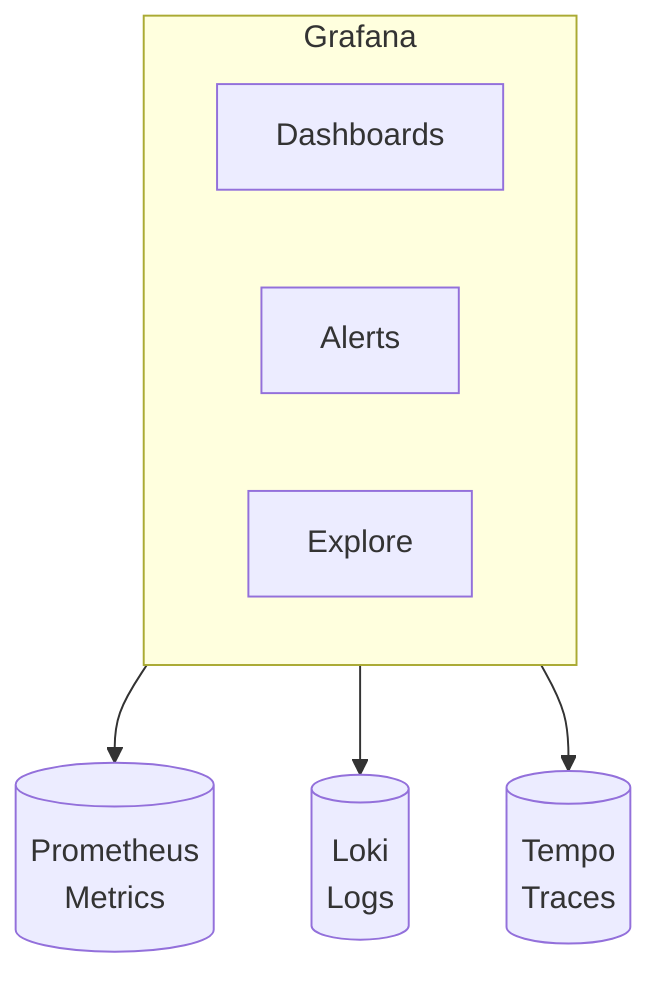

# ADR-0012: Grafana for Observability Dashboards

## Status

Accepted

## Context

With metrics in Prometheus, logs in Loki, and traces in Tempo, we need a unified visualization layer that:

- Provides dashboards for operational monitoring
- Correlates signals across metrics, logs, and traces
- Supports alerting with visual rule management
- Enables self-service dashboard creation for teams
- Offers role-based access for different user types

Candidates considered:
- **Grafana**: Open-source, multi-data-source visualization platform
- **Kibana**: Elasticsearch-focused, less suited for Prometheus
- **Datadog**: Managed but expensive and vendor lock-in
- **Custom dashboards**: Maximum flexibility but high development cost

## Decision

We will use **Grafana** as the unified observability dashboard platform.

Architecture:

Dashboard organization:
- **Service Dashboards**: One per microservice with RED metrics, resource usage
- **Infrastructure Dashboards**: Kafka, PostgreSQL, MongoDB, Vault health
- **Business Dashboards**: Order volume, revenue, user signups
- **SLO Dashboards**: Error budgets, burn rates, compliance status

Dashboard provisioning:
- Dashboards defined as code in Git (JSON or Grafana's provisioning format)
- Automated deployment via ConfigMaps or Grafana provisioning directories
- Version-controlled changes with review process

Key features utilized:
- **Unified Alerting**: Single alerting system across all data sources
- **Explore**: Ad-hoc querying across metrics, logs, and traces
- **Correlations**: Jump from metric spike to relevant logs to distributed trace

## Consequences

### Positive

- **Unified View**: Single pane of glass for metrics, logs, and traces
- **Data Source Agnostic**: Works with Prometheus, Loki, Tempo, and many others
- **Extensibility**: Plugin ecosystem for additional visualizations
- **Collaboration**: Dashboard sharing, annotations, team folders
- **Alerting**: Visual alert rule creation with multiple notification channels
- **Open Source**: No licensing costs, active community

### Negative

- **State Management**: Dashboard state requires backup/restore procedures
- **Learning Curve**: PromQL and LogQL require training
- **Performance**: Large dashboards with many panels can be slow
- **Access Control**: Fine-grained permissions require Grafana Enterprise

### Mitigations

- Use infrastructure-as-code for dashboard provisioning
- Backup Grafana database regularly
- Provide PromQL/LogQL training for engineering teams
- Optimize dashboards with appropriate time ranges and query caching
- Use folder-based access control for team isolation
