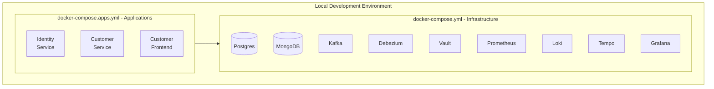

# ADR-0016: Docker Compose for Local Development

## Status

Accepted

## Context

The ACME platform consists of many infrastructure components (databases, message brokers, observability stack) and application services. Developers need a consistent local development environment that:

- Replicates the production architecture closely
- Is easy to set up and tear down
- Works consistently across macOS, Linux, and Windows
- Allows selective service startup for resource efficiency
- Supports rapid iteration on individual services

Candidates considered:
- **Docker Compose**: Standard container orchestration for local development
- **Kubernetes (minikube/kind)**: Production parity but high resource overhead
- **Podman Compose**: Docker-compatible but less mature ecosystem
- **Vagrant**: VM-based, heavier than containers

## Decision

We will use **Docker Compose** for local development environment orchestration.

Architecture:

File organization:
- `docker-compose.yml`: Infrastructure services (databases, Kafka, observability)
- `docker-compose.apps.yml`: Application services
- `.env` / `.env.example`: Environment-specific configuration
- `docker/`: Service-specific configuration (init scripts, config files)

Key design decisions:
- **Separate Compose Files**: Infrastructure and apps managed independently
- **Health Checks**: Services declare health checks for dependency ordering
- **Named Volumes**: Data persists across container restarts
- **Network Isolation**: Services communicate via Docker networks
- **Port Mapping**: Consistent ports for developer familiarity

Management script (`scripts/docker-manage.sh`):
- `start`: Start all services
- `stop`: Stop all services
- `health`: Check health of all services
- `rebuild <service>`: Rebuild and restart specific service
- `logs <service>`: View service logs

## Consequences

### Positive

- **Consistency**: All developers use identical environments
- **Simplicity**: Single command to start entire stack
- **Flexibility**: Start only needed services for resource efficiency
- **Isolation**: Each project runs in its own containers
- **Reproducibility**: Environment defined as code, version controlled

### Negative

- **Resource Usage**: Full stack requires significant memory (8GB+ recommended)
- **Startup Time**: Cold start of all services takes several minutes
- **macOS Performance**: Docker Desktop has I/O performance overhead
- **Complexity**: Many moving parts to understand and troubleshoot

### Mitigations

- Provide scripts for starting minimal subsets of services
- Use volume mounts for hot-reload during development
- Document minimum system requirements
- Implement health checks with appropriate timeouts
- Use `docker-manage.sh` script to simplify common operations
