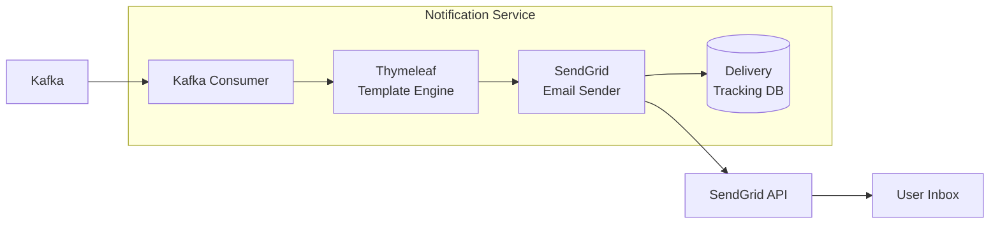

# ADR-0017: SendGrid for Transactional Email

## Status

Accepted

## Context

The e-commerce platform requires a reliable email delivery system for transactional communications:

- **Verification emails** sent immediately after user registration
- **Password reset emails** for account recovery
- **Order confirmations** and shipping notifications
- **Account alerts** for security-related events

Requirements for the email delivery solution:

- High deliverability rates (>99%) to avoid spam folders
- Support for email authentication (SPF, DKIM, DMARC)
- Delivery tracking and webhooks for status updates
- Sandbox mode for testing without sending real emails
- Template support for consistent branding
- API-first approach for programmatic sending
- Scalability for high-volume transactional email

Candidates considered:
- **SendGrid (Twilio)**: Industry-leading email API with strong deliverability
- **Amazon SES**: Cost-effective but requires more setup for deliverability
- **Mailgun**: Good API but less established in enterprise settings
- **Postmark**: Excellent for transactional but limited marketing features
- **SMTP Server (self-hosted)**: Maximum control but operational overhead and deliverability challenges

## Decision

We will use **SendGrid** (via the sendgrid-java SDK) as the transactional email provider for the Notification Service.

Key configuration:

- **API Integration**: Use SendGrid API v3 via official Java SDK
- **Sandbox Mode**: Enable for development and testing environments
- **Templates**: Use Thymeleaf for server-side rendering before sending to SendGrid
- **Tracking**: Capture delivery status via provider message IDs
- **Headers**: Include correlation IDs for distributed tracing

Email categories and configuration:

| Category | Type | Unsubscribe | Retry Policy |
|----------|------|-------------|--------------|
| Verification | Transactional | No | 3x, 5min intervals |
| Password Reset | Transactional | No | 3x, 5min intervals |
| Order Confirmation | Transactional | No | 3x, 5min intervals |
| Marketing | Marketing | Yes | No retry |

Authentication setup:
- **Domain Authentication**: Verify sending domain with DNS records
- **SPF**: Configured via SendGrid DNS records
- **DKIM**: 2048-bit key via SendGrid domain authentication
- **DMARC**: Policy configured at organizational level

## Consequences

### Positive

- **High Deliverability**: SendGrid maintains strong sender reputation and inbox placement
- **Email Authentication**: SPF, DKIM, DMARC handled automatically through domain verification
- **Sandbox Mode**: Safe testing without sending real emails or consuming quotas
- **Comprehensive API**: Full control over email content, headers, and metadata
- **Webhook Support**: Real-time delivery status updates (bounces, opens, clicks)
- **Scalability**: Handles millions of emails without infrastructure concerns
- **Compliance**: GDPR and CAN-SPAM compliance features built-in

### Negative

- **External Dependency**: Reliance on third-party service for critical user communications
- **Cost at Scale**: Per-email pricing can become significant at high volumes
- **Vendor Lock-in**: Integration specific to SendGrid API
- **Latency**: External API calls add latency to email sending operations
- **Rate Limits**: Must handle rate limiting for burst scenarios

### Mitigations

- Implement circuit breaker pattern for SendGrid API calls
- Queue emails for async sending to handle rate limits gracefully
- Track delivery status in local database for operational visibility
- Design email sender interface for easy provider substitution
- Monitor SendGrid service status and alert on degradation
- Use sandbox mode extensively in CI/CD pipelines to avoid accidental sends
