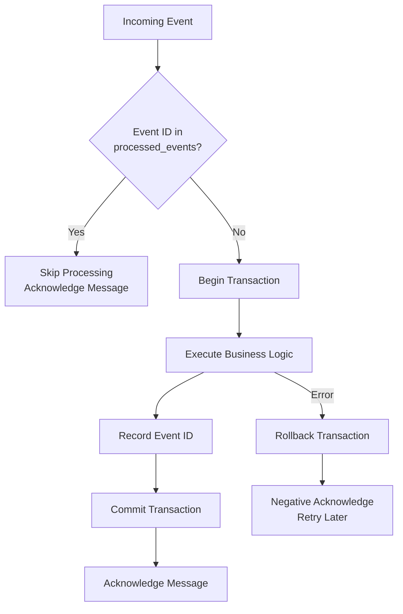

# ADR-0018: Idempotent Event Processing Pattern

## Status

Accepted

## Context

In an event-driven architecture using Apache Kafka (ADR-0007), services consume events to trigger business operations. Kafka provides "at-least-once" delivery semantics, meaning:

- Events may be delivered multiple times due to consumer rebalancing
- Network issues can cause message redelivery
- Consumer crashes after processing but before committing offset
- Manual offset reset for replay scenarios

Without proper handling, duplicate event processing can cause:

- Duplicate records in databases
- Multiple emails sent to users
- Incorrect financial calculations
- Data inconsistency across services

The platform has multiple event consumers that must handle duplicates:
- **Customer Service**: Consumes `UserRegistered` events to create profiles
- **Notification Service**: Consumes `UserRegistered` events to send verification emails
- **Order Service**: Consumes payment and inventory events (future)

## Decision

We will implement **idempotent event processing** using a database-backed processed events registry with transactional guarantees.

Pattern implementation:

```kotlin
@Transactional
fun handle(event: DomainEvent) {
    // 1. Check idempotency within transaction
    if (processedEventRepository.existsByEventId(event.eventId)) {
        logger.info("Event {} already processed, skipping", event.eventId)
        return
    }

    // 2. Execute business logic
    businessLogic.execute(event)

    // 3. Mark event as processed (same transaction)
    processedEventRepository.save(ProcessedEvent(
        eventId = event.eventId,
        eventType = event.eventType,
        processedAt = Instant.now()
    ))
}
```



Database schema for processed events:

```sql
CREATE TABLE processed_events (
    event_id UUID PRIMARY KEY,
    event_type VARCHAR(100) NOT NULL,
    processed_at TIMESTAMP WITH TIME ZONE NOT NULL DEFAULT NOW()
);

CREATE INDEX idx_processed_events_type ON processed_events(event_type);
```

Key design decisions:

- **Event ID as Primary Key**: UUID from the source event ensures uniqueness
- **Transactional Boundary**: Idempotency check and business logic in same transaction
- **Manual Acknowledgment**: Only acknowledge Kafka offset after successful processing
- **Retry on Failure**: Exceptions trigger Kafka retry mechanism (no duplicate protection needed for failures)

Implementation across services:

| Service | Consumer | Event Type | Idempotency Table |
|---------|----------|------------|-------------------|
| Customer Service | UserRegisteredConsumer | UserRegistered | processed_events |
| Notification Service | UserRegisteredConsumer | UserRegistered | processed_events |
| Order Service (Planned) | PaymentCompletedConsumer | PaymentCompleted | processed_events |

## Consequences

### Positive

- **Exactly-Once Semantics**: Business operations execute exactly once per event
- **Safe Replay**: Events can be replayed without side effects
- **Resilience**: Consumer crashes and rebalancing handled gracefully
- **Auditability**: Processed events table provides processing history
- **Consistency**: Database transaction ensures atomicity of check-process-record
- **Simple Implementation**: Pattern is straightforward and easy to understand

### Negative

- **Storage Overhead**: Processed events table grows with event volume
- **Performance Impact**: Additional database read/write per event
- **Cross-Service Complexity**: Each service maintains its own processed events table
- **Retention Management**: Need strategy for cleaning old processed event records

### Mitigations

- Implement scheduled job to purge processed events older than Kafka retention period
- Add database index on `processed_at` for efficient purging
- Monitor processed_events table size as operational metric
- Use batch operations for high-throughput scenarios
- Consider partitioning processed_events table by date for large-scale deployments
