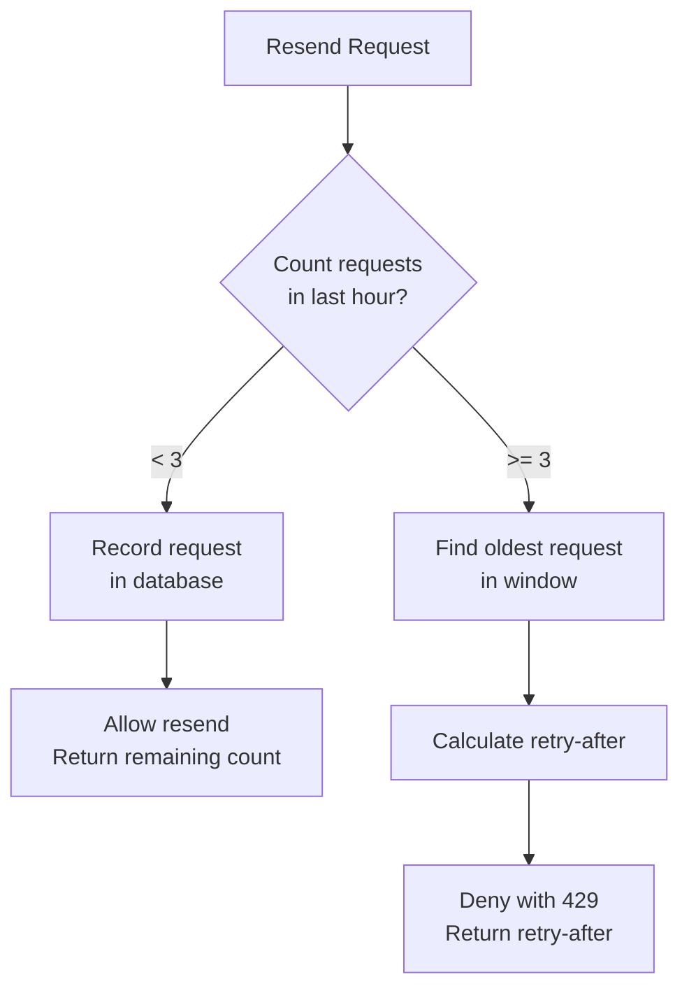

# ADR-0019: Persistent Rate Limiting for Verification Resend

## Status

Accepted

## Context

The email verification resend functionality (US-0002-05) requires rate limiting to prevent abuse:

- Users can request verification email resend up to 3 times per hour
- Rate limits must be enforced consistently across service restarts
- Rate limits must work correctly in multi-instance deployments
- Users should see how many requests they have remaining

The platform already uses Bucket4j with Caffeine cache for registration rate limiting (ADR: RateLimiter in identity service), which provides:

- Fast in-memory token bucket algorithm
- Per-IP rate limiting
- No persistence across restarts

For verification resend, we face different constraints:

- Rate limit is per-email, not per-IP
- Longer time window (1 hour vs 1 minute)
- Users need visibility into remaining requests
- Security implications of repeated resend attempts

Options considered:

1. **In-memory rate limiting (existing pattern)**: Fast but loses state on restart
2. **Redis-backed rate limiting**: Distributed but adds infrastructure dependency
3. **Database-backed rate limiting**: Persistent, auditable, leverages existing infrastructure

## Decision

We will implement **database-backed persistent rate limiting** for verification email resend requests.

Implementation approach:

```kotlin
@Service
class VerificationRateLimiter(
    private val resendRepository: ResendRequestRepository
) {
    fun checkRateLimit(email: String): RateLimitResult {
        val oneHourAgo = Instant.now().minus(1, ChronoUnit.HOURS)
        val recentRequests = resendRepository.countByEmailSince(email, oneHourAgo)

        return if (recentRequests >= MAX_REQUESTS_PER_HOUR) {
            val oldestRequest = resendRepository.findOldestByEmailSince(email, oneHourAgo)
            RateLimitResult.Exceeded(retryAfter = oldestRequest.requestedAt.plus(1, ChronoUnit.HOURS))
        } else {
            RateLimitResult.Allowed(remaining = MAX_REQUESTS_PER_HOUR - recentRequests)
        }
    }
}
```

Database schema:

```sql
CREATE TABLE verification_resend_requests (
    id UUID PRIMARY KEY,
    email VARCHAR(255) NOT NULL,
    ip_address VARCHAR(45),
    requested_at TIMESTAMP WITH TIME ZONE NOT NULL DEFAULT NOW()
);

CREATE INDEX idx_resend_requests_email_time ON verification_resend_requests(email, requested_at);
CREATE INDEX idx_resend_requests_ip_time ON verification_resend_requests(ip_address, requested_at);
```



Key design decisions:

- **Per-Email Limiting**: Rate limit by normalized (lowercase) email address
- **Sliding Window**: Count requests in the last 60 minutes (rolling window)
- **IP Tracking**: Record IP address for security analysis but rate limit by email
- **Remaining Count**: Return requests remaining for user transparency
- **Retry-After Header**: Include HTTP standard header for rate limit response

Comparison with existing rate limiter:

| Aspect | Registration (Existing) | Resend (New) |
|--------|------------------------|--------------|
| Key | IP address | Email address |
| Window | 1 minute | 1 hour |
| Limit | 5 requests | 3 requests |
| Storage | In-memory (Bucket4j) | PostgreSQL |
| Persistence | No | Yes |
| Multi-instance | No (per-instance) | Yes (shared DB) |

## Consequences

### Positive

- **Persistence**: Rate limits survive service restarts and redeployments
- **Consistency**: Works correctly across multiple service instances
- **Auditability**: Complete history of resend requests for security analysis
- **Transparency**: Users see remaining requests and retry time
- **No New Infrastructure**: Leverages existing PostgreSQL database
- **Security**: IP address tracking enables detecting abuse patterns
- **Accurate Window**: Sliding window provides precise rate limiting

### Negative

- **Performance Overhead**: Database query per rate limit check (mitigated by indexing)
- **Storage Growth**: Table grows with each resend request
- **Cleanup Required**: Need periodic purge of old records
- **Latency**: Slightly higher than in-memory rate limiting

### Mitigations

- Efficient indexes on (email, requested_at) for fast queries
- Scheduled job to purge requests older than 24 hours
- Consider adding read replica for rate limit queries if needed
- Monitor query performance and table size as operational metrics
- Cache rate limit results briefly (5-10 seconds) if performance becomes an issue

## Related Decisions

- ADR-0005: PostgreSQL as Command Store
- ADR-0018: Idempotent Event Processing (similar pattern for tracking)
- US-0002-05: Email Verification Processing (source requirement)
