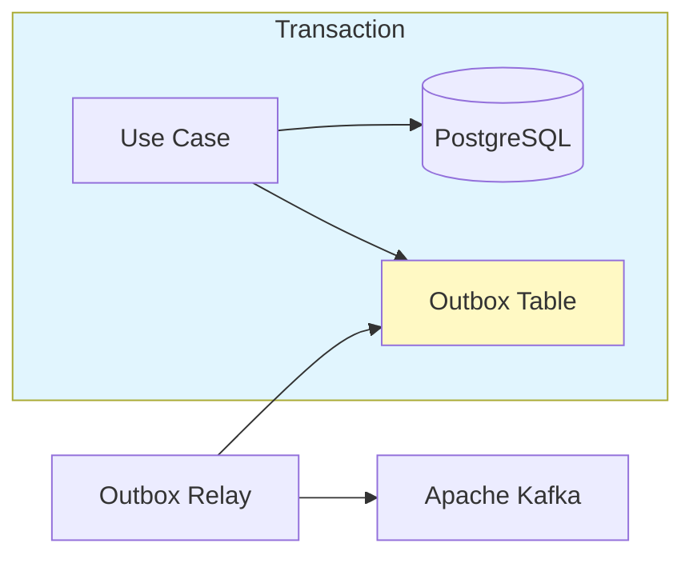
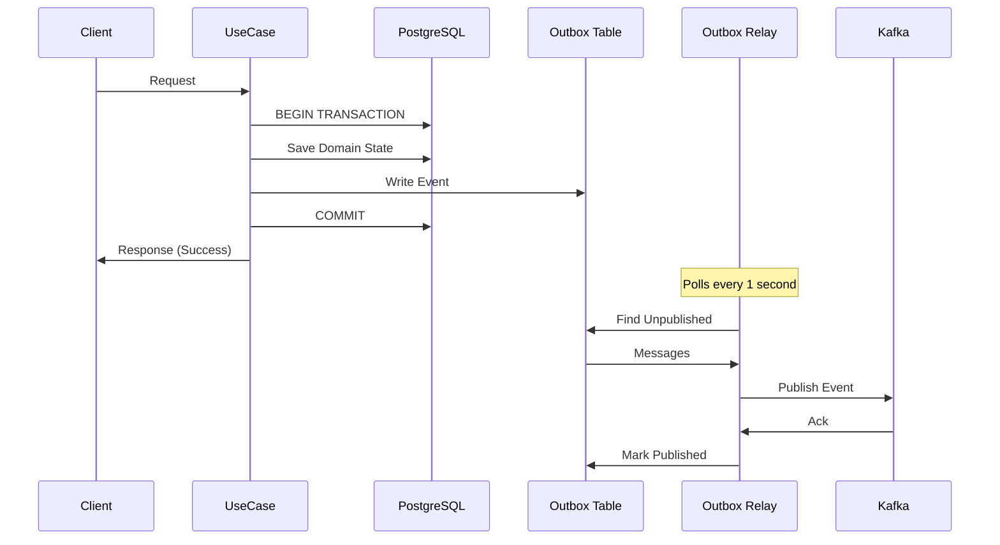

# ADR-0022: Transactional Outbox Pattern for Event Publishing

## Status

Accepted

## Context

In our event-driven microservices architecture (ADR-0001, ADR-0007), services publish domain events to Apache Kafka after completing business operations. The original implementation published events synchronously within the same request:

```kotlin
@Transactional
fun execute(...): Result {
    // 1. Perform domain operation
    val entity = repository.save(domainObject)
    eventStore.save(domainEvent)

    // 2. Publish to Kafka (synchronous)
    kafkaTemplate.send(topic, event).get()  // Blocks until Kafka confirms

    return Result.Success(entity)
}
```

This approach has several problems:

- **Tight Coupling**: Database transaction success is coupled to Kafka availability
- **Rollback Risk**: If Kafka is temporarily unavailable, the entire transaction rolls back, even though the business operation was valid
- **Latency**: Synchronous Kafka publishing adds network latency to every request
- **Inconsistency Risk**: If the transaction commits but Kafka publishing fails (race condition), events are lost
- **Availability Impact**: Kafka maintenance or network issues cause service degradation

The dual-write problem is well-documented in distributed systems: writing to two systems (database + message broker) without distributed transactions can lead to data inconsistency.

## Decision

We will implement the **Transactional Outbox pattern** to decouple Kafka publishing from database transactions.

### Architecture



### Components

**1. Outbox Table** (`outbox`)

Events are written to a database table within the same transaction as domain state changes:

```sql
CREATE TABLE outbox (
    id UUID PRIMARY KEY,
    aggregate_id UUID NOT NULL,
    aggregate_type VARCHAR(100) NOT NULL,
    event_type VARCHAR(100) NOT NULL,
    event_id UUID NOT NULL UNIQUE,
    topic VARCHAR(255) NOT NULL,
    message_key VARCHAR(255) NOT NULL,
    payload JSONB NOT NULL,
    created_at TIMESTAMP WITH TIME ZONE NOT NULL DEFAULT NOW(),
    published_at TIMESTAMP WITH TIME ZONE,
    retry_count INTEGER NOT NULL DEFAULT 0,
    last_error TEXT
);

-- Index for efficient polling of unpublished messages
CREATE INDEX idx_outbox_created_published ON outbox(created_at, published_at)
    WHERE published_at IS NULL;
```

**JPA Entity Configuration**

When using Hibernate with PostgreSQL JSONB columns, you must explicitly declare the JSON type mapping. The `@Column(columnDefinition = "jsonb")` annotation alone is insufficient - Hibernate will still attempt to bind the value as a `VARCHAR`, causing PostgreSQL to reject the insert with:

```
ERROR: column "payload" is of type jsonb but expression is of type character varying
```

The solution is to add the `@JdbcTypeCode(SqlTypes.JSON)` annotation from Hibernate:

```kotlin
import org.hibernate.annotations.JdbcTypeCode
import org.hibernate.type.SqlTypes

@Entity
@Table(name = "outbox")
class OutboxMessage(
    // ... other fields ...

    @JdbcTypeCode(SqlTypes.JSON)
    @Column(name = "payload", nullable = false, columnDefinition = "jsonb")
    val payload: String,
)
```

The `@JdbcTypeCode(SqlTypes.JSON)` annotation tells Hibernate to properly serialize the String value as JSON when communicating with PostgreSQL, enabling seamless storage and retrieval of JSON data in JSONB columns.

**2. Outbox Writer**

Writes events to the outbox within the domain transaction:

```kotlin
@Component
class OutboxWriter(
    private val outboxRepository: OutboxRepository,
    private val objectMapper: ObjectMapper
) {
    fun write(event: DomainEvent, topic: String) {
        val outboxMessage = OutboxMessage(
            aggregateId = event.aggregateId,
            eventType = event.eventType,
            eventId = event.eventId,
            topic = topic,
            messageKey = event.aggregateId.toString(),
            payload = objectMapper.writeValueAsString(event)
        )
        outboxRepository.save(outboxMessage)
    }
}
```

**3. Outbox Relay**

Polls for unpublished messages and publishes them to Kafka asynchronously:

```kotlin
@Component
class OutboxRelay(
    private val outboxRepository: OutboxRepository,
    private val kafkaTemplate: KafkaTemplate<String, String>
) {
    @Scheduled(fixedDelayString = "\${customer.outbox.poll-delay-ms:1000}")
    fun relayMessages() {
        val unpublished = outboxRepository.findUnpublished()
        unpublished.forEach { message ->
            if (message.retryCount < maxRetryCount) {
                publishMessage(message)
            }
        }
    }

    @Transactional
    fun publishMessage(message: OutboxMessage) {
        try {
            kafkaTemplate.send(message.topic, message.messageKey, message.payload)
                .get(timeoutSeconds, TimeUnit.SECONDS)
            message.publishedAt = Instant.now()
        } catch (e: Exception) {
            message.retryCount++
            message.lastError = e.message
        }
        outboxRepository.save(message)
    }
}
```

### Event Flow



### Configuration

```yaml
customer:
  outbox:
    poll-delay-ms: 1000        # Relay polling interval
    publish:
      timeout-seconds: 10       # Kafka publish timeout
    max-retry-count: 5          # Max retries before manual intervention
```

### Use Case Integration

Before (synchronous publishing):
```kotlin
@Transactional
fun execute(...) {
    repository.save(entity)
    eventStore.save(event)
    kafkaPublisher.publish(event)  // Could fail and rollback
}
```

After (outbox pattern):
```kotlin
@Transactional
fun execute(...) {
    repository.save(entity)
    eventStore.save(event)
    outboxWriter.write(event, TOPIC)  // Same transaction, always succeeds
}
```

## Consequences

### Positive

- **Decoupled Availability**: Kafka outages don't affect domain operations
- **Guaranteed Delivery**: Events are persisted and will eventually be published (at-least-once)
- **No Distributed Transactions**: Single database transaction for consistency
- **Reduced Latency**: Request completes without waiting for Kafka
- **Retry Capability**: Failed publishes are automatically retried
- **Auditability**: Outbox table provides event publishing history
- **Ordering Preserved**: Events published in creation order per aggregate

### Negative

- **Eventual Consistency**: Events are published asynchronously (typically < 1 second delay)
- **Additional Storage**: Outbox table grows with event volume
- **Polling Overhead**: Relay polls database on fixed interval
- **Duplicate Risk**: At-least-once delivery requires idempotent consumers (see ADR-0018)
- **Operational Complexity**: Need to monitor outbox backlog and failed messages

### Mitigations

| Concern | Mitigation |
|---------|------------|
| Storage growth | Scheduled job to purge published messages older than 7 days |
| Polling inefficiency | Consider LISTEN/NOTIFY or Change Data Capture for high-volume scenarios |
| Duplicate events | Consumers implement idempotent processing (ADR-0018) |
| Failed messages | Alerting on messages exceeding max retry count |
| Backlog monitoring | Prometheus metrics for outbox queue depth |

### Implementation Scope

Currently implemented in:

| Service | Use Cases |
|---------|-----------|
| Customer Service | `CreateCustomerUseCase`, `ActivateCustomerUseCase` |

Future candidates:

| Service | Use Cases |
|---------|-----------|
| Identity Service | `RegisterUserUseCase`, `VerifyEmailUseCase` |
| Notification Service | `SendVerificationEmailUseCase` |
| Order Service | All order lifecycle events |

## References

- [Microservices Patterns: Transactional Outbox](https://microservices.io/patterns/data/transactional-outbox.html) - Chris Richardson
- [Reliable Microservices Data Exchange With the Outbox Pattern](https://debezium.io/blog/2019/02/19/reliable-microservices-data-exchange-with-the-outbox-pattern/) - Debezium
- ADR-0007: Apache Kafka Event Streaming
- ADR-0018: Idempotent Event Processing Pattern
