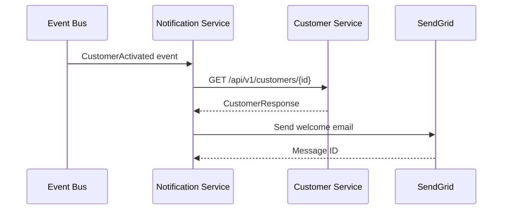

# ADR-0024: Synchronous Customer Lookup for Welcome Notifications

## Status

Accepted

## Context

When implementing the welcome notification feature (US-0002-07), the Notification Service needs to send personalized welcome emails containing:

- Customer's first name for greeting
- Customer number for reference
- Marketing preference to determine email content variant
- Profile completeness to show/hide profile completion CTA

The `CustomerActivated` event from the Customer Service only contains:
- `customerId` (UUID)
- `activatedAt` (timestamp)
- `emailVerified` (boolean)

We needed to decide how to obtain the additional customer details required for personalization.

**Options Considered:**

1. **Extend CustomerActivated Event** - Add all required fields to the event payload
2. **Synchronous REST API Call** - Query Customer Service when processing the event
3. **Event-Carried State Transfer** - Store customer details when UserRegistered event is consumed
4. **Saga/Choreography** - Request customer details and wait for response event

## Decision

We will use a **synchronous REST API call** to the Customer Service to fetch customer details when processing `CustomerActivated` events.



Implementation details:

- **CustomerServiceClient**: Spring RestClient-based HTTP client
- **Circuit Breaker**: For resilience against Customer Service failures
- **Timeout**: 5-second timeout for customer lookup
- **Retry**: Handler-level retry on transient failures
- **Caching**: Not implemented initially (fresh data preferred)

```kotlin
@Component
class CustomerServiceClient(
    private val restClient: RestClient.Builder,
    @Value("\${notification.customer-service.base-url}")
    private val baseUrl: String
) {
    fun getCustomerById(customerId: UUID): CustomerQueryResult
}
```

## Consequences

### Positive

- **Fresh Data**: Always gets current customer state, including latest preferences
- **Single Source of Truth**: Customer Service remains the authority for customer data
- **Simpler Events**: CustomerActivated event stays lean and focused
- **No Data Duplication**: Avoids storing customer data in Notification Service
- **Preference Changes**: Respects last-minute marketing preference changes

### Negative

- **Coupling**: Notification Service depends on Customer Service availability
- **Latency**: Added network round-trip for each welcome email
- **Failure Mode**: Welcome email fails if Customer Service is unavailable
- **Rate Limiting**: High activation volume could overwhelm Customer Service

### Mitigations

- **Retry Policy**: Kafka consumer retries failed messages (3x with 5-min intervals)
- **Circuit Breaker**: Fail fast when Customer Service is consistently unavailable
- **Monitoring**: Alert on elevated lookup failure rates
- **Dead Letter Queue (Deferred)**: A dedicated DLQ topic and routing from the Kafka consumer will be implemented in a later iteration; for now, messages that still fail after all retries are logged and skipped.
- **Timeout Handling**: 5-second timeout prevents blocking consumer threads

> Note: At the time of this ADR's acceptance, the DLQ is a planned mitigation and is not yet configured in the Kafka consumer. This is an acceptable interim trade-off given the low expected failure volume and strong monitoring; a follow-up ADR will capture the concrete DLQ design and rollout.
## Alternatives Not Chosen

### Extend CustomerActivated Event

**Pros:**
- No synchronous dependencies
- Event contains all needed data

**Cons:**
- Event bloat as requirements grow
- Customer Service must anticipate all consumer needs
- Stale data if customer updates preferences between activation and email send

### Event-Carried State Transfer

**Pros:**
- No synchronous dependencies
- Data locality in Notification Service

**Cons:**
- Requires storing and maintaining customer data
- Consistency challenges when customer updates preferences
- More complex implementation

## Related

- [ADR-0001: Microservices Architecture](./0001-microservices-architecture.md)
- [ADR-0017: SendGrid for Transactional Email](./0017-sendgrid-transactional-email.md)
- [ADR-0018: Idempotent Event Processing](./0018-idempotent-event-processing.md)
- [US-0002-07: Welcome Notification](../user-stories/0002-create-customer-profile/US-0002-07-welcome-notification.md)
