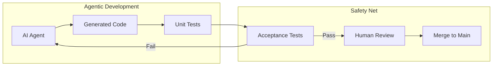

# ADR-0027: Acceptance Testing as a Safety Net for Agentic Development

## Status

Accepted

## Context

This project uses AI coding agents (such as Claude Code) for software development. Agentic development introduces unique challenges:

1. **Code Generation at Scale**: AI agents can generate large amounts of code quickly, making manual review of every line impractical
2. **Hallucination Risk**: AI may generate plausible-looking code that doesn't actually work correctly
3. **Context Loss**: Agents may lose context between sessions, potentially introducing inconsistencies
4. **Regression Risk**: Changes made by agents may inadvertently break existing functionality
5. **Implicit Assumptions**: AI may make assumptions about system behavior that don't match reality

Traditional development relies heavily on developers' mental models and institutional knowledge. When AI agents generate code, these safeguards are reduced, requiring stronger automated verification.

### The Problem

Without comprehensive acceptance tests:
- AI-generated code may pass unit tests but fail in integration
- Breaking changes may go undetected until production
- There's no executable specification of expected system behavior
- Human reviewers cannot efficiently verify all AI-generated changes

## Decision

We will maintain comprehensive acceptance tests as a **mandatory safety net** for all AI-assisted development work.

Requirements:

1. **Coverage**: Acceptance tests must cover all critical user journeys and business requirements
2. **Executable Specifications**: Feature files serve as the source of truth for expected behavior
3. **CI/CD Gate**: All acceptance tests must pass before merging AI-generated code
4. **Regression Detection**: Tests must catch regressions introduced by AI changes

### Testing Pyramid for Agentic Development

```
                    ┌─────────────┐
                    │  Acceptance │  ← Primary safety net for AI code
                    │    Tests    │    Validates end-to-end behavior
                    ├─────────────┤
                    │ Integration │  ← Catches component interaction bugs
                    │    Tests    │
                    ├─────────────┤
                    │    Unit     │  ← AI can generate these, but they
                    │    Tests    │    only test what AI thinks is right
                    └─────────────┘
```

### Workflow Integration



### Key Principles

1. **Trust but Verify**: AI-generated code requires automated verification
2. **Behavior over Implementation**: Test what the system does, not how
3. **Executable Documentation**: Feature files document expected behavior in business language
4. **Fast Feedback**: Tests should run quickly to enable rapid iteration with AI
5. **Clear Failure Messages**: Test failures must clearly indicate what behavior broke

## Consequences

### Positive

- **Safety Net**: Catches AI mistakes before they reach production
- **Confidence**: Developers can accept AI suggestions knowing tests will catch errors
- **Documentation**: Feature files explain system behavior to both humans and AI
- **Regression Prevention**: Historical behavior is preserved despite AI changes
- **Faster Development**: AI can move quickly with tests providing guardrails
- **Context Recovery**: Tests help AI agents understand expected behavior in new sessions

### Negative

- **Maintenance Burden**: Tests must be kept in sync with requirements
- **Initial Investment**: Writing comprehensive acceptance tests requires upfront effort
- **Test Flakiness**: UI tests can be brittle, causing false failures
- **Slower CI**: Full acceptance test runs add time to the pipeline

### Mitigations

- **Conditional Browser Launch**: Only UI tests launch Playwright; API tests skip browser overhead
- **Parallel Execution**: Run tests concurrently to reduce total time
- **Selective Tagging**: Use tags (`@smoke`, `@regression`) to run subsets
- **Page Object Pattern**: Isolate UI changes to reduce test maintenance
- **Clear Step Definitions**: Well-named steps help AI understand test intent

## Implementation Notes

### Test Organization

```
acceptance-tests/
├── features/
│   ├── customer/          # @customer - UI tests (browser required)
│   ├── admin/             # @admin - UI tests (browser required)
│   ├── api/               # @api - API tests (no browser)
│   └── backend/           # @api - Backend integration tests
├── steps/                 # Step definitions
├── pages/                 # Page objects for UI tests
└── support/
    ├── hooks.ts           # Conditional Playwright setup
    └── world.ts           # Test context with API clients
```

### Hooks Optimization

The test framework conditionally launches browsers:
- `@customer` or `@admin` tags: Full Playwright browser setup
- `@api` tag only: API clients initialized, no browser overhead

This ensures API tests run fast while UI tests get full browser capabilities.

## References

- [ADR-0015: Cucumber.js and Playwright for Acceptance Testing](0015-cucumber-playwright-testing.md)
- [Anthropic Claude Code Documentation](https://docs.anthropic.com/en/docs/claude-code)
- [BDD and Specification by Example](https://cucumber.io/docs/bdd/)
