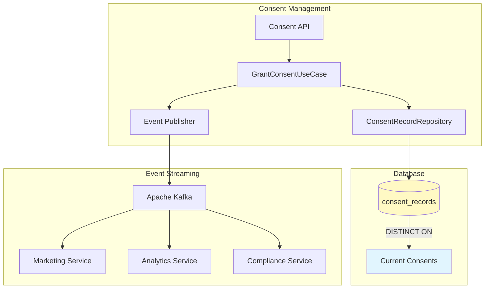
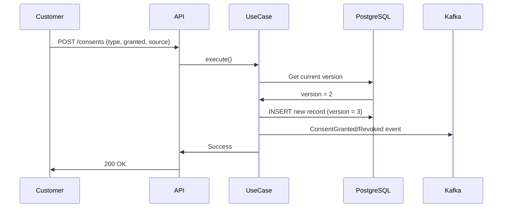

# ADR-0028: Append-Only Consent Records for GDPR Compliance

## Status

Accepted

## Context

The Customer Service needs to manage customer consent for various data processing activities to comply with GDPR (General Data Protection Regulation) and other privacy regulations. Key requirements include:

1. **Audit Trail**: All consent changes must be traceable with full history
2. **Immutability**: Consent records cannot be modified or deleted after creation
3. **Data Subject Rights**: Customers must be able to export their complete consent history (Article 15)
4. **Version Tracking**: Each consent change must have an incrementing version number
5. **Expiration**: Non-required consents should have configurable expiration (default: 1 year)
6. **Real-time Status**: Current consent status must be queryable efficiently

Traditional CRUD approaches (updating a single record) fail to meet these requirements because:

- Updates destroy historical data needed for audits
- No way to track when changes occurred or from where
- No versioning for dispute resolution
- Cannot prove what consent existed at a specific point in time

## Decision

We will implement **append-only consent records** where consent changes create new records rather than updating existing ones. The current consent status is determined by the most recent record for each consent type.

### Architecture



### Database Schema

```sql
-- Immutable consent records table (append-only)
CREATE TABLE consent_records (
    id UUID PRIMARY KEY,
    customer_id UUID NOT NULL REFERENCES customers(id),
    consent_type VARCHAR(50) NOT NULL,
    granted BOOLEAN NOT NULL,
    source VARCHAR(50) NOT NULL,
    ip_address VARCHAR(45) NOT NULL,
    user_agent TEXT,
    expires_at TIMESTAMP WITH TIME ZONE,
    created_at TIMESTAMP WITH TIME ZONE NOT NULL DEFAULT NOW(),
    version INTEGER NOT NULL
);

-- Current consent status via DISTINCT ON
SELECT DISTINCT ON (consent_type)
    consent_type, granted, source, expires_at, created_at, version
FROM consent_records
WHERE customer_id = :customerId
ORDER BY consent_type, created_at DESC;
```

### Consent Types

| Type | Description | Required | Default | Expiration |
|------|-------------|----------|---------|------------|
| DATA_PROCESSING | Basic data processing for service delivery | Yes | Granted at registration | Never |
| MARKETING | Marketing communications and promotions | No | Per registration choice | 1 year |
| ANALYTICS | Usage analytics and behavior tracking | No | Not granted | 1 year |
| THIRD_PARTY | Data sharing with partners | No | Not granted | 1 year |
| PERSONALIZATION | Personalized recommendations | No | Not granted | 1 year |

### Grant/Revoke Flow



### Domain Model

```kotlin
@Entity
@Table(name = "consent_records")
class ConsentRecord(
    @Id val id: UUID,
    val customerId: UUID,
    val consentType: ConsentType,
    val granted: Boolean,
    val source: ConsentSource,
    val ipAddress: String,
    val userAgent: String?,
    val expiresAt: Instant?,
    val createdAt: Instant,
    val version: Int
) {
    // No setters - immutable record
    // Only validation and helper methods
    fun isExpired(): Boolean =
        expiresAt != null && Instant.now().isAfter(expiresAt)

    fun isEffective(): Boolean = granted && !isExpired()
}
```

### Required Consent Protection

DATA_PROCESSING consent is required for service delivery and cannot be revoked:

```kotlin
if (consentType == ConsentType.DATA_PROCESSING && !granted) {
    return RequiredConsentCannotBeRevoked(
        consentType,
        "This consent is required. To remove it, please close your account."
    )
}
```

### Event Publishing

Each consent change publishes a domain event for downstream services:

- **ConsentGranted**: Marketing can begin sending communications
- **ConsentRevoked**: Analytics must stop processing within 24 hours (GDPR requirement)

```kotlin
val event = if (granted) {
    ConsentGranted.create(customerId, consentId, consentType, ...)
} else {
    ConsentRevoked.create(customerId, consentId, consentType, ...)
}
eventPublisher.publish(event)
```

### GDPR Export

The complete consent history can be exported for data subject requests:

```kotlin
@Transactional(readOnly = true)
fun exportConsentHistory(customerId: UUID): ConsentHistoryExport {
    val records = consentRecordRepository.findByCustomerId(customerId)
    return ConsentHistoryExport(
        customerId = customerId,
        exportedAt = Instant.now(),
        consentHistory = records.map { ... }
    )
}
```

## Consequences

### Positive

- **Complete Audit Trail**: Every consent change is permanently recorded
- **Immutability**: Historical records cannot be altered (GDPR compliance)
- **Versioning**: Each consent type has incrementing versions for tracking
- **Point-in-Time Queries**: Can determine what consent existed at any date
- **GDPR Export**: Full history available for data subject requests
- **Event-Driven**: Downstream services react to consent changes in real-time
- **Simple Current Status**: DISTINCT ON efficiently retrieves current state

### Negative

- **Storage Growth**: Table grows with every consent change (not updates)
- **Query Complexity**: Current status requires ordering by timestamp
- **No Physical Delete**: Cannot truly delete records (soft delete via account closure)
- **Index Overhead**: Multiple indexes needed for efficient queries

### Mitigations

| Concern | Mitigation |
|---------|------------|
| Storage growth | Most customers change consents rarely; table size is bounded |
| Query complexity | Database function `get_current_consents(customer_id)` for efficiency |
| GDPR Right to Erasure | Entire customer record deleted on account closure (CASCADE) |
| Performance | Indexes on (customer_id, consent_type, created_at DESC) |

### Metrics & Monitoring

```yaml
metrics:
  - consent_granted_total{consent_type, source}
  - consent_revoked_total{consent_type, source}
  - consent_export_total{format}
```

## Implementation

### Files Created

| Path | Description |
|------|-------------|
| `domain/ConsentType.kt` | Enum with consent types and metadata |
| `domain/ConsentRecord.kt` | Immutable entity with value class wrappers |
| `domain/events/ConsentGranted.kt` | Domain event for consent grants |
| `domain/events/ConsentRevoked.kt` | Domain event for consent revocations |
| `application/GrantConsentUseCase.kt` | Business logic for consent changes |
| `application/GetConsentsUseCase.kt` | Current consent status retrieval |
| `application/ExportConsentHistoryUseCase.kt` | GDPR export functionality |
| `api/v1/ConsentController.kt` | REST API endpoints |
| `infrastructure/persistence/ConsentRecordRepository.kt` | JPA repository |

### Database Migration

`V9__create_consent_records_table.sql` creates the table, indexes, and helper functions.

## Related Decisions

- ADR-0003: Event Sourcing (consent records follow similar append-only pattern)
- ADR-0018: Idempotent Event Processing (consumers handle duplicate ConsentGranted/Revoked events)
- ADR-0022: Transactional Outbox Pattern (consent events use outbox for reliable publishing)

## References

- [GDPR Article 7: Conditions for Consent](https://gdpr-info.eu/art-7-gdpr/)
- [GDPR Article 15: Right of Access](https://gdpr-info.eu/art-15-gdpr/)
- [GDPR Article 17: Right to Erasure](https://gdpr-info.eu/art-17-gdpr/)
- US-0002-11: Consent Management User Story
