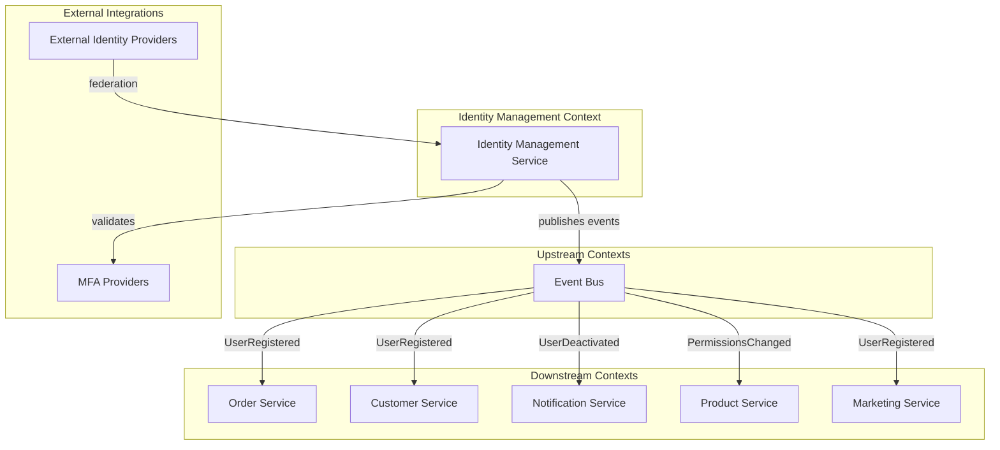
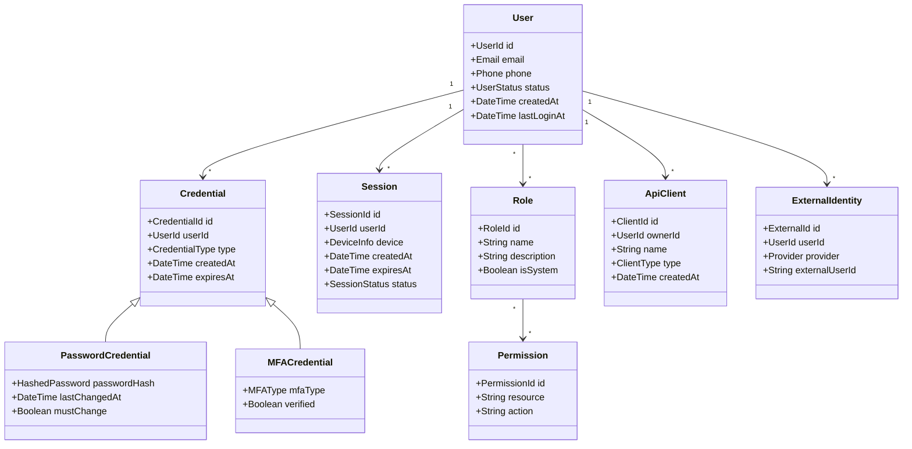
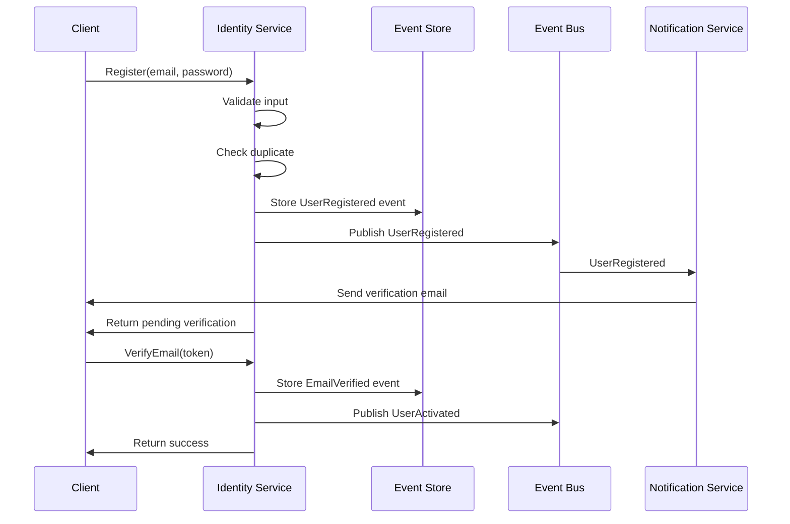
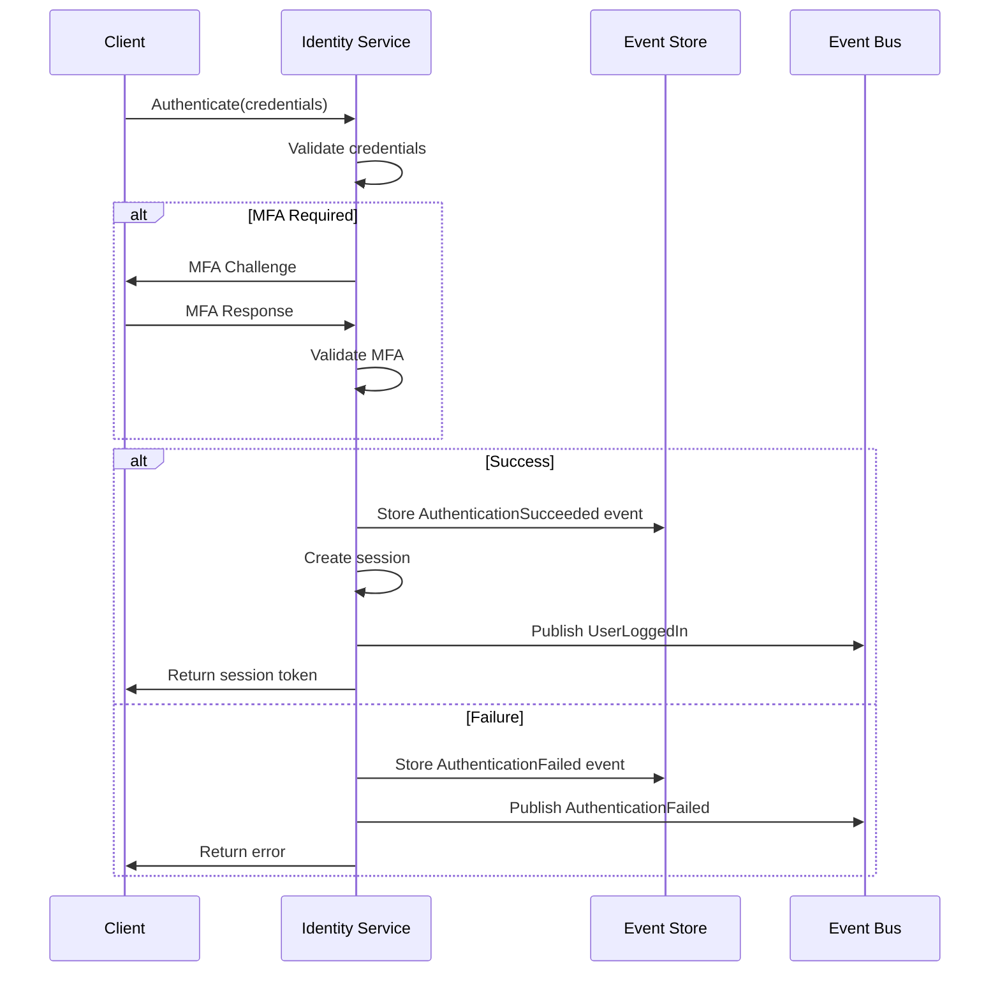

# Identity Management Epic

## Epic Overview

**As a** platform operator for ACME, Inc. e-commerce
**I want** a centralized identity management system
**So that** customers and internal users can securely authenticate, manage their identities, and access platform resources according to their permissions

## Business Context

The Identity Management service is a foundational bounded context that provides authentication, authorization, and user identity lifecycle management for the ACME e-commerce platform. This service acts as the single source of truth for user identities across all platform services.

## Bounded Context Definition

### Domain Boundaries

The Identity Management bounded context owns:

- User identity lifecycle (creation, modification, deactivation)
- Authentication mechanisms and credential validation
- Authorization policies and access control
- Session and token management
- Security audit trail

### Context Map

## Features

### F1: User Registration

Enable new users to create accounts on the platform with verified contact information.

- Self-service registration for customers
- Invited registration for B2B partners
- Administrative user creation for internal staff
- Email and phone verification workflows
- Duplicate account detection
- Consent and terms acceptance tracking

### F2: Authentication

Provide secure mechanisms for users to prove their identity.

- Credential-based authentication (username/password)
- Multi-factor authentication (MFA)
- Passwordless authentication options
- Social identity provider federation
- Single sign-on (SSO) for enterprise customers
- Remember device functionality
- Brute force and bot protection

### F3: Session Management

Manage user sessions across devices and platform touchpoints.

- Session creation and validation
- Concurrent session policies
- Session timeout and renewal
- Cross-device session visibility
- Forced session termination (logout everywhere)
- Session activity tracking

### F4: Authorization

Control access to platform resources based on user permissions.

- Role-based access control (RBAC)
- Permission assignment and inheritance
- Resource-level access policies
- API scope management
- Delegated authorization for third parties
- Temporary elevated permissions

### F5: Credential Management

Allow users to manage their authentication credentials securely.

- Password change workflows
- Password reset via verified channels
- MFA enrollment and management
- Recovery code generation
- Security key registration
- Credential strength enforcement

### F6: User Profile Management

Enable users to maintain their identity information.

- Profile attribute updates
- Contact information management
- Communication preferences
- Privacy settings
- Account linking (merge accounts)
- Data export requests

### F7: Account Lifecycle

Manage the full lifecycle of user accounts.

- Account suspension and reactivation
- Account deactivation (soft delete)
- Account deletion (hard delete with data retention policies)
- Account recovery
- Inactivity policies
- Account transfer (B2B scenarios)

### F8: API Authentication

Secure programmatic access to platform services.

- API key generation and rotation
- OAuth client credentials
- Service-to-service authentication
- Rate limiting per client
- Scope-based API access
- API key revocation

### F9: Audit and Compliance

Maintain comprehensive security audit capabilities.

- Authentication event logging
- Authorization decision logging
- Credential change tracking
- Session activity history
- Compliance reporting
- Anomaly detection events

## Domain Model

## Event Flows

### User Registration Flow

### Authentication Flow

## Architectural Alignment

### Microservices

- Identity Management operates as an independent, deployable service
- Owns its dedicated data store for identity information
- Exposes well-defined APIs for authentication and authorization
- Scales independently based on authentication load

### Event-Driven Architecture

The service publishes domain events for significant identity operations:

| Event | Description | Consumers |
|-------|-------------|-----------|
| UserRegistered | New user account created | Customer, Marketing, Notification |
| UserActivated | Email/phone verified | Customer, Marketing |
| UserDeactivated | Account suspended or deleted | All services |
| UserLoggedIn | Successful authentication | Analytics, Security |
| AuthenticationFailed | Failed login attempt | Security, Notification |
| PasswordChanged | Credential updated | Notification, Security |
| PermissionsChanged | Role or permission modified | All services (cache invalidation) |
| MFAEnrolled | MFA added to account | Notification, Security |
| SessionTerminated | User logged out or session expired | Analytics |

### CQRS

- **Write Model**: Handles registration, authentication, credential changes
- **Read Model**: Optimized for token validation, permission checks, user lookups
- Separate scaling for read-heavy authorization checks vs. write operations

### Event Sourcing

- All identity state changes stored as immutable events
- Complete audit trail for compliance requirements
- Ability to reconstruct account state at any point in time
- Support for temporal queries (e.g., "what permissions did user X have on date Y?")

### Change Data Capture

- Sync user identity data to downstream read replicas
- Enable other services to maintain local user caches
- Support eventual consistency for user profile data

## Broad Acceptance Criteria

### Security

- [ ] All passwords are hashed using industry-standard algorithms
- [ ] Authentication tokens have configurable expiration
- [ ] Failed login attempts trigger progressive delays
- [ ] MFA can be enforced based on risk factors
- [ ] All authentication events are logged for audit

### Scalability

- [ ] Token validation operates with sub-10ms latency at P99
- [ ] Service handles authentication spikes during peak shopping periods
- [ ] Read operations scale independently of write operations

### Reliability

- [ ] Service maintains 99.9% availability
- [ ] Graceful degradation when external identity providers are unavailable
- [ ] Session validation continues during partial outages

### Compliance

- [ ] User data deletion completes within regulatory timeframes
- [ ] Audit logs retained according to compliance requirements
- [ ] Consent records maintained for all data processing

### Integration

- [ ] Other platform services can validate tokens without direct coupling
- [ ] Events published within seconds of identity state changes
- [ ] External identity provider federation follows standard protocols

## Dependencies

### Upstream Dependencies

- None (Identity is a foundational service)

### Downstream Dependents

- All platform services requiring authentication/authorization
- Customer Service (user profile data)
- Order Service (user identity for orders)
- Notification Service (user contact information)

## Open Questions

1. What identity providers should be supported for social login at launch?
2. What are the password complexity requirements?
3. Should B2B customers have different authentication flows?
4. What is the session timeout policy for different user types?
5. What data retention periods apply to audit logs?

## Related Documentation

- [Architecture Overview](../ARCHITECTURE.md)
