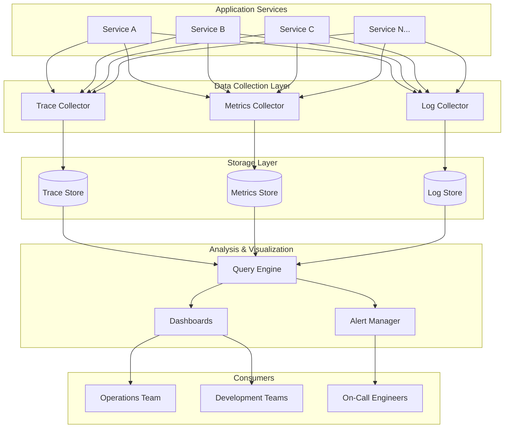
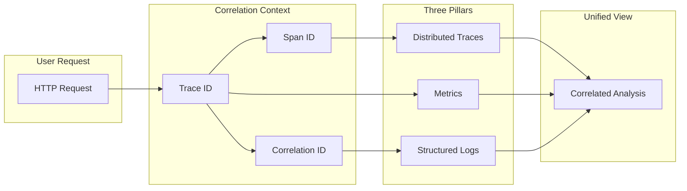
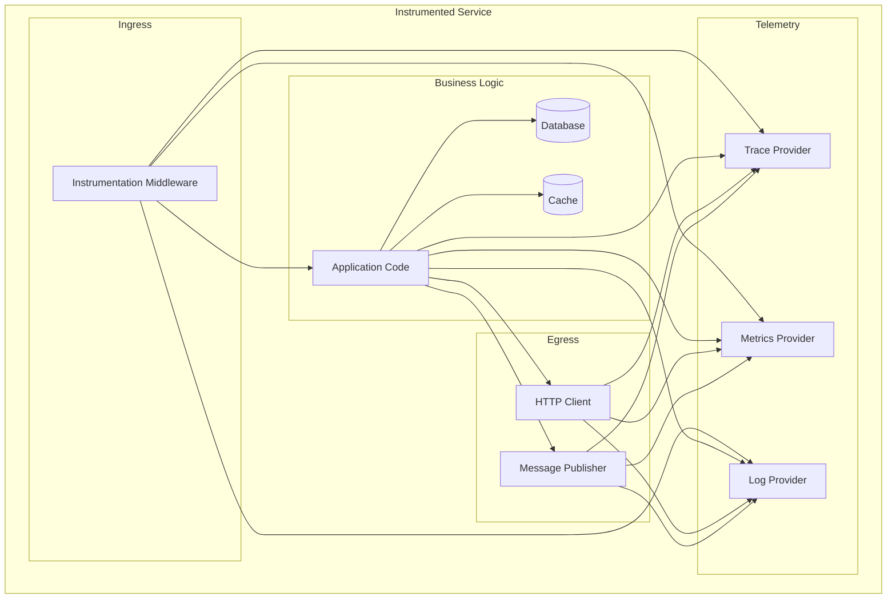
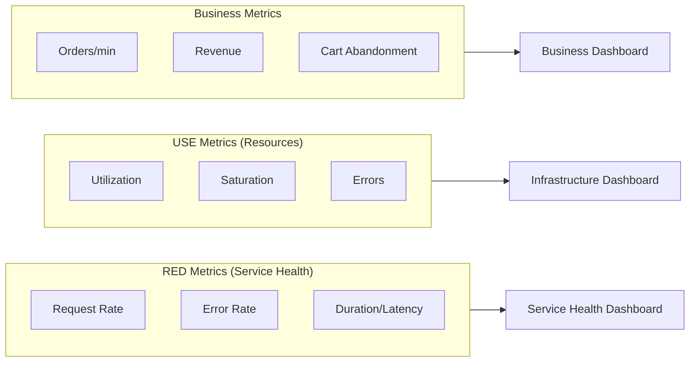
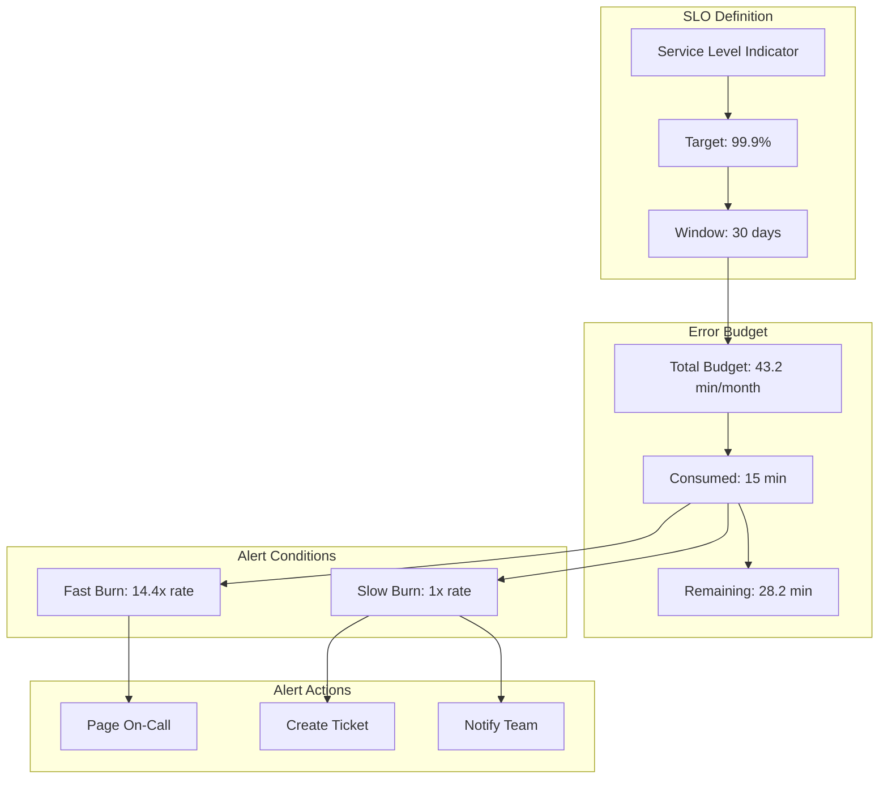
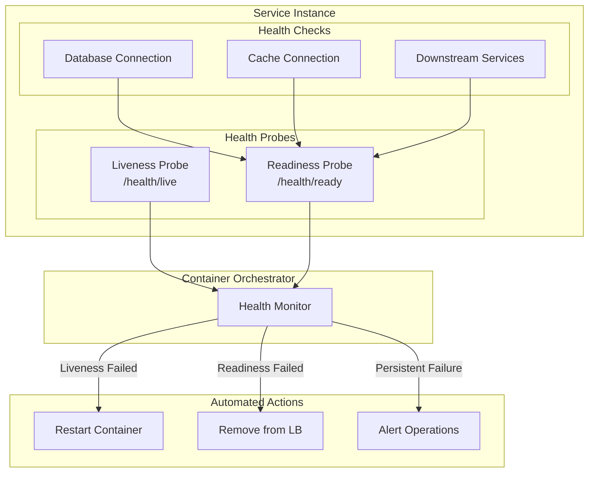
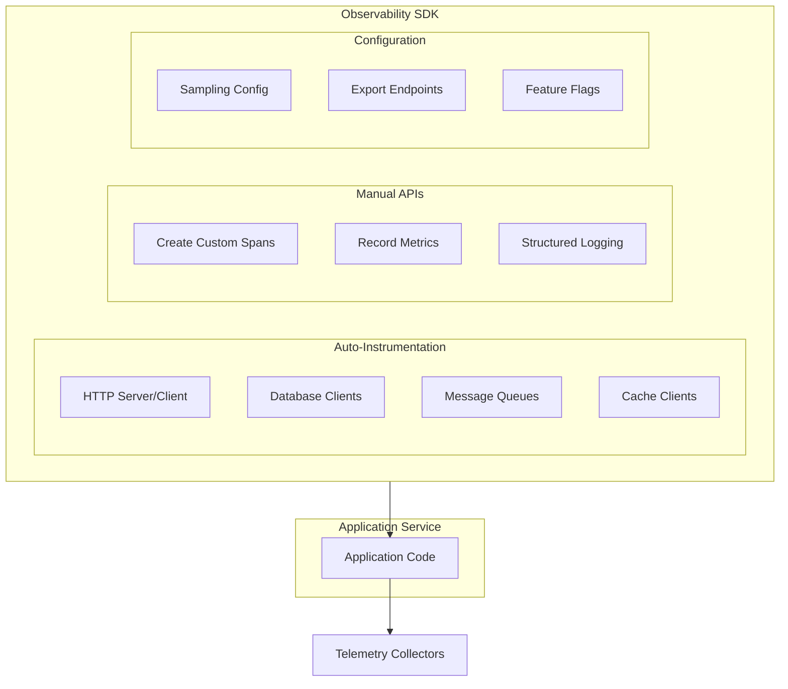

# Epic: Observability Platform

## Epic Summary

**As a** platform engineering team,
**We want** a comprehensive observability platform that provides unified visibility into the health, performance, and behavior of all services across the ACME e-commerce platform,
**So that** we can proactively detect issues, reduce mean time to resolution (MTTR), ensure system reliability, and make data-driven decisions about capacity and performance.

---

## Business Context

### Problem Statement

As the ACME e-commerce platform grows into a distributed microservices architecture, traditional monitoring approaches become insufficient. Without proper observability:

- **Debugging distributed transactions** requires manual correlation across multiple service logs
- **Performance bottlenecks** remain hidden until they impact customers
- **System failures** are detected reactively through customer complaints
- **Capacity planning** relies on guesswork rather than empirical data
- **Incident response** is slow due to lack of context and tooling

### Business Value

A robust observability platform directly impacts key business metrics:

- **Reduced downtime** through proactive issue detection and faster resolution
- **Improved customer experience** by identifying and resolving performance issues before they impact users
- **Lower operational costs** through efficient troubleshooting and reduced firefighting
- **Data-driven decisions** for capacity planning and architecture evolution
- **Compliance support** through comprehensive audit trails and log retention

---

## Goals and Objectives

### Primary Goals

1. **Unified Visibility**: Provide a single pane of glass for understanding system health across all services
2. **Correlation**: Enable seamless correlation between traces, metrics, and logs for any request
3. **Proactive Detection**: Identify issues before they impact customers through intelligent alerting
4. **Self-Service**: Empower development teams to instrument, monitor, and debug their own services

### Success Metrics

| Metric | Target |
|--------|--------|
| Mean Time to Detection (MTTD) | < 5 minutes |
| Mean Time to Resolution (MTTR) | 50% reduction from baseline |
| Trace coverage | 100% of external requests |
| Service health visibility | 100% of services monitored |
| Alert actionability rate | > 90% true positive rate |

---

## High-Level Architecture

### Observability Data Flow

### Three Pillars Integration

### Service Instrumentation Pattern

---

## Features

### Feature 1: Distributed Tracing

Implement end-to-end request tracing across all services to visualize request flow and identify performance bottlenecks.

#### Capabilities

- **Context Propagation**: Automatically propagate trace context across service boundaries via HTTP headers and message metadata
- **Span Collection**: Capture spans for all service interactions including HTTP calls, database queries, cache operations, and message processing
- **Trace Visualization**: Provide interactive trace timelines showing request flow and latency breakdown
- **Sampling Strategies**: Support configurable sampling to balance observability with performance overhead
- **Error Tracking**: Automatically capture and highlight errors within trace context

#### Acceptance Criteria

- All inbound requests generate a trace with a unique trace ID
- Trace context propagates through synchronous (HTTP/gRPC) and asynchronous (message queue) boundaries
- Traces include spans for external service calls, database operations, and cache interactions
- Engineers can search traces by trace ID, service name, operation name, duration, and error status
- Trace data is retained according to defined retention policies

---

### Feature 2: Metrics Collection and Aggregation

Collect, aggregate, and expose metrics that provide quantitative measurements of system behavior and performance.

#### Capabilities

- **RED Metrics**: Automatically collect Rate, Errors, and Duration for all service endpoints
- **USE Metrics**: Track Utilization, Saturation, and Errors for infrastructure resources
- **Business Metrics**: Support custom business metrics alongside technical metrics
- **Dimensional Metrics**: Enable tagging/labeling for flexible aggregation and filtering
- **Real-time Aggregation**: Provide near real-time metric aggregation across time windows

#### Acceptance Criteria

- All service endpoints automatically emit RED metrics
- Infrastructure metrics are collected for compute, memory, network, and storage
- Metrics support dimensional tagging for service, version, environment, and custom labels
- Historical metrics are queryable for trend analysis and capacity planning
- Metrics cardinality is managed to prevent storage explosion

---

### Feature 3: Centralized Logging

Aggregate structured logs from all services into a centralized system for querying, analysis, and correlation.

#### Capabilities

- **Structured Logging**: Enforce consistent structured log format across all services
- **Log Correlation**: Include trace and correlation IDs in all log entries
- **Log Levels**: Support standard log levels (DEBUG, INFO, WARN, ERROR) with appropriate usage guidelines
- **Log Aggregation**: Centralize logs from all services for unified querying
- **Log Retention**: Implement retention policies aligned with compliance and operational needs

#### Acceptance Criteria

- All services emit logs in a consistent structured format
- Log entries include trace ID, span ID, service name, and timestamp
- Engineers can search logs across all services using a unified query interface
- Logs are automatically correlated with distributed traces
- Sensitive data is redacted or excluded from log output
- Log retention policies are configurable per environment and log level

---

### Feature 4: Alerting and SLO Management

Implement intelligent alerting based on Service Level Objectives (SLOs) to detect and notify about service degradation.

#### Capabilities

- **SLO Definition**: Define Service Level Objectives for critical user journeys and service endpoints
- **Error Budget Tracking**: Track error budget consumption over rolling time windows
- **Burn Rate Alerts**: Alert based on SLO burn rates rather than static thresholds
- **Multi-Window Alerting**: Implement multi-window alerting to reduce false positives
- **Alert Routing**: Route alerts to appropriate teams based on service ownership and severity
- **Alert Suppression**: Support maintenance windows and alert suppression

#### Acceptance Criteria

- SLOs can be defined for availability, latency, and throughput
- Error budget is calculated and displayed for each SLO
- Alerts fire based on configurable burn rate thresholds
- Alert fatigue is minimized through intelligent grouping and deduplication
- On-call engineers receive actionable alerts with context and runbook links
- Alert history is retained for post-incident analysis

---

### Feature 5: Health Monitoring

Implement comprehensive health checking for all services to enable automated recovery and traffic management.

#### Capabilities

- **Liveness Probes**: Detect crashed or deadlocked service instances
- **Readiness Probes**: Manage traffic routing during startup and dependency failures
- **Dependency Health**: Include downstream dependency health in readiness assessments
- **Health Aggregation**: Provide aggregated health status across the platform
- **Health History**: Track health status changes over time

#### Acceptance Criteria

- All services expose standardized health endpoints
- Liveness probes detect service crashes and deadlocks
- Readiness probes prevent traffic to services that cannot handle requests
- Health status integrates with service discovery for automatic failover
- Health check failures generate appropriate alerts
- Health status is visible in operational dashboards

---

### Feature 6: Dashboards and Visualization

Provide pre-built and customizable dashboards for operational visibility and troubleshooting.

#### Capabilities

- **Service Dashboards**: Pre-built dashboards for each service showing key metrics
- **Infrastructure Dashboards**: Visibility into underlying infrastructure health
- **Business Dashboards**: Executive-level dashboards for business metrics
- **Custom Dashboards**: Self-service dashboard creation for teams
- **Dashboard Sharing**: Share dashboards across teams and embed in runbooks

#### Acceptance Criteria

- Each service has an auto-generated dashboard with RED metrics
- Platform-wide dashboard shows overall system health at a glance
- Dashboards support drill-down from high-level to detailed views
- Teams can create and manage their own dashboards
- Dashboards load within acceptable performance thresholds

---

### Feature 7: Observability SDK and Instrumentation

Provide libraries and tooling to simplify service instrumentation and ensure consistency.

#### Capabilities

- **Instrumentation Libraries**: Provide language-specific libraries for common instrumentation patterns
- **Auto-Instrumentation**: Support automatic instrumentation for common frameworks and libraries
- **Manual Instrumentation APIs**: Expose APIs for custom span creation and metric recording
- **Configuration Management**: Centralized configuration for sampling rates, export endpoints, and feature flags
- **Documentation and Examples**: Comprehensive documentation and code examples

#### Acceptance Criteria

- SDK is available for all supported programming languages
- Common frameworks and libraries are auto-instrumented
- Instrumentation adds minimal performance overhead (< 5% latency impact)
- Configuration changes can be applied without service restarts
- Comprehensive documentation enables self-service adoption

---

## Cross-Cutting Concerns

### Data Correlation

All observability data must be correlated through shared identifiers:

- **Trace ID**: Links all spans within a distributed trace
- **Span ID**: Identifies individual operations within a trace
- **Correlation ID**: Links logs, metrics, and traces for a single request

### Performance Impact

Observability instrumentation must minimize impact on application performance:

- Trace sampling to control overhead for high-throughput services
- Asynchronous telemetry export to avoid blocking application threads
- Efficient serialization and batching of telemetry data

### Security and Privacy

- Sensitive data must be excluded or redacted from logs and traces
- Access to observability data must be controlled based on team ownership
- Telemetry transport must be encrypted in transit

### Multi-Environment Support

The observability platform must support all environments:

- Development, staging, and production environments
- Environment-specific configuration for retention, sampling, and alerting
- Clear environment labeling in all telemetry data

---

## Dependencies and Constraints

### Dependencies

- **Service Mesh / API Gateway**: For automatic context propagation at the network layer
- **Container Orchestration**: For health check integration and automated recovery
- **CI/CD Pipeline**: For deploying instrumented services and observability infrastructure

### Constraints

- Must support the existing microservices architecture patterns
- Must integrate with event-driven and CQRS patterns
- Must not introduce single points of failure
- Must scale with the platform growth

---

## Out of Scope

The following items are explicitly out of scope for this epic:

- Application Performance Monitoring (APM) code-level profiling
- Real User Monitoring (RUM) and browser-side telemetry
- Synthetic monitoring and uptime checks
- Security Information and Event Management (SIEM) integration
- Cost attribution and FinOps dashboards
- Chaos engineering and fault injection tooling

These items may be addressed in future epics as the platform matures.

---

## Related Documentation

- [Architecture Overview](../ARCHITECTURE.md) - Platform architecture patterns including observability standards

---

## Revision History

| Date | Author | Description |
|------|--------|-------------|
| 2026-01-01 | Platform Team | Initial epic creation |
