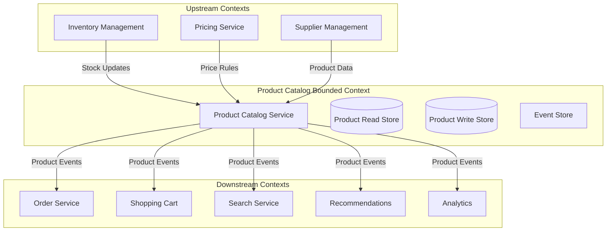
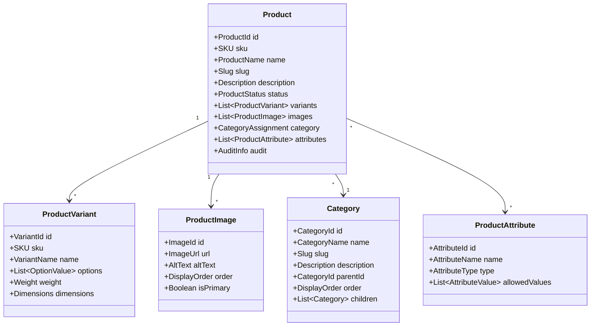
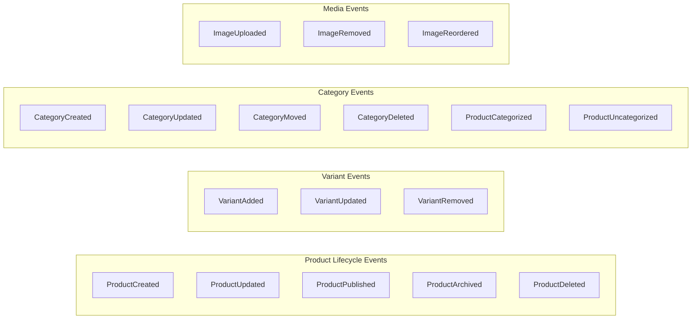
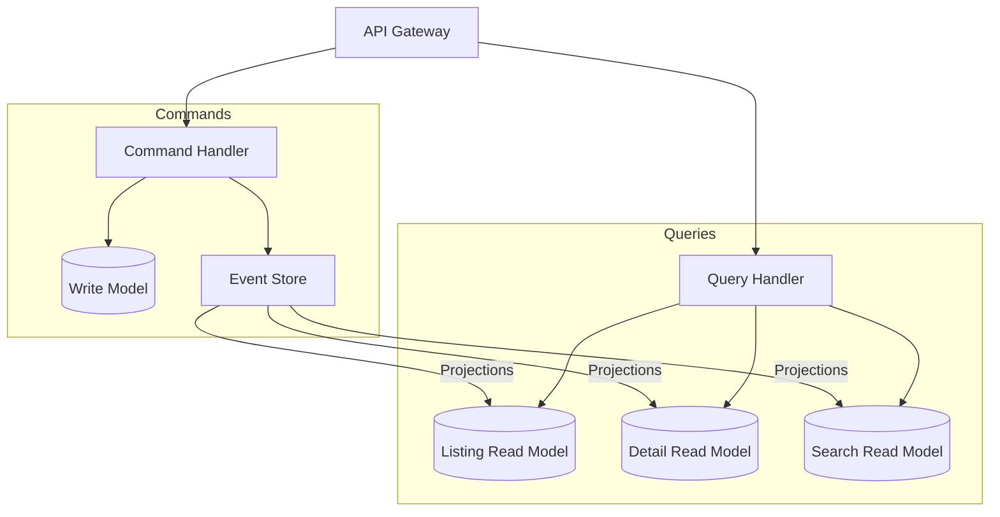
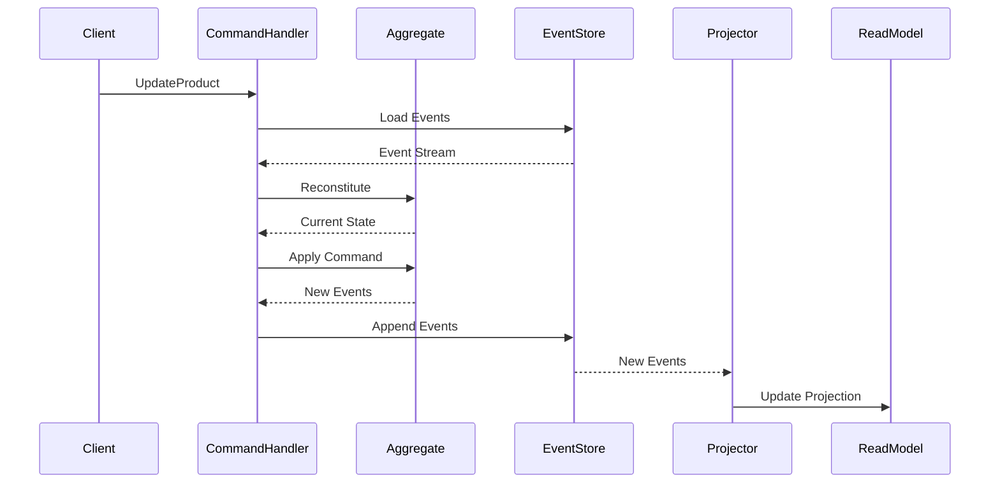
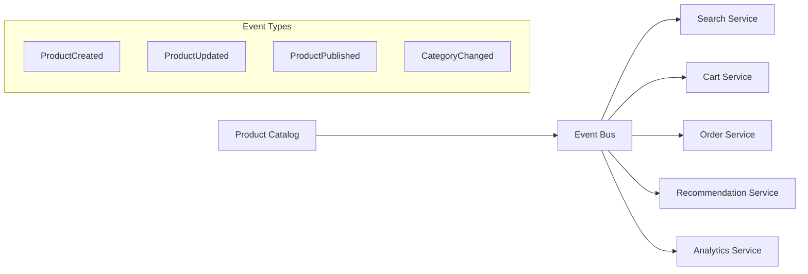
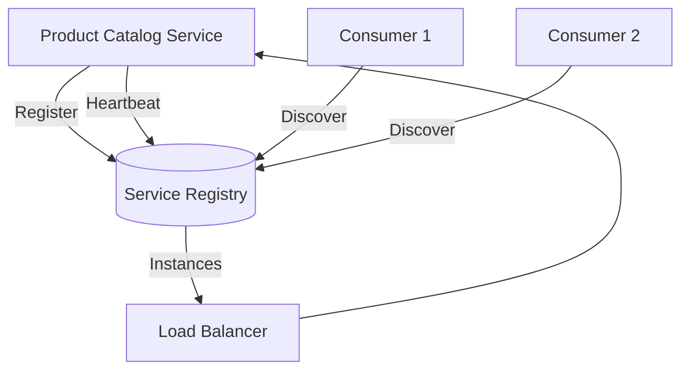
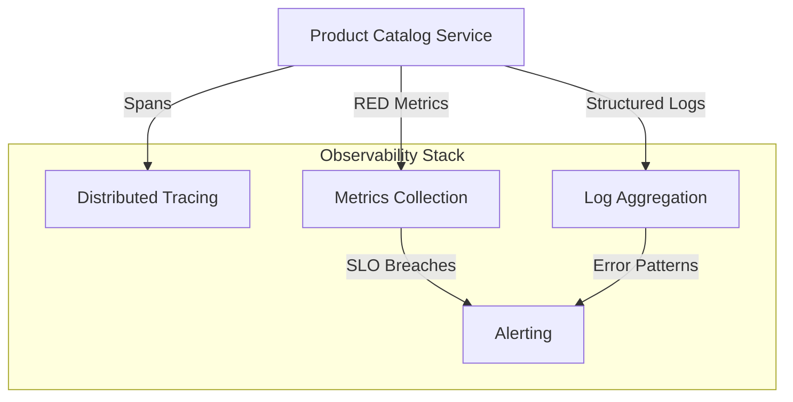

# Epic: Product Catalog Service

## Epic Statement

**As a** business stakeholder of ACME, Inc.,
**I want** a Product Catalog service that serves as the central source of truth for all product information,
**So that** customers can discover, browse, and evaluate products while administrators can efficiently manage the product inventory.

## Business Context

The Product Catalog is a foundational bounded context within the ACME e-commerce platform. It owns all product-related data and exposes capabilities to both customer-facing applications and internal administrative systems. As a core domain service, it must be highly available, performant, and capable of evolving independently of other platform services.

## Bounded Context

The Product Catalog service operates as an autonomous bounded context with clear ownership boundaries.

### Context Map

### Domain Ownership

The Product Catalog service has exclusive ownership over:

- Product definitions and descriptions
- Product categorization and taxonomy
- Product variants and options
- Product media and assets
- Product attributes and specifications
- Category hierarchy and organization

### Integration Boundaries

| Integration | Direction | Pattern | Purpose |
|-------------|-----------|---------|---------|
| Inventory Management | Upstream | Event Consumer | Receive stock level updates |
| Pricing Service | Upstream | Event Consumer | Receive price change events |
| Supplier Management | Upstream | Event Consumer | Receive new product data |
| Order Service | Downstream | Event Producer | Publish product snapshots |
| Shopping Cart | Downstream | Query API | Provide product details |
| Search Service | Downstream | Event Producer | Publish catalog changes |
| Recommendations | Downstream | Event Producer | Publish product relationships |
| Analytics | Downstream | Event Producer | Publish catalog activity |

## Domain Model

### Aggregate Roots

### Domain Events

The following events represent significant state changes within the Product Catalog:

## Features

### F1: Product Information Management

**Description:** Enable administrators to create, update, and manage comprehensive product information throughout the product lifecycle.

**Capabilities:**
- Create new products with required attributes
- Edit product details including descriptions, specifications, and metadata
- Manage product status transitions (draft → active → archived)
- Support rich text descriptions with formatting
- Track product change history for audit purposes

**Acceptance Criteria:**
- Products can be created in draft status and published when ready
- All product changes are captured as domain events
- Product history is queryable for audit and rollback purposes
- Validation rules prevent invalid product states

---

### F2: Product Variant Management

**Description:** Support products with multiple variations such as size, color, material, or other distinguishing characteristics.

**Capabilities:**
- Define variant options (e.g., Size: S, M, L, XL)
- Create variant combinations with unique identifiers
- Manage variant-specific attributes (weight, dimensions)
- Support variant-level media associations

**Acceptance Criteria:**
- Variants inherit base product information while maintaining unique attributes
- Each variant has a unique SKU for inventory tracking
- Variant option combinations are validated for uniqueness
- Variants can be individually activated or deactivated

---

### F3: Category Taxonomy Management

**Description:** Provide hierarchical organization of products through a flexible category system.

**Capabilities:**
- Create and manage category hierarchies
- Assign products to categories
- Support multiple category assignments per product
- Define category display ordering
- Manage category metadata and descriptions

**Acceptance Criteria:**
- Categories support unlimited nesting depth
- Products can belong to multiple categories
- Category changes propagate to downstream systems via events
- Category deletion handles existing product assignments gracefully

---

### F4: Product Media Management

**Description:** Manage visual assets associated with products including images, videos, and documents.

**Capabilities:**
- Upload and store product images
- Support multiple images per product with ordering
- Associate images with specific variants
- Manage image metadata (alt text, captions)
- Generate optimized image variants for different display contexts

**Acceptance Criteria:**
- Images are validated for format and size constraints
- Primary image designation is enforced per product
- Image deletion is handled with appropriate cleanup
- Media events are published for downstream processing

---

### F5: Product Attribute System

**Description:** Flexible attribute system for capturing product specifications and enabling faceted navigation.

**Capabilities:**
- Define custom attributes with types (text, number, boolean, selection)
- Assign attributes to products with values
- Support attribute grouping for display
- Enable attribute-based filtering and search

**Acceptance Criteria:**
- Attributes support multiple data types with validation
- Selection attributes have configurable allowed values
- Attribute assignments are validated against attribute definitions
- Attribute changes trigger appropriate events for search reindexing

---

### F6: Product Search and Discovery

**Description:** Enable customers to find products through various discovery mechanisms.

**Capabilities:**
- Full-text search across product content
- Faceted filtering by category, attributes, and status
- Sorting by relevance, date, and custom criteria
- Autocomplete and search suggestions
- Search result highlighting

**Acceptance Criteria:**
- Search returns results within acceptable latency thresholds
- Facet counts are accurate and performant
- Search handles misspellings and synonyms appropriately
- Search results respect product visibility rules

---

### F7: Product Browsing Experience

**Description:** Provide optimized read models for customer-facing product browsing.

**Capabilities:**
- Product listing pages with pagination
- Product detail page with complete information
- Category-based product navigation
- Related product associations
- Recently viewed product tracking

**Acceptance Criteria:**
- Product listings support efficient pagination
- Product details include all relevant information in single query
- Category navigation reflects current hierarchy
- Read models are eventually consistent with write models

---

### F8: Administrative Bulk Operations

**Description:** Support efficient management of large product catalogs through bulk operations.

**Capabilities:**
- Bulk product import from external sources
- Bulk status updates (publish, archive, delete)
- Bulk category assignments
- Export product data for external processing

**Acceptance Criteria:**
- Bulk operations provide progress feedback
- Failed items in bulk operations are reported without blocking others
- Bulk operations generate appropriate events for each affected product
- Import operations validate data before committing changes

---

### F9: Product Availability and Visibility

**Description:** Control product visibility across channels and time periods.

**Capabilities:**
- Schedule product publication and archival
- Control product visibility by channel or region
- Support product embargo dates for coordinated launches
- Manage product lifecycle status transitions

**Acceptance Criteria:**
- Scheduled operations execute reliably at specified times
- Visibility rules are enforced across all query interfaces
- Status transitions follow defined lifecycle rules
- Visibility changes are published as events

## Architecture Considerations

### Command Query Responsibility Segregation (CQRS)

The Product Catalog will implement CQRS to optimize for different access patterns:

**Write Side:**
- Processes commands through domain aggregates
- Persists events to event store
- Optimized for consistency and business rule enforcement

**Read Side:**
- Multiple denormalized read models optimized for specific query patterns
- Eventually consistent projections built from event stream
- Independently scalable from write side

### Event Sourcing

Product state changes will be captured as an immutable sequence of events:

**Benefits:**
- Complete audit trail of all product changes
- Ability to rebuild read models from events
- Temporal queries to view product state at any point in time
- Support for debugging and rollback scenarios

### Event-Driven Integration

Product catalog events will be published for consumption by downstream services:

**Event Contract:**
- Events include all necessary data for consumer autonomy
- Schema versioning supports backward compatibility
- Events are idempotent-safe for at-least-once delivery

### Service Discovery and Health

The service will participate in platform service discovery:

**Health Checks:**
- Liveness probe: Service process is running
- Readiness probe: Service can handle requests (dependencies available)
- Dependency health: Database, event store, message broker connectivity

### Observability

**Key Metrics:**
- Request rate, error rate, duration (RED) for all endpoints
- Event publishing rate and latency
- Read model projection lag
- Query performance by type

**Tracing:**
- Trace context propagation across service boundaries
- Span creation for significant operations
- Correlation with downstream service calls

## Broad Acceptance Criteria

### Functional Requirements

1. **Product Management**
   - Administrators can perform full CRUD operations on products
   - Product lifecycle states are enforced correctly
   - All changes are auditable through event history

2. **Category Management**
   - Category hierarchy can be created and reorganized
   - Products can be associated with categories
   - Category changes are reflected in product queries

3. **Search and Discovery**
   - Customers can search products by text query
   - Customers can filter products by attributes and categories
   - Search results are relevant and performant

4. **Integration**
   - Events are published for all significant state changes
   - Upstream events are processed correctly
   - API contracts are versioned and documented

### Non-Functional Requirements

1. **Availability**
   - Service meets defined SLO for uptime
   - Graceful degradation when dependencies are unavailable
   - Zero-downtime deployments

2. **Performance**
   - Product listing queries return within latency SLO
   - Product detail queries return within latency SLO
   - Search queries return within latency SLO

3. **Scalability**
   - Read and write workloads can be scaled independently
   - Service handles expected catalog size growth
   - Bulk operations complete within acceptable time frames

4. **Observability**
   - All requests are traceable end-to-end
   - Metrics enable proactive capacity planning
   - Alerts fire appropriately for SLO violations

5. **Security**
   - Administrative operations require authentication and authorization
   - Public queries enforce visibility rules
   - Input validation prevents injection attacks

## Open Questions

1. What is the expected product catalog size at launch and projected growth?
2. Are there multi-language/localization requirements for product content?
3. What are the specific SLO targets for availability and latency?
4. Are there existing brand or content guidelines for product descriptions?
5. What is the integration timeline with upstream services (Inventory, Pricing)?
6. Are there regulatory requirements affecting product data retention?

## Dependencies

- Identity and Access Management service for authentication/authorization
- Event bus infrastructure for event-driven integration
- Service discovery infrastructure for registration and health checks
- Observability platform for metrics, tracing, and logging
