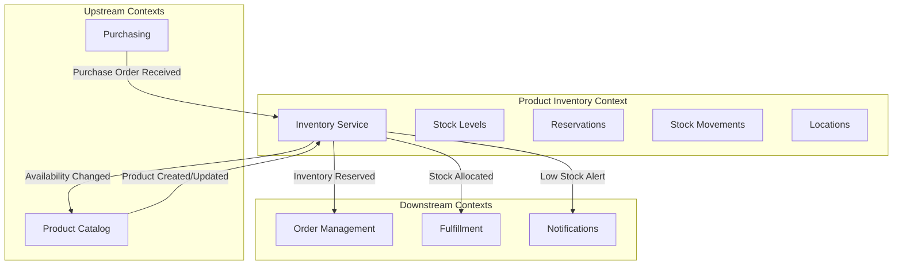
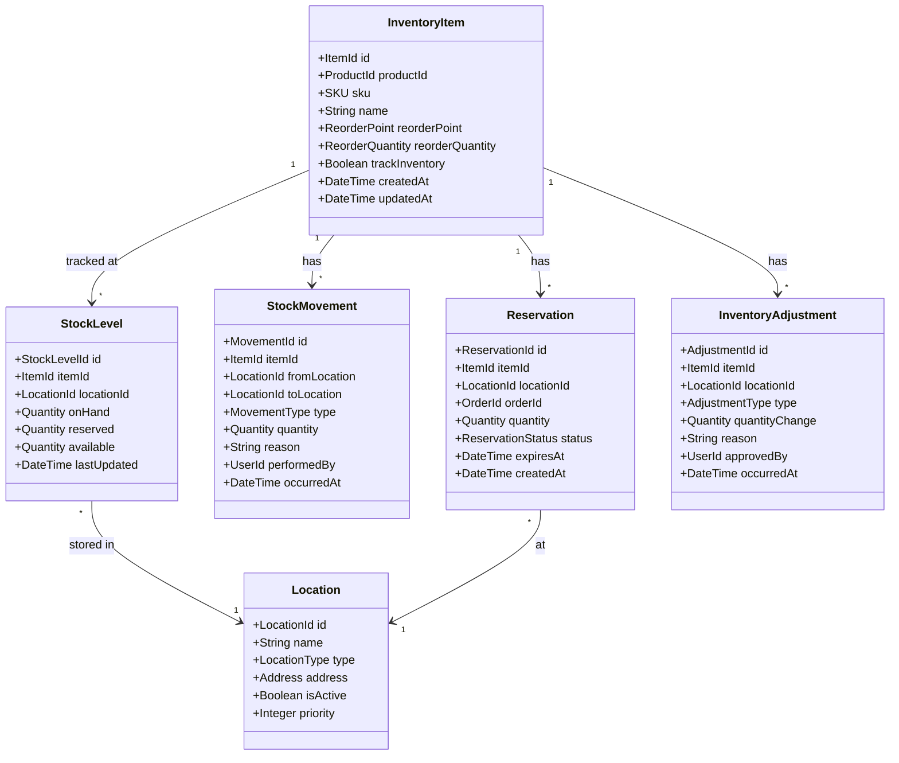
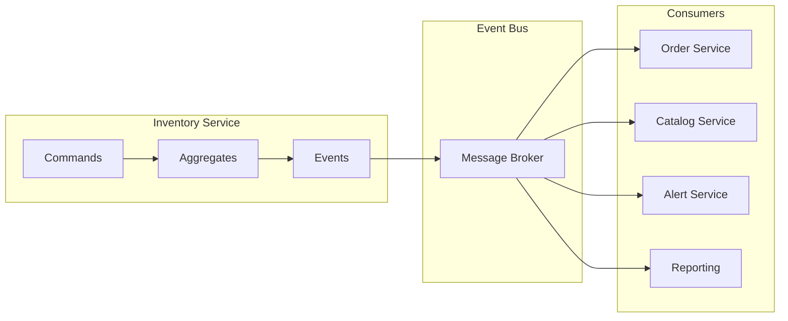
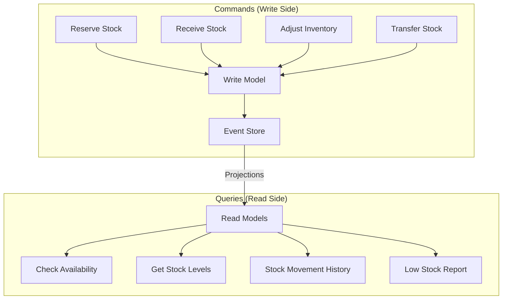
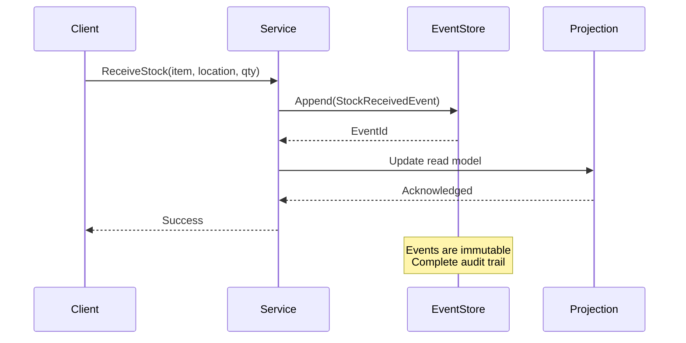
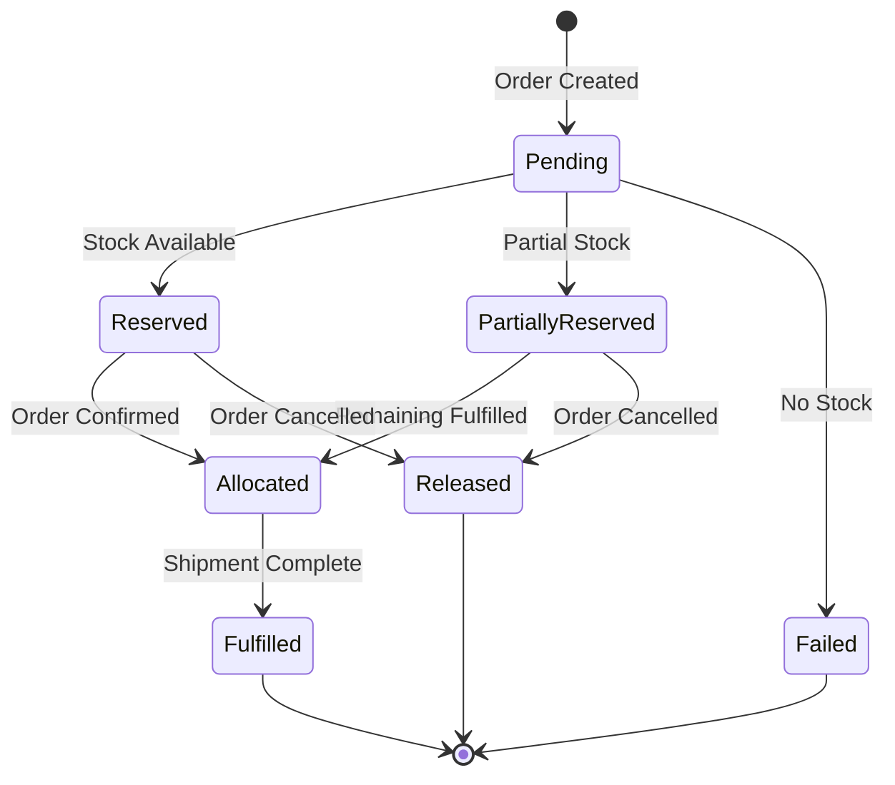
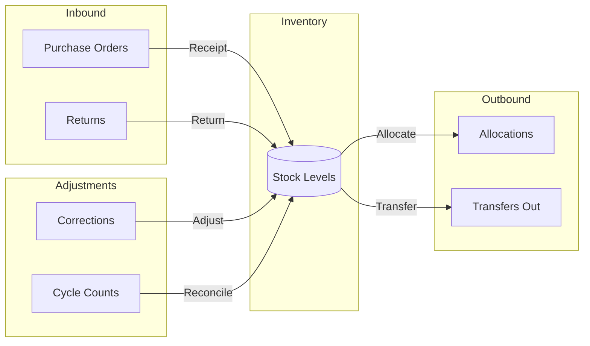
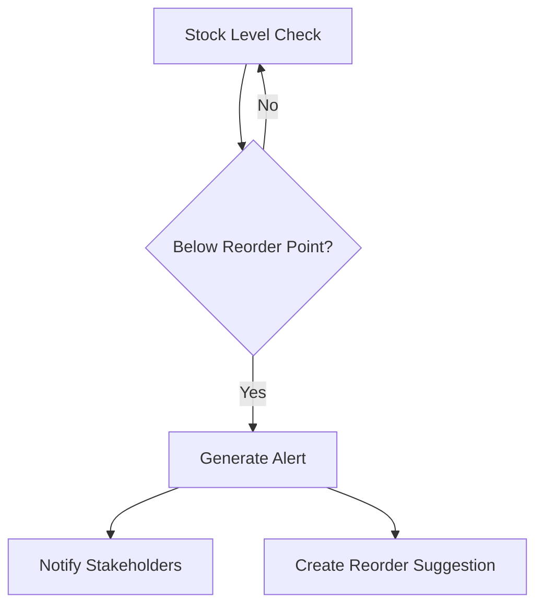
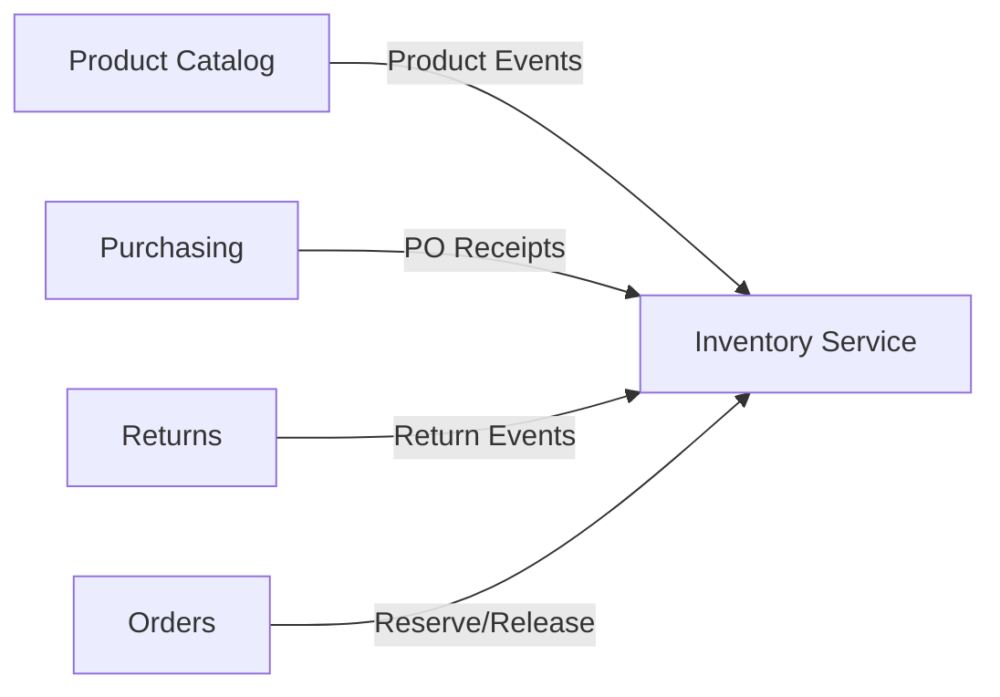
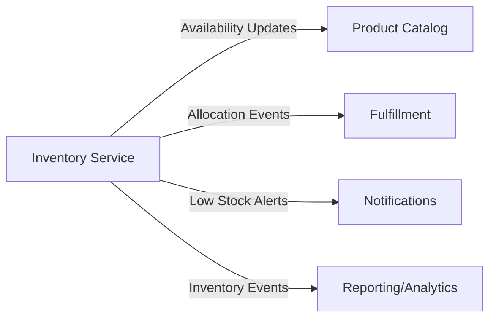

# Epic: Product Inventory Management

## Overview

As the **ACME, Inc. e-commerce platform**, we need a robust Product Inventory Management system to track stock levels, manage inventory across multiple locations, handle reservations for pending orders, and provide real-time visibility into product availability. This bounded context is critical for ensuring accurate stock information, preventing overselling, and enabling efficient fulfillment operations.

## Problem Statement

Without centralized inventory management, the platform faces several challenges:

- **Overselling**: Selling products that are not available leads to order cancellations and customer dissatisfaction
- **Stockouts**: Lack of visibility into low stock levels results in lost sales
- **Inaccurate reporting**: Disconnected systems create discrepancies between physical and recorded inventory
- **Operational inefficiency**: Manual inventory tracking across locations is error-prone and time-consuming
- **Poor customer experience**: Inability to show accurate availability information at point of purchase

## Goals

- Provide real-time, accurate inventory visibility across all locations
- Prevent overselling through inventory reservations during the order lifecycle
- Enable proactive inventory replenishment through configurable alerts
- Maintain complete audit trail of all inventory movements
- Support multi-location inventory management with transfer capabilities
- Integrate seamlessly with other bounded contexts (Orders, Fulfillment, Purchasing)

## Bounded Context

The Product Inventory Management service operates as a distinct bounded context within the ACME e-commerce ecosystem. It owns all data and business logic related to inventory tracking, stock movements, and availability calculations.

### Context Map

### Domain Model

## Architectural Alignment

This bounded context adheres to the architectural patterns defined in the platform architecture.

### Event-Driven Architecture

The inventory service publishes domain events for all significant state changes, enabling loose coupling with downstream consumers.

#### Published Events

| Event | Description | Consumers |
|-------|-------------|-----------|
| `InventoryItemCreated` | New inventory item registered | Catalog, Reporting |
| `StockReceived` | Stock added to inventory | Catalog, Reporting |
| `StockReserved` | Inventory reserved for order | Order Service |
| `ReservationConfirmed` | Reservation converted to allocation | Fulfillment |
| `ReservationReleased` | Reserved stock returned to available | Catalog |
| `StockAdjusted` | Manual inventory adjustment | Reporting, Audit |
| `StockTransferred` | Stock moved between locations | Reporting |
| `LowStockDetected` | Stock fell below reorder point | Notifications, Purchasing |
| `OutOfStock` | Item has zero available stock | Catalog, Notifications |

#### Consumed Events

| Event | Source | Action |
|-------|--------|--------|
| `ProductCreated` | Catalog Service | Create inventory item record |
| `ProductDeleted` | Catalog Service | Deactivate inventory tracking |
| `PurchaseOrderReceived` | Purchasing | Increase stock levels |
| `OrderCancelled` | Order Service | Release reservations |
| `FulfillmentCompleted` | Fulfillment | Confirm stock deduction |

### CQRS Pattern

Separate command and query responsibilities to optimize for different access patterns.

### Event Sourcing

All inventory changes are captured as immutable events, providing complete audit trail and temporal query capabilities.

## Features

### F1: Inventory Item Management

Create and manage inventory items linked to products from the catalog.

**Capabilities:**
- Register new inventory items when products are created in catalog
- Configure inventory tracking settings per item
- Set reorder points and reorder quantities
- Enable/disable inventory tracking for specific items
- Support for serialized inventory (unique items) vs. quantity-based

**Acceptance Criteria:**
- Inventory items are automatically created when products are published
- Items can be configured with location-specific reorder thresholds
- Inventory tracking can be disabled for digital/virtual products
- Changes to inventory configuration are audited

### F2: Stock Level Tracking

Maintain accurate, real-time stock levels across all locations.

**Capabilities:**
- Track on-hand, reserved, and available quantities per location
- Support for multiple warehouse/store locations
- Real-time availability calculations
- Aggregate availability across locations for customer-facing displays

**Acceptance Criteria:**
- Available quantity = On-hand - Reserved
- Stock levels update in near real-time (sub-second latency)
- Concurrent updates are handled correctly without race conditions
- Stock levels can never go negative

### F3: Inventory Reservations

Reserve inventory during the order lifecycle to prevent overselling.

**Capabilities:**
- Create reservations when orders are placed
- Automatic reservation expiration for abandoned carts/orders
- Convert reservations to allocations upon order confirmation
- Release reservations when orders are cancelled
- Support partial reservations across locations

**Acceptance Criteria:**
- Reservations are created atomically with order placement
- Reserved stock is deducted from available quantity immediately
- Expired reservations are automatically released
- Reservation conflicts are handled gracefully with customer notification

### F4: Stock Movements

Track all inventory movements including receipts, transfers, and adjustments.

**Movement Types:**
- **Receipt**: Stock received from purchase orders or returns
- **Transfer**: Stock moved between locations
- **Adjustment**: Manual corrections (shrinkage, damage, found stock)
- **Allocation**: Stock assigned to orders for fulfillment
- **Return**: Stock returned from customers

**Acceptance Criteria:**
- All movements are recorded with reason, quantity, and timestamp
- Movements require appropriate authorization based on type
- Movement history is immutable and queryable
- Transfers between locations maintain inventory integrity

### F5: Multi-Location Support

Manage inventory across multiple warehouses, stores, and fulfillment centers.

**Capabilities:**
- Define location hierarchy (regions, warehouses, zones)
- Set location-specific stock levels and thresholds
- Configure location priorities for fulfillment
- Support for virtual/logical locations (e.g., damaged goods, returns processing)

**Acceptance Criteria:**
- Each location has independent stock tracking
- Availability can be queried per location or aggregated
- Location priorities influence fulfillment allocation
- Inactive locations do not appear in availability calculations

### F6: Reorder Point Management

Automatically detect low stock and trigger replenishment workflows.

**Capabilities:**
- Configure reorder points per item and location
- Calculate dynamic reorder points based on sales velocity
- Generate low stock alerts and notifications
- Integrate with purchasing for automated reorder suggestions

**Acceptance Criteria:**
- Alerts trigger when available stock falls below reorder point
- Alerts include suggested reorder quantity
- Duplicate alerts are suppressed until stock is replenished
- Alert thresholds can be adjusted per season or promotion

### F7: Inventory Auditing

Maintain complete audit trail for compliance and operational insight.

**Capabilities:**
- Record all inventory changes with user, timestamp, and reason
- Support cycle counting workflows
- Variance detection and reporting
- Compliance reporting for financial audits

**Acceptance Criteria:**
- Every stock change is traceable to a source event or user action
- Audit logs are immutable and retained per policy
- Discrepancies are flagged for review
- Reports can be generated for any time period

### F8: Availability API

Provide real-time availability information to upstream services.

**Capabilities:**
- Query availability by SKU, location, or region
- Support bulk availability queries for catalog pages
- Provide estimated availability for backordered items
- Cache availability data for high-traffic endpoints

**Acceptance Criteria:**
- API responds within SLA thresholds (p99 < 100ms)
- Stale data is refreshed proactively
- API supports filtering by fulfillment capability
- Availability includes lead time for non-stocked items

## Integration Points

### Inbound Integrations

| Source | Integration | Data Flow |
|--------|-------------|-----------|
| Product Catalog | Event subscription | Product creation, updates, deletion |
| Purchasing | Event subscription | Purchase order receipts |
| Returns | Event subscription | Returned item receipts |
| Orders | Synchronous API | Reservation requests |

### Outbound Integrations

| Target | Integration | Data Flow |
|--------|-------------|-----------|
| Product Catalog | Event publishing | Availability changes |
| Fulfillment | Event publishing | Stock allocations |
| Notifications | Event publishing | Low stock alerts |
| Reporting | Event publishing | All inventory events |

## Observability Requirements

### Metrics

- Stock levels by item and location
- Reservation success/failure rates
- Average reservation duration
- Stock movement volumes by type
- Reorder alert frequency
- API latency percentiles

### Distributed Tracing

- Trace reservation flows from order to allocation
- Track stock movement propagation
- Monitor event processing latency

### Health Checks

- Event store connectivity
- Read model synchronization status
- Message broker connection health
- Cache availability

## Success Metrics

| Metric | Target | Description |
|--------|--------|-------------|
| Oversell Rate | < 0.1% | Orders placed for unavailable stock |
| Availability Accuracy | > 99.5% | Match between reported and actual availability |
| Reservation Latency | p99 < 200ms | Time to reserve stock for order |
| Stock Sync Latency | < 5 seconds | Time for stock changes to reflect in read models |
| Audit Completeness | 100% | All stock changes have audit trail |

## Risks and Mitigations

| Risk | Impact | Mitigation |
|------|--------|------------|
| Event store unavailability | Cannot process inventory updates | Multi-region replication, graceful degradation |
| Race conditions in reservations | Overselling | Optimistic locking, idempotent operations |
| Read model lag | Stale availability data | Tunable consistency, cache invalidation |
| High-volume traffic spikes | Service degradation | Auto-scaling, rate limiting, circuit breakers |
| Data inconsistency across locations | Incorrect stock levels | Reconciliation jobs, alerts on discrepancies |

## Future Considerations

- **Predictive inventory**: Machine learning for demand forecasting
- **Distributed inventory**: Support for dropship and marketplace inventory
- **Batch/lot tracking**: Expiration dates and batch-level traceability
- **Automated replenishment**: Integration with vendor systems for auto-reorder

## Appendix

### Glossary

| Term | Definition |
|------|------------|
| On-Hand | Physical quantity in a location |
| Reserved | Quantity held for pending orders |
| Available | On-hand minus reserved (can be sold) |
| Allocated | Reserved quantity assigned to fulfillment |
| Reorder Point | Stock level that triggers replenishment |
| SKU | Stock Keeping Unit, unique product identifier |
| Cycle Count | Periodic physical inventory verification |

### Related Documents

- [Architecture Overview](../ARCHITECTURE.md)
- [Product Catalog Epic](./002-product-catalog.md)
