# Epic: Customer Management Service

## Overview

As the **ACME, Inc. e-commerce platform**, we need a comprehensive Customer Management service to store, manage, and provide access to customer profile data, preferences, and relationship history. This bounded context serves as the central authority for customer identity and profile information, enabling personalized experiences and supporting business operations across the platform.

## Problem Statement

Without centralized customer management, the platform faces several challenges:

- **Fragmented customer data**: Customer information scattered across systems leads to inconsistent experiences
- **Poor personalization**: Inability to leverage customer preferences and history for tailored experiences
- **Compliance risks**: Lack of centralized data governance makes privacy regulations difficult to enforce
- **Operational inefficiency**: Customer service teams cannot access comprehensive customer context
- **Limited segmentation**: Marketing cannot effectively target customers without unified profiles
- **Address management chaos**: Multiple addresses stored inconsistently across order and payment systems

## Goals

- Establish a single source of truth for customer profile information
- Enable personalized customer experiences through preference management
- Support regulatory compliance (GDPR, CCPA) with comprehensive data governance
- Provide customer service teams with complete customer context
- Enable marketing segmentation through customer attributes and behavior tracking
- Maintain complete audit trail of all customer data changes
- Support multi-channel customer engagement with unified profiles

## Bounded Context

The Customer Management service operates as a distinct bounded context within the ACME e-commerce ecosystem. It owns all data and business logic related to customer profiles, preferences, addresses, and relationship management.

### Context Map

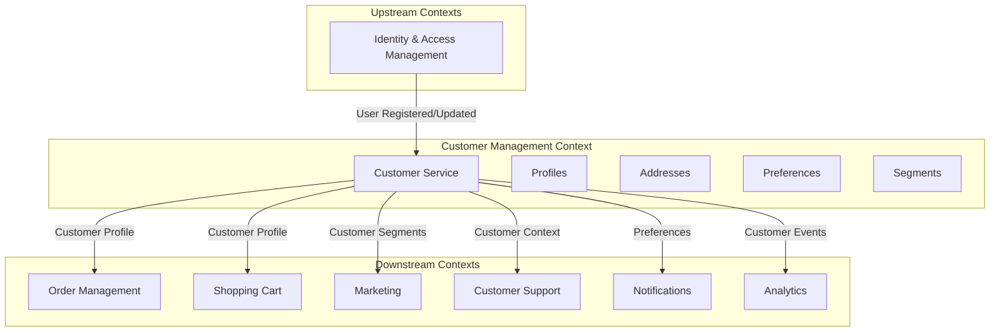

### Domain Ownership

The Customer Management service has exclusive ownership over:

- Customer profile data (name, contact information, demographics)
- Customer addresses (shipping, billing, favorites)
- Customer preferences (communication, display, privacy)
- Customer segments and tags
- Customer notes and internal annotations
- Customer consent and privacy settings
- Customer relationship metadata

### Integration Boundaries

| Integration | Direction | Pattern | Purpose |
|-------------|-----------|---------|---------|
| Identity & Access Management | Upstream | Event Consumer | Receive user registration and authentication events |
| Order Management | Downstream | Event Producer / Query API | Provide customer details for orders |
| Shopping Cart | Downstream | Query API | Provide addresses and preferences |
| Marketing | Downstream | Event Producer | Publish segment changes and profile updates |
| Customer Support | Downstream | Query API | Provide complete customer context |
| Notifications | Downstream | Query API | Provide communication preferences |
| Analytics | Downstream | Event Producer | Publish customer lifecycle events |

### Domain Model

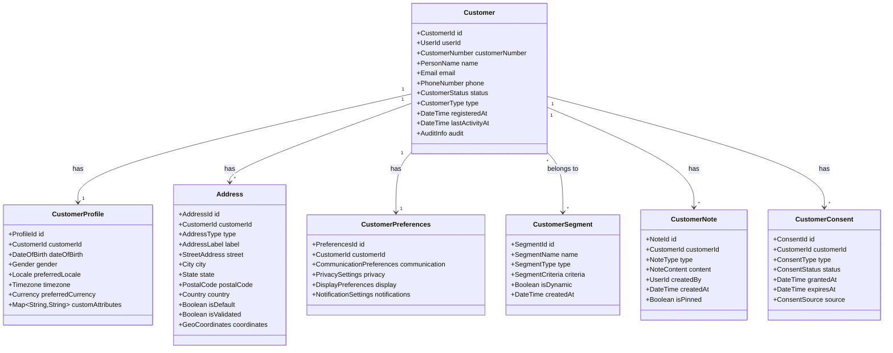

### Domain Events

The following events represent significant state changes within the Customer Management context:

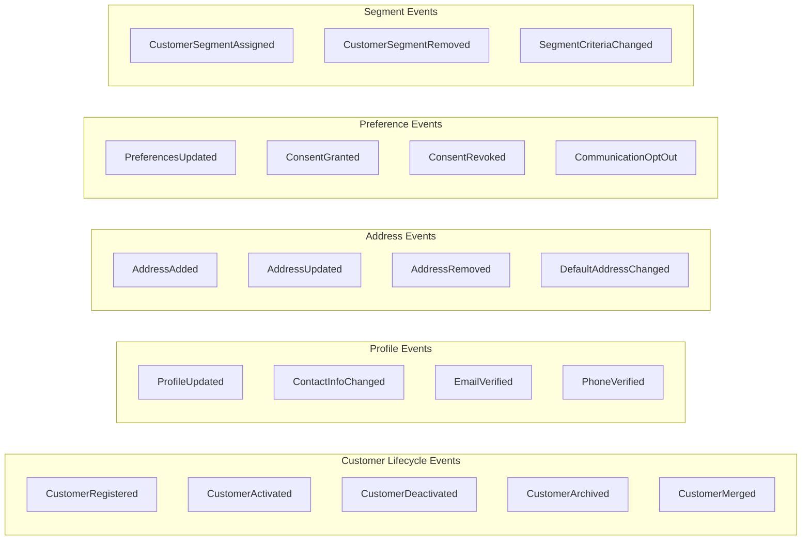

## Architectural Alignment

This bounded context adheres to the architectural patterns defined in the platform architecture.

### Event-Driven Architecture

The Customer Management service publishes domain events for all significant state changes, enabling loose coupling with downstream consumers.

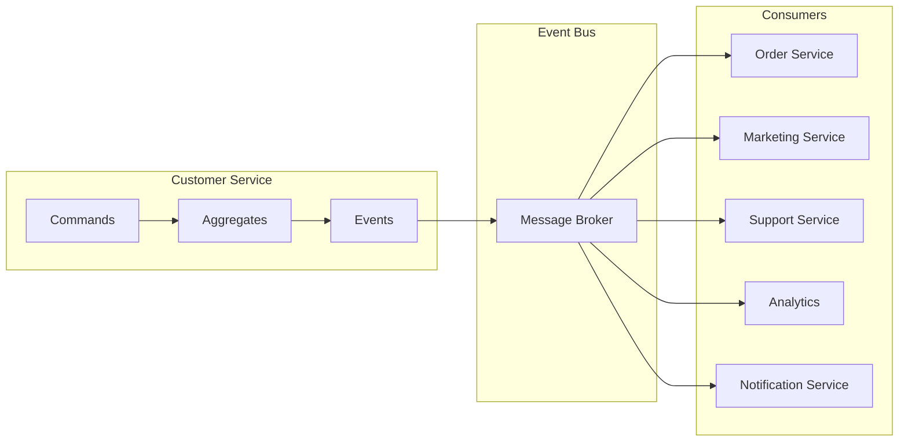

#### Published Events

| Event | Description | Consumers |
|-------|-------------|-----------|
| `CustomerRegistered` | New customer created | Marketing, Analytics, Notifications |
| `CustomerActivated` | Customer account activated | Order Service, Marketing |
| `CustomerProfileUpdated` | Profile information changed | Analytics, Support |
| `AddressAdded` | New address added | Order Service, Cart Service |
| `AddressUpdated` | Existing address modified | Order Service |
| `DefaultAddressChanged` | Default shipping/billing address changed | Cart Service |
| `PreferencesUpdated` | Customer preferences changed | Notifications, Marketing |
| `ConsentGranted` | Customer granted consent | Marketing, Notifications |
| `ConsentRevoked` | Customer revoked consent | Marketing, Notifications |
| `CustomerSegmentAssigned` | Customer added to segment | Marketing |
| `CustomerDeactivated` | Customer account deactivated | All downstream services |

#### Consumed Events

| Event | Source | Action |
|-------|--------|--------|
| `UserRegistered` | Identity Management | Create customer profile |
| `UserDeleted` | Identity Management | Archive customer data |
| `OrderCompleted` | Order Management | Update last activity, purchase count |
| `SupportTicketResolved` | Customer Support | Update customer notes |

### CQRS Pattern

Separate command and query responsibilities to optimize for different access patterns.

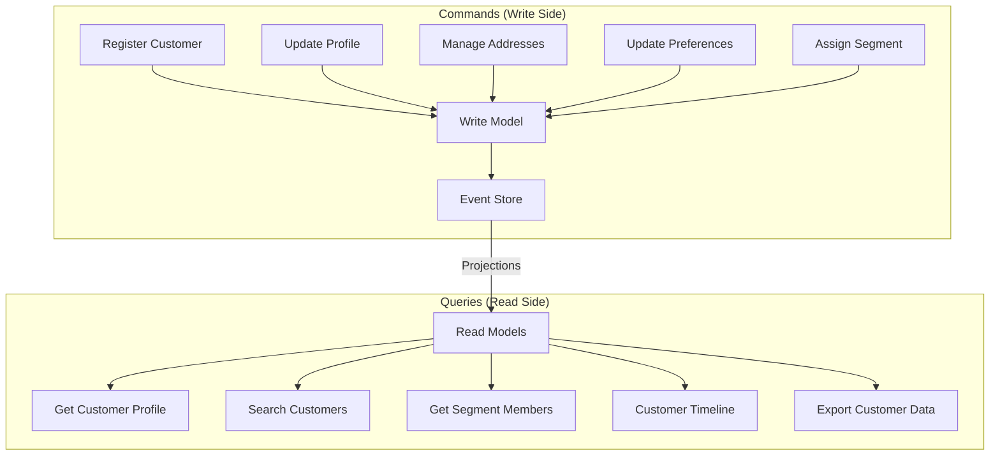

### Event Sourcing

All customer changes are captured as immutable events, providing complete audit trail and temporal query capabilities essential for compliance.

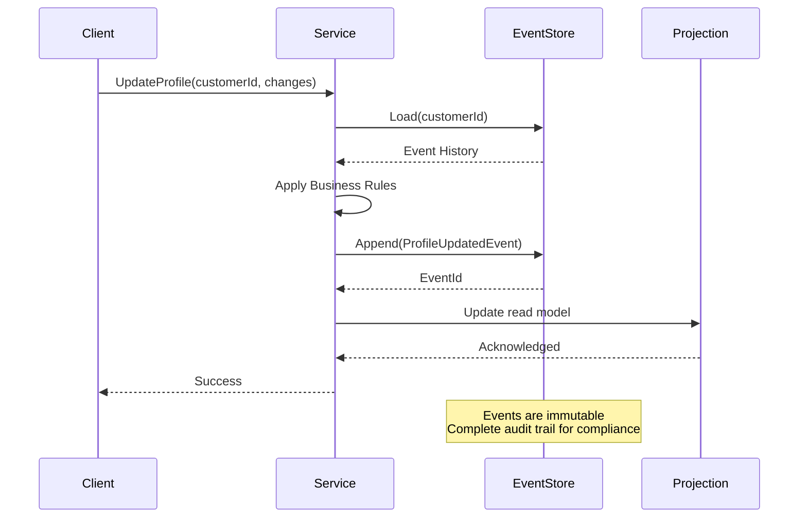

### Service Discovery and Health

The service participates in platform service discovery:

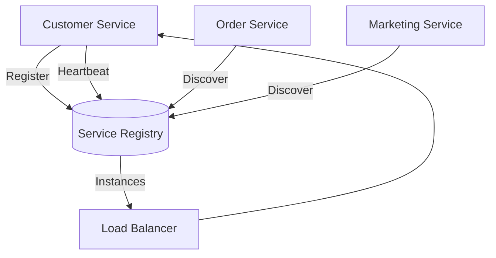

**Health Checks:**
- Liveness probe: Service process is running
- Readiness probe: Service can handle requests (dependencies available)
- Dependency health: Database, event store, message broker connectivity

## Features

### F1: Customer Profile Management

Create and manage comprehensive customer profiles throughout the customer lifecycle.

**Capabilities:**
- Create customer profiles upon user registration
- Update customer contact information (email, phone)
- Manage customer demographic data
- Track customer lifecycle status transitions
- Support customer profile merging for duplicate resolution
- Maintain profile completeness scoring

**Acceptance Criteria:**
- Customer profiles are created automatically when users register
- All profile changes are captured as domain events
- Profile history is queryable for audit and customer service
- Validation rules prevent invalid profile states
- Duplicate detection is performed on registration

---

### F2: Address Management

Manage multiple customer addresses for shipping, billing, and other purposes.

**Capabilities:**
- Add, update, and remove customer addresses
- Support multiple address types (shipping, billing, business)
- Designate default addresses per type
- Validate addresses against postal standards
- Store geocoordinates for delivery optimization
- Label addresses with customer-friendly names

**Acceptance Criteria:**
- Customers can maintain multiple addresses per type
- Address changes trigger events for dependent services
- Address validation is performed before storage
- Default address changes are propagated to cart and checkout
- Address deletion is handled gracefully with order history preservation

---

### F3: Customer Preferences Management

Store and manage customer preferences for personalized experiences.

**Capabilities:**
- Manage communication preferences (email, SMS, push)
- Store display preferences (language, currency, timezone)
- Track privacy settings and data sharing preferences
- Support notification frequency controls
- Enable per-channel opt-in/opt-out

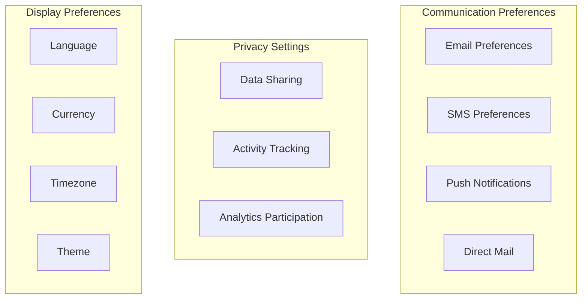

**Acceptance Criteria:**
- Preferences can be updated independently
- Preference changes are immediately effective
- Marketing respects communication preferences
- Preferences are exportable for data portability
- Default preferences are applied for new customers

---

### F4: Consent Management

Track and manage customer consent for regulatory compliance.

**Capabilities:**
- Record consent grants with timestamps and sources
- Track consent expiration and renewal
- Support consent revocation with full audit trail
- Manage consent per purpose (marketing, analytics, personalization)
- Export consent records for compliance audits

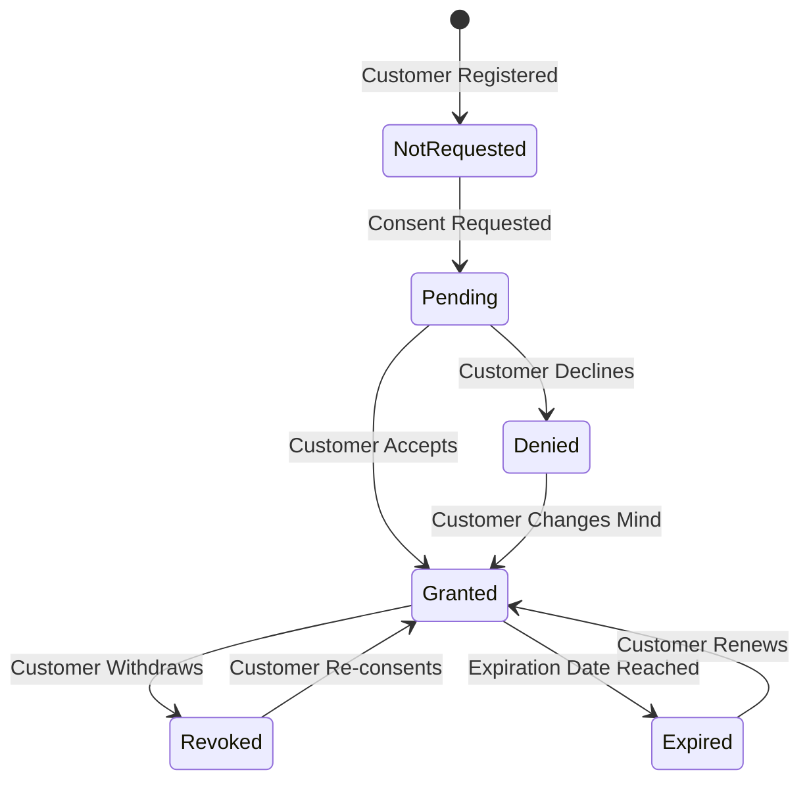

**Acceptance Criteria:**
- All consent changes are immutably recorded
- Consent status is queryable by purpose
- Revoked consent immediately affects dependent processing
- Consent audit logs meet regulatory requirements
- Consent can be requested through multiple channels

---

### F5: Customer Segmentation

Organize customers into segments for targeted marketing and personalization.

**Capabilities:**
- Define static segments with manual membership
- Create dynamic segments with rule-based criteria
- Support multiple segment assignments per customer
- Track segment membership changes over time
- Provide segment analytics and counts

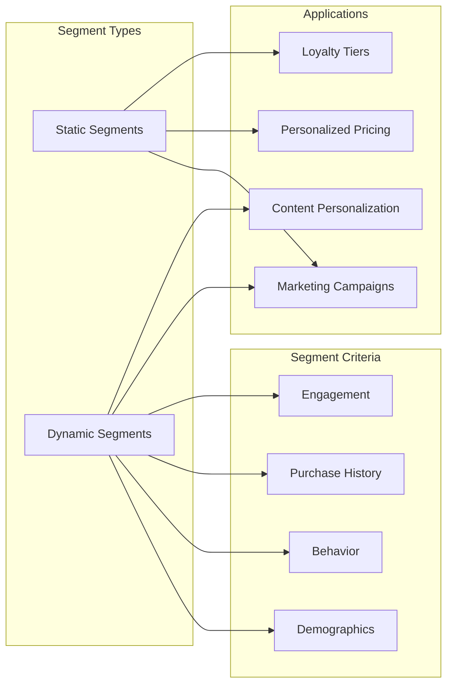

**Acceptance Criteria:**
- Segments can be created and modified by administrators
- Dynamic segment membership is recalculated on relevant events
- Segment changes trigger events for marketing systems
- Large segment queries are performant
- Segment overlap is visible for campaign planning

---

### F6: Customer Notes and Annotations

Maintain internal notes and annotations on customer records.

**Capabilities:**
- Add notes to customer profiles
- Categorize notes by type (support, sales, compliance)
- Support note pinning for visibility
- Track note authorship and timestamps
- Search notes across customer base

**Acceptance Criteria:**
- Notes are visible to authorized personnel only
- Note history is maintained and auditable
- Notes can be filtered by type and date
- Pinned notes appear prominently
- Notes are included in customer context exports

---

### F7: Customer Search and Discovery

Enable efficient search across the customer base.

**Capabilities:**
- Full-text search across customer data
- Filtering by attributes, segments, and status
- Search by partial name, email, or phone
- Sort by relevance, date, or activity
- Pagination for large result sets

**Acceptance Criteria:**
- Search returns results within acceptable latency thresholds
- Search respects data access permissions
- Partial matches are handled appropriately
- Search results include relevant context
- Export search results for bulk operations

---

### F8: Customer Data Export and Portability

Support data portability and compliance requirements.

**Capabilities:**
- Export complete customer data in standard formats
- Generate data access requests for GDPR/CCPA
- Support selective data export
- Provide machine-readable export formats
- Track export requests for compliance

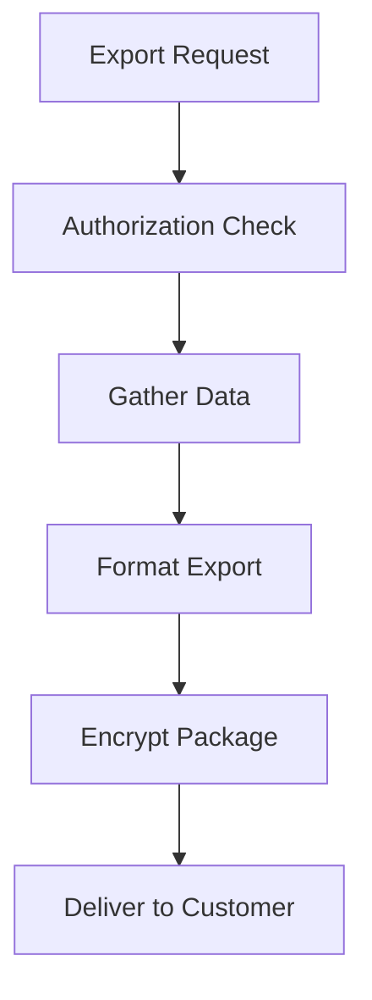

**Acceptance Criteria:**
- Exports include all customer-owned data
- Export format is documented and consistent
- Exports complete within SLA timeframes
- Export requests are logged for compliance
- Sensitive data is appropriately handled

---

### F9: Customer Data Retention and Deletion

Manage customer data lifecycle per retention policies.

**Capabilities:**
- Define retention periods by data type
- Automatic anonymization after retention period
- Support right-to-erasure requests
- Selective deletion with order history preservation
- Deletion audit trail maintenance

**Acceptance Criteria:**
- Retention policies are configurable
- Anonymization preserves analytical value
- Deletion requests are processed within SLA
- Deleted data cannot be recovered
- Deletion is propagated to downstream systems

---

### F10: Customer Activity Timeline

Provide unified view of customer interactions and events.

**Capabilities:**
- Aggregate customer events across services
- Display chronological activity timeline
- Filter by event type and date range
- Highlight significant events
- Support customer service context

**Acceptance Criteria:**
- Timeline includes events from all relevant sources
- Events are displayed in real-time
- Large timelines are efficiently paginated
- Timeline is accessible to authorized users only
- Event details are expandable

## Integration Points

### Inbound Integrations

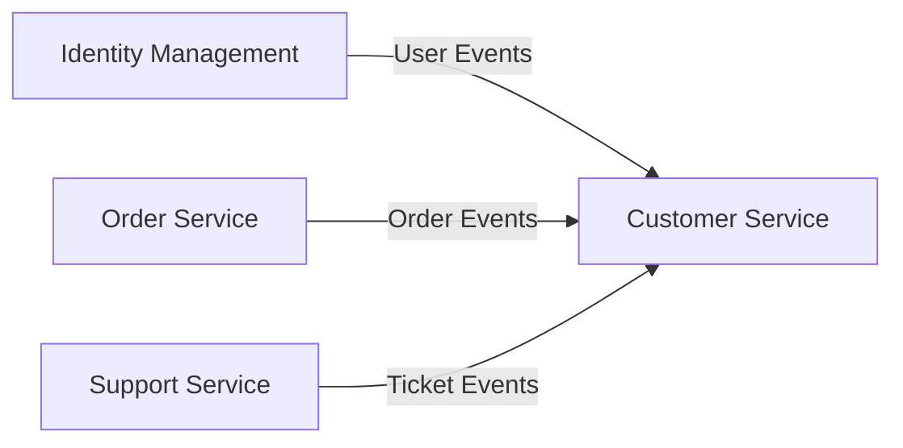

| Source | Integration | Data Flow |
|--------|-------------|-----------|
| Identity Management | Event subscription | User registration, updates, deletion |
| Order Service | Event subscription | Order completion, purchase patterns |
| Support Service | Event subscription | Ticket creation, resolution |

### Outbound Integrations

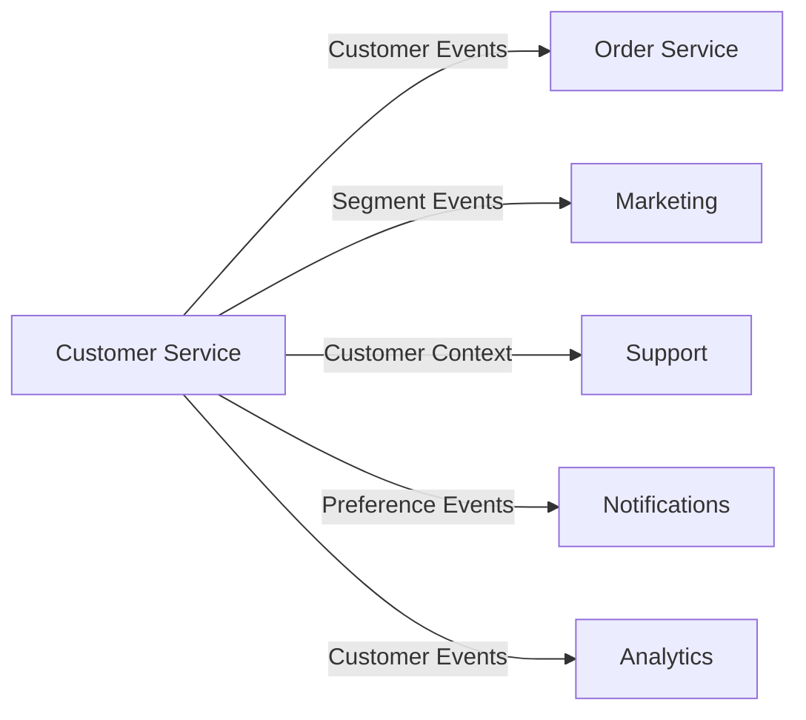

| Target | Integration | Data Flow |
|--------|-------------|-----------|
| Order Service | Query API / Events | Customer profiles, addresses |
| Marketing | Event publishing | Segment changes, preferences |
| Support | Query API | Complete customer context |
| Notifications | Query API | Communication preferences |
| Analytics | Event publishing | Customer lifecycle events |

## Observability Requirements

### Metrics

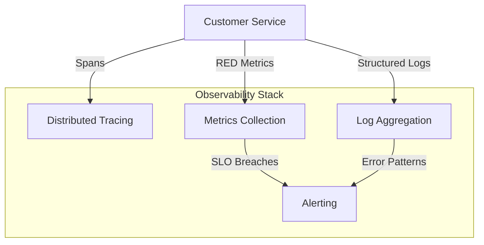

**Key Metrics:**
- Customer registration rate and funnel conversion
- Profile completeness scores
- Address validation success rates
- Consent grant/revoke ratios
- Segment membership counts and changes
- Data export request volume and processing time
- API latency percentiles (RED metrics)

### Distributed Tracing

- Trace customer registration flows across services
- Track profile update propagation
- Monitor consent enforcement paths
- Trace data export processing

### Health Checks

- Event store connectivity
- Read model synchronization status
- Message broker connection health
- External validation service availability

## Success Metrics

| Metric | Target | Description |
|--------|--------|-------------|
| Profile Completeness | > 80% | Customers with complete core profile data |
| Address Validation Rate | > 95% | Addresses passing validation |
| Consent Coverage | 100% | Customers with recorded consent status |
| Data Export SLA | < 72 hours | Time to fulfill data export requests |
| API Latency | p99 < 100ms | Customer lookup response time |
| Event Processing Lag | < 5 seconds | Time for events to update read models |

## Risks and Mitigations

| Risk | Impact | Mitigation |
|------|--------|------------|
| Data breach exposure | Regulatory fines, reputation damage | Encryption at rest and transit, access controls |
| GDPR/CCPA non-compliance | Legal liability | Comprehensive consent tracking, data portability |
| Customer data inconsistency | Poor customer experience | Event sourcing, reconciliation processes |
| High-volume profile updates | Service degradation | CQRS, caching, rate limiting |
| Duplicate customer records | Fragmented customer view | Duplicate detection, merge workflows |
| Downstream service failures | Stale customer data | Event retry mechanisms, circuit breakers |

## Security Considerations

### Data Classification

| Data Type | Classification | Handling |
|-----------|---------------|----------|
| Email, Phone | PII | Encrypted, access logged |
| Name, Address | PII | Encrypted, access logged |
| Date of Birth | Sensitive PII | Additional access controls |
| Preferences | Personal | Standard encryption |
| Consent Records | Compliance | Immutable, long retention |

### Access Controls

- Role-based access to customer data
- Customer service representatives have read access
- Administrators have full access with audit
- Customers have full access to their own data
- Marketing has segment membership only

## Future Considerations

- **Customer 360 View**: Unified dashboard with all customer touchpoints
- **Predictive Segmentation**: Machine learning for behavioral segmentation
- **Identity Resolution**: Cross-device and cross-channel identity linking
- **Customer Health Scoring**: Predictive churn and engagement scoring
- **B2B Customer Hierarchies**: Support for business accounts with parent-child relationships

## Appendix

### Glossary

| Term | Definition |
|------|------------|
| Customer | A person or entity that has registered with the platform |
| Profile | Core identifying information about a customer |
| Segment | A group of customers sharing common characteristics |
| Consent | Explicit permission for specific data processing |
| PII | Personally Identifiable Information |
| Data Subject | The individual whose data is being processed |
| Right to Erasure | GDPR right to have personal data deleted |

### Related Documents

- [Architecture Overview](../ARCHITECTURE.md)
- [Identity Management Epic](./000-identity-management.md)
- [Order Management Epic](./005-order-management.md)
