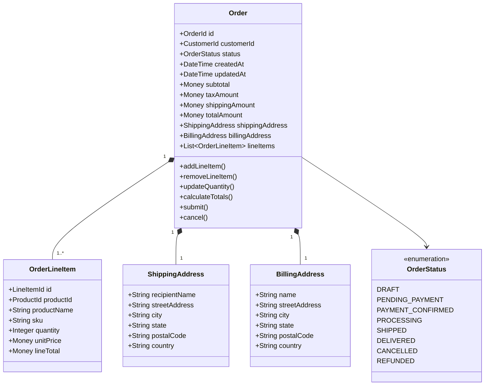

# Epic: Order Management Service

## Overview

**Epic ID:** ACME-EPIC-005
**Title:** Order Management Service for ACME E-Commerce
**Priority:** High
**Status:** Draft

### Epic Statement

As an **e-commerce platform operator**, I need a **comprehensive order management system** so that **customers can place, track, and manage their orders while the business maintains full visibility into order lifecycle and fulfillment operations**.

## Business Context

The Order Management Service represents a core bounded context within the ACME e-commerce platform. It serves as the central orchestrator for the customer purchase journey, coordinating interactions between customers, inventory, payments, and fulfillment operations. This service must handle high transaction volumes while maintaining data consistency, providing real-time status updates, and supporting complex business rules around order processing.

## Strategic Importance

- **Revenue Generation**: Direct enabler of customer transactions
- **Customer Experience**: Primary touchpoint for purchase satisfaction
- **Operational Efficiency**: Streamlines fulfillment workflows
- **Business Intelligence**: Source of truth for sales analytics

## Domain Model

### Bounded Context

### Order Aggregate

The Order serves as the aggregate root, encapsulating all order-related entities and enforcing business invariants.

## Order Lifecycle State Machine

## Features

### F1: Order Creation

Enable customers to create and submit orders from their shopping cart.

**Capabilities:**
- Convert shopping cart to order
- Validate product availability
- Reserve inventory during checkout
- Calculate pricing, taxes, and shipping costs
- Capture shipping and billing information
- Generate unique order identifiers

**Acceptance Criteria:**
- Orders can only be created with valid products that are in stock
- Inventory is reserved when order is submitted
- Order totals are accurately calculated including applicable taxes
- Customers receive immediate confirmation of order submission

### F2: Order Modification

Allow customers and administrators to modify orders before fulfillment begins.

**Capabilities:**
- Add or remove line items
- Update quantities
- Change shipping address
- Apply promotional codes
- Update shipping method

**Acceptance Criteria:**
- Modifications are only allowed while order is in modifiable state
- Price adjustments are recalculated automatically
- Inventory reservations are updated accordingly
- Audit trail captures all modifications

### F3: Order Cancellation

Support order cancellation with appropriate inventory and payment handling.

**Capabilities:**
- Customer-initiated cancellation
- Administrative cancellation
- Automatic cancellation (payment timeout, fraud detection)
- Cancellation reason tracking

**Acceptance Criteria:**
- Cancellation triggers inventory release
- Payment refunds are initiated for paid orders
- Cancellation notifications are sent to customers
- Cancelled orders cannot be reactivated

### F4: Order Fulfillment Tracking

Track orders through the fulfillment pipeline and provide status visibility.

**Capabilities:**
- Status transitions through fulfillment stages
- Integration with warehouse management
- Shipping carrier tracking integration
- Estimated delivery date calculation

**Acceptance Criteria:**
- Order status reflects current fulfillment state
- Status changes trigger customer notifications
- Tracking information is available once shipped
- Delivery confirmation updates order status

### F5: Order History and Retrieval

Provide comprehensive order history and search capabilities.

**Capabilities:**
- Customer order history view
- Order search by multiple criteria
- Order details retrieval
- Reorder functionality

**Acceptance Criteria:**
- Customers can view all past orders
- Orders are searchable by ID, date range, status, and product
- Complete order details are accessible
- Previous orders can be used as templates for new orders

### F6: Returns and Refunds

Manage return requests and process refunds.

**Capabilities:**
- Return merchandise authorization (RMA) generation
- Return reason categorization
- Partial and full refund processing
- Return shipping coordination

**Acceptance Criteria:**
- Returns are only accepted within the return policy window
- Refunds are processed based on return condition
- Inventory is updated upon return receipt
- Customer is notified of refund status

### F7: Order Notifications

Send timely notifications throughout the order lifecycle.

**Capabilities:**
- Order confirmation notifications
- Status change notifications
- Shipping notifications with tracking
- Delivery confirmation notifications

**Acceptance Criteria:**
- Notifications are sent via customer's preferred channel
- Notifications contain relevant order details
- Tracking links are included when available
- Notification preferences are respected

### F8: Administrative Order Management

Provide tools for customer service and operations teams.

**Capabilities:**
- Order lookup and management
- Manual status updates
- Order notes and annotations
- Bulk order operations
- Order exception handling

**Acceptance Criteria:**
- Authorized users can search and view any order
- Status can be manually adjusted with proper authorization
- All administrative actions are audit logged
- Customer service can handle order exceptions efficiently

## Architecture

### Service Integration

### CQRS Pattern Implementation

### Event Sourcing

The Order Management Service implements event sourcing to maintain a complete audit trail and enable temporal queries.

### Order Domain Events

| Event | Description | Triggers |
|-------|-------------|----------|
| OrderCreated | New order initialized | Cart checkout initiated |
| OrderLineItemAdded | Item added to order | Product added during modification |
| OrderLineItemRemoved | Item removed from order | Product removed during modification |
| OrderSubmitted | Order submitted for processing | Customer confirms order |
| OrderPaymentRequested | Payment initiated | Order submission |
| OrderPaymentConfirmed | Payment successful | Payment service confirmation |
| OrderPaymentFailed | Payment unsuccessful | Payment service rejection |
| OrderProcessingStarted | Fulfillment begun | Payment confirmation |
| OrderShipped | Order dispatched | Warehouse confirmation |
| OrderDelivered | Order received | Delivery confirmation |
| OrderCancelled | Order cancelled | Customer/admin/system action |
| OrderRefundInitiated | Refund processing started | Cancellation or return |
| OrderRefundCompleted | Refund processed | Payment service confirmation |

### Saga: Order Placement

## Cross-Cutting Concerns

### Observability

Following platform observability standards:

- **Distributed Tracing**: Correlation IDs propagated across all service interactions
- **Metrics**: RED metrics for all endpoints, business metrics for order KPIs
- **Logging**: Structured logs with correlation IDs for all operations
- **Health Checks**: Liveness and readiness probes including downstream dependencies

### Key Metrics

| Metric | Type | Description |
|--------|------|-------------|
| orders_created_total | Counter | Total orders created |
| orders_completed_total | Counter | Total orders successfully delivered |
| orders_cancelled_total | Counter | Total orders cancelled |
| order_processing_duration | Histogram | Time from submission to delivery |
| order_value | Histogram | Order total amounts |
| active_orders | Gauge | Orders currently in progress |

### Security Considerations

- Orders accessible only to owning customer or authorized administrators
- Payment information handled in compliance with PCI-DSS
- Audit logging for all order modifications
- Rate limiting on order creation endpoints
- Fraud detection integration points

### Data Consistency

- Event sourcing ensures complete audit trail
- Saga pattern for distributed transaction coordination
- Eventual consistency between write and read models
- Idempotency keys for duplicate request handling

## Integration Points

| Service | Integration Type | Purpose |
|---------|-----------------|---------|
| Product Catalog | Synchronous | Product validation, pricing |
| Inventory | Synchronous + Events | Stock reservation, availability |
| Payment | Synchronous | Payment processing |
| Shipping | Synchronous + Events | Shipping rates, tracking |
| Customer | Events | Customer order history |
| Notification | Events | Customer communications |

## Non-Functional Requirements

### Performance
- Order creation latency under 500ms (P95)
- Order query latency under 100ms (P95)
- Support for 1000+ concurrent orders

### Availability
- 99.9% uptime SLO
- Graceful degradation when dependencies unavailable
- Circuit breakers for external service calls

### Scalability
- Horizontal scaling of command and query sides independently
- Event store partitioning by order ID
- Read model replication for query scaling

### Data Retention
- Order data retained for 7 years (regulatory compliance)
- Event store provides complete history
- Read models can be rebuilt from events

## Dependencies

| Dependency | Type | Criticality |
|------------|------|-------------|
| Event Store | Infrastructure | Critical |
| Read Model Database | Infrastructure | High |
| Message Broker | Infrastructure | Critical |
| Product Catalog Service | Service | Critical |
| Inventory Service | Service | Critical |
| Payment Service | Service | Critical |
| Shipping Service | Service | High |
| Notification Service | Service | Medium |

## Success Metrics

| Metric | Target | Measurement |
|--------|--------|-------------|
| Order Completion Rate | > 95% | Completed / Submitted |
| Order Processing Time | < 3 days | Submission to Delivery |
| Customer Satisfaction | > 4.5/5 | Post-purchase survey |
| Cart Abandonment | < 30% | Checkout initiated vs completed |
| Return Rate | < 5% | Returns / Completed orders |

## Open Questions

1. What is the maximum order modification window?
2. What partial fulfillment strategies should be supported?
3. What fraud detection integrations are required?
4. What international shipping considerations exist?
5. What loyalty program integrations are needed?

## Related Epics

- ACME-EPIC-003: Product Catalog Service
- ACME-EPIC-004: Product Inventory Management
- (Future) Shopping Cart Service
- (Future) Payment Processing Service
- (Future) Shipping and Fulfillment Service

## Revision History

| Version | Date | Author | Changes |
|---------|------|--------|---------|
| 1.0 | 2026-01-01 | ACME Platform Team | Initial draft |
