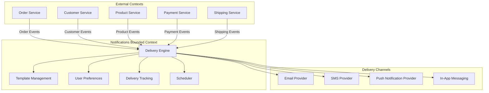
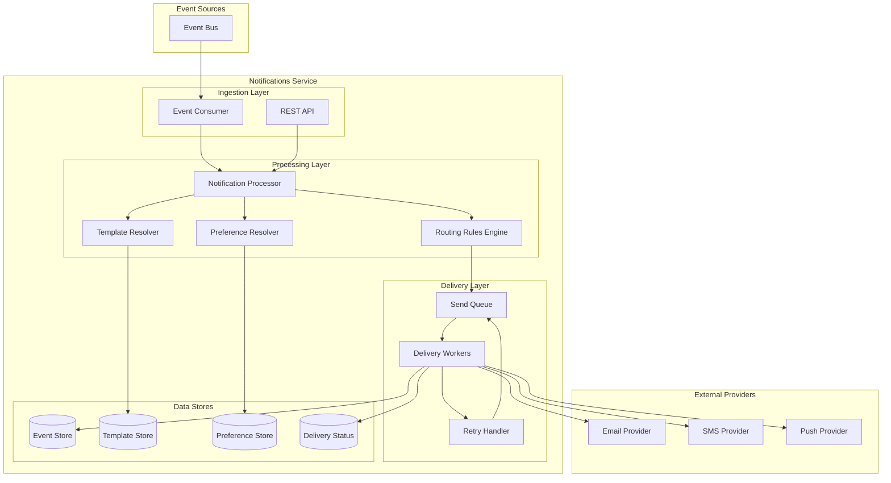
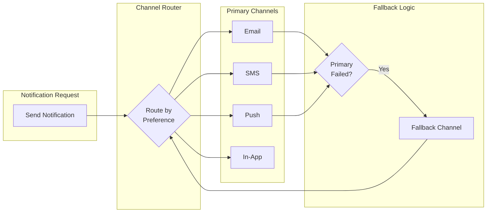
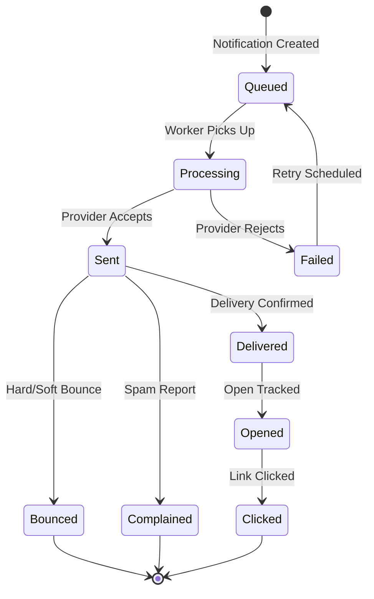
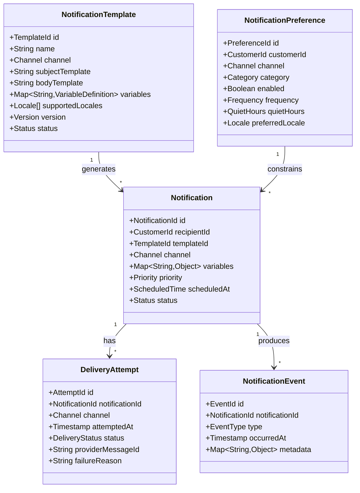

# Epic: Notifications Management Service for ACME E-Commerce

## Overview

As the **ACME E-Commerce Platform**, we need a centralized **Notifications Management Service** that delivers timely, relevant communications to customers and internal stakeholders across multiple channels. This bounded context service is responsible for orchestrating all outbound communications triggered by events throughout the platform.

## Problem Statement

E-commerce platforms generate numerous events that require customer communication: order confirmations, shipping updates, promotional campaigns, account alerts, and more. Without a centralized notification service:

- Each service implements its own notification logic, leading to inconsistent messaging
- User preferences are scattered across services or ignored entirely
- Delivery failures go untracked, resulting in poor customer experience
- Template management becomes fragmented and difficult to maintain
- Scaling notification delivery independently from business services is impossible

## Business Value

- **Improved Customer Experience**: Timely, consistent communications across all touchpoints
- **Reduced Support Burden**: Proactive notifications reduce "where is my order?" inquiries
- **Marketing Enablement**: Centralized platform for promotional and transactional messaging
- **Compliance Support**: Audit trail for all communications and preference management
- **Operational Visibility**: Delivery metrics and failure tracking across all channels

## Bounded Context

The Notifications Management Service owns the following domain concepts:

- **Notification Templates**: Reusable message templates with variable substitution
- **Delivery Channels**: Email, SMS, push notifications, and in-app messages
- **User Preferences**: Per-user, per-channel communication settings
- **Notification Events**: Triggers that initiate notification delivery
- **Delivery Status**: Tracking of send attempts, successes, and failures
- **Scheduling Rules**: Time-based delivery constraints and batching logic

### Context Boundaries

This service **does not own**:
- User identity or authentication (consumed from Customer Service)
- Order details (consumed from Order Service)
- Product information (consumed from Product Catalog Service)
- Payment status (consumed from Payment Service)

## Architecture Alignment

This service adheres to the architectural patterns defined in the platform:

### Microservices Pattern
- Independently deployable service with dedicated data storage
- Clear API boundaries for template management and preference configuration
- Asynchronous event consumption for notification triggers

### Event-Driven Architecture
- Consumes domain events from upstream services (orders, shipments, payments)
- Publishes notification lifecycle events (sent, delivered, failed, opened)
- Decoupled from event producers—services don't need to know about notifications

### CQRS Pattern
- **Command Side**: Template creation, preference updates, send requests
- **Query Side**: Delivery status, notification history, analytics dashboards
- Optimized read models for high-volume status queries

### Event Sourcing
- All notification events stored immutably for audit compliance
- Replay capability for debugging delivery issues
- Historical reconstruction for compliance inquiries

### Observability
- Distributed tracing across the delivery pipeline
- Metrics for delivery rates, latency, and failure rates by channel
- Structured logging with correlation IDs linking to source events

## System Architecture

## Features

### F1: Notification Template Management

Manage reusable message templates with support for variable substitution, localization, and version control.

**Capabilities**:
- Create, update, and archive notification templates
- Support multiple content formats per template (HTML, plain text, rich push)
- Variable placeholders with validation rules
- Template versioning with rollback support
- Preview and test rendering before activation
- Localization support for multi-language content

**Broad Acceptance Criteria**:
- Templates can be created for any supported channel
- Variables are validated against expected data schemas
- Templates support conditional content blocks
- Previous template versions remain accessible for audit purposes
- Templates can be tested with sample data before activation

### F2: User Notification Preferences

Enable users to control their communication preferences across channels and notification types.

**Capabilities**:
- Per-channel opt-in/opt-out settings
- Notification category preferences (transactional, promotional, alerts)
- Quiet hours configuration
- Preferred language selection
- Frequency controls (immediate, daily digest, weekly summary)
- Unsubscribe management with compliance tracking

**Broad Acceptance Criteria**:
- Users can manage preferences through self-service interface
- Transactional notifications respect legal requirements regardless of preferences
- Preference changes take effect immediately
- Preference history is maintained for compliance audits
- Bulk unsubscribe requests are processed within regulatory timeframes

### F3: Multi-Channel Delivery

Deliver notifications through multiple channels with intelligent routing and fallback strategies.

**Capabilities**:
- Email delivery with tracking (opens, clicks)
- SMS delivery with delivery receipts
- Mobile push notifications (iOS, Android)
- In-app notification center
- Channel priority and fallback configuration
- Provider abstraction for vendor flexibility

**Broad Acceptance Criteria**:
- Each channel operates independently with its own delivery pipeline
- Failed deliveries on primary channel trigger fallback attempts
- Channel-specific formatting is applied automatically
- Delivery provider failures don't cascade to other channels
- Provider switching requires no changes to upstream services

### F4: Event-Driven Notification Triggers

Consume domain events from platform services to trigger contextual notifications automatically.

**Capabilities**:
- Event subscription configuration per notification type
- Event-to-template mapping rules
- Data extraction and transformation from events
- Conditional trigger logic based on event attributes
- Deduplication of repeated events
- Event replay for missed notifications

**Broad Acceptance Criteria**:
- New event types can be configured without code deployment
- Events are processed in order per customer
- Failed event processing doesn't block subsequent events
- Duplicate events result in single notification delivery
- Event processing lag is visible in operational dashboards

### F5: Delivery Tracking and Status

Track the complete lifecycle of every notification from creation through delivery confirmation.

**Capabilities**:
- Real-time delivery status updates
- Bounce and complaint handling
- Open and click tracking for supported channels
- Delivery failure categorization (hard bounce, soft bounce, spam)
- Customer notification history view
- Webhook callbacks for delivery events

**Broad Acceptance Criteria**:
- Delivery status is queryable within seconds of status change
- Failed deliveries include actionable failure reasons
- Notification history is retained per compliance requirements
- Status webhooks are delivered reliably with retry logic
- Aggregate delivery metrics are available for reporting

### F6: Scheduling and Batching

Control when notifications are delivered with scheduling rules and intelligent batching.

**Capabilities**:
- Scheduled delivery for future timestamps
- Timezone-aware delivery optimization
- Quiet hours enforcement per user preference
- Batch similar notifications into digests
- Send rate limiting to prevent provider throttling
- Campaign scheduling with time windows

**Broad Acceptance Criteria**:
- Scheduled notifications are delivered within acceptable tolerance
- Timezone calculations handle daylight saving transitions
- Quiet hours delay notifications without losing them
- Digest batching is configurable per notification category
- Rate limits prevent provider throttling and blacklisting

### F7: Retry and Failure Handling

Handle delivery failures gracefully with intelligent retry strategies and failure escalation.

**Capabilities**:
- Configurable retry policies per channel and failure type
- Exponential backoff with jitter
- Circuit breaker for failing providers
- Dead letter queue for unrecoverable failures
- Failure alerting and escalation
- Manual retry triggering for operations

**Broad Acceptance Criteria**:
- Transient failures are retried automatically
- Permanent failures are identified and not retried indefinitely
- Provider outages trigger circuit breaker protection
- Failed notifications are accessible for manual intervention
- Retry policies are configurable without code changes

### F8: Rate Limiting and Throttling

Protect delivery infrastructure and external providers from overload conditions.

**Capabilities**:
- Per-provider rate limiting
- Per-customer send frequency limits
- Burst protection for high-volume events
- Priority queuing for critical notifications
- Backpressure signaling to upstream services
- Dynamic rate adjustment based on provider feedback

**Broad Acceptance Criteria**:
- Provider rate limits are never exceeded
- Critical notifications (security alerts) bypass frequency limits
- High-volume events don't starve normal notification delivery
- Rate limit status is visible in operational dashboards
- Throttled notifications are queued, not dropped

## Domain Model

## Integration Points

### Upstream Services (Event Producers)

| Service | Events Consumed | Example Notifications |
|---------|-----------------|----------------------|
| Order Service | OrderCreated, OrderConfirmed, OrderCancelled | Order confirmation, cancellation notice |
| Shipping Service | ShipmentCreated, ShipmentDelivered | Shipping confirmation, delivery notice |
| Payment Service | PaymentSucceeded, PaymentFailed | Payment receipt, payment failure alert |
| Customer Service | AccountCreated, PasswordReset | Welcome email, password reset link |
| Product Service | PriceDropped, BackInStock | Price alert, back-in-stock notification |
| Cart Service | CartAbandoned | Abandoned cart reminder |

### Downstream Consumers (Event Subscribers)

| Consumer | Events Published | Purpose |
|----------|------------------|---------|
| Analytics Service | NotificationSent, NotificationOpened | Engagement tracking |
| Customer Service | DeliveryFailed, Unsubscribed | Support visibility |
| Compliance Service | PreferenceChanged, NotificationSent | Audit trail |

## Non-Functional Requirements

### Scalability
- Handle burst traffic during peak events (flash sales, promotions)
- Scale delivery workers independently per channel
- Support millions of notifications per day

### Reliability
- No notification loss—all accepted notifications must be delivered or explicitly failed
- Provider failover without manual intervention
- Graceful degradation during partial outages

### Performance
- Sub-second processing from event receipt to delivery initiation
- Real-time status updates for delivery tracking
- Efficient bulk operations for campaign sends

### Compliance
- GDPR-compliant preference management and data retention
- CAN-SPAM compliance for commercial email
- Audit trail for all communications

## Success Metrics

| Metric | Description | Target |
|--------|-------------|--------|
| Delivery Rate | Percentage of notifications successfully delivered | > 99% |
| Delivery Latency | Time from trigger to delivery | < 30 seconds (p95) |
| Bounce Rate | Percentage of hard bounces | < 2% |
| Complaint Rate | Spam complaints per notification | < 0.1% |
| Preference Compliance | Notifications respecting user preferences | 100% |
| System Availability | Service uptime | 99.9% |

## Open Questions

1. **Consent Management**: Should consent tracking be part of this service or a separate service?
2. **Rich Media**: What level of rich media support (images, attachments) is required?
3. **A/B Testing**: Is notification A/B testing in scope for initial release?
4. **Analytics Depth**: What level of engagement analytics should be built-in vs. delegated?
5. **Multi-Tenant**: Does the platform require tenant isolation for notifications?

## Future Considerations

- **AI-Powered Optimization**: Send time optimization based on user engagement patterns
- **Content Personalization**: Dynamic content selection based on user behavior
- **Channel Orchestration**: Multi-touch campaigns across channels
- **Self-Service Campaign Builder**: Marketing team tools for campaign creation

---

**Epic Status**: Draft
**Created**: 2026-01-02
**Last Updated**: 2026-01-02
