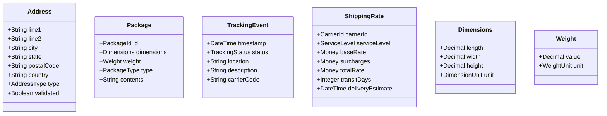

# Epic: Shipping & Fulfillment Management Service

## Epic Overview

**Epic ID:** ACME-EPIC-007
**Title:** Shipping & Fulfillment Management Service
**Status:** Draft
**Priority:** High
**Business Owner:** Operations & Logistics

### Vision Statement

As an e-commerce platform operator, I need a comprehensive shipping and fulfillment management system so that orders can be efficiently picked, packed, shipped, and tracked across multiple carriers and fulfillment centers, providing customers with transparent delivery experiences and enabling optimized logistics operations.

### Business Context

The Shipping & Fulfillment Management Service is a critical component of the ACME e-commerce platform, responsible for the entire post-purchase logistics workflow. This service bridges the gap between order placement and product delivery, coordinating with multiple carriers, managing fulfillment operations, and providing real-time visibility into shipment status.

### Strategic Alignment

- **Customer Experience:** Provide accurate delivery estimates and real-time tracking
- **Operational Efficiency:** Optimize carrier selection and fulfillment workflows
- **Cost Management:** Enable rate shopping and shipping cost optimization
- **Scalability:** Support multiple fulfillment centers and geographic expansion

---

## Bounded Context Definition

### Context Name

**Shipping & Fulfillment Context**

### Domain Responsibility

This bounded context owns all concepts related to the physical movement of goods from fulfillment centers to customers, including:

- Shipment lifecycle management
- Carrier integration and rate negotiation
- Fulfillment order processing
- Package tracking and delivery confirmation
- Returns and reverse logistics
- Shipping address validation

### Context Boundaries

### Ubiquitous Language

| Term | Definition |
|------|------------|
| **Shipment** | A physical package or group of packages traveling together from origin to destination |
| **Fulfillment Order** | An internal work order directing warehouse operations to pick, pack, and ship items |
| **Carrier** | A shipping provider (e.g., courier, freight company) responsible for physical delivery |
| **Tracking Event** | A timestamped status update indicating shipment progress |
| **Service Level** | The delivery speed/priority tier (e.g., standard, express, overnight) |
| **Shipping Zone** | A geographic region used to calculate shipping rates and delivery times |
| **Pick List** | An ordered list of items to be collected from warehouse locations |
| **Packing Slip** | Documentation included with a shipment listing its contents |
| **Shipping Label** | Carrier-generated label with routing and tracking information |
| **Return Merchandise Authorization (RMA)** | Authorization for a customer to return items |
| **Reverse Logistics** | The process of moving goods from customer back to warehouse |
| **Rate Shopping** | Comparing shipping rates across multiple carriers for optimal selection |

---

## Domain Model

### Aggregate Roots

### Value Objects

---

## Event Flows

### Order to Delivery Flow

### Return Processing Flow

---

## Domain Events

### Events Produced

| Event | Description | Payload |
|-------|-------------|---------|
| `FulfillmentOrderCreated` | A new fulfillment order has been created | orderId, fulfillmentOrderId, items, priority |
| `FulfillmentOrderCompleted` | All items picked, packed, and ready to ship | fulfillmentOrderId, completedAt |
| `ShipmentCreated` | A shipment has been created with a carrier | shipmentId, orderId, carrierId, trackingNumber |
| `ShipmentLabelGenerated` | Shipping label has been generated | shipmentId, labelUrl, trackingNumber |
| `ShipmentPickedUp` | Carrier has picked up the shipment | shipmentId, pickupTime, carrierId |
| `ShipmentInTransit` | Shipment is in transit | shipmentId, currentLocation, estimatedDelivery |
| `ShipmentOutForDelivery` | Shipment is out for final delivery | shipmentId, estimatedDeliveryWindow |
| `ShipmentDelivered` | Shipment has been delivered | shipmentId, deliveryTime, signedBy |
| `ShipmentException` | Delivery exception occurred | shipmentId, exceptionType, description |
| `ReturnAuthorized` | Return has been authorized | returnId, rmaNumber, originalShipmentId |
| `ReturnLabelGenerated` | Return shipping label created | returnId, labelUrl, trackingNumber |
| `ReturnReceived` | Return received at warehouse | returnId, receivedAt, condition |
| `ReturnProcessed` | Return inspection completed | returnId, disposition, refundAmount |

### Events Consumed

| Event | Source | Action |
|-------|--------|--------|
| `OrderPlaced` | Order Management | Create fulfillment order |
| `OrderCancelled` | Order Management | Cancel fulfillment if not shipped |
| `OrderModified` | Order Management | Update fulfillment order if possible |
| `InventoryReserved` | Inventory Management | Proceed with fulfillment |
| `InventoryReservationFailed` | Inventory Management | Handle backorder or split shipment |
| `PaymentCaptured` | Payment Management | Release shipment for carrier pickup |

---

## Service Architecture

### High-Level Architecture

### CQRS Implementation

---

## Features

### F1: Fulfillment Order Management

Manage the internal workflow for processing orders through the fulfillment center.

**Capabilities:**
- Create fulfillment orders from placed orders
- Generate optimized pick lists based on warehouse layout
- Track pick, pack, and ship status
- Handle split shipments for multi-location inventory
- Support batch processing for high-volume periods
- Manage fulfillment priorities and SLAs

**Acceptance Criteria:**
- Fulfillment orders are automatically created when orders are placed
- Pick lists optimize walking path through warehouse
- Status updates are reflected in real-time
- Split shipments are supported when inventory is distributed
- Priority orders are processed ahead of standard orders

---

### F2: Multi-Carrier Integration

Integrate with multiple shipping carriers through a unified abstraction layer.

**Capabilities:**
- Connect to carrier APIs for shipment creation
- Retrieve real-time shipping rates
- Generate shipping labels and documentation
- Receive tracking updates via webhooks
- Support carrier-specific service levels
- Handle carrier authentication and credentials

**Acceptance Criteria:**
- At least three major carriers can be integrated
- Carrier integrations follow a consistent adapter pattern
- Carrier failures are handled gracefully with fallback options
- API credentials are securely managed
- Carrier-specific features are accessible through unified interface

---

### F3: Rate Shopping & Carrier Selection

Optimize shipping costs and delivery speed through intelligent carrier selection.

**Capabilities:**
- Query multiple carriers for shipping rates in parallel
- Compare rates based on cost, speed, and reliability
- Apply business rules for carrier selection
- Support promotional shipping rates
- Calculate dimensional weight pricing
- Factor in carrier performance metrics

**Acceptance Criteria:**
- Rates are retrieved from all active carriers for comparison
- Selection algorithm considers cost, delivery time, and reliability
- Business rules can override automatic selection
- Rate caching reduces API calls for repeated queries
- Dimensional weight is correctly calculated for oversized packages

---

### F4: Shipping Label Generation

Create compliant shipping labels and documentation for packages.

**Capabilities:**
- Generate carrier-compliant shipping labels
- Support multiple label formats (PDF, ZPL, PNG)
- Create packing slips and customs documentation
- Handle international shipping documentation
- Support batch label printing
- Void and reprint labels as needed

**Acceptance Criteria:**
- Labels are generated in carrier-required format
- International shipments include required customs forms
- Labels can be reprinted if needed
- Voided labels are properly cancelled with carrier
- Batch printing supports high-volume operations

---

### F5: Shipment Tracking

Provide real-time visibility into shipment status and location.

**Capabilities:**
- Receive and process carrier tracking webhooks
- Poll carriers for tracking updates when webhooks unavailable
- Normalize tracking events across carriers
- Maintain complete tracking history
- Calculate and update delivery estimates
- Detect and flag delivery exceptions

**Acceptance Criteria:**
- Tracking updates are processed within minutes of carrier update
- Tracking events are normalized to consistent status taxonomy
- Delivery estimates are updated based on tracking progress
- Exceptions trigger appropriate alerts and workflows
- Tracking history is queryable for customer service

---

### F6: Delivery Notifications

Keep customers informed throughout the delivery journey.

**Capabilities:**
- Trigger notifications at key shipment milestones
- Support configurable notification preferences
- Provide tracking links and delivery estimates
- Send delivery window notifications
- Handle failed delivery attempt notifications
- Support proof of delivery notifications

**Acceptance Criteria:**
- Notifications are sent at shipment created, shipped, out for delivery, and delivered
- Customers can configure notification channel preferences
- Tracking links work for all supported carriers
- Failed delivery notifications include rescheduling options
- Delivery confirmation includes timestamp and signature if available

---

### F7: Address Validation

Ensure shipping addresses are valid and deliverable.

**Capabilities:**
- Validate addresses against carrier databases
- Suggest address corrections and completions
- Standardize address formats
- Identify residential vs commercial addresses
- Flag potentially undeliverable addresses
- Support international address formats

**Acceptance Criteria:**
- Addresses are validated before shipment creation
- Invalid addresses are flagged with suggested corrections
- Address standardization improves delivery success rate
- Residential/commercial classification affects rate calculation
- International addresses are validated against country-specific rules

---

### F8: Returns Management

Handle reverse logistics for product returns.

**Capabilities:**
- Process return requests and generate RMAs
- Create prepaid return shipping labels
- Track return shipments
- Manage return receiving and inspection
- Route returns to appropriate disposition
- Calculate restocking fees if applicable

**Acceptance Criteria:**
- Return eligibility is validated against return policy
- Return labels are generated and delivered to customer
- Return shipments are tracked like outbound shipments
- Received returns are inspected and dispositioned
- Return processing triggers appropriate refund workflow

---

### F9: Shipping Rules Engine

Apply business rules to automate shipping decisions.

**Capabilities:**
- Define rules for carrier selection
- Configure service level routing
- Apply shipping surcharges and discounts
- Handle promotional free shipping
- Route by destination zone or product type
- Support seasonal and time-based rules

**Acceptance Criteria:**
- Rules can be configured without code changes
- Rules are evaluated in priority order
- Conflicting rules are resolved deterministically
- Rules can be scheduled for specific time periods
- Rule changes are audited and reversible

---

### F10: Fulfillment Center Management

Support operations across multiple fulfillment locations.

**Capabilities:**
- Configure fulfillment center attributes
- Route orders to optimal fulfillment center
- Manage center-specific carrier relationships
- Track center capacity and performance
- Support center-specific business hours
- Handle center maintenance windows

**Acceptance Criteria:**
- Multiple fulfillment centers can be configured
- Order routing considers inventory location and shipping distance
- Center-specific carriers and rates are applied
- Capacity constraints prevent over-allocation
- Center status affects order routing decisions

---

### F11: Shipping Analytics & Reporting

Provide visibility into shipping operations and performance.

**Capabilities:**
- Track shipping costs by carrier, service, and destination
- Monitor delivery performance and SLA compliance
- Analyze shipping exceptions and root causes
- Report on fulfillment center throughput
- Calculate shipping cost per order metrics
- Identify cost optimization opportunities

**Acceptance Criteria:**
- Shipping costs are tracked and reportable by multiple dimensions
- On-time delivery rates are measured against carrier SLAs
- Exception trends are identifiable for process improvement
- Fulfillment metrics support capacity planning
- Reports are available for configurable time periods

---

### F12: International Shipping Support

Enable shipping to international destinations with compliance.

**Capabilities:**
- Calculate duties and taxes
- Generate customs documentation
- Support harmonized tariff codes
- Handle restricted and prohibited items
- Manage country-specific regulations
- Support multiple currencies

**Acceptance Criteria:**
- Duties and taxes are estimated at checkout
- Required customs forms are automatically generated
- Product catalog supports harmonized codes
- Restricted items are blocked from international shipping
- Currency conversion uses current exchange rates

---

## Integration Points

### Upstream Services

### Downstream Services

### External Systems

---

## Observability Requirements

### Distributed Tracing

- Trace shipment creation through carrier API calls
- Correlate tracking webhook events with shipments
- Track fulfillment order processing through all stages
- Enable latency analysis for carrier integrations

### Metrics

- **Rate Metrics:** Shipments created/hour, labels generated/hour, tracking updates/minute
- **Error Metrics:** Carrier API failures, label generation errors, address validation failures
- **Duration Metrics:** Fulfillment order processing time, carrier API response time, end-to-end delivery time
- **Business Metrics:** On-time delivery rate, shipping cost per order, return rate, carrier utilization

### Health Checks

- Carrier API connectivity and authentication
- Message broker connection status
- Database read/write availability
- Cache service availability
- Event store connectivity

### Alerting

- Carrier API degradation or outage
- Shipment creation failure rate exceeds threshold
- Tracking webhook processing delays
- Fulfillment SLA breach risk
- Delivery exception rate anomalies

---

## Acceptance Criteria (Epic Level)

### Functional Requirements

- [ ] Orders are automatically routed to fulfillment upon placement
- [ ] Fulfillment workflow supports pick, pack, and ship stages
- [ ] Multiple carriers can be integrated and selected
- [ ] Shipping rates are retrieved and compared across carriers
- [ ] Shipping labels are generated in carrier-compliant formats
- [ ] Tracking updates are received and processed from carriers
- [ ] Customers receive notifications at shipment milestones
- [ ] Returns can be initiated and processed
- [ ] Shipping addresses are validated before label creation
- [ ] Business rules govern carrier selection and shipping options

### Non-Functional Requirements

- [ ] Service handles expected order volume with <500ms P99 latency
- [ ] Carrier integrations are resilient to individual carrier failures
- [ ] Event-driven architecture enables loose coupling with other services
- [ ] CQRS pattern separates read and write concerns appropriately
- [ ] Event sourcing provides complete audit trail of shipment state changes
- [ ] Service supports horizontal scaling for peak periods
- [ ] Observability meets platform standards for tracing, metrics, and logging

### Integration Requirements

- [ ] Consumes order events from Order Management service
- [ ] Publishes shipment events for downstream consumers
- [ ] Integrates with Notification Management for customer communications
- [ ] Provides shipment data to Analytics for reporting
- [ ] Supports Customer Service queries for order tracking

---

## Dependencies

### Upstream Dependencies

| Service | Dependency Type | Description |
|---------|-----------------|-------------|
| Order Management | Event | Receives order placed/cancelled events |
| Inventory Management | Event | Receives inventory reservation confirmations |
| Payment Management | Event | Receives payment capture confirmations |
| Product Catalog | Query | Retrieves product dimensions and shipping restrictions |

### Downstream Dependents

| Service | Dependency Type | Description |
|---------|-----------------|-------------|
| Notification Management | Event | Consumes shipment events for customer notifications |
| Customer Management | Query | Queries shipment status for customer portal |
| Analytics | Event | Consumes shipping metrics for reporting |
| Customer Service | Query | Queries shipment details for support cases |

---

## Risks and Mitigations

| Risk | Impact | Probability | Mitigation |
|------|--------|-------------|------------|
| Carrier API instability | High | Medium | Implement circuit breakers, fallback carriers, retry logic |
| Address validation failures | Medium | Medium | Queue for manual review, allow override with customer confirmation |
| Webhook delivery failures | Medium | Low | Implement polling fallback, idempotent processing, dead letter queue |
| Peak volume overload | High | Medium | Horizontal scaling, rate limiting, queue-based processing |
| Carrier rate changes | Medium | High | Cache rates with TTL, alert on significant changes, business rule override |
| International compliance | High | Low | Partner with customs broker, maintain country rule database |

---

## Future Considerations

- Predictive delivery date modeling using machine learning
- Same-day and next-day delivery optimization
- Crowdsourced delivery integration
- Package consolidation for multi-order shipments
- Carbon footprint tracking and offset options
- Autonomous delivery vehicle integration
- Smart locker and alternative delivery point support

---

## Related Documentation

- [Architecture Overview](../ARCHITECTURE.md)
- [Order Management Epic](./006-order-management.md)
- [Notification Management Epic](./007-notifications-management.md)
- [Customer Management Epic](./005-customer-management.md)
- [Product Inventory Management Epic](./004-product-inventory-management.md)
