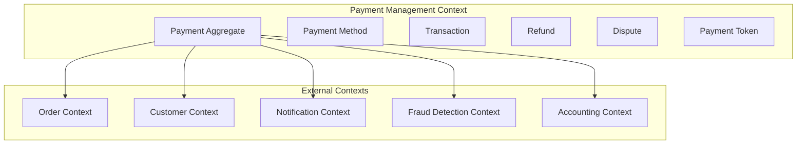
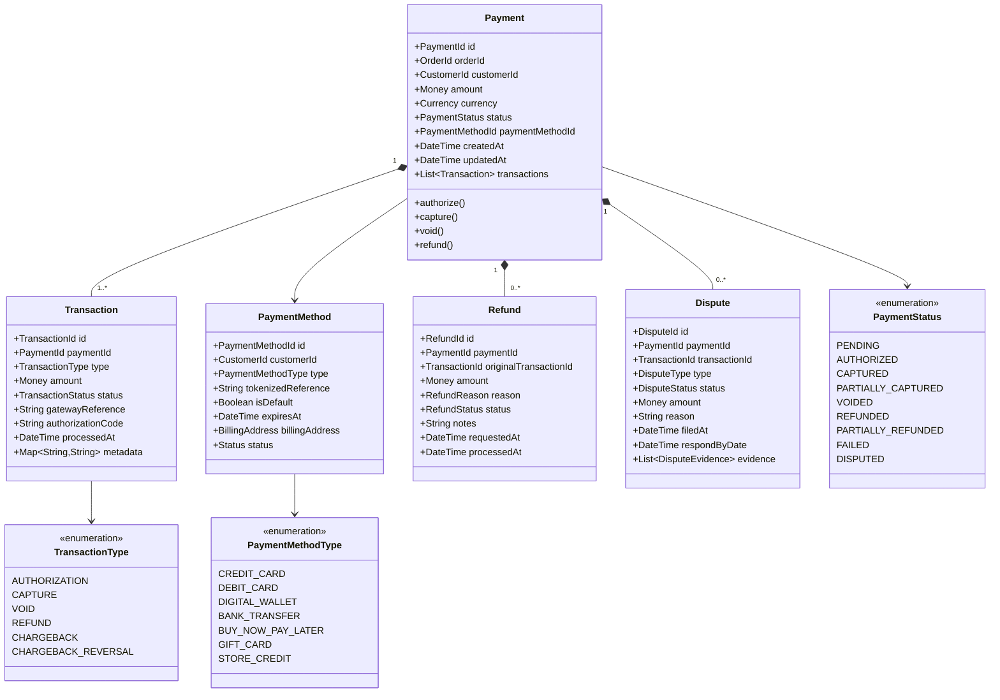
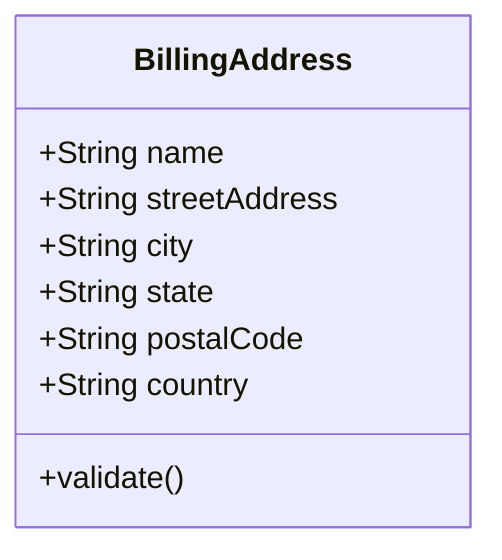
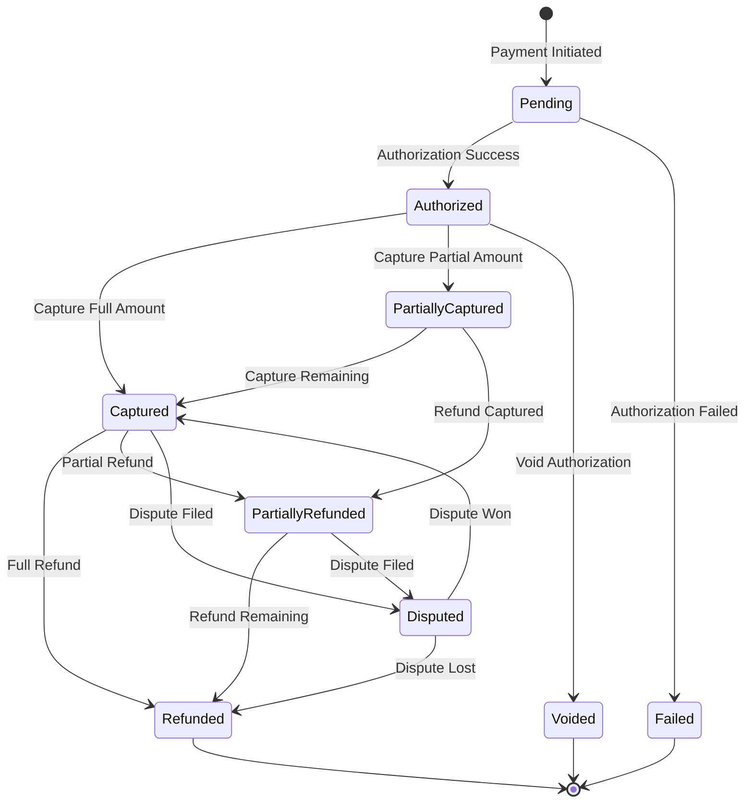
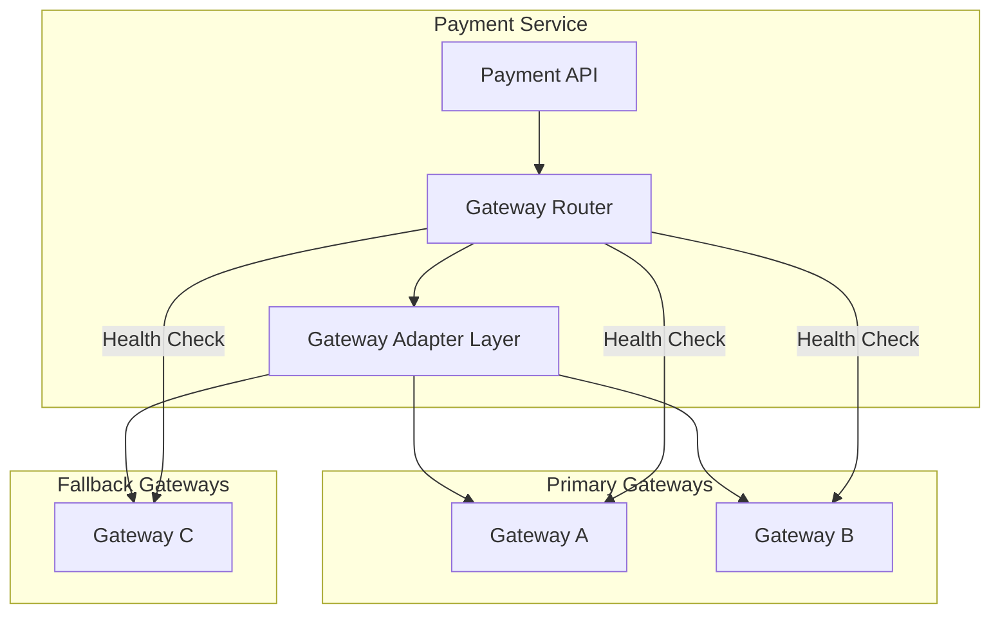
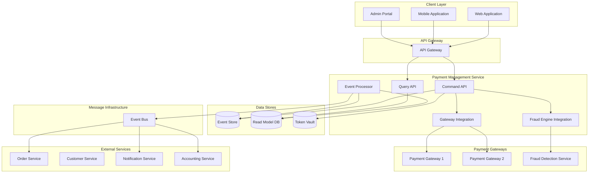
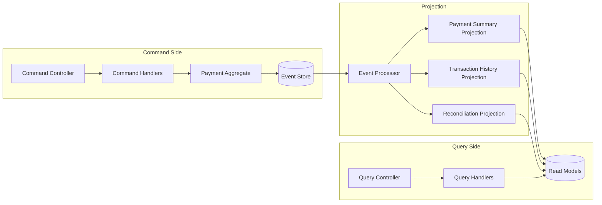
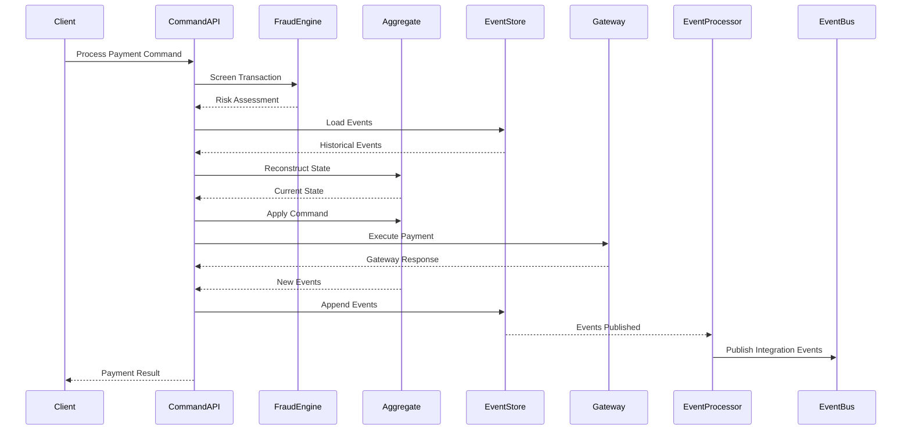
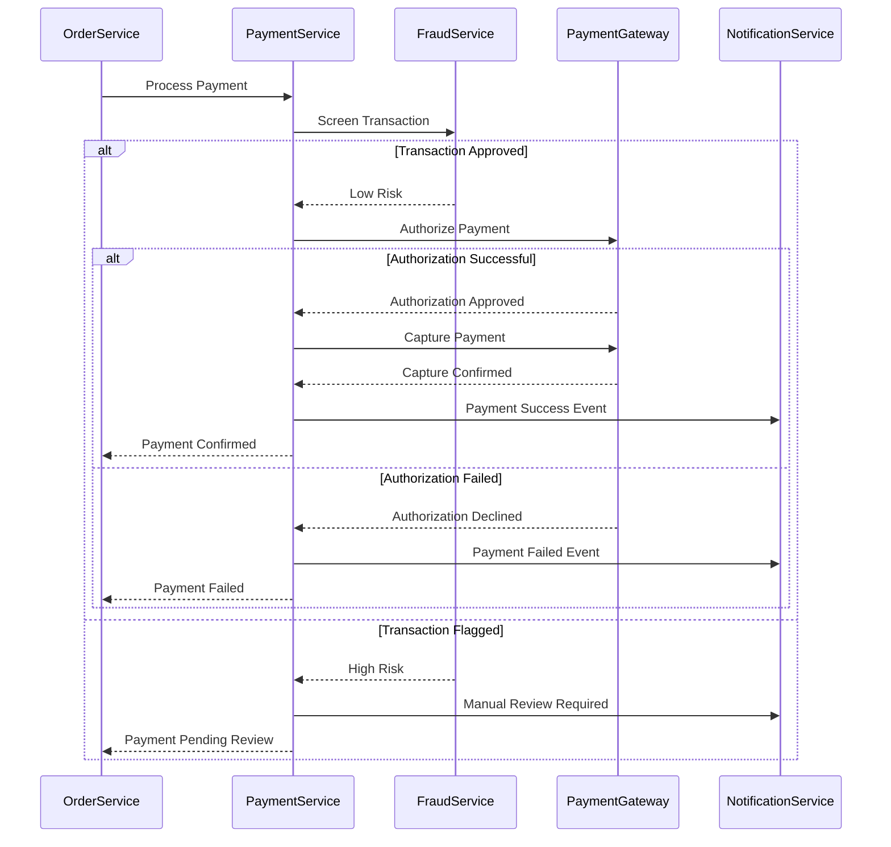
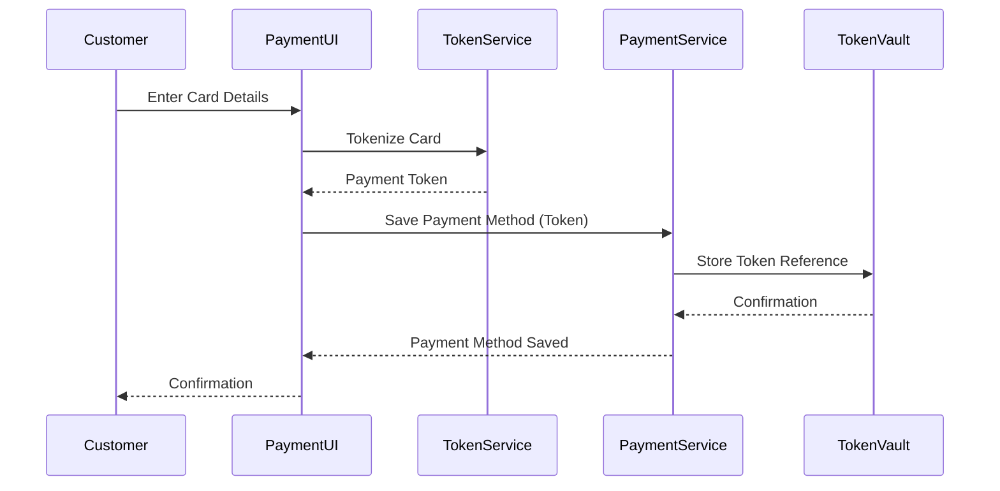

# Epic: Payment Management Service

## Overview

**Epic ID:** ACME-EPIC-008
**Title:** Payment Management Service for ACME E-Commerce
**Priority:** Critical
**Status:** Draft

### Epic Statement

As an **e-commerce platform operator**, I need a **secure, reliable payment management system** so that **customers can complete purchases using their preferred payment methods while the business maintains compliance, minimizes fraud, and reconciles financial transactions accurately**.

## Business Context

The Payment Management Service represents a critical bounded context within the ACME e-commerce platform. It serves as the financial transaction hub, responsible for securely processing customer payments, managing payment methods, handling refunds and disputes, and ensuring compliance with financial regulations. This service must handle sensitive financial data with the highest security standards while providing a seamless checkout experience.

## Strategic Importance

- **Revenue Enablement**: Direct gatekeeper for all monetary transactions
- **Customer Trust**: Secure handling of sensitive payment information builds confidence
- **Regulatory Compliance**: Adherence to PCI-DSS and financial regulations
- **Fraud Prevention**: Protection against financial losses from fraudulent transactions
- **Operational Efficiency**: Automated reconciliation and dispute management

## Domain Model

### Bounded Context

### Payment Aggregate

The Payment serves as the aggregate root, encapsulating all payment-related entities and enforcing business invariants around financial transactions.

### Billing Address Value Object

## Payment Lifecycle State Machine

## Features

### F1: Payment Processing

Enable secure processing of customer payments through multiple payment gateways.

**Capabilities:**
- Process authorization requests for payment validation
- Capture authorized payments for settlement
- Support immediate capture for instant settlement
- Handle partial captures for split shipments
- Void authorized payments before capture
- Process payments in multiple currencies

**Acceptance Criteria:**
- Payment authorization completes within acceptable latency thresholds
- Sensitive payment data is never stored in plain text
- Failed authorizations provide actionable decline reasons
- Partial captures accurately track remaining authorized amounts
- All payment operations are idempotent to prevent duplicate charges

### F2: Payment Method Management

Allow customers to securely store and manage their payment methods.

**Capabilities:**
- Add new payment methods with validation
- Tokenize payment credentials for secure storage
- Set default payment method preferences
- Update billing address information
- Remove stored payment methods
- Handle payment method expiration

**Acceptance Criteria:**
- Payment credentials are tokenized before storage
- Card validation (Luhn check, expiration) occurs before saving
- Customers can manage multiple payment methods
- Expired payment methods trigger customer notification
- Removal of payment methods is immediate and permanent

### F3: Refund Processing

Support full and partial refunds with proper accounting and reconciliation.

**Capabilities:**
- Process full refunds for cancelled orders
- Process partial refunds for partial returns
- Track refund reasons for analytics
- Handle refunds to original payment method
- Support refunds to alternative destinations (store credit)
- Enforce refund policy rules

**Acceptance Criteria:**
- Refunds cannot exceed original payment amount
- Refund processing reflects in customer's account within expected timeframes
- Refund transactions maintain linkage to original payment
- Multiple partial refunds are tracked accurately
- Refund policy violations are prevented at the service level

### F4: Dispute and Chargeback Management

Handle payment disputes and chargebacks with proper evidence management.

**Capabilities:**
- Receive and track dispute notifications from payment networks
- Manage dispute evidence collection and submission
- Track dispute resolution deadlines
- Process chargeback reversals when disputes are won
- Generate dispute analytics and reporting
- Automate dispute response for common scenarios

**Acceptance Criteria:**
- Disputes are recorded immediately upon notification
- Response deadlines are tracked and alerts are generated
- Evidence submission workflow is clearly defined
- Dispute outcomes update payment status appropriately
- Dispute trends are visible for fraud pattern analysis

### F5: Fraud Prevention Integration

Integrate with fraud detection systems to minimize fraudulent transactions.

**Capabilities:**
- Pre-authorization fraud screening
- Risk scoring for payment attempts
- Velocity checks for unusual patterns
- Address verification service (AVS) integration
- Card verification value (CVV) validation
- 3D Secure authentication support
- Block list management for known fraud indicators

**Acceptance Criteria:**
- High-risk transactions are flagged for review before capture
- Fraud rules are configurable without code deployment
- Legitimate transactions are not unnecessarily declined
- Fraud screening adds minimal latency to payment flow
- Blocked transactions are logged with reasoning

### F6: Multi-Gateway Support

Abstract payment gateway integration to support multiple providers.

**Capabilities:**
- Gateway-agnostic payment API
- Gateway routing based on payment method and region
- Automatic failover between gateways
- Gateway-specific feature support mapping
- Gateway fee tracking for cost optimization
- Gateway health monitoring

**Acceptance Criteria:**
- Adding new gateways requires minimal code changes
- Gateway failures automatically route to backup providers
- Gateway-specific errors are translated to standard codes
- Gateway costs are tracked per transaction
- Gateway performance metrics are monitored

### F7: Payment Security and Compliance

Ensure all payment operations meet security and regulatory requirements.

**Capabilities:**
- PCI-DSS compliant data handling
- Encryption of sensitive data at rest and in transit
- Tokenization of payment credentials
- Audit logging for all payment operations
- Access control for sensitive operations
- Data retention policy enforcement

**Acceptance Criteria:**
- No raw card data is stored in the system
- All payment data transmission uses secure protocols
- Audit logs capture all payment lifecycle events
- Access to payment data requires appropriate authorization
- Data retention complies with regulatory requirements

### F8: Payment Reconciliation

Support financial reconciliation between internal records and external systems.

**Capabilities:**
- Daily settlement reconciliation with gateways
- Transaction matching between orders and payments
- Exception identification and reporting
- Reconciliation status dashboards
- Integration with accounting systems
- Historical reconciliation for audits

**Acceptance Criteria:**
- Daily reconciliation identifies all discrepancies
- Matched transactions are linked accurately
- Exceptions are flagged for manual review
- Reconciliation reports are generated automatically
- Historical records support audit requirements

## Architecture

### Service Integration

### CQRS Pattern Implementation

### Event Sourcing

The Payment Management Service implements event sourcing to maintain a complete audit trail for compliance and enable temporal queries for reconciliation.

### Payment Domain Events

| Event | Description | Triggers |
|-------|-------------|----------|
| PaymentInitiated | New payment request received | Customer checkout |
| PaymentAuthorized | Payment authorization successful | Gateway approval |
| PaymentAuthorizationFailed | Payment authorization declined | Gateway rejection |
| PaymentCaptured | Payment settled with gateway | Capture request |
| PaymentPartiallyCaptured | Partial amount captured | Partial capture request |
| PaymentVoided | Authorization cancelled | Void request |
| RefundRequested | Refund initiated | Customer/admin action |
| RefundProcessed | Refund completed | Gateway confirmation |
| RefundFailed | Refund could not be processed | Gateway rejection |
| DisputeOpened | Chargeback/dispute received | Gateway notification |
| DisputeEvidenceSubmitted | Evidence sent to gateway | Admin action |
| DisputeResolved | Dispute outcome received | Gateway notification |
| PaymentMethodAdded | Customer added payment method | Customer action |
| PaymentMethodRemoved | Customer removed payment method | Customer action |
| PaymentMethodExpiring | Payment method approaching expiration | Scheduled check |

### Saga: Payment Processing

### Tokenization Flow

## Cross-Cutting Concerns

### Observability

Following platform observability standards:

- **Distributed Tracing**: Correlation IDs propagated across all payment operations and gateway calls
- **Metrics**: RED metrics for all endpoints, business metrics for payment KPIs
- **Logging**: Structured logs with correlation IDs, PCI-compliant (no sensitive data)
- **Health Checks**: Liveness and readiness probes including gateway connectivity

### Key Metrics

| Metric | Type | Description |
|--------|------|-------------|
| payments_processed_total | Counter | Total payments processed by status |
| payment_authorization_duration | Histogram | Time to authorize payments |
| payment_capture_duration | Histogram | Time to capture payments |
| refunds_processed_total | Counter | Total refunds by reason |
| disputes_opened_total | Counter | Total disputes by type |
| gateway_requests_total | Counter | Requests per gateway |
| gateway_error_rate | Gauge | Error rate per gateway |
| fraud_screening_duration | Histogram | Time for fraud screening |

### Security Considerations

- All payment data encrypted at rest and in transit
- Card data tokenized immediately upon receipt
- Access to payment operations requires role-based authorization
- Audit logging for all payment lifecycle events
- PCI-DSS compliance for all payment handling
- Secure key management for encryption keys
- Network segmentation for payment processing systems

### Data Consistency

- Event sourcing ensures complete audit trail for compliance
- Idempotency keys prevent duplicate payment processing
- Saga pattern for coordinating with Order Service
- Eventual consistency between write and read models
- Strong consistency for payment state transitions

## Integration Points

| Service | Integration Type | Purpose |
|---------|-----------------|---------|
| Order Service | Synchronous + Events | Payment requests, status updates |
| Customer Service | Synchronous | Customer payment method management |
| Notification Service | Events | Payment confirmations, failures, disputes |
| Accounting Service | Events | Financial reconciliation, reporting |
| Fraud Detection | Synchronous | Transaction risk assessment |
| Payment Gateways | Synchronous | Payment processing |

## Non-Functional Requirements

### Performance
- Payment authorization latency under 2 seconds (P95)
- Payment query latency under 100ms (P95)
- Support for 500+ concurrent payment requests

### Availability
- 99.99% uptime SLO for payment processing
- Automatic gateway failover within 5 seconds
- Graceful degradation when fraud service unavailable

### Scalability
- Horizontal scaling of command and query sides independently
- Gateway connection pooling for throughput
- Event store partitioning by payment ID

### Security
- PCI-DSS Level 1 compliance
- SOC 2 Type II compliance
- End-to-end encryption for all payment data
- Regular penetration testing

### Data Retention
- Transaction records retained for 7 years (regulatory)
- Tokenized payment methods retained until customer removal
- Audit logs retained for 10 years

## Dependencies

| Dependency | Type | Criticality |
|------------|------|-------------|
| Event Store | Infrastructure | Critical |
| Token Vault | Infrastructure | Critical |
| Read Model Database | Infrastructure | High |
| Message Broker | Infrastructure | Critical |
| Primary Payment Gateway | External Service | Critical |
| Backup Payment Gateway | External Service | High |
| Fraud Detection Service | External Service | High |
| Order Service | Internal Service | Critical |
| Notification Service | Internal Service | Medium |

## Success Metrics

| Metric | Target | Measurement |
|--------|--------|-------------|
| Payment Success Rate | > 98% | Successful / Attempted |
| Authorization Latency | < 2s (P95) | Time to authorize |
| Refund Processing Time | < 24 hours | Request to completion |
| Dispute Win Rate | > 60% | Won / Total disputes |
| Fraud Detection Rate | > 95% | Detected / Total fraud |
| False Positive Rate | < 2% | Legitimate declined / Total |
| Gateway Availability | > 99.9% | Uptime |

## Open Questions

1. Which payment gateways should be integrated for initial launch?
2. What fraud detection service will be used?
3. What is the refund policy window?
4. What currencies must be supported at launch?
5. What payment methods are required for each market?
6. What is the acceptable false positive rate for fraud detection?
7. What dispute evidence automation is required?
8. What are the PCI-DSS audit requirements and timeline?

## Related Epics

- ACME-EPIC-005: Order Management Service
- ACME-EPIC-004: Customer Management Service
- ACME-EPIC-006: Notifications Management Service
- (Future) Accounting and Financial Reporting Service
- (Future) Fraud Detection Service

## Revision History

| Version | Date | Author | Changes |
|---------|------|--------|---------|
| 1.0 | 2026-01-02 | ACME Platform Team | Initial draft |
