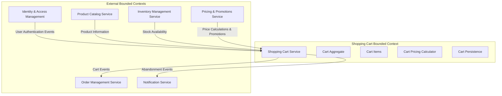
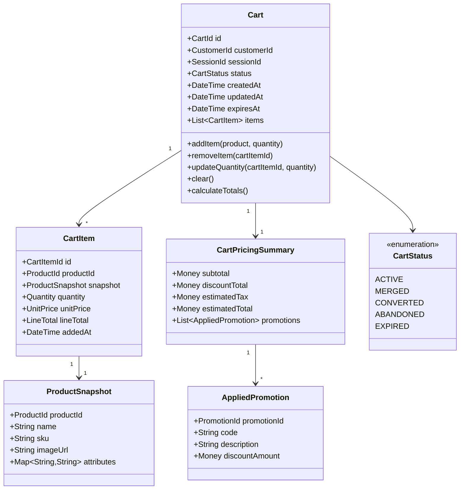
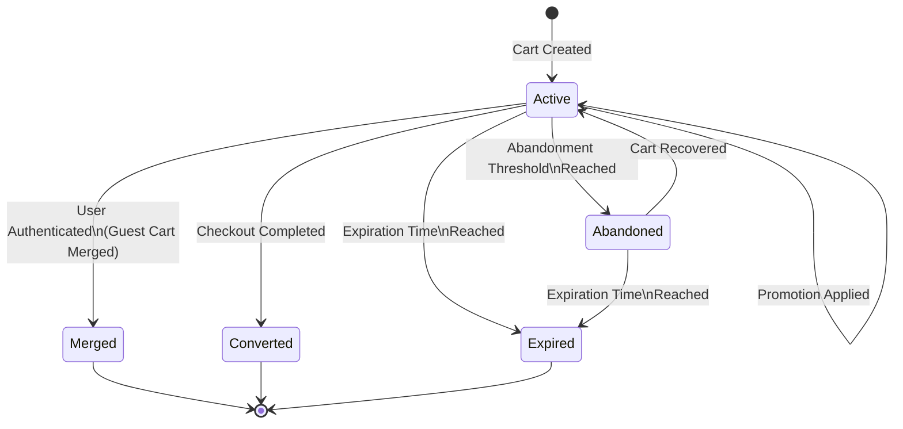
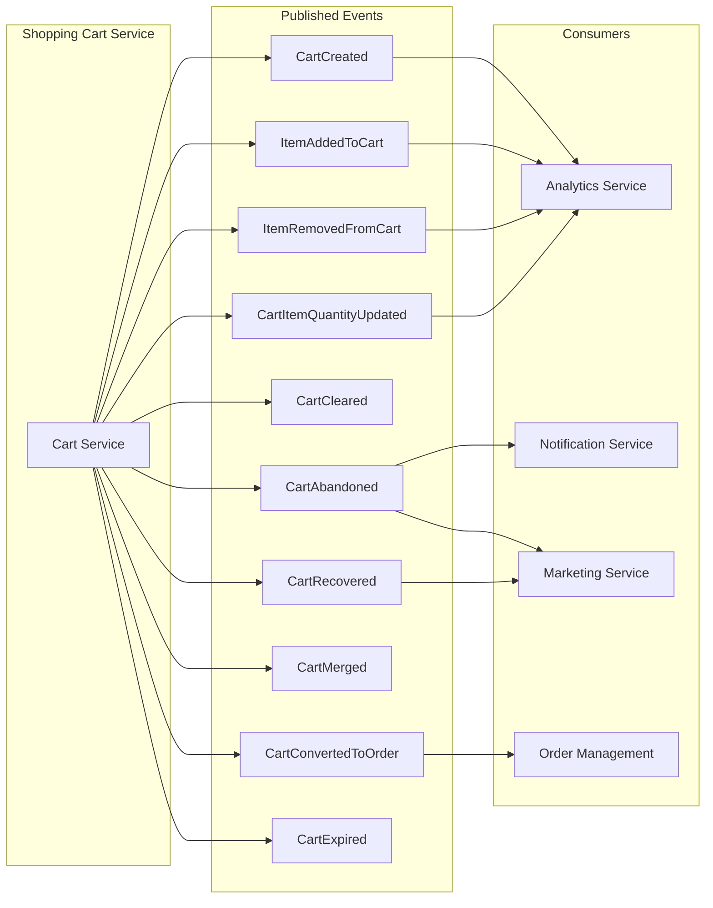
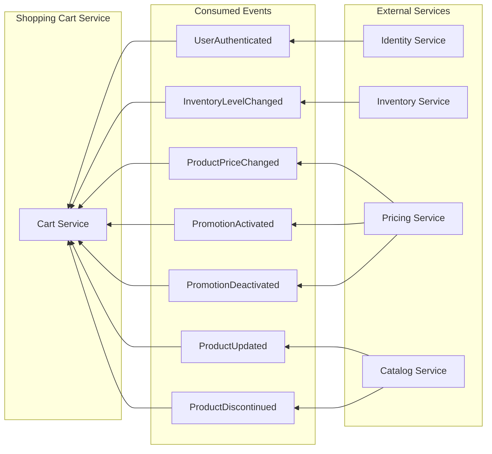
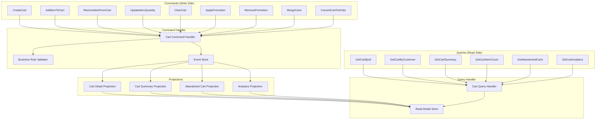

# Epic: Shopping Cart Management Service for ACME E-Commerce

## Overview

As a **customer** of the ACME e-commerce platform, I want a **reliable and responsive shopping cart** so that I can **collect items I intend to purchase, review my selections, and proceed to checkout with confidence**.

As a **business stakeholder**, I want the shopping cart to **maximize conversion rates** by providing a frictionless experience that reduces cart abandonment and supports customer purchasing decisions.

## Problem Statement

Customers need a seamless way to accumulate products during their shopping journey across multiple sessions, devices, and authentication states. The cart must maintain accuracy with real-time inventory and pricing while providing a foundation for promotional features and checkout workflows.

## Business Value

- **Increased Conversion**: Reduce friction in the purchasing journey
- **Customer Retention**: Persist carts across sessions to capture returning customers
- **Revenue Protection**: Validate inventory availability before checkout
- **Marketing Enablement**: Support abandoned cart recovery campaigns
- **Analytics Foundation**: Capture shopping behavior data for business intelligence

## Bounded Context Definition

The Shopping Cart Management Service owns the cart aggregate and is responsible for all cart-related operations from creation through checkout transition. It operates as a distinct bounded context within the e-commerce domain.

## Domain Model

## Cart Lifecycle State Machine

## Event-Driven Architecture

### Events Published by Shopping Cart Service

### Events Consumed by Shopping Cart Service

## CQRS Model

## Features

### F1: Cart Lifecycle Management

Manage the complete lifecycle of shopping carts from creation through completion or expiration.

**Capabilities:**
- Create new carts for authenticated and guest users
- Associate guest carts with browser sessions
- Automatic cart expiration after configurable inactivity period
- Cart recovery for abandoned carts within recovery window
- Soft delete with retention for analytics

**Acceptance Criteria:**
- Carts are uniquely identifiable across the platform
- Guest carts persist across page refreshes within the same session
- Carts expire after the configured inactivity threshold
- Expired cart data is retained for the configured retention period
- Cart creation and state transitions emit appropriate domain events

### F2: Cart Item Operations

Enable customers to manage products within their shopping cart.

**Capabilities:**
- Add products to cart with specified quantity
- Remove individual items from cart
- Update item quantities
- Clear entire cart
- Validate product availability before adding
- Capture product snapshot at time of addition

**Acceptance Criteria:**
- Items can be added with quantities within allowed limits
- Duplicate product additions increment existing item quantity
- Removing the last item does not delete the cart
- Quantity updates validate against inventory availability
- Product snapshots capture essential details for display consistency
- All item operations emit appropriate domain events

### F3: Guest Cart to User Cart Merging

Seamlessly merge guest shopping carts with authenticated user carts upon login.

**Capabilities:**
- Detect cart merge scenarios during authentication
- Configurable merge strategies (keep guest, keep user, combine)
- Resolve quantity conflicts for duplicate products
- Preserve promotional codes applied to either cart
- Notify users of merge results

**Acceptance Criteria:**
- Guest cart items transfer to user cart upon authentication
- Duplicate products combine quantities up to maximum allowed
- User is informed when items cannot be merged due to limits
- Original guest cart is marked as merged and retained for audit
- Merge operation is atomic and consistent

### F4: Real-time Price Calculation

Maintain accurate and current pricing throughout the shopping experience.

**Capabilities:**
- Calculate line item totals based on current prices
- Compute cart subtotal, discounts, and estimated total
- Apply promotional discounts and coupon codes
- Handle price changes during shopping session
- Display estimated taxes based on shipping destination

**Acceptance Criteria:**
- Prices reflect current catalog pricing at checkout time
- Applied promotions display discount amounts clearly
- Price changes during session trigger customer notification
- Tax estimates update when delivery address changes
- Pricing calculations are consistent across all cart views

### F5: Inventory Availability Integration

Ensure cart contents reflect real-time product availability.

**Capabilities:**
- Validate inventory before adding items to cart
- Monitor inventory changes for carted items
- Notify customers of availability changes
- Reserve inventory during checkout transition
- Handle out-of-stock scenarios gracefully

**Acceptance Criteria:**
- Cannot add items exceeding available inventory
- Inventory reductions affecting carted items trigger notifications
- Cart displays availability status for each item
- Checkout blocked when items become unavailable
- Partial availability scenarios provide clear customer options

### F6: Promotion and Coupon Code Support

Enable application of promotional offers to shopping carts.

**Capabilities:**
- Apply promotional coupon codes to cart
- Validate promotion eligibility (dates, limits, products)
- Stack multiple compatible promotions
- Display promotion savings breakdown
- Remove or replace promotional codes

**Acceptance Criteria:**
- Valid coupon codes apply discounts correctly
- Invalid or expired codes provide clear error messages
- Promotion eligibility validates against cart contents
- Stacking rules enforce promotion compatibility
- Removing items may invalidate applied promotions

### F7: Multi-Device Cart Synchronization

Provide consistent cart experience across customer devices and channels.

**Capabilities:**
- Real-time cart synchronization for authenticated users
- Conflict resolution for concurrent modifications
- Support web, mobile, and API channels
- Maintain cart consistency across platform touchpoints

**Acceptance Criteria:**
- Cart changes sync across devices within acceptable latency
- Last-write-wins with conflict detection and resolution
- All channels access the same cart data for authenticated users
- Offline modifications sync when connectivity restores

### F8: Cart Abandonment Detection and Recovery

Identify abandoned carts and support recovery workflows.

**Capabilities:**
- Detect cart abandonment based on configurable thresholds
- Emit abandonment events for marketing automation
- Support cart recovery links in communications
- Track recovery success metrics
- Provide abandonment analytics

**Acceptance Criteria:**
- Carts flagged as abandoned after inactivity threshold
- Abandonment events include cart contents summary
- Recovery links restore cart to active state
- Recovered carts validate item availability
- Analytics track abandonment and recovery rates

### F9: Cart Checkout Transition

Prepare cart for seamless handoff to checkout workflow.

**Capabilities:**
- Validate cart readiness for checkout
- Lock cart during checkout process
- Generate checkout token for order service
- Handle checkout abandonment and cart unlock
- Support checkout resumption

**Acceptance Criteria:**
- Checkout validates all items available and cart non-empty
- Cart locked to prevent modifications during checkout
- Checkout token contains necessary cart reference
- Abandoned checkouts unlock cart after timeout
- Successful order converts cart with proper status

### F10: Cart Analytics and Reporting

Capture cart behavior data for business intelligence.

**Capabilities:**
- Track cart creation, modification, and completion events
- Measure cart-to-order conversion rates
- Analyze abandonment patterns and causes
- Report on popular products in carts
- Monitor cart value distributions

**Acceptance Criteria:**
- All significant cart events captured with timestamps
- Analytics data available for real-time dashboards
- Historical data retained per compliance requirements
- Reports filterable by time period and customer segment
- Privacy controls respected in analytics collection

## Integration Patterns

### Synchronous Integrations

| Integration Point | Direction | Purpose |
|------------------|-----------|---------|
| Product Catalog | Inbound | Retrieve product details for cart display |
| Inventory Service | Inbound | Validate stock availability |
| Pricing Service | Inbound | Calculate current prices and apply promotions |

### Asynchronous Integrations

| Event | Producer | Consumer | Purpose |
|-------|----------|----------|---------|
| UserAuthenticated | Identity Service | Cart Service | Trigger cart merge |
| ProductPriceChanged | Pricing Service | Cart Service | Update cached prices |
| InventoryLevelChanged | Inventory Service | Cart Service | Validate carted quantities |
| CartAbandoned | Cart Service | Notification Service | Trigger recovery emails |
| CartConvertedToOrder | Cart Service | Order Service | Initiate order creation |

## Observability Requirements

### Distributed Tracing

- Trace cart operations from API entry through event publication
- Correlate cart operations with upstream service calls
- Track cart lifecycle events across the system

### Metrics

- Cart creation rate and cart lifetime distribution
- Items per cart distribution
- Cart value distribution
- Cart-to-checkout conversion rate
- Abandonment rate by funnel stage
- API response latency percentiles

### Health Checks

- Cart service liveness and readiness probes
- Event store connectivity check
- External service dependency health
- Read model synchronization lag

### Logging

- Structured logging for all cart operations
- Correlation ID propagation for distributed tracing
- Business event logging for audit trail
- Error logging with context for troubleshooting

## Non-Functional Requirements

### Performance

- Cart read operations complete within 100ms p95
- Cart write operations complete within 200ms p95
- Support concurrent carts proportional to active users
- Real-time sync latency under 500ms

### Scalability

- Horizontal scaling of cart service instances
- Independent scaling of read and write models
- Event processing scales with cart activity

### Reliability

- Cart data durability through event sourcing
- Graceful degradation when dependencies unavailable
- Idempotent operations for retry safety

### Security

- Cart access restricted to owning customer
- Guest carts scoped to authenticated sessions
- PII handling compliant with privacy regulations
- API authentication and authorization

## Assumptions

1. Customer identity management exists as a separate bounded context
2. Product catalog provides necessary product information via API
3. Inventory service provides real-time availability data
4. Pricing service handles price calculations including promotions
5. Event infrastructure supports reliable message delivery
6. Platform supports required observability tooling

## Dependencies

- **Identity & Access Management**: User authentication events and customer identification
- **Product Catalog Service**: Product information for cart display
- **Inventory Management Service**: Stock availability validation
- **Pricing & Promotions Service**: Price calculations and promotion rules
- **Order Management Service**: Checkout transition and order creation
- **Notification Service**: Abandonment recovery communications

## Open Questions

1. What is the appropriate cart expiration threshold for this business?
2. Should cart merging prefer guest cart items, user cart items, or combine both?
3. What inventory reservation strategy should be used during checkout?
4. How long should abandoned cart data be retained for analytics?
5. What are the specific promotion stacking rules for this platform?

## Glossary

| Term | Definition |
|------|------------|
| Cart | A container for products a customer intends to purchase |
| Cart Item | A specific product with quantity within a cart |
| Guest Cart | A cart associated with an unauthenticated browser session |
| Cart Merge | The process of combining a guest cart with a user cart |
| Cart Abandonment | When a customer leaves without completing checkout |
| Product Snapshot | A point-in-time capture of product details for display |
| Checkout Transition | The process of converting a cart to an order |

---

*Epic created: 2026-01-02*
*Last updated: 2026-01-02*
*Status: Draft*
