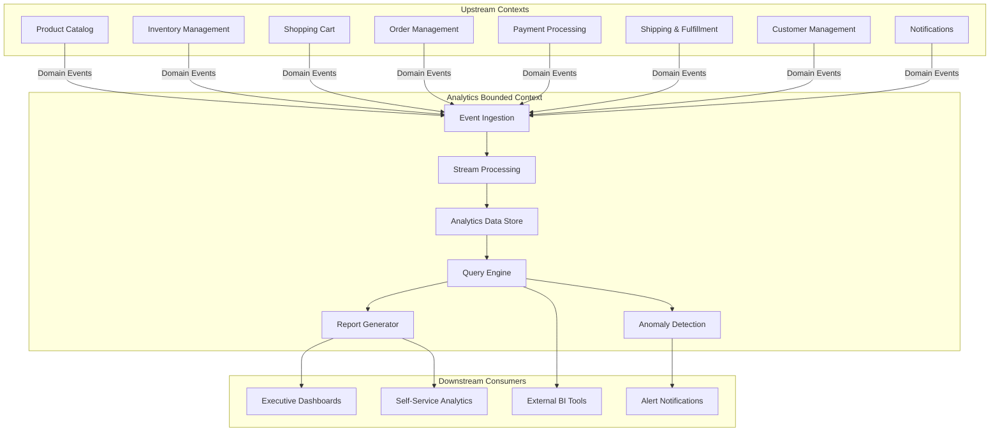
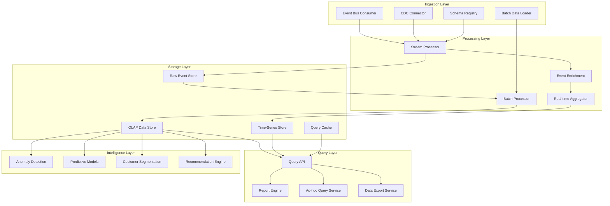
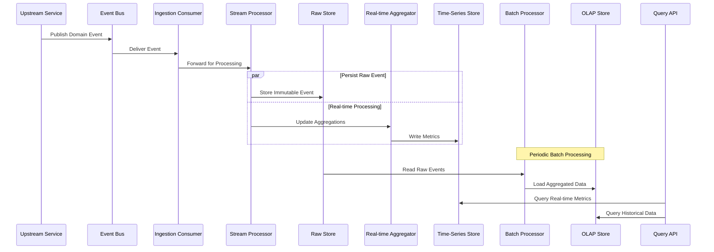
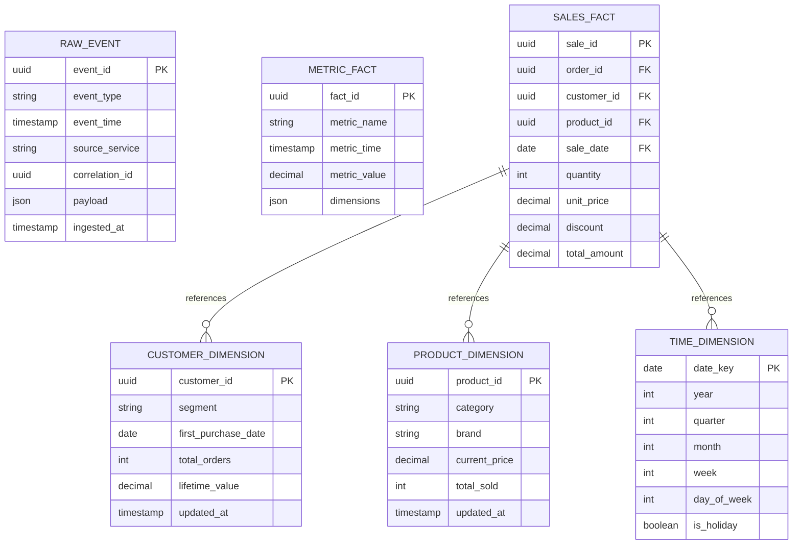

# Epic: Analytics & Business Intelligence Service for ACME E-Commerce

## Epic Overview

**Epic ID:** ACME-EPIC-010
**Title:** Analytics & Business Intelligence Service
**Status:** Draft
**Created:** 2026-01-02

## Business Value

The Analytics & Business Intelligence Service provides ACME stakeholders with actionable insights into customer behavior, sales performance, inventory trends, and operational efficiency. By capturing and analyzing events across all platform services, this bounded context enables data-driven decision making, identifies growth opportunities, detects anomalies, and supports strategic planning through comprehensive reporting and predictive capabilities.

## Problem Statement

Without a centralized analytics capability, ACME lacks visibility into:
- Customer purchasing patterns and lifetime value
- Real-time sales performance and revenue trends
- Product performance and inventory optimization opportunities
- Marketing campaign effectiveness and ROI
- Conversion funnel bottlenecks and abandonment points
- Operational inefficiencies across fulfillment and shipping
- Early warning indicators for business anomalies

## Strategic Goals

1. **Enable Data-Driven Decisions** - Provide real-time and historical analytics to inform business strategy
2. **Optimize Customer Experience** - Understand customer journeys to improve conversion and retention
3. **Maximize Revenue** - Identify sales opportunities and optimize pricing strategies
4. **Improve Operational Efficiency** - Surface insights to streamline fulfillment and reduce costs
5. **Support Compliance** - Maintain audit trails and support regulatory reporting requirements

---

## Bounded Context Definition

### Domain Boundaries

The Analytics Service operates as a downstream consumer of domain events from all other bounded contexts. It owns the analytics domain, including:

- Event ingestion and normalization
- Metric computation and aggregation
- Report generation and distribution
- Dashboard and visualization APIs
- Alerting and anomaly detection
- Predictive model execution

### Context Relationships

---

## Architecture Design

### Architectural Patterns Applied

This service leverages the following patterns from the ACME architecture standards:

| Pattern | Application in Analytics Service |
|---------|----------------------------------|
| **Event-Driven Architecture** | Consumes domain events from all upstream services asynchronously |
| **CQRS** | Separates event ingestion (write path) from analytics queries (read path) with optimized data models for each |
| **Event Sourcing** | Stores raw events immutably to support replay, backfilling, and temporal queries |
| **Change Data Capture** | Optionally supplements event streams with CDC from upstream databases for data reconciliation |
| **Microservices** | Deployed as an independent service with its own persistence and scaling characteristics |
| **Service Discovery** | Registers with the service registry for health monitoring and load balancing |

### Component Architecture

### Event Flow Architecture

---

## Features

### F1: Real-Time Analytics Dashboard

Provide live dashboards displaying key business metrics with minimal latency from event occurrence.

**Capabilities:**
- Live sales volume and revenue counters
- Active user and session counts
- Real-time order pipeline visualization
- Inventory level monitoring
- Payment success/failure rates
- Geographic distribution of activity

**Acceptance Criteria:**
- [ ] Dashboards update within seconds of underlying events
- [ ] Support for customizable dashboard layouts
- [ ] Role-based access to different dashboard views
- [ ] Mobile-responsive dashboard rendering
- [ ] Dashboard state persistence per user

---

### F2: Sales & Revenue Analytics

Comprehensive analysis of sales performance across multiple dimensions.

**Capabilities:**
- Revenue tracking by period, product, category, and channel
- Average order value trends
- Sales velocity analysis
- Discount and promotion impact analysis
- Refund and chargeback tracking
- Revenue forecasting

**Acceptance Criteria:**
- [ ] Support time-based comparisons (YoY, MoM, WoW, DoD)
- [ ] Drill-down from summary to transaction-level detail
- [ ] Filter by product hierarchy, geography, customer segment
- [ ] Export capabilities for further analysis
- [ ] Scheduled report delivery

---

### F3: Customer Behavior Analytics

Understand customer interactions, journeys, and lifetime value.

**Capabilities:**
- Customer acquisition funnel analysis
- Session and journey tracking
- Cart abandonment analysis
- Customer cohort analysis
- Lifetime value (LTV) calculation
- Churn prediction indicators
- RFM (Recency, Frequency, Monetary) segmentation

**Acceptance Criteria:**
- [ ] Track customer journeys across sessions and devices
- [ ] Identify drop-off points in conversion funnel
- [ ] Segment customers by behavior patterns
- [ ] Calculate and track customer LTV over time
- [ ] Support privacy-compliant data handling

---

### F4: Product Performance Analytics

Analyze product catalog performance and optimization opportunities.

**Capabilities:**
- Product sales ranking and trends
- Category performance comparison
- Product affinity and association analysis
- Search-to-purchase conversion by product
- Inventory turnover analytics
- Price elasticity indicators

**Acceptance Criteria:**
- [ ] Rank products by multiple performance metrics
- [ ] Identify slow-moving and fast-moving inventory
- [ ] Surface frequently purchased together products
- [ ] Track product performance changes over time
- [ ] Support product lifecycle stage tracking

---

### F5: Inventory & Supply Chain Analytics

Optimize inventory management through data-driven insights.

**Capabilities:**
- Stock level trend analysis
- Demand forecasting
- Stockout and overstock alerts
- Supplier performance metrics
- Lead time analysis
- Inventory carrying cost analysis

**Acceptance Criteria:**
- [ ] Predict stock requirements based on historical patterns
- [ ] Alert on projected stockouts before they occur
- [ ] Track inventory accuracy metrics
- [ ] Analyze supplier reliability and performance
- [ ] Support multi-warehouse inventory views

---

### F6: Marketing & Campaign Analytics

Measure marketing effectiveness and campaign ROI.

**Capabilities:**
- Campaign performance tracking
- Attribution modeling
- Channel effectiveness comparison
- Promotion and discount analysis
- Customer acquisition cost (CAC) calculation
- Marketing ROI measurement

**Acceptance Criteria:**
- [ ] Track conversions attributed to campaigns
- [ ] Support multiple attribution models
- [ ] Compare performance across marketing channels
- [ ] Measure promotion uplift and cannibalization
- [ ] Calculate and track CAC by channel and campaign

---

### F7: Operational Analytics

Monitor and optimize platform operations.

**Capabilities:**
- Order processing time analysis
- Fulfillment efficiency metrics
- Shipping performance tracking
- Payment processing metrics
- Error rate and failure analysis
- Capacity planning indicators

**Acceptance Criteria:**
- [ ] Track end-to-end order fulfillment times
- [ ] Identify operational bottlenecks
- [ ] Monitor SLA compliance metrics
- [ ] Surface error patterns and root causes
- [ ] Support capacity forecasting

---

### F8: Anomaly Detection & Alerting

Proactively identify unusual patterns and potential issues.

**Capabilities:**
- Automated anomaly detection on key metrics
- Configurable alert thresholds and rules
- Multi-channel alert delivery
- Alert correlation and noise reduction
- Incident tracking integration

**Acceptance Criteria:**
- [ ] Detect statistical anomalies automatically
- [ ] Support both threshold-based and ML-based detection
- [ ] Reduce false positive alerts through smart filtering
- [ ] Deliver alerts via multiple channels (email, SMS, webhook)
- [ ] Provide context and suggested actions with alerts

---

### F9: Self-Service Reporting

Enable business users to create custom reports without engineering support.

**Capabilities:**
- Report builder interface
- Custom metric definitions
- Scheduled report generation
- Multiple export formats
- Report sharing and collaboration
- Report templates library

**Acceptance Criteria:**
- [ ] Non-technical users can build reports independently
- [ ] Support drag-and-drop report construction
- [ ] Allow scheduled report delivery
- [ ] Export to common formats (PDF, CSV, Excel)
- [ ] Maintain report version history

---

### F10: Data Export & Integration

Support data extraction for external tools and compliance needs.

**Capabilities:**
- Bulk data export APIs
- Integration with external BI platforms
- Compliance data extraction
- Data lake export pipelines
- API access for programmatic queries

**Acceptance Criteria:**
- [ ] Provide secure API access to analytics data
- [ ] Support standard data formats and protocols
- [ ] Enable incremental data exports
- [ ] Maintain data lineage and audit trails
- [ ] Support data retention policy enforcement

---

## Data Model Overview

### Core Analytics Entities

---

## Integration Points

### Consumed Events

| Source Service | Event Types |
|---------------|-------------|
| Product Catalog | ProductCreated, ProductUpdated, ProductDeleted, CategoryChanged |
| Inventory | StockLevelChanged, StockReserved, StockReleased, ReorderTriggered |
| Shopping Cart | CartCreated, ItemAdded, ItemRemoved, CartAbandoned, CartConverted |
| Order Management | OrderPlaced, OrderConfirmed, OrderCancelled, OrderModified |
| Payment Processing | PaymentInitiated, PaymentCompleted, PaymentFailed, RefundProcessed |
| Shipping & Fulfillment | ShipmentCreated, ShipmentShipped, ShipmentDelivered, ReturnInitiated |
| Customer Management | CustomerRegistered, ProfileUpdated, PreferencesChanged |
| Notifications | NotificationSent, NotificationDelivered, NotificationFailed |

### Exposed APIs

| API | Purpose |
|-----|---------|
| Query API | Execute analytics queries and retrieve metric data |
| Report API | Generate, schedule, and retrieve reports |
| Dashboard API | Retrieve dashboard configurations and real-time data |
| Export API | Bulk data extraction for external systems |
| Alert API | Configure and manage alerting rules |
| Admin API | Service configuration and metadata management |

---

## Observability Requirements

Following ACME observability standards, the Analytics Service will implement:

### Distributed Tracing
- Trace event ingestion from source through processing to storage
- Trace query execution across data stores
- Correlate with upstream service traces via correlation IDs

### Metrics
- Event ingestion rate and latency
- Query execution time and throughput
- Data freshness (lag from event time to availability)
- Storage utilization and growth rates
- Error rates by processing stage

### Logging
- Structured logs for all processing stages
- Query audit logs for compliance
- Error logs with full context for debugging

### Health Checks
- Liveness: Service process health
- Readiness: Data store connectivity and event bus subscription status
- Dependency health: Upstream event bus, downstream notification services

---

## Non-Functional Requirements

### Scalability
- Handle ingestion of millions of events per day
- Support concurrent dashboard users during peak business hours
- Scale query capacity independently from ingestion

### Performance
- Real-time dashboard latency under 5 seconds
- Ad-hoc query response time appropriate to data volume
- Batch processing completion within defined windows

### Reliability
- No data loss for ingested events
- Graceful degradation during upstream failures
- Support event replay for reprocessing

### Security
- Role-based access control for all analytics data
- Data masking for sensitive fields
- Audit logging for data access
- Encryption at rest and in transit

### Privacy & Compliance
- Support data subject access requests
- Implement data retention policies
- Enable anonymization for long-term analytics
- Support geographic data residency requirements

---

## Open Questions

1. What data retention periods are required for raw events vs aggregated data?
2. What external BI tools need to be supported for integration?
3. Are there specific regulatory compliance requirements (GDPR, CCPA, etc.)?
4. What level of real-time analytics is required vs near-real-time?
5. Should the service support multi-tenant analytics for marketplace sellers?

---

## Dependencies

- **Event Bus Infrastructure** - Required for event consumption
- **Schema Registry** - For event schema validation and evolution
- **Identity Service** - For authentication and authorization
- **Notification Service** - For alert delivery

---

## Risks & Mitigations

| Risk | Impact | Mitigation |
|------|--------|------------|
| High event volume impacts processing | Data freshness degradation | Implement backpressure and horizontal scaling |
| Schema changes in upstream events | Processing failures | Use schema registry with compatibility checks |
| Query performance degradation | Poor user experience | Implement query optimization, caching, and materialized views |
| Data quality issues from upstream | Incorrect analytics | Implement data quality checks and alerting |
| Storage cost growth | Increased operational costs | Implement tiered storage and retention policies |

---

## Success Metrics

- Dashboard adoption rate across business units
- Reduction in time to generate business reports
- Increase in data-driven decision making (measured via surveys)
- Query performance SLA adherence
- Data freshness SLA adherence
- Alert accuracy (reduction in false positives)

---

## References

- [ACME Architecture Standards](../ARCHITECTURE.md)
- [Event-Driven Architecture Patterns](../ARCHITECTURE.md#event-driven-architecture)
- [CQRS Pattern](../ARCHITECTURE.md#cqrs)
- [Event Sourcing Pattern](../ARCHITECTURE.md#event-sourcing)

