# Epic: Pricing Management Service

## Overview

**Epic ID:** ACME-EPIC-011
**Title:** Pricing Management Service for ACME E-Commerce
**Priority:** High
**Status:** Draft

### Epic Statement

As an **e-commerce platform operator**, I need a **centralized pricing management system** so that **the business can define, manage, and optimize product pricing strategies while ensuring customers see accurate, consistent prices across all channels and touchpoints**.

## Business Context

The Pricing Management Service represents a strategic bounded context within the ACME e-commerce platform. It serves as the authoritative source for all pricing decisions, enabling sophisticated pricing strategies including promotional campaigns, tiered pricing, dynamic adjustments, and multi-currency support. This service must balance business flexibility with operational reliability, ensuring that pricing changes propagate consistently across the platform while maintaining a complete audit trail for compliance and analysis.

## Strategic Importance

- **Revenue Optimization**: Enables dynamic pricing strategies to maximize margins
- **Competitive Positioning**: Supports rapid price adjustments in response to market conditions
- **Customer Segmentation**: Facilitates personalized pricing for different customer tiers
- **Promotional Agility**: Powers marketing campaigns with flexible discount mechanisms
- **Compliance**: Maintains complete pricing history for audit and regulatory requirements

## Domain Model

### Bounded Context

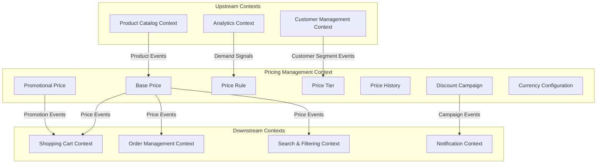

### Context Map

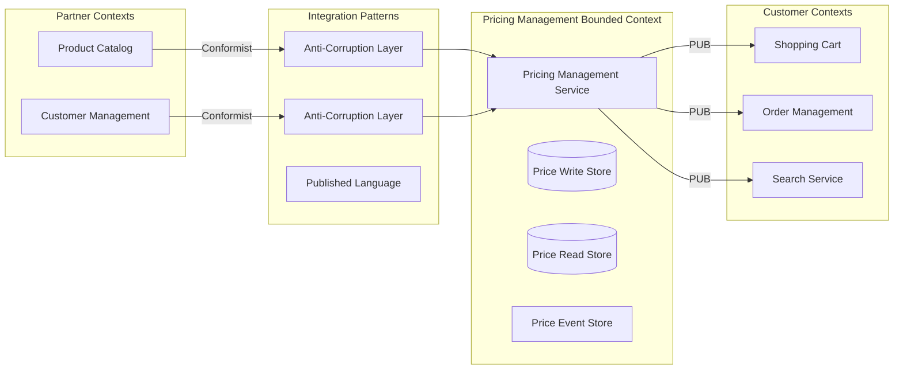

### Domain Ownership

The Pricing Management Service has exclusive ownership over:

- Base product prices and price points
- Promotional pricing and discount rules
- Price tier definitions and customer segment pricing
- Dynamic pricing rules and algorithms
- Currency conversion rates and regional pricing
- Price effective dates and scheduling
- Price change audit history

### Integration Boundaries

| Integration | Direction | Pattern | Purpose |
|-------------|-----------|---------|---------|
| Product Catalog | Upstream | Event Consumer | Receive product lifecycle events |
| Customer Management | Upstream | Event Consumer | Receive customer segment updates |
| Analytics | Upstream | Event Consumer | Receive demand and performance signals |
| Shopping Cart | Downstream | Event Producer + Query API | Provide current prices and applicable discounts |
| Order Management | Downstream | Event Producer + Query API | Provide price snapshots for order creation |
| Search Service | Downstream | Event Producer | Publish price ranges for filtering |
| Notification Service | Downstream | Event Producer | Trigger price drop alerts |

## Pricing Aggregate Model

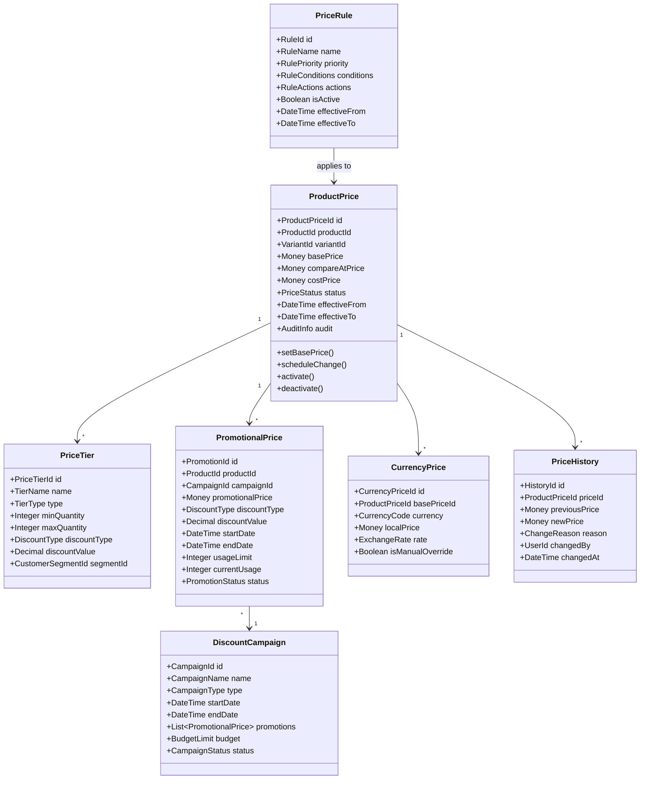

### Value Objects

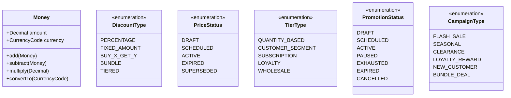

## Price Lifecycle State Machine

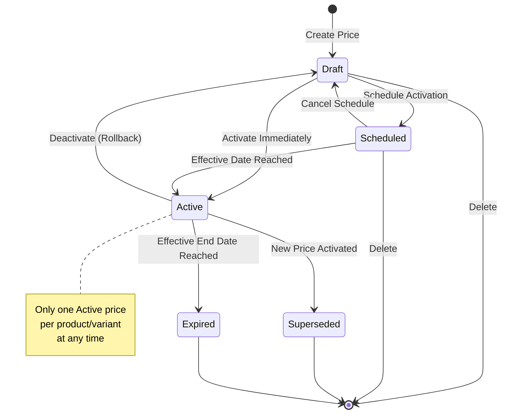

## Features

### F1: Base Price Management

Establish and maintain the foundational pricing for all products and variants.

**Capabilities:**
- Set base retail prices for products and variants
- Define compare-at prices for displaying savings
- Track cost prices for margin calculations
- Support price effective dating for scheduled changes
- Maintain price history for all modifications

**Acceptance Criteria:**
- Base prices can be set for individual products or variants
- Price changes can be scheduled for future effective dates
- Only one active base price exists per product/variant at any time
- All price modifications are captured in audit history
- Cost prices are protected with appropriate access controls

---

### F2: Promotional Pricing

Enable time-limited price reductions and promotional campaigns.

**Capabilities:**
- Create promotional prices with start and end dates
- Support multiple discount types (percentage, fixed amount)
- Define usage limits per promotion
- Associate promotions with marketing campaigns
- Stack or exclude promotions based on business rules

**Acceptance Criteria:**
- Promotions automatically activate and expire based on defined dates
- Usage limits are enforced in real-time across all channels
- Promotion conflicts are resolved through priority rules
- Exhausted promotions trigger appropriate notifications
- Promotional history is retained for campaign analysis

---

### F3: Price Tier Management

Support differentiated pricing based on quantity, customer segment, or subscription status.

**Capabilities:**
- Define quantity-based price breaks
- Create customer segment-specific pricing
- Support subscription and loyalty tier pricing
- Configure wholesale pricing tiers
- Manage tier eligibility rules

**Acceptance Criteria:**
- Customers see applicable tier pricing based on their profile
- Quantity breaks are calculated accurately in cart
- Tier changes propagate to active sessions appropriately
- Tier pricing respects promotional overlay rules
- Tier definitions support complex eligibility criteria

---

### F4: Discount Campaign Management

Coordinate and manage promotional campaigns across products and time periods.

**Capabilities:**
- Create and manage discount campaigns
- Associate multiple products with campaigns
- Set campaign budgets and spending limits
- Schedule campaign start and end dates
- Track campaign performance metrics

**Acceptance Criteria:**
- Campaigns can be created, scheduled, and managed centrally
- Budget limits halt discounts when exhausted
- Campaign performance is tracked in real-time
- Campaigns can be paused or cancelled mid-flight
- Campaign events trigger downstream notifications

---

### F5: Dynamic Price Rules

Enable rule-based pricing adjustments responding to business conditions.

**Capabilities:**
- Define price rules with conditions and actions
- Support time-based pricing rules
- Enable inventory-level based adjustments
- Configure competitive response rules
- Manage rule priorities and conflicts

**Acceptance Criteria:**
- Rules are evaluated in priority order
- Rule conditions support complex logical expressions
- Rule changes take effect within defined latency windows
- Rule execution is audited for transparency
- Rules can be tested before activation

---

### F6: Multi-Currency Pricing

Support pricing in multiple currencies for international commerce.

**Capabilities:**
- Configure supported currencies
- Manage exchange rates (automatic and manual)
- Override calculated prices with fixed local prices
- Handle currency rounding rules
- Support regional pricing strategies

**Acceptance Criteria:**
- Prices display in customer's preferred currency
- Exchange rates update according to configured schedule
- Manual price overrides take precedence over calculated prices
- Currency conversions are consistent across all touchpoints
- Rounding rules comply with currency standards

---

### F7: Price Query and Resolution

Provide efficient price resolution for real-time commerce operations.

**Capabilities:**
- Resolve current effective price for any product
- Calculate prices with applicable discounts and tiers
- Support bulk price queries for catalog operations
- Provide price breakdowns showing applied rules
- Cache resolved prices for performance

**Acceptance Criteria:**
- Price queries return within latency SLO
- Resolved prices account for all applicable rules and tiers
- Price breakdowns clearly show calculation components
- Cached prices invalidate appropriately on changes
- Bulk queries scale efficiently for large catalogs

---

### F8: Price Change Notifications

Alert stakeholders and systems to pricing changes.

**Capabilities:**
- Publish price change events to downstream systems
- Support customer price drop alerts
- Notify administrators of significant changes
- Trigger reindexing for search and filtering
- Enable price monitoring integrations

**Acceptance Criteria:**
- Price change events are published reliably
- Customer alerts respect opt-in preferences
- Events include sufficient context for consumers
- High-volume changes are batched appropriately
- Event delivery is monitored and alertable

---

### F9: Pricing Analytics and Reporting

Provide insights into pricing performance and history.

**Capabilities:**
- Track price change frequency and patterns
- Measure promotional campaign effectiveness
- Analyze margin impacts of pricing decisions
- Generate pricing audit reports
- Export pricing data for analysis

**Acceptance Criteria:**
- Pricing history is queryable for analysis
- Reports can be generated for compliance audits
- Campaign metrics are available in near real-time
- Data exports support standard formats
- Analytics respect data access controls

## Architecture

### Service Integration

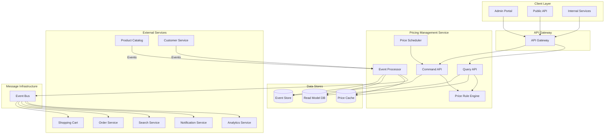

### CQRS Pattern Implementation

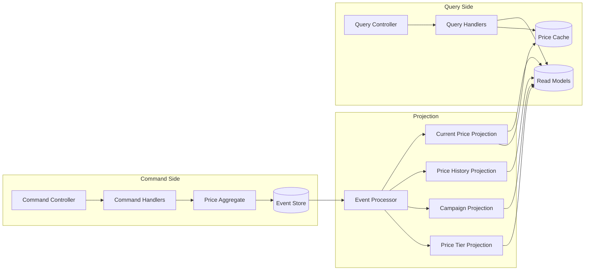

### Event Sourcing

The Pricing Management Service implements event sourcing to maintain complete pricing history and enable temporal queries.

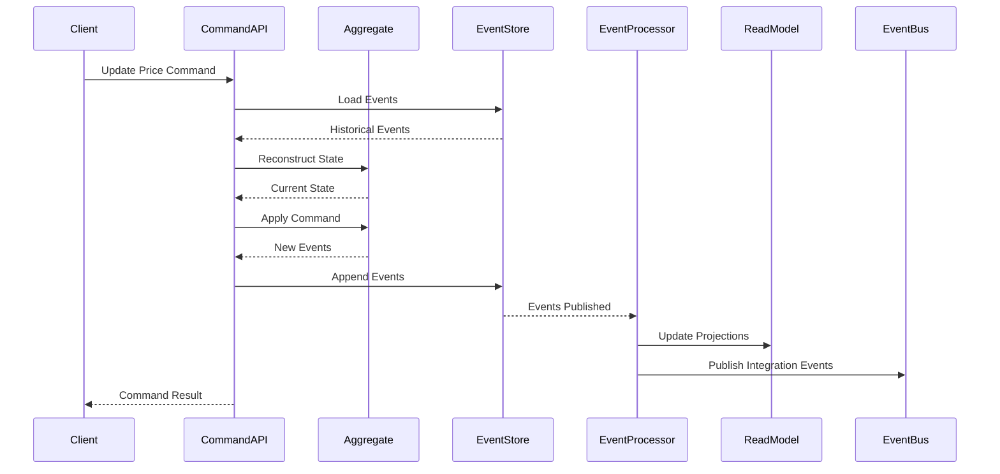

### Price Domain Events

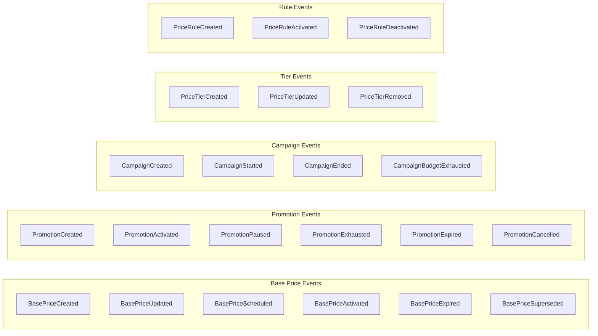

| Event | Description | Triggers |
|-------|-------------|----------|
| BasePriceCreated | New base price established | Admin creates product price |
| BasePriceUpdated | Base price modified | Admin updates price |
| BasePriceScheduled | Price change scheduled | Admin schedules future price |
| BasePriceActivated | Price becomes effective | Scheduled date reached or immediate activation |
| BasePriceExpired | Price reaches end date | Effective end date reached |
| BasePriceSuperseded | Price replaced by new price | New price activated |
| PromotionCreated | New promotion defined | Admin creates promotion |
| PromotionActivated | Promotion becomes active | Start date reached |
| PromotionExhausted | Usage limit reached | Usage count meets limit |
| PromotionExpired | Promotion end date reached | End date passed |
| CampaignStarted | Campaign goes live | Campaign start date |
| CampaignBudgetExhausted | Campaign budget depleted | Discount total exceeds budget |
| PriceTierCreated | New pricing tier defined | Admin creates tier |
| PriceRuleActivated | Pricing rule enabled | Rule effective date or manual activation |

### Price Resolution Flow

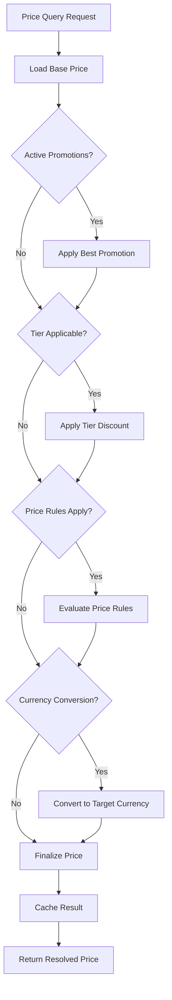

### Scheduled Price Changes

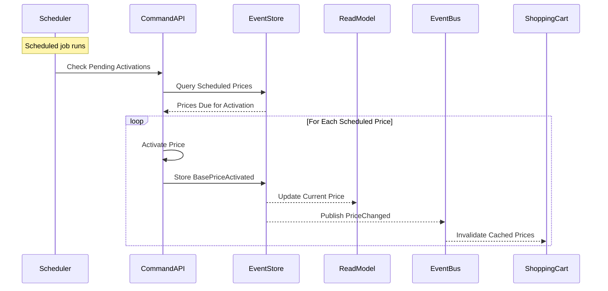

## Cross-Cutting Concerns

### Observability

Following platform observability standards:

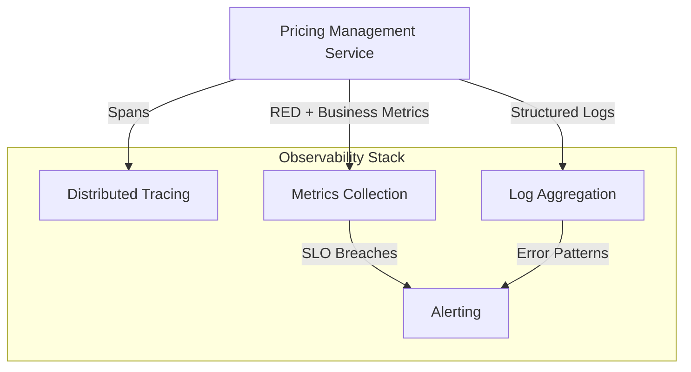

**Key Metrics:**

| Metric | Type | Description |
|--------|------|-------------|
| price_queries_total | Counter | Total price resolution requests |
| price_query_duration_ms | Histogram | Price resolution latency |
| price_changes_total | Counter | Total price modifications |
| promotions_active | Gauge | Currently active promotions |
| cache_hit_rate | Gauge | Price cache effectiveness |
| rule_evaluations_total | Counter | Price rule evaluations |
| campaign_budget_remaining | Gauge | Remaining campaign budgets |

**Distributed Tracing:**
- Trace context propagation across all service interactions
- Span creation for price resolution steps
- Correlation with downstream cart and order operations

**Structured Logging:**
- All price changes logged with full context
- Include correlation IDs for request tracing
- Capture rule evaluation decisions for debugging

### Health Checks

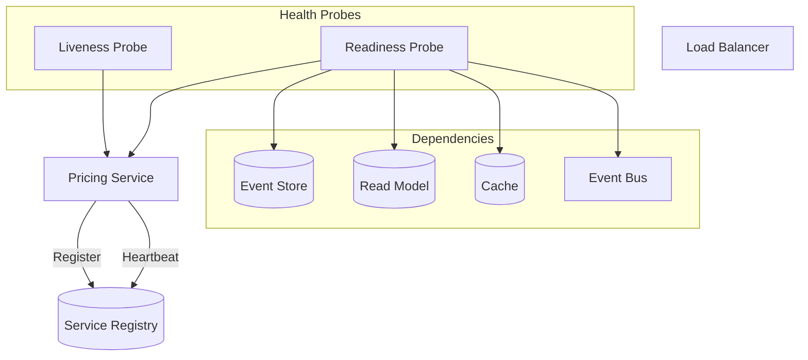

**Liveness Probe:**
- Service process is running
- Core components are responsive

**Readiness Probe:**
- Event store connectivity
- Read model database connectivity
- Cache connectivity
- Message broker connectivity

### Security Considerations

- Price modifications require authenticated and authorized users
- Cost prices are restricted to privileged roles
- All price changes are audit logged with user context
- Rate limiting on price query endpoints
- Input validation prevents injection attacks
- Sensitive pricing data encrypted at rest

### Data Consistency

- Event sourcing ensures complete audit trail
- Eventual consistency between write and read models
- Price cache invalidation on change events
- Idempotency keys for duplicate request handling
- Optimistic concurrency control on price aggregates

## Non-Functional Requirements

### Performance

- Price query latency under 50ms (P95)
- Price update propagation under 500ms (P95)
- Support for 10,000+ concurrent price queries
- Bulk price updates for 1000+ products within 30 seconds

### Availability

- 99.9% uptime SLO
- Graceful degradation when analytics unavailable
- Circuit breakers for external service calls
- Cached prices served during partial outages

### Scalability

- Horizontal scaling of query side independently
- Event store partitioning by product category
- Read model replication for query scaling
- Price cache distributed across regions

### Data Retention

- Price event history retained indefinitely for audit
- Active price data retained while product exists
- Campaign data retained for 3 years post-completion
- Read models can be rebuilt from events

## Integration Points

| Service | Integration Type | Purpose |
|---------|-----------------|---------|
| Product Catalog | Events (Upstream) | Product lifecycle events |
| Customer Management | Events (Upstream) | Customer segment updates |
| Shopping Cart | Events + Query API | Current prices, discounts |
| Order Management | Events + Query API | Price snapshots for orders |
| Search Service | Events | Price range indexing |
| Notification Service | Events | Price drop alerts |
| Analytics | Events | Pricing performance data |

## Dependencies

| Dependency | Type | Criticality |
|------------|------|-------------|
| Event Store | Infrastructure | Critical |
| Read Model Database | Infrastructure | Critical |
| Price Cache | Infrastructure | High |
| Message Broker | Infrastructure | Critical |
| Product Catalog Service | Service | High |
| Customer Management Service | Service | Medium |

## Success Metrics

| Metric | Target | Measurement |
|--------|--------|-------------|
| Price Query Latency | < 50ms P95 | Monitoring |
| Price Propagation Time | < 500ms P95 | Event timestamps |
| Cache Hit Rate | > 95% | Cache metrics |
| Promotion Redemption Rate | Business defined | Campaign analytics |
| Price Accuracy | 100% | Reconciliation |
| System Availability | 99.9% | Uptime monitoring |

## Open Questions

1. What pricing strategies should the dynamic pricing rules initially support?
2. What are the requirements for competitive price monitoring integrations?
3. Should prices support regional variations beyond currency conversion?
4. What approval workflows are needed for price changes above certain thresholds?
5. What are the compliance requirements for price change notifications to customers?
6. How should price conflicts between promotions and tier pricing be resolved?
7. What external pricing data sources should be integrated?

## Related Epics

- ACME-EPIC-002: Product Catalog Service
- ACME-EPIC-005: Order Management Service
- ACME-EPIC-009: Shopping Cart Management Service
- ACME-EPIC-010: Analytics & Business Intelligence Service
- ACME-EPIC-004: Customer Management Service

## Revision History

| Version | Date | Author | Changes |
|---------|------|--------|---------|
| 1.0 | 2026-01-02 | ACME Platform Team | Initial draft |
