# User Journey: Create Customer Profile

**Journey ID:** UJ-0001
**Version:** 1.0
**Status:** Draft
**Created:** 2026-01-02
**Last Updated:** 2026-01-02

## Overview

This user journey documents the complete flow for a new customer creating their profile on the ACME e-commerce platform. The journey spans multiple bounded contexts and implements the platform's event-driven architecture, CQRS, and event sourcing patterns.

### Business Value

- **Customer Acquisition**: Enable new customers to onboard quickly and start shopping
- **Personalization Foundation**: Collect profile data to enable personalized experiences
- **Compliance Readiness**: Establish consent and preference records from the start
- **Marketing Enablement**: Capture customer data for segmentation and targeting

### Journey Scope

This journey covers:
1. User registration and email verification
2. Initial customer profile creation (automated)
3. Profile completion by the customer
4. Address management
5. Preference configuration
6. Consent management

---

## Actors and Systems

### Primary Actor
- **New Customer**: A person visiting the ACME platform who wants to create an account

### Participating Services

| Service | Bounded Context | Responsibility |
|---------|-----------------|----------------|
| **Web Application** | Frontend | User interface for registration and profile management |
| **Identity Management Service** | Identity | User registration, authentication, email verification |
| **Customer Management Service** | Customer | Profile storage, address management, preferences |
| **Notifications Service** | Notifications | Welcome email, verification emails |
| **Analytics Service** | Analytics | Track registration and profile completion events |

---

## Journey Flow

### High-Level Flow

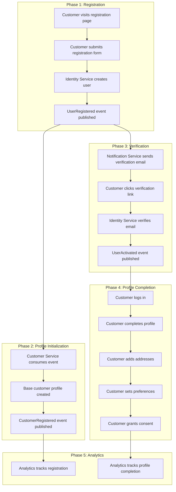

---

## Detailed Journey Steps

### Step 1: Customer Initiates Registration

**Actor:** New Customer
**System:** Web Application

The customer navigates to the registration page and is presented with a registration form.

#### UI Requirements

- Form fields: Email, Password, Confirm Password, First Name, Last Name
- Password strength indicator
- Terms of Service and Privacy Policy checkboxes
- Optional: Marketing communications opt-in checkbox
- Clear validation error messages

#### Acceptance Criteria

| ID | Criterion | Priority |
|----|-----------|----------|
| AC-1.1 | Email field validates email format in real-time | Must Have |
| AC-1.2 | Password field enforces minimum 8 characters with at least one uppercase, one lowercase, one digit, and one special character | Must Have |
| AC-1.3 | Confirm password field validates match with password field | Must Have |
| AC-1.4 | First name and last name fields are required, max 50 characters each | Must Have |
| AC-1.5 | Terms of Service checkbox must be checked to proceed | Must Have |
| AC-1.6 | Form submission button is disabled until all required validations pass | Must Have |
| AC-1.7 | Form displays inline validation errors within 200ms of field blur | Should Have |
| AC-1.8 | Password field has show/hide toggle | Should Have |

---

### Step 2: Identity Service Processes Registration

**Actor:** Web Application
**System:** Identity Management Service

The web application submits the registration request to the Identity Management Service.

#### Sequence Diagram

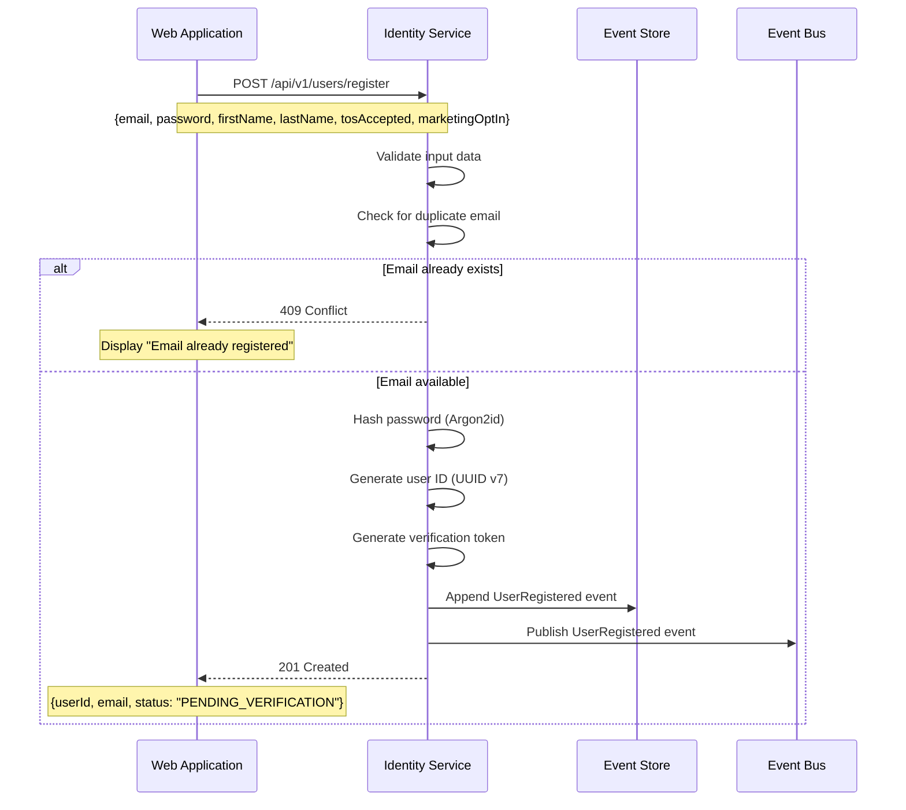

#### API Contract

**Request:**
```
POST /api/v1/users/register
Content-Type: application/json

{
  "email": "customer@example.com",
  "password": "SecureP@ss123",
  "firstName": "Jane",
  "lastName": "Doe",
  "tosAccepted": true,
  "tosAcceptedAt": "2026-01-02T10:30:00Z",
  "marketingOptIn": false
}
```

**Response (Success):**
```
HTTP/1.1 201 Created
Content-Type: application/json

{
  "userId": "01941234-5678-7abc-def0-123456789abc",
  "email": "customer@example.com",
  "status": "PENDING_VERIFICATION",
  "createdAt": "2026-01-02T10:30:01Z"
}
```

#### Domain Event: UserRegistered

```json
{
  "eventId": "01941234-5678-7abc-def0-123456789001",
  "eventType": "UserRegistered",
  "eventVersion": "1.0",
  "timestamp": "2026-01-02T10:30:01Z",
  "aggregateId": "01941234-5678-7abc-def0-123456789abc",
  "aggregateType": "User",
  "correlationId": "01941234-5678-7abc-def0-123456789002",
  "payload": {
    "userId": "01941234-5678-7abc-def0-123456789abc",
    "email": "customer@example.com",
    "firstName": "Jane",
    "lastName": "Doe",
    "tosAcceptedAt": "2026-01-02T10:30:00Z",
    "marketingOptIn": false,
    "registrationSource": "WEB"
  }
}
```

#### Acceptance Criteria

| ID | Criterion | Priority |
|----|-----------|----------|
| AC-2.1 | Duplicate email check returns 409 within 100ms (p99) | Must Have |
| AC-2.2 | Password is hashed using Argon2id with memory cost of 64MB, time cost of 3, parallelism of 4 | Must Have |
| AC-2.3 | User ID is generated as UUID v7 (time-ordered) | Must Have |
| AC-2.4 | UserRegistered event is persisted to event store before response | Must Have |
| AC-2.5 | UserRegistered event is published to Kafka topic `identity.user.events` | Must Have |
| AC-2.6 | Verification token expires after 24 hours | Must Have |
| AC-2.7 | Registration endpoint responds within 500ms (p95) | Should Have |
| AC-2.8 | Terms of Service acceptance timestamp is recorded immutably | Must Have |
| AC-2.9 | Registration source (WEB, MOBILE, API) is captured in event | Should Have |

---

### Step 3: Customer Profile Creation

**Actor:** Customer Management Service
**System:** Event Consumer

The Customer Management Service consumes the `UserRegistered` event and creates the initial customer profile.

#### Sequence Diagram

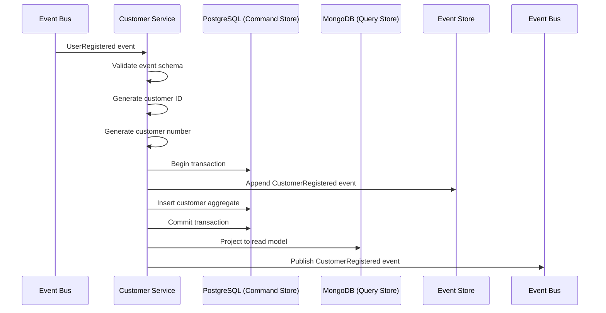

#### Customer Number Generation

Customer numbers follow the format: `ACME-YYYYMM-NNNNNN`
- `ACME`: Platform prefix
- `YYYYMM`: Year and month of registration
- `NNNNNN`: Sequential 6-digit number (zero-padded)

Example: `ACME-202601-000142`

#### Domain Event: CustomerRegistered

```json
{
  "eventId": "01941234-5678-7abc-def0-123456789010",
  "eventType": "CustomerRegistered",
  "eventVersion": "1.0",
  "timestamp": "2026-01-02T10:30:02Z",
  "aggregateId": "01941234-5678-7abc-def0-123456789020",
  "aggregateType": "Customer",
  "correlationId": "01941234-5678-7abc-def0-123456789002",
  "causationId": "01941234-5678-7abc-def0-123456789001",
  "payload": {
    "customerId": "01941234-5678-7abc-def0-123456789020",
    "userId": "01941234-5678-7abc-def0-123456789abc",
    "customerNumber": "ACME-202601-000142",
    "email": "customer@example.com",
    "firstName": "Jane",
    "lastName": "Doe",
    "status": "PENDING_VERIFICATION",
    "type": "INDIVIDUAL",
    "registeredAt": "2026-01-02T10:30:02Z"
  }
}
```

#### Initial Profile State

```json
{
  "customerId": "01941234-5678-7abc-def0-123456789020",
  "userId": "01941234-5678-7abc-def0-123456789abc",
  "customerNumber": "ACME-202601-000142",
  "name": {
    "firstName": "Jane",
    "lastName": "Doe",
    "displayName": "Jane Doe"
  },
  "email": {
    "address": "customer@example.com",
    "verified": false
  },
  "phone": null,
  "status": "PENDING_VERIFICATION",
  "type": "INDIVIDUAL",
  "profile": {
    "dateOfBirth": null,
    "gender": null,
    "preferredLocale": "en-US",
    "timezone": "UTC",
    "preferredCurrency": "USD"
  },
  "preferences": {
    "communication": {
      "email": true,
      "sms": false,
      "push": false,
      "marketing": false
    },
    "privacy": {
      "shareDataWithPartners": false,
      "allowAnalytics": true
    }
  },
  "addresses": [],
  "segments": [],
  "registeredAt": "2026-01-02T10:30:02Z",
  "lastActivityAt": "2026-01-02T10:30:02Z",
  "profileCompleteness": 25
}
```

#### Acceptance Criteria

| ID | Criterion | Priority |
|----|-----------|----------|
| AC-3.1 | Customer profile is created within 5 seconds of UserRegistered event | Must Have |
| AC-3.2 | Customer ID is generated as UUID v7 (time-ordered) | Must Have |
| AC-3.3 | Customer number is unique and sequential per month | Must Have |
| AC-3.4 | Event store write and command store write are in same transaction | Must Have |
| AC-3.5 | Read model projection occurs within 2 seconds of command store commit | Should Have |
| AC-3.6 | CustomerRegistered event includes causationId linking to UserRegistered | Must Have |
| AC-3.7 | Default preferences are applied based on marketing opt-in selection | Must Have |
| AC-3.8 | Profile completeness score is calculated and stored (initially 25%) | Should Have |
| AC-3.9 | Failed event processing is retried with exponential backoff (max 5 retries) | Must Have |
| AC-3.10 | Idempotent processing: duplicate UserRegistered events do not create duplicate profiles | Must Have |

---

### Step 4: Verification Email Sent

**Actor:** Notifications Service
**System:** Event Consumer

The Notifications Service consumes the `UserRegistered` event and sends a verification email.

#### Sequence Diagram

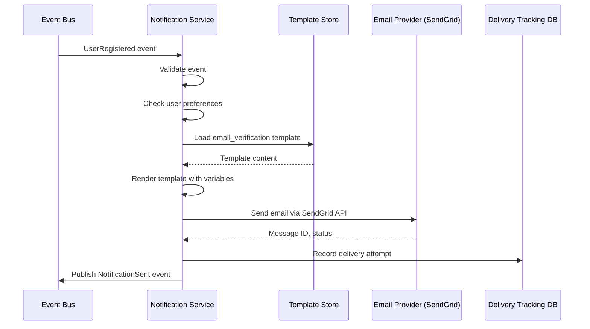

#### Email Template Variables

```json
{
  "recipientName": "Jane",
  "verificationUrl": "https://www.acme.com/verify?token=abc123xyz",
  "expirationHours": 24,
  "supportEmail": "support@acme.com"
}
```

#### Acceptance Criteria

| ID | Criterion | Priority |
|----|-----------|----------|
| AC-4.1 | Verification email is sent within 30 seconds of UserRegistered event | Must Have |
| AC-4.2 | Email contains personalized recipient name | Must Have |
| AC-4.3 | Verification link is unique per user and single-use | Must Have |
| AC-4.4 | Email clearly states 24-hour expiration | Must Have |
| AC-4.5 | Email passes SPF, DKIM, and DMARC validation | Must Have |
| AC-4.6 | Delivery status is tracked (sent, delivered, bounced) | Must Have |
| AC-4.7 | Failed sends are retried up to 3 times with 5-minute intervals | Should Have |
| AC-4.8 | Email template supports localization (initially en-US) | Should Have |
| AC-4.9 | Unsubscribe link is NOT included (transactional email) | Must Have |

---

### Step 5: Customer Verifies Email

**Actor:** New Customer
**System:** Identity Management Service

The customer clicks the verification link in the email and completes email verification.

#### Sequence Diagram

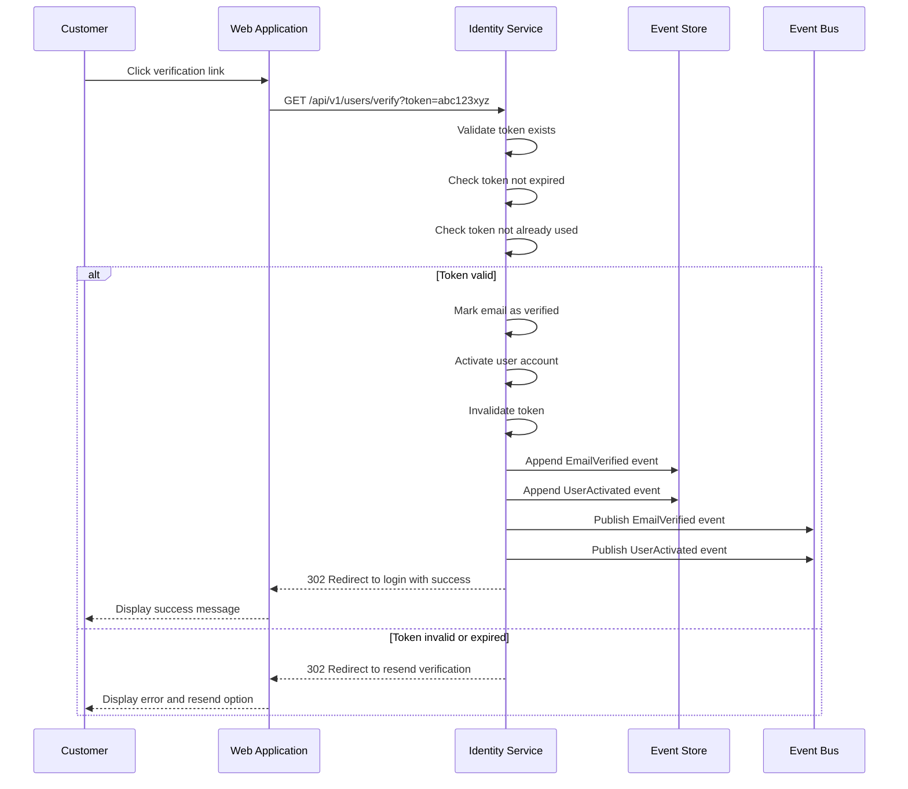

#### Domain Events

**EmailVerified:**
```json
{
  "eventId": "01941234-5678-7abc-def0-123456789030",
  "eventType": "EmailVerified",
  "eventVersion": "1.0",
  "timestamp": "2026-01-02T11:15:00Z",
  "aggregateId": "01941234-5678-7abc-def0-123456789abc",
  "aggregateType": "User",
  "payload": {
    "userId": "01941234-5678-7abc-def0-123456789abc",
    "email": "customer@example.com",
    "verifiedAt": "2026-01-02T11:15:00Z"
  }
}
```

**UserActivated:**
```json
{
  "eventId": "01941234-5678-7abc-def0-123456789031",
  "eventType": "UserActivated",
  "eventVersion": "1.0",
  "timestamp": "2026-01-02T11:15:00Z",
  "aggregateId": "01941234-5678-7abc-def0-123456789abc",
  "aggregateType": "User",
  "payload": {
    "userId": "01941234-5678-7abc-def0-123456789abc",
    "activatedAt": "2026-01-02T11:15:00Z",
    "activationMethod": "EMAIL_VERIFICATION"
  }
}
```

#### Acceptance Criteria

| ID | Criterion | Priority |
|----|-----------|----------|
| AC-5.1 | Valid verification tokens activate the account immediately | Must Have |
| AC-5.2 | Expired tokens (>24 hours) display appropriate error and resend option | Must Have |
| AC-5.3 | Already-used tokens display "already verified" message | Must Have |
| AC-5.4 | Invalid tokens display generic "invalid link" error (security) | Must Have |
| AC-5.5 | Verification endpoint responds within 200ms (p95) | Should Have |
| AC-5.6 | EmailVerified and UserActivated events are published atomically | Must Have |
| AC-5.7 | Customer can request new verification email (max 3 per hour) | Must Have |
| AC-5.8 | Resend verification email rate limit is clearly communicated to user | Should Have |

---

### Step 6: Customer Profile Activated

**Actor:** Customer Management Service
**System:** Event Consumer

The Customer Management Service consumes the `UserActivated` event and updates the customer status.

#### Sequence Diagram

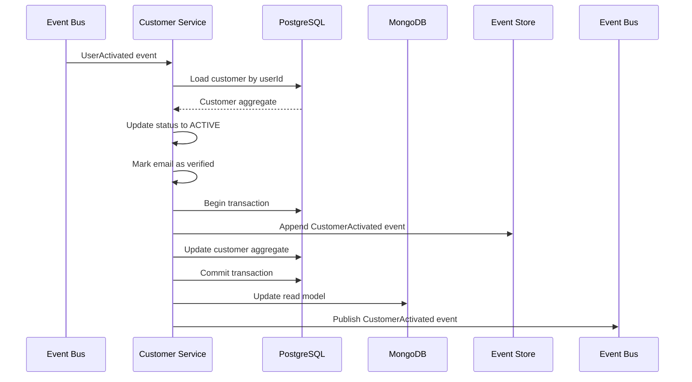

#### Domain Event: CustomerActivated

```json
{
  "eventId": "01941234-5678-7abc-def0-123456789040",
  "eventType": "CustomerActivated",
  "eventVersion": "1.0",
  "timestamp": "2026-01-02T11:15:01Z",
  "aggregateId": "01941234-5678-7abc-def0-123456789020",
  "aggregateType": "Customer",
  "correlationId": "01941234-5678-7abc-def0-123456789002",
  "causationId": "01941234-5678-7abc-def0-123456789031",
  "payload": {
    "customerId": "01941234-5678-7abc-def0-123456789020",
    "activatedAt": "2026-01-02T11:15:01Z",
    "emailVerified": true
  }
}
```

#### Acceptance Criteria

| ID | Criterion | Priority |
|----|-----------|----------|
| AC-6.1 | Customer status transitions from PENDING_VERIFICATION to ACTIVE within 5 seconds | Must Have |
| AC-6.2 | Email verified flag is set to true | Must Have |
| AC-6.3 | CustomerActivated event is published for downstream consumers | Must Have |
| AC-6.4 | Customer can now log in and access all platform features | Must Have |
| AC-6.5 | Last activity timestamp is updated | Should Have |

---

### Step 7: Welcome Notification Sent

**Actor:** Notifications Service
**System:** Event Consumer

Upon customer activation, a welcome notification is sent.

#### Acceptance Criteria

| ID | Criterion | Priority |
|----|-----------|----------|
| AC-7.1 | Welcome email is sent within 60 seconds of CustomerActivated event | Must Have |
| AC-7.2 | Welcome email includes personalized content and call-to-action | Must Have |
| AC-7.3 | Welcome email respects marketing preference (transactional portion always sent) | Must Have |
| AC-7.4 | If marketing opt-in, welcome email includes promotional content section | Should Have |

---

### Step 8: Customer Completes Profile

**Actor:** New Customer
**System:** Customer Management Service

After verification, the customer logs in and completes their profile with additional information.

#### UI Flow

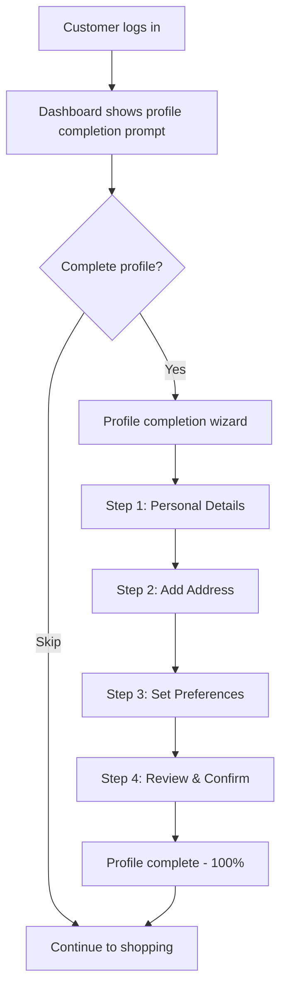

#### Profile Completion Wizard Steps

**Step 1: Personal Details**
- Phone number (optional)
- Date of birth (optional)
- Gender (optional)
- Preferred language
- Timezone

**Step 2: Add Address**
- Address type (Shipping/Billing/Both)
- Street address (line 1, line 2)
- City
- State/Province
- Postal code
- Country
- Set as default checkbox

**Step 3: Preferences**
- Communication channels (Email, SMS, Push)
- Marketing communications opt-in
- Privacy settings

**Step 4: Consent Management**
- Data processing consent
- Marketing consent
- Partner data sharing consent

#### API Contract: Update Profile

**Request:**
```
PATCH /api/v1/customers/{customerId}/profile
Content-Type: application/json
Authorization: Bearer <jwt>

{
  "phone": {
    "countryCode": "+1",
    "number": "5551234567"
  },
  "dateOfBirth": "1990-05-15",
  "gender": "FEMALE",
  "preferredLocale": "en-US",
  "timezone": "America/New_York"
}
```

**Response (Success):**
```
HTTP/1.1 200 OK
Content-Type: application/json

{
  "customerId": "01941234-5678-7abc-def0-123456789020",
  "profile": {
    "phone": {
      "countryCode": "+1",
      "number": "5551234567",
      "verified": false
    },
    "dateOfBirth": "1990-05-15",
    "gender": "FEMALE",
    "preferredLocale": "en-US",
    "timezone": "America/New_York"
  },
  "profileCompleteness": 65,
  "updatedAt": "2026-01-02T11:30:00Z"
}
```

#### Domain Event: ProfileUpdated

```json
{
  "eventId": "01941234-5678-7abc-def0-123456789050",
  "eventType": "ProfileUpdated",
  "eventVersion": "1.0",
  "timestamp": "2026-01-02T11:30:00Z",
  "aggregateId": "01941234-5678-7abc-def0-123456789020",
  "aggregateType": "Customer",
  "payload": {
    "customerId": "01941234-5678-7abc-def0-123456789020",
    "changedFields": ["phone", "dateOfBirth", "gender", "preferredLocale", "timezone"],
    "profileCompleteness": 65
  }
}
```

#### Acceptance Criteria

| ID | Criterion | Priority |
|----|-----------|----------|
| AC-8.1 | Profile update endpoint requires authentication | Must Have |
| AC-8.2 | Customers can only update their own profile | Must Have |
| AC-8.3 | Phone number validates format based on country code | Must Have |
| AC-8.4 | Date of birth validates customer is at least 13 years old | Must Have |
| AC-8.5 | Profile completeness score updates in real-time | Should Have |
| AC-8.6 | ProfileUpdated event includes list of changed fields | Must Have |
| AC-8.7 | Profile update responds within 300ms (p95) | Should Have |
| AC-8.8 | Partial updates are supported (PATCH semantics) | Must Have |
| AC-8.9 | Profile changes are captured in event store for audit | Must Have |

---

### Step 9: Customer Adds Address

**Actor:** New Customer
**System:** Customer Management Service

#### API Contract: Add Address

**Request:**
```
POST /api/v1/customers/{customerId}/addresses
Content-Type: application/json
Authorization: Bearer <jwt>

{
  "type": "SHIPPING",
  "label": "Home",
  "street": {
    "line1": "123 Main Street",
    "line2": "Apt 4B"
  },
  "city": "New York",
  "state": "NY",
  "postalCode": "10001",
  "country": "US",
  "isDefault": true
}
```

**Response (Success):**
```
HTTP/1.1 201 Created
Content-Type: application/json

{
  "addressId": "01941234-5678-7abc-def0-123456789060",
  "customerId": "01941234-5678-7abc-def0-123456789020",
  "type": "SHIPPING",
  "label": "Home",
  "street": {
    "line1": "123 Main Street",
    "line2": "Apt 4B"
  },
  "city": "New York",
  "state": "NY",
  "postalCode": "10001",
  "country": "US",
  "isDefault": true,
  "isValidated": true,
  "coordinates": {
    "latitude": 40.7484,
    "longitude": -73.9967
  },
  "createdAt": "2026-01-02T11:35:00Z"
}
```

#### Address Validation Flow

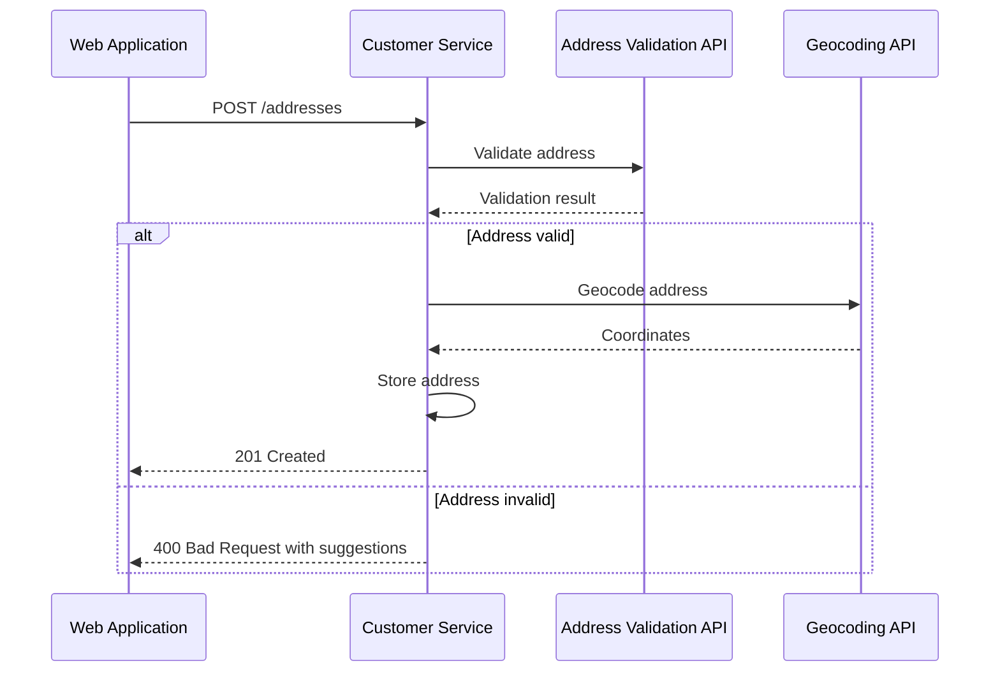

#### Domain Event: AddressAdded

```json
{
  "eventId": "01941234-5678-7abc-def0-123456789061",
  "eventType": "AddressAdded",
  "eventVersion": "1.0",
  "timestamp": "2026-01-02T11:35:00Z",
  "aggregateId": "01941234-5678-7abc-def0-123456789020",
  "aggregateType": "Customer",
  "payload": {
    "customerId": "01941234-5678-7abc-def0-123456789020",
    "addressId": "01941234-5678-7abc-def0-123456789060",
    "type": "SHIPPING",
    "isDefault": true,
    "isValidated": true
  }
}
```

#### Acceptance Criteria

| ID | Criterion | Priority |
|----|-----------|----------|
| AC-9.1 | Address is validated against postal standards before storage | Must Have |
| AC-9.2 | Invalid addresses return suggestions for correction | Should Have |
| AC-9.3 | Setting address as default updates previous default to non-default | Must Have |
| AC-9.4 | Geocoordinates are stored for validated addresses | Should Have |
| AC-9.5 | Customer can have multiple addresses per type (max 10) | Must Have |
| AC-9.6 | Address labels must be unique per customer | Should Have |
| AC-9.7 | AddressAdded event is published for dependent services | Must Have |
| AC-9.8 | Address add responds within 1 second (p95) including validation | Should Have |
| AC-9.9 | PO Box addresses are supported for billing, not shipping | Should Have |

---

### Step 10: Customer Sets Preferences

**Actor:** New Customer
**System:** Customer Management Service

#### API Contract: Update Preferences

**Request:**
```
PUT /api/v1/customers/{customerId}/preferences
Content-Type: application/json
Authorization: Bearer <jwt>

{
  "communication": {
    "email": true,
    "sms": true,
    "push": false,
    "marketing": true,
    "frequency": "WEEKLY_DIGEST"
  },
  "privacy": {
    "shareDataWithPartners": false,
    "allowAnalytics": true,
    "allowPersonalization": true
  },
  "display": {
    "language": "en-US",
    "currency": "USD",
    "timezone": "America/New_York"
  }
}
```

#### Domain Event: PreferencesUpdated

```json
{
  "eventId": "01941234-5678-7abc-def0-123456789070",
  "eventType": "PreferencesUpdated",
  "eventVersion": "1.0",
  "timestamp": "2026-01-02T11:40:00Z",
  "aggregateId": "01941234-5678-7abc-def0-123456789020",
  "aggregateType": "Customer",
  "payload": {
    "customerId": "01941234-5678-7abc-def0-123456789020",
    "changedPreferences": {
      "communication.sms": {"old": false, "new": true},
      "communication.marketing": {"old": false, "new": true},
      "communication.frequency": {"old": "IMMEDIATE", "new": "WEEKLY_DIGEST"}
    }
  }
}
```

#### Acceptance Criteria

| ID | Criterion | Priority |
|----|-----------|----------|
| AC-10.1 | Preference changes take effect immediately | Must Have |
| AC-10.2 | PreferencesUpdated event includes old and new values for audit | Must Have |
| AC-10.3 | SMS preference can only be enabled if phone number is verified | Must Have |
| AC-10.4 | Push preference can only be enabled if device token is registered | Should Have |
| AC-10.5 | Marketing opt-out is honored within 24 hours across all channels | Must Have |
| AC-10.6 | Preference changes are logged for GDPR compliance | Must Have |

---

### Step 11: Customer Grants Consent

**Actor:** New Customer
**System:** Customer Management Service

#### Consent Types

| Consent Type | Description | Required |
|--------------|-------------|----------|
| DATA_PROCESSING | Basic data processing for service delivery | Yes |
| MARKETING | Marketing communications | No |
| ANALYTICS | Usage analytics and personalization | No |
| THIRD_PARTY | Data sharing with partners | No |

#### API Contract: Grant Consent

**Request:**
```
POST /api/v1/customers/{customerId}/consents
Content-Type: application/json
Authorization: Bearer <jwt>

{
  "consentType": "MARKETING",
  "granted": true,
  "source": "PROFILE_WIZARD",
  "ipAddress": "192.168.1.100",
  "userAgent": "Mozilla/5.0..."
}
```

#### Domain Event: ConsentGranted

```json
{
  "eventId": "01941234-5678-7abc-def0-123456789080",
  "eventType": "ConsentGranted",
  "eventVersion": "1.0",
  "timestamp": "2026-01-02T11:45:00Z",
  "aggregateId": "01941234-5678-7abc-def0-123456789020",
  "aggregateType": "Customer",
  "payload": {
    "customerId": "01941234-5678-7abc-def0-123456789020",
    "consentId": "01941234-5678-7abc-def0-123456789081",
    "consentType": "MARKETING",
    "granted": true,
    "grantedAt": "2026-01-02T11:45:00Z",
    "source": "PROFILE_WIZARD",
    "expiresAt": "2027-01-02T11:45:00Z"
  }
}
```

#### Acceptance Criteria

| ID | Criterion | Priority |
|----|-----------|----------|
| AC-11.1 | Consent records are immutable (append-only) | Must Have |
| AC-11.2 | Consent includes timestamp, source, and IP address | Must Have |
| AC-11.3 | DATA_PROCESSING consent is implicitly granted at registration | Must Have |
| AC-11.4 | Consent can be revoked at any time | Must Have |
| AC-11.5 | Consent expiration is configurable per type (default 1 year) | Should Have |
| AC-11.6 | ConsentGranted/ConsentRevoked events are published for compliance systems | Must Have |
| AC-11.7 | Consent history is exportable for GDPR data subject requests | Must Have |

---

## Profile Completeness Calculation

Profile completeness is calculated based on weighted sections:

| Section | Weight | Criteria for 100% |
|---------|--------|-------------------|
| Basic Info (name, email) | 25% | First name, last name, verified email |
| Contact Info | 15% | Phone number added |
| Personal Details | 15% | Date of birth OR gender provided |
| Address | 20% | At least one validated address |
| Preferences | 15% | Communication preferences set |
| Consent | 10% | All required consents granted |

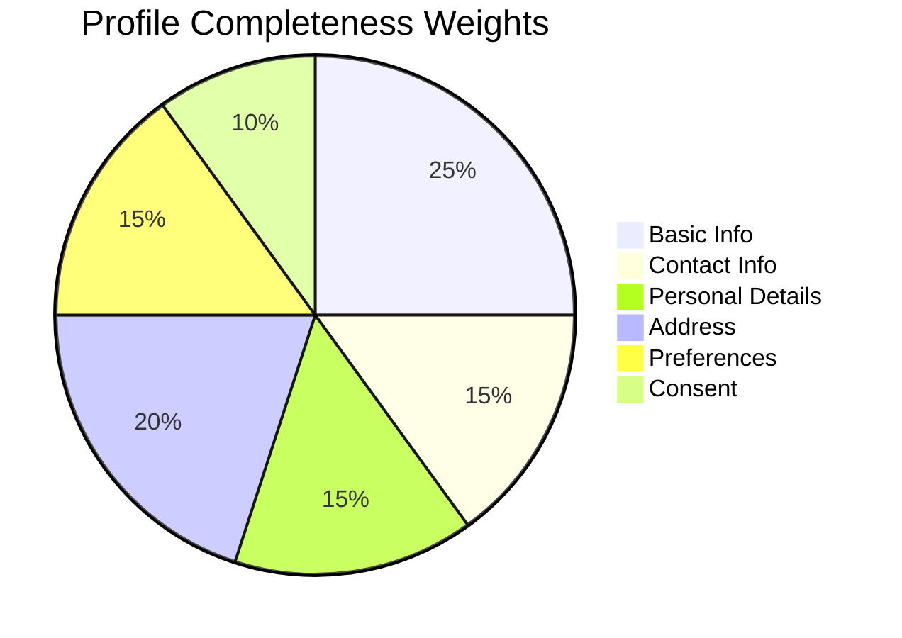

#### Acceptance Criteria

| ID | Criterion | Priority |
|----|-----------|----------|
| AC-PC.1 | Profile completeness is recalculated on every profile change | Must Have |
| AC-PC.2 | Profile completeness is visible to customer in UI | Should Have |
| AC-PC.3 | 100% completion triggers ProfileCompleted event | Should Have |
| AC-PC.4 | Dashboard shows prompt for incomplete profiles (<80%) | Should Have |

---

## Error Scenarios

### E1: Duplicate Email Registration

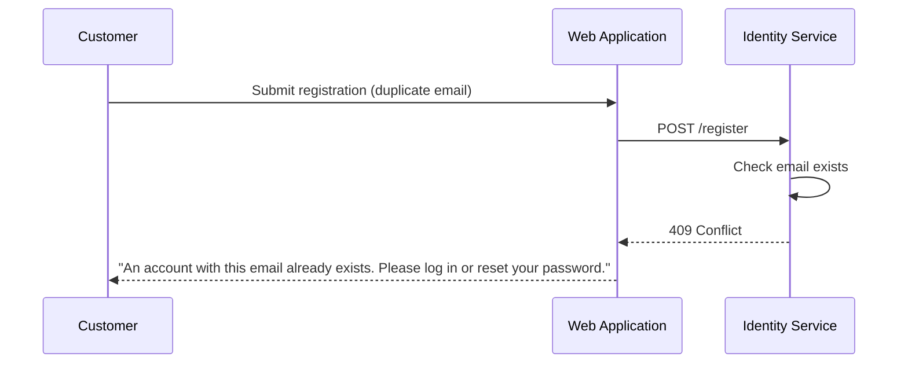

| ID | Criterion | Priority |
|----|-----------|----------|
| AC-E1.1 | Error message does not confirm email exists (security) | Must Have |
| AC-E1.2 | User is offered login and password reset options | Must Have |

### E2: Verification Email Delivery Failure

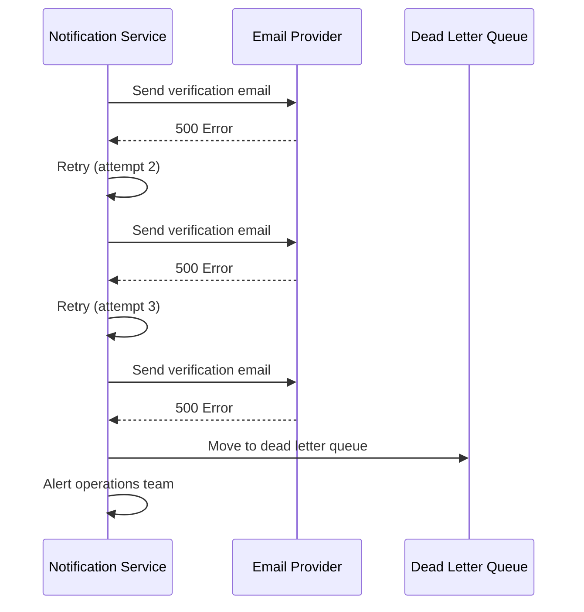

| ID | Criterion | Priority |
|----|-----------|----------|
| AC-E2.1 | Failed email delivery is retried 3 times with exponential backoff | Must Have |
| AC-E2.2 | After max retries, message moves to DLQ | Must Have |
| AC-E2.3 | Operations team is alerted for DLQ entries | Should Have |
| AC-E2.4 | Customer can manually request resend | Must Have |

### E3: Address Validation Failure

| ID | Criterion | Priority |
|----|-----------|----------|
| AC-E3.1 | Invalid addresses display specific validation errors | Must Have |
| AC-E3.2 | Suggested corrections are offered when available | Should Have |
| AC-E3.3 | Customer can override validation for unrecognized addresses | Should Have |

### E4: Event Processing Failure

| ID | Criterion | Priority |
|----|-----------|----------|
| AC-E4.1 | Failed event processing is retried with exponential backoff | Must Have |
| AC-E4.2 | Events are processed in order per aggregate | Must Have |
| AC-E4.3 | Poison messages are moved to DLQ after max retries | Must Have |
| AC-E4.4 | Manual replay is available for DLQ messages | Should Have |

---

## Analytics Events

The following events are tracked by the Analytics Service:

| Event | Trigger | Key Metrics |
|-------|---------|-------------|
| RegistrationStarted | User opens registration form | Funnel entry count |
| RegistrationCompleted | UserRegistered event | Registration conversion rate |
| VerificationEmailSent | Notification sent | Email delivery rate |
| VerificationCompleted | UserActivated event | Verification conversion rate |
| ProfileWizardStarted | User opens profile wizard | Wizard engagement |
| ProfileWizardCompleted | Profile reaches 100% | Completion rate |
| ProfileWizardAbandoned | User exits before completion | Drop-off analysis |

---

## Observability Requirements

### Distributed Tracing

All requests across this journey must propagate trace context:

```
traceparent: 00-{trace-id}-{span-id}-01
```

| Span | Service | Purpose |
|------|---------|---------|
| registration_request | Web App | Top-level request span |
| create_user | Identity Service | User creation span |
| publish_event | Identity Service | Event publishing span |
| consume_event | Customer Service | Event consumption span |
| create_profile | Customer Service | Profile creation span |
| send_notification | Notification Service | Email sending span |

### Key Metrics

| Metric | Type | Labels |
|--------|------|--------|
| `registration_attempts_total` | Counter | status, source |
| `registration_duration_seconds` | Histogram | step |
| `verification_completion_rate` | Gauge | - |
| `profile_completeness_distribution` | Histogram | - |
| `event_processing_lag_seconds` | Histogram | event_type, service |

### Health Checks

Each service exposes:
- `GET /actuator/health/liveness` - Process is running
- `GET /actuator/health/readiness` - Dependencies available

---

## Testing Strategy

### Unit Tests

- Input validation logic
- Profile completeness calculation
- Event serialization/deserialization
- Domain entity business rules

### Integration Tests

- API endpoint contracts
- Event store persistence
- Read model projection
- Kafka event publishing/consuming

### End-to-End Tests (Cucumber/Playwright)

```gherkin
Feature: Customer Profile Creation

  Scenario: New customer completes registration and profile
    Given I am on the registration page
    When I submit valid registration details
    Then I should see a verification email prompt
    And a verification email should be sent to my email address

    When I click the verification link in the email
    Then my account should be activated
    And I should be able to log in

    When I complete the profile wizard
    Then my profile completeness should be 100%
    And I should see a welcome message on the dashboard

  Scenario: Customer tries to register with existing email
    Given a customer exists with email "existing@example.com"
    When I try to register with email "existing@example.com"
    Then I should see an error message
    And I should be offered login and password reset options
```

### Performance Tests

| Test | Target | Tool |
|------|--------|------|
| Registration throughput | 100 req/s | k6 |
| Verification endpoint latency | p99 < 200ms | k6 |
| Event processing lag | < 5 seconds | Custom |
| Profile query latency | p95 < 100ms | k6 |

---

## Security Considerations

| Concern | Mitigation |
|---------|------------|
| Credential storage | Argon2id hashing with secure parameters |
| Session hijacking | Secure, HttpOnly, SameSite cookies |
| CSRF | CSRF tokens on all state-changing forms |
| Email enumeration | Generic error messages for duplicate emails |
| Brute force | Rate limiting on registration and verification |
| PII exposure | Encrypted storage, access logging |
| Event tampering | Immutable event store, digital signatures |

---

## Implementation Phases

### Phase 1: Core Registration (MVP)
- User registration
- Email verification
- Basic profile creation
- Welcome email

### Phase 2: Profile Completion
- Profile wizard
- Address management
- Preference configuration

### Phase 3: Enhanced Features
- Phone verification
- Consent management
- Profile completeness tracking
- Analytics integration

---

## Related Documents

- [Architecture Overview](../ARCHITECTURE.md)
- [Implementation Guidelines](../IMPLEMENTATION.md)
- [Identity Management Epic](../epics/000-identity-management.md)
- [Customer Management Epic](../epics/004-customer-management.md)
- [Notifications Management Epic](../epics/006-notifications-management.md)
- [Analytics Epic](../epics/010-analytics.md)

---

## Appendix: Event Catalog

| Event | Producer | Consumers |
|-------|----------|-----------|
| UserRegistered | Identity Service | Customer Service, Notification Service, Analytics |
| EmailVerified | Identity Service | Customer Service |
| UserActivated | Identity Service | Customer Service, Marketing, Analytics |
| CustomerRegistered | Customer Service | Analytics, Marketing |
| CustomerActivated | Customer Service | Order Service, Cart Service |
| ProfileUpdated | Customer Service | Analytics |
| AddressAdded | Customer Service | Order Service, Cart Service |
| AddressUpdated | Customer Service | Order Service |
| PreferencesUpdated | Customer Service | Notification Service, Marketing |
| ConsentGranted | Customer Service | Marketing, Analytics, Compliance |
| ConsentRevoked | Customer Service | Marketing, Analytics, Compliance |
| NotificationSent | Notification Service | Analytics |
| NotificationDelivered | Notification Service | Analytics |
