# User Journey: Customer Signin

**Journey ID:** UJ-0002
**Version:** 1.0
**Status:** Draft
**Created:** 2026-01-17
**Last Updated:** 2026-01-17

## Overview

This user journey documents the complete flow for an existing customer signing into the ACME e-commerce platform. The journey covers credential validation, multi-factor authentication, session management, and security measures to protect customer accounts.

### Business Value

- **Customer Retention**: Seamless signin experience encourages repeat visits and purchases
- **Security**: Protect customer accounts and sensitive data through robust authentication
- **Personalization**: Enable personalized experiences by identifying authenticated customers
- **Fraud Prevention**: Detect and prevent unauthorized access attempts
- **Multi-device Support**: Allow customers to access their accounts across devices securely

### Journey Scope

This journey covers:
1. Credential entry and validation
2. Rate limiting and account lockout
3. Multi-factor authentication (MFA) challenge
4. Session and token management
5. Remember device functionality
6. Customer context loading
7. Password reset initiation
8. Suspicious activity detection
9. Session invalidation and logout
10. Concurrent session management

---

## Actors and Systems

### Primary Actor
- **Existing Customer**: A registered customer with an active account on the ACME platform

### Participating Services

| Service | Bounded Context | Responsibility |
|---------|-----------------|----------------|
| **Web Application** | Frontend | Signin UI, MFA input, password reset initiation |
| **Identity Management Service** | Identity | Credential validation, session creation, MFA verification, token management |
| **Customer Management Service** | Customer | Profile retrieval, last activity updates |
| **Notifications Service** | Notifications | MFA code delivery, suspicious login alerts |
| **Analytics Service** | Analytics | Signin events, failed attempts tracking |

---

## Journey Flow

### High-Level Flow

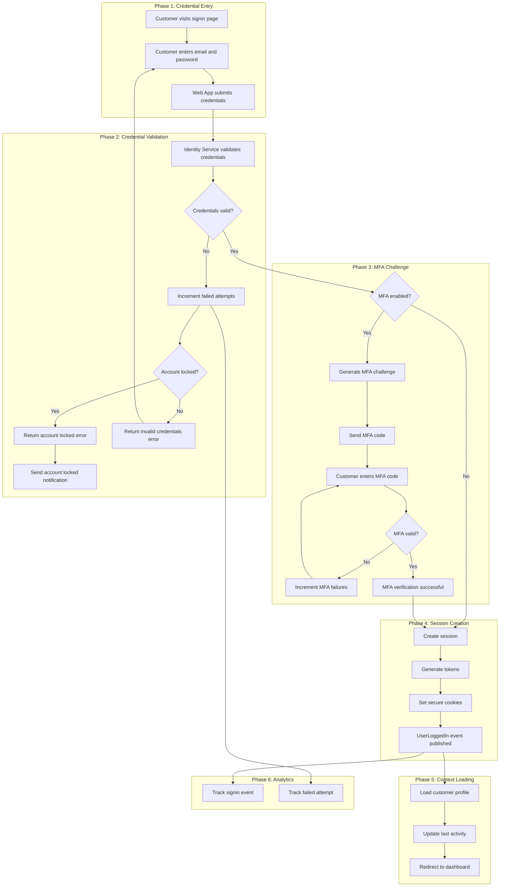

---

## Detailed Journey Steps

### Step 1: Customer Initiates Signin

**Actor:** Existing Customer
**System:** Web Application

The customer navigates to the signin page and is presented with a signin form.

#### UI Requirements

- Form fields: Email, Password
- Remember me checkbox
- Show/hide password toggle
- "Forgot password?" link
- "Create account" link for new customers
- Clear validation error messages
- Loading state indicator during submission

#### Sequence Diagram

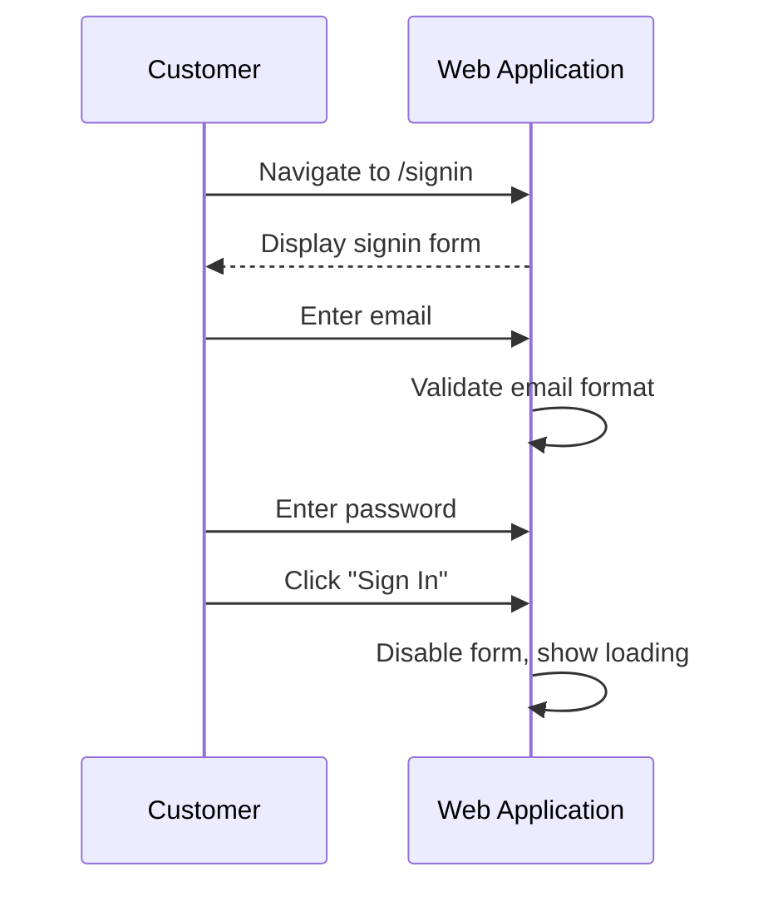

#### Acceptance Criteria

| ID | Criterion | Priority |
|----|-----------|----------|
| AC-1.1 | Email field validates email format before submission | Must Have |
| AC-1.2 | Password field is masked by default with show/hide toggle | Must Have |
| AC-1.3 | Form submission button is disabled during request processing | Must Have |
| AC-1.4 | "Remember me" checkbox is unchecked by default | Must Have |
| AC-1.5 | Form displays inline validation errors within 200ms of field blur | Should Have |
| AC-1.6 | Pressing Enter in password field submits the form | Should Have |
| AC-1.7 | Form is accessible via keyboard navigation | Must Have |
| AC-1.8 | Signin page loads within 1 second (p95) | Should Have |

---

### Step 2: Identity Service Validates Credentials

**Actor:** Web Application
**System:** Identity Management Service

The web application submits the signin request to the Identity Management Service for credential validation.

#### Sequence Diagram

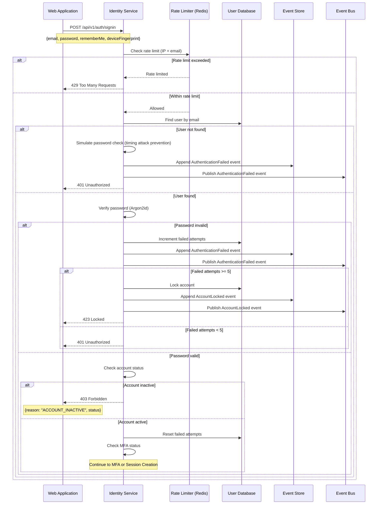

#### API Contract

**Request:**
```
POST /api/v1/auth/signin
Content-Type: application/json

{
  "email": "customer@example.com",
  "password": "SecureP@ss123",
  "rememberMe": false,
  "deviceFingerprint": "fp_abc123xyz789"
}
```

**Response (MFA Required):**
```
HTTP/1.1 200 OK
Content-Type: application/json

{
  "status": "MFA_REQUIRED",
  "mfaToken": "mfa_01941234-5678-7abc-def0-123456789abc",
  "mfaMethods": ["TOTP", "SMS"],
  "expiresIn": 300
}
```

**Response (Success - No MFA):**
```
HTTP/1.1 200 OK
Content-Type: application/json
Set-Cookie: access_token=<jwt>; HttpOnly; Secure; SameSite=Strict; Path=/; Max-Age=900
Set-Cookie: refresh_token=<jwt>; HttpOnly; Secure; SameSite=Strict; Path=/api/v1/auth/refresh; Max-Age=604800

{
  "status": "SUCCESS",
  "userId": "01941234-5678-7abc-def0-123456789abc",
  "expiresIn": 900
}
```

**Response (Invalid Credentials):**
```
HTTP/1.1 401 Unauthorized
Content-Type: application/json

{
  "error": "INVALID_CREDENTIALS",
  "message": "Invalid email or password",
  "remainingAttempts": 3
}
```

**Response (Account Locked):**
```
HTTP/1.1 423 Locked
Content-Type: application/json

{
  "error": "ACCOUNT_LOCKED",
  "message": "Account temporarily locked due to too many failed attempts",
  "lockedUntil": "2026-01-17T10:45:00Z",
  "supportUrl": "https://www.acme.com/support"
}
```

#### Acceptance Criteria

| ID | Criterion | Priority |
|----|-----------|----------|
| AC-2.1 | Rate limiting enforces max 10 signin attempts per minute per IP | Must Have |
| AC-2.2 | Rate limiting enforces max 5 signin attempts per minute per email | Must Have |
| AC-2.3 | Password is verified using Argon2id with memory cost 64MB, time cost 3, parallelism 4 | Must Have |
| AC-2.4 | Account is locked after 5 consecutive failed attempts | Must Have |
| AC-2.5 | Account lockout duration is 15 minutes | Must Have |
| AC-2.6 | Timing attack prevention: consistent response time for valid/invalid emails | Must Have |
| AC-2.7 | AuthenticationFailed event is published for all failed attempts | Must Have |
| AC-2.8 | Credential validation responds within 500ms (p95) | Should Have |
| AC-2.9 | Error messages do not reveal whether email exists | Must Have |
| AC-2.10 | Device fingerprint is captured and stored for fraud detection | Should Have |

---

### Step 3: MFA Challenge

**Actor:** Existing Customer
**System:** Identity Management Service

If MFA is enabled for the account, the customer must complete a second factor verification.

#### Sequence Diagram

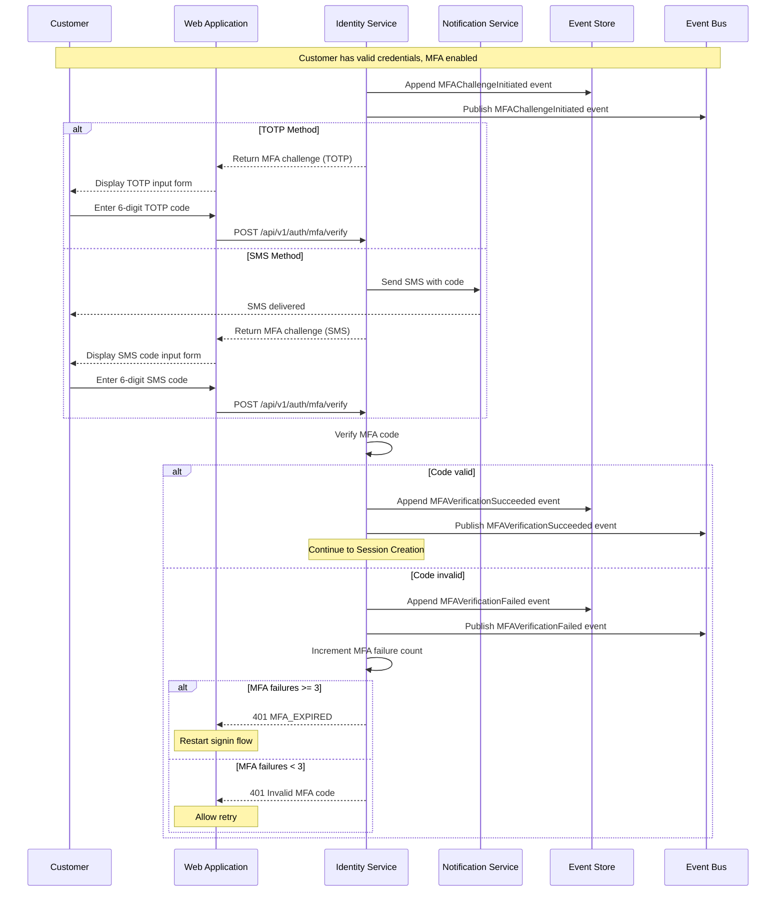

#### API Contract: Verify MFA

**Request:**
```
POST /api/v1/auth/mfa/verify
Content-Type: application/json

{
  "mfaToken": "mfa_01941234-5678-7abc-def0-123456789abc",
  "code": "123456",
  "method": "TOTP",
  "rememberDevice": true
}
```

**Response (Success):**
```
HTTP/1.1 200 OK
Content-Type: application/json
Set-Cookie: access_token=<jwt>; HttpOnly; Secure; SameSite=Strict; Path=/; Max-Age=900
Set-Cookie: refresh_token=<jwt>; HttpOnly; Secure; SameSite=Strict; Path=/api/v1/auth/refresh; Max-Age=604800
Set-Cookie: device_trust=<token>; HttpOnly; Secure; SameSite=Strict; Path=/; Max-Age=2592000

{
  "status": "SUCCESS",
  "userId": "01941234-5678-7abc-def0-123456789abc",
  "deviceTrusted": true,
  "expiresIn": 900
}
```

**Response (Invalid Code):**
```
HTTP/1.1 401 Unauthorized
Content-Type: application/json

{
  "error": "INVALID_MFA_CODE",
  "message": "Invalid verification code",
  "remainingAttempts": 2
}
```

#### Acceptance Criteria

| ID | Criterion | Priority |
|----|-----------|----------|
| AC-3.1 | TOTP codes are validated with 30-second time window and 1-step tolerance | Must Have |
| AC-3.2 | SMS codes are 6 digits and expire after 5 minutes | Must Have |
| AC-3.3 | SMS codes can only be used once | Must Have |
| AC-3.4 | MFA challenge expires after 5 minutes | Must Have |
| AC-3.5 | Maximum 3 MFA verification attempts per challenge | Must Have |
| AC-3.6 | MFA verification responds within 200ms (p95) | Should Have |
| AC-3.7 | "Remember this device" option bypasses MFA for 30 days | Should Have |
| AC-3.8 | Remembered devices are revocable from account settings | Should Have |
| AC-3.9 | SMS codes are rate limited to 3 per hour per account | Must Have |
| AC-3.10 | MFAChallengeInitiated event includes method type | Must Have |

---

### Step 4: Session and Token Creation

**Actor:** Identity Management Service
**System:** Token Generator

After successful authentication (with or without MFA), the Identity Service creates a session and generates tokens.

#### Sequence Diagram

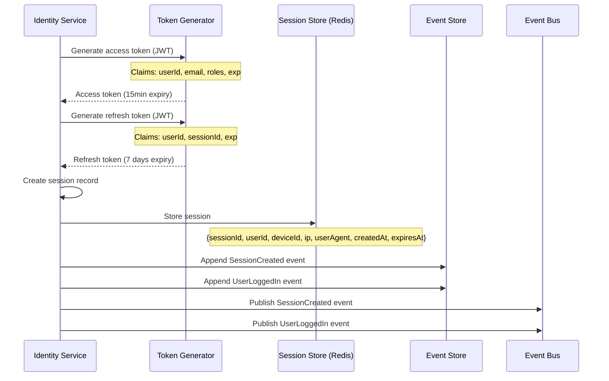

#### Token Structure

**Access Token (JWT):**
```json
{
  "header": {
    "alg": "RS256",
    "typ": "JWT",
    "kid": "key-2026-01"
  },
  "payload": {
    "sub": "01941234-5678-7abc-def0-123456789abc",
    "email": "customer@example.com",
    "roles": ["CUSTOMER"],
    "sessionId": "sess_01941234-5678-7abc-def0-123456789def",
    "iat": 1705487400,
    "exp": 1705488300,
    "iss": "https://auth.acme.com",
    "aud": "https://api.acme.com"
  }
}
```

**Refresh Token (JWT):**
```json
{
  "header": {
    "alg": "RS256",
    "typ": "JWT",
    "kid": "key-2026-01"
  },
  "payload": {
    "sub": "01941234-5678-7abc-def0-123456789abc",
    "sessionId": "sess_01941234-5678-7abc-def0-123456789def",
    "tokenFamily": "fam_01941234-5678-7abc-def0-123456789ghi",
    "iat": 1705487400,
    "exp": 1706092200,
    "iss": "https://auth.acme.com"
  }
}
```

#### Cookie Configuration

| Cookie | Value | Attributes |
|--------|-------|------------|
| `access_token` | JWT | `HttpOnly; Secure; SameSite=Strict; Path=/; Max-Age=900` |
| `refresh_token` | JWT | `HttpOnly; Secure; SameSite=Strict; Path=/api/v1/auth/refresh; Max-Age=604800` |
| `device_trust` | Token | `HttpOnly; Secure; SameSite=Strict; Path=/; Max-Age=2592000` |

#### Acceptance Criteria

| ID | Criterion | Priority |
|----|-----------|----------|
| AC-4.1 | Access tokens expire after 15 minutes | Must Have |
| AC-4.2 | Refresh tokens expire after 7 days | Must Have |
| AC-4.3 | Tokens are signed using RS256 with rotating keys | Must Have |
| AC-4.4 | Cookies are set with HttpOnly, Secure, and SameSite=Strict | Must Have |
| AC-4.5 | Session is stored in Redis with TTL matching refresh token expiry | Must Have |
| AC-4.6 | Token generation responds within 50ms (p95) | Should Have |
| AC-4.7 | SessionCreated event includes device information | Must Have |
| AC-4.8 | Concurrent sessions are tracked per user (max 5 devices) | Should Have |
| AC-4.9 | Refresh token rotation: new tokens issued on each refresh | Must Have |
| AC-4.10 | Refresh token reuse detection invalidates entire token family | Must Have |

---

### Step 5: Remember Device

**Actor:** Identity Management Service
**System:** Device Trust Store

When the customer opts to remember their device, a trust token is issued to bypass MFA on future signins.

#### Sequence Diagram

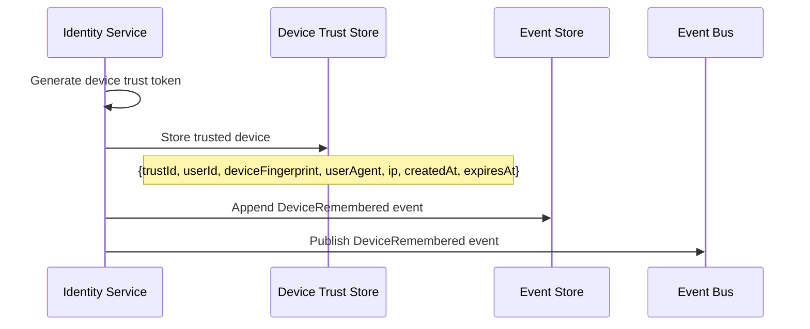

#### Domain Event: DeviceRemembered

```json
{
  "eventId": "01941234-5678-7abc-def0-123456789100",
  "eventType": "DeviceRemembered",
  "eventVersion": "1.0",
  "timestamp": "2026-01-17T10:30:05Z",
  "aggregateId": "01941234-5678-7abc-def0-123456789abc",
  "aggregateType": "User",
  "payload": {
    "userId": "01941234-5678-7abc-def0-123456789abc",
    "deviceTrustId": "dt_01941234-5678-7abc-def0-123456789xyz",
    "deviceFingerprint": "fp_abc123xyz789",
    "userAgent": "Mozilla/5.0...",
    "ipAddress": "192.168.1.100",
    "trustedUntil": "2026-02-16T10:30:05Z"
  }
}
```

#### Acceptance Criteria

| ID | Criterion | Priority |
|----|-----------|----------|
| AC-5.1 | Device trust tokens expire after 30 days | Must Have |
| AC-5.2 | Device trust is tied to device fingerprint | Must Have |
| AC-5.3 | Users can view and revoke trusted devices | Must Have |
| AC-5.4 | Maximum 10 trusted devices per user | Should Have |
| AC-5.5 | Device trust is revoked when password changes | Must Have |
| AC-5.6 | DeviceRemembered event is published for audit | Must Have |

---

### Step 6: Customer Context Loading

**Actor:** Customer Management Service
**System:** Profile Loader

After successful signin, the customer's profile and context are loaded.

#### Sequence Diagram

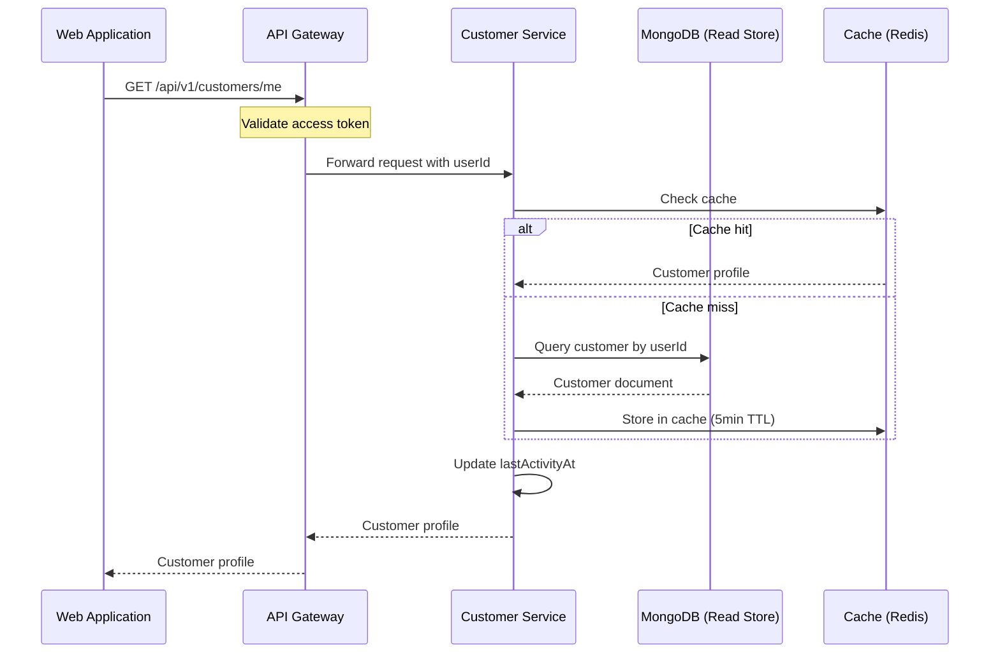

#### API Contract: Get Current Customer

**Request:**
```
GET /api/v1/customers/me
Authorization: Bearer <access_token>
```

**Response:**
```
HTTP/1.1 200 OK
Content-Type: application/json

{
  "customerId": "01941234-5678-7abc-def0-123456789020",
  "customerNumber": "ACME-202601-000142",
  "name": {
    "firstName": "Jane",
    "lastName": "Doe",
    "displayName": "Jane Doe"
  },
  "email": {
    "address": "customer@example.com",
    "verified": true
  },
  "status": "ACTIVE",
  "preferences": {
    "communication": {
      "email": true,
      "sms": false,
      "push": true
    },
    "display": {
      "language": "en-US",
      "currency": "USD",
      "timezone": "America/New_York"
    }
  },
  "profileCompleteness": 85,
  "lastActivityAt": "2026-01-17T10:30:00Z"
}
```

#### Acceptance Criteria

| ID | Criterion | Priority |
|----|-----------|----------|
| AC-6.1 | Customer profile is loaded within 500ms of signin completion | Must Have |
| AC-6.2 | Profile is cached in Redis with 5-minute TTL | Should Have |
| AC-6.3 | lastActivityAt is updated on each signin | Should Have |
| AC-6.4 | Customer context includes preferences for UI personalization | Must Have |
| AC-6.5 | Profile endpoint requires valid access token | Must Have |
| AC-6.6 | Token validation latency is sub-10ms (p99) | Should Have |

---

## Domain Events

### UserLoggedIn

```json
{
  "eventId": "01941234-5678-7abc-def0-123456789200",
  "eventType": "UserLoggedIn",
  "eventVersion": "1.0",
  "timestamp": "2026-01-17T10:30:01Z",
  "aggregateId": "01941234-5678-7abc-def0-123456789abc",
  "aggregateType": "User",
  "correlationId": "01941234-5678-7abc-def0-123456789300",
  "payload": {
    "userId": "01941234-5678-7abc-def0-123456789abc",
    "sessionId": "sess_01941234-5678-7abc-def0-123456789def",
    "ipAddress": "192.168.1.100",
    "userAgent": "Mozilla/5.0...",
    "deviceFingerprint": "fp_abc123xyz789",
    "mfaUsed": true,
    "mfaMethod": "TOTP",
    "loginSource": "WEB"
  }
}
```

### AuthenticationFailed

```json
{
  "eventId": "01941234-5678-7abc-def0-123456789201",
  "eventType": "AuthenticationFailed",
  "eventVersion": "1.0",
  "timestamp": "2026-01-17T10:29:55Z",
  "aggregateId": "01941234-5678-7abc-def0-123456789abc",
  "aggregateType": "User",
  "payload": {
    "email": "customer@example.com",
    "reason": "INVALID_PASSWORD",
    "ipAddress": "192.168.1.100",
    "userAgent": "Mozilla/5.0...",
    "failedAttemptCount": 2
  }
}
```

### MFAChallengeInitiated

```json
{
  "eventId": "01941234-5678-7abc-def0-123456789202",
  "eventType": "MFAChallengeInitiated",
  "eventVersion": "1.0",
  "timestamp": "2026-01-17T10:30:00Z",
  "aggregateId": "01941234-5678-7abc-def0-123456789abc",
  "aggregateType": "User",
  "payload": {
    "userId": "01941234-5678-7abc-def0-123456789abc",
    "mfaToken": "mfa_01941234-5678-7abc-def0-123456789abc",
    "method": "TOTP",
    "expiresAt": "2026-01-17T10:35:00Z"
  }
}
```

### MFAVerificationSucceeded

```json
{
  "eventId": "01941234-5678-7abc-def0-123456789203",
  "eventType": "MFAVerificationSucceeded",
  "eventVersion": "1.0",
  "timestamp": "2026-01-17T10:30:01Z",
  "aggregateId": "01941234-5678-7abc-def0-123456789abc",
  "aggregateType": "User",
  "payload": {
    "userId": "01941234-5678-7abc-def0-123456789abc",
    "method": "TOTP",
    "deviceRemembered": true
  }
}
```

### MFAVerificationFailed

```json
{
  "eventId": "01941234-5678-7abc-def0-123456789204",
  "eventType": "MFAVerificationFailed",
  "eventVersion": "1.0",
  "timestamp": "2026-01-17T10:30:01Z",
  "aggregateId": "01941234-5678-7abc-def0-123456789abc",
  "aggregateType": "User",
  "payload": {
    "userId": "01941234-5678-7abc-def0-123456789abc",
    "method": "TOTP",
    "reason": "INVALID_CODE",
    "attemptCount": 1
  }
}
```

### SessionCreated

```json
{
  "eventId": "01941234-5678-7abc-def0-123456789205",
  "eventType": "SessionCreated",
  "eventVersion": "1.0",
  "timestamp": "2026-01-17T10:30:01Z",
  "aggregateId": "sess_01941234-5678-7abc-def0-123456789def",
  "aggregateType": "Session",
  "payload": {
    "sessionId": "sess_01941234-5678-7abc-def0-123456789def",
    "userId": "01941234-5678-7abc-def0-123456789abc",
    "deviceId": "dev_01941234-5678-7abc-def0-123456789ghi",
    "ipAddress": "192.168.1.100",
    "userAgent": "Mozilla/5.0...",
    "expiresAt": "2026-01-24T10:30:01Z"
  }
}
```

### SessionInvalidated

```json
{
  "eventId": "01941234-5678-7abc-def0-123456789206",
  "eventType": "SessionInvalidated",
  "eventVersion": "1.0",
  "timestamp": "2026-01-17T11:30:00Z",
  "aggregateId": "sess_01941234-5678-7abc-def0-123456789def",
  "aggregateType": "Session",
  "payload": {
    "sessionId": "sess_01941234-5678-7abc-def0-123456789def",
    "userId": "01941234-5678-7abc-def0-123456789abc",
    "reason": "USER_LOGOUT",
    "invalidatedAt": "2026-01-17T11:30:00Z"
  }
}
```

### AccountLocked

```json
{
  "eventId": "01941234-5678-7abc-def0-123456789207",
  "eventType": "AccountLocked",
  "eventVersion": "1.0",
  "timestamp": "2026-01-17T10:29:59Z",
  "aggregateId": "01941234-5678-7abc-def0-123456789abc",
  "aggregateType": "User",
  "payload": {
    "userId": "01941234-5678-7abc-def0-123456789abc",
    "reason": "EXCESSIVE_FAILED_ATTEMPTS",
    "failedAttemptCount": 5,
    "lockedUntil": "2026-01-17T10:44:59Z",
    "ipAddress": "192.168.1.100"
  }
}
```

### AccountUnlocked

```json
{
  "eventId": "01941234-5678-7abc-def0-123456789208",
  "eventType": "AccountUnlocked",
  "eventVersion": "1.0",
  "timestamp": "2026-01-17T10:45:00Z",
  "aggregateId": "01941234-5678-7abc-def0-123456789abc",
  "aggregateType": "User",
  "payload": {
    "userId": "01941234-5678-7abc-def0-123456789abc",
    "reason": "LOCKOUT_EXPIRED",
    "unlockedAt": "2026-01-17T10:45:00Z"
  }
}
```

### PasswordResetRequested

```json
{
  "eventId": "01941234-5678-7abc-def0-123456789209",
  "eventType": "PasswordResetRequested",
  "eventVersion": "1.0",
  "timestamp": "2026-01-17T10:30:00Z",
  "aggregateId": "01941234-5678-7abc-def0-123456789abc",
  "aggregateType": "User",
  "payload": {
    "userId": "01941234-5678-7abc-def0-123456789abc",
    "email": "customer@example.com",
    "resetToken": "rst_01941234-5678-7abc-def0-123456789jkl",
    "expiresAt": "2026-01-17T11:30:00Z",
    "ipAddress": "192.168.1.100"
  }
}
```

---

## Error Scenarios

### E1: Invalid Credentials

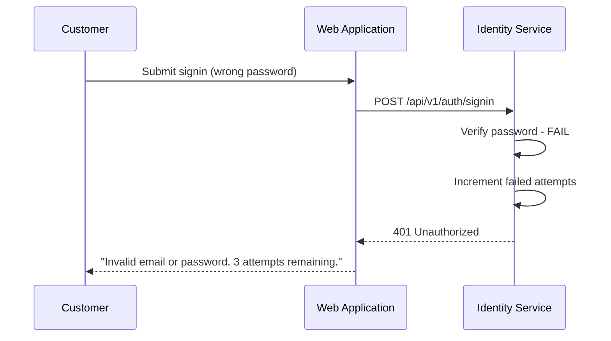

| ID | Criterion | Priority |
|----|-----------|----------|
| AC-E1.1 | Error message does not reveal whether email exists (timing attack prevention) | Must Have |
| AC-E1.2 | Remaining attempts are displayed to user | Should Have |
| AC-E1.3 | "Forgot password?" link is prominently displayed | Must Have |

### E2: Account Locked

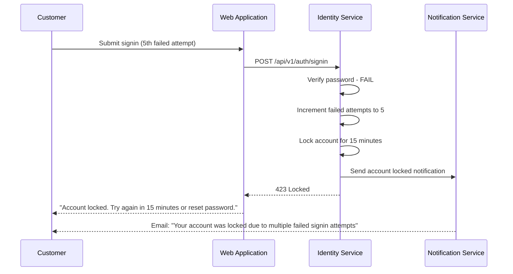

| ID | Criterion | Priority |
|----|-----------|----------|
| AC-E2.1 | Account locks after 5 consecutive failed attempts | Must Have |
| AC-E2.2 | Lockout duration is 15 minutes | Must Have |
| AC-E2.3 | Account locked notification is sent via email | Should Have |
| AC-E2.4 | Password reset bypasses lockout | Must Have |
| AC-E2.5 | Lockout time remaining is displayed to user | Should Have |

### E3: Inactive Account

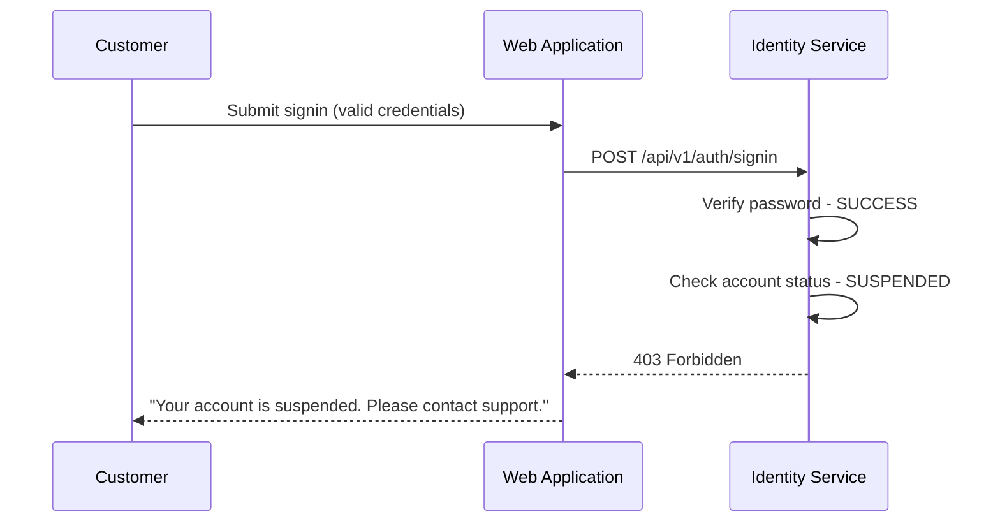

| ID | Criterion | Priority |
|----|-----------|----------|
| AC-E3.1 | PENDING_VERIFICATION status prompts email verification | Must Have |
| AC-E3.2 | SUSPENDED status directs to support | Must Have |
| AC-E3.3 | DEACTIVATED status offers reactivation option | Should Have |
| AC-E3.4 | Reason for inactive status is logged but not exposed to user | Must Have |

### E4: Expired Session

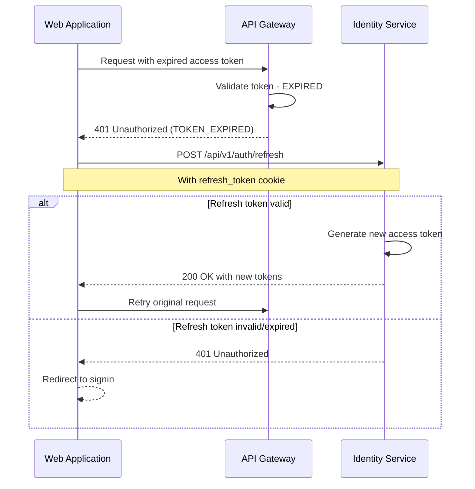

| ID | Criterion | Priority |
|----|-----------|----------|
| AC-E4.1 | Expired access tokens trigger automatic refresh | Must Have |
| AC-E4.2 | Refresh token rotation issues new refresh token | Must Have |
| AC-E4.3 | Expired refresh tokens redirect to signin | Must Have |
| AC-E4.4 | Original request is retried after successful refresh | Should Have |

### E5: Password Reset Flow

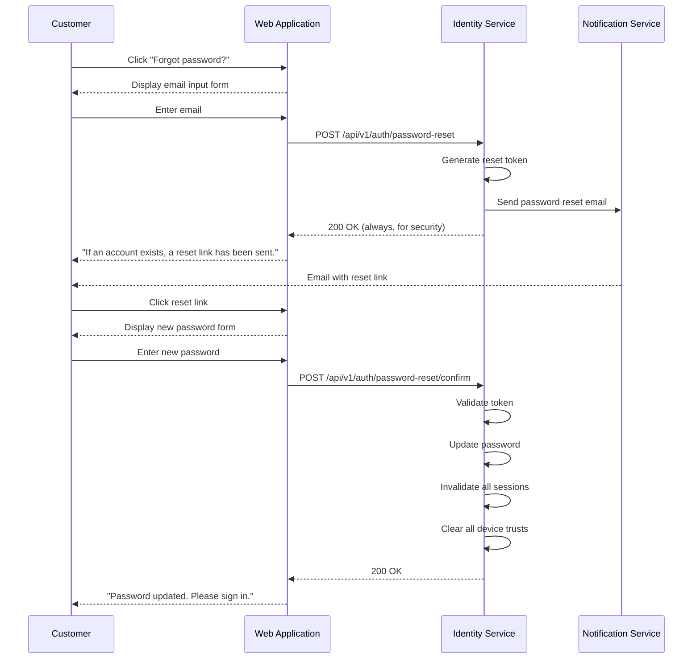

| ID | Criterion | Priority |
|----|-----------|----------|
| AC-E5.1 | Password reset tokens expire after 1 hour | Must Have |
| AC-E5.2 | Password reset tokens are single-use | Must Have |
| AC-E5.3 | Response does not reveal if email exists | Must Have |
| AC-E5.4 | All active sessions are invalidated on password change | Must Have |
| AC-E5.5 | All device trusts are revoked on password change | Must Have |
| AC-E5.6 | Password reset emails are rate limited (3 per hour) | Must Have |

---

## Analytics Events

The following events are tracked by the Analytics Service:

| Event | Trigger | Key Metrics |
|-------|---------|-------------|
| SigninPageViewed | User opens signin page | Page views, traffic sources |
| SigninAttempted | User submits signin form | Attempt count, device type |
| SigninSucceeded | Successful authentication | Success rate, time to signin |
| SigninFailed | Failed authentication | Failure rate, failure reasons |
| MFAChallengePresented | MFA screen displayed | MFA adoption rate |
| MFACompleted | MFA verification passed | MFA success rate |
| MFAFailed | MFA verification failed | MFA failure rate |
| AccountLocked | Account locked due to failures | Lockout frequency |
| PasswordResetInitiated | Password reset requested | Reset request volume |
| SessionExpired | User session expired | Session duration, timeout rate |

---

## Observability Requirements

### Distributed Tracing

All requests across this journey must propagate trace context:

```
traceparent: 00-{trace-id}-{span-id}-01
```

| Span | Service | Purpose |
|------|---------|---------|
| signin_request | Web App | Top-level request span |
| validate_credentials | Identity Service | Credential validation span |
| verify_mfa | Identity Service | MFA verification span |
| generate_tokens | Identity Service | Token generation span |
| create_session | Identity Service | Session creation span |
| load_profile | Customer Service | Profile loading span |

### Key Metrics

| Metric | Type | Labels |
|--------|------|--------|
| `signin_attempts_total` | Counter | status, source, mfa_used |
| `signin_duration_seconds` | Histogram | step, mfa_used |
| `authentication_failures_total` | Counter | reason, source |
| `mfa_verifications_total` | Counter | method, status |
| `active_sessions_total` | Gauge | - |
| `token_refresh_total` | Counter | status |
| `account_lockouts_total` | Counter | reason |

### Health Checks

Each service exposes:
- `GET /actuator/health/liveness` - Process is running
- `GET /actuator/health/readiness` - Dependencies available

### Alerting Thresholds

| Alert | Condition | Severity |
|-------|-----------|----------|
| High signin failure rate | >10% failures in 5 minutes | Warning |
| Elevated account lockouts | >50 lockouts in 15 minutes | Warning |
| Token generation latency | p99 > 100ms | Warning |
| Session store unavailable | Redis health check fails | Critical |

---

## Testing Strategy

### Unit Tests

- Input validation logic (email format, password requirements)
- Token generation and validation
- Rate limiting calculations
- MFA code verification (TOTP algorithm)
- Account lockout logic

### Integration Tests

- API endpoint contracts
- Redis session store operations
- Kafka event publishing
- Token refresh flow
- Rate limiter behavior

### End-to-End Tests (Cucumber/Playwright)

```gherkin
Feature: Customer Signin

  Scenario: Customer signs in with valid credentials
    Given I am a registered customer with email "customer@example.com"
    And my account is active
    When I navigate to the signin page
    And I enter my email and password
    And I click the "Sign In" button
    Then I should be redirected to the dashboard
    And I should see my name in the header

  Scenario: Customer signs in with MFA enabled
    Given I am a registered customer with MFA enabled
    And my account is active
    When I sign in with valid credentials
    Then I should see the MFA verification screen
    When I enter a valid TOTP code
    Then I should be redirected to the dashboard

  Scenario: Customer enters wrong password
    Given I am a registered customer
    When I sign in with an incorrect password
    Then I should see "Invalid email or password"
    And I should see "4 attempts remaining"

  Scenario: Customer account is locked after failed attempts
    Given I am a registered customer
    When I fail to sign in 5 times
    Then my account should be locked
    And I should see "Account locked. Try again in 15 minutes"
    And I should receive an account locked email

  Scenario: Customer resets password
    Given I am a registered customer
    When I click "Forgot password?"
    And I enter my email address
    Then I should see "If an account exists, a reset link has been sent"
    When I click the reset link in my email
    And I enter a new password
    Then my password should be updated
    And all my sessions should be invalidated

  Scenario: Customer session expires and refreshes
    Given I am signed in
    And my access token has expired
    When I make an API request
    Then my session should be automatically refreshed
    And the request should succeed
```

### Performance Tests

| Test | Target | Tool |
|------|--------|------|
| Signin throughput | 500 req/s | k6 |
| Credential validation latency | p95 < 500ms | k6 |
| MFA verification latency | p95 < 200ms | k6 |
| Token generation latency | p95 < 50ms | k6 |
| Token validation latency | p99 < 10ms | k6 |
| Session store operations | p99 < 5ms | k6 |

---

## Security Considerations

| Concern | Mitigation |
|---------|------------|
| Credential stuffing | Rate limiting per IP and email, CAPTCHA after failures |
| Brute force attacks | Account lockout after 5 failures, progressive delays |
| Timing attacks | Constant-time password comparison, consistent response times |
| Session hijacking | HttpOnly, Secure, SameSite=Strict cookies |
| Token theft | Short-lived access tokens (15min), refresh token rotation |
| XSS | HttpOnly cookies prevent JavaScript access to tokens |
| CSRF | SameSite=Strict cookies, CSRF tokens on forms |
| Replay attacks | Single-use MFA codes, nonce in tokens |
| Password storage | Argon2id with 64MB memory, 3 iterations, 4 parallelism |
| Man-in-the-middle | TLS 1.3 required, HSTS enabled |

---

## Implementation Phases

### Phase 1: Core Signin (MVP)
- Email/password authentication
- Basic session management
- JWT token generation
- Account lockout
- Rate limiting

### Phase 2: Enhanced Security
- MFA support (TOTP)
- Device remembering
- Refresh token rotation
- Suspicious activity detection

### Phase 3: Extended Features
- SMS MFA
- Biometric authentication support
- Single sign-on (SSO) integration
- Advanced fraud detection

---

## Related Documents

- [Architecture Overview](../ARCHITECTURE.md)
- [Implementation Guidelines](../IMPLEMENTATION.md)
- [Identity Management Epic](../epics/000-identity-management.md)
- [Customer Management Epic](../epics/004-customer-management.md)
- [Notifications Management Epic](../epics/006-notifications-management.md)
- [User Journey: Create Customer Profile](./0002-create-customer-profile.md)

---

## Appendix: Event Catalog

| Event | Producer | Consumers |
|-------|----------|-----------|
| UserLoggedIn | Identity Service | Customer Service, Analytics, Fraud Detection |
| AuthenticationFailed | Identity Service | Analytics, Fraud Detection, Security |
| MFAChallengeInitiated | Identity Service | Analytics |
| MFAVerificationSucceeded | Identity Service | Analytics |
| MFAVerificationFailed | Identity Service | Analytics, Security |
| SessionCreated | Identity Service | Analytics |
| SessionInvalidated | Identity Service | Analytics |
| DeviceRemembered | Identity Service | Analytics |
| AccountLocked | Identity Service | Notification Service, Analytics, Security |
| AccountUnlocked | Identity Service | Analytics |
| PasswordResetRequested | Identity Service | Notification Service, Analytics |
