# User Journey: Customer Shopping Experience

**Journey ID:** UJ-0003
**Version:** 1.0
**Status:** Draft
**Created:** 2026-01-17
**Last Updated:** 2026-01-17

## Overview

This user journey documents the complete flow for a customer browsing products, searching and filtering the catalog, viewing product details, and adding items to their shopping cart on the ACME e-commerce platform. The journey covers the core shopping experience from product discovery through cart management.

### Business Value

- **Revenue Generation**: Enable customers to find and purchase products efficiently, driving sales conversion
- **Conversion Optimization**: Reduce friction in the product discovery and cart addition process
- **Customer Experience**: Provide intuitive search, filtering, and browsing capabilities
- **Inventory Accuracy**: Ensure real-time availability information prevents customer disappointment
- **Personalization Foundation**: Capture shopping behavior data for personalized recommendations
- **Cart Recovery**: Persist cart state to support abandoned cart recovery campaigns

### Journey Scope

This journey covers:
1. Product search and autocomplete
2. Search result filtering by category, price, and attributes
3. Product detail viewing with variant selection
4. Adding items to shopping cart with inventory validation
5. Cart persistence for guest and authenticated customers

---

## Actors and Systems

### Primary Actor
- **Customer**: A visitor or registered customer browsing products on the ACME platform

### Participating Services

| Service | Bounded Context | Responsibility |
|---------|-----------------|----------------|
| **Web Application** | Frontend | Product browsing UI, search interface, cart management UI |
| **Product Catalog Service** | Product Catalog | Product data, search capabilities, filtering, category navigation |
| **Search Service** | Search | Full-text search, faceted filtering, relevance ranking, autocomplete |
| **Inventory Service** | Inventory | Real-time availability checks, stock level queries |
| **Pricing Service** | Pricing | Current prices, promotional pricing, tier pricing |
| **Shopping Cart Service** | Shopping Cart | Cart operations, guest/authenticated cart management, cart persistence |
| **Identity Service** | Identity | Session management, authentication state detection |
| **Analytics Service** | Analytics | Track search queries, product views, and cart events |

---

## Journey Flow

### High-Level Flow

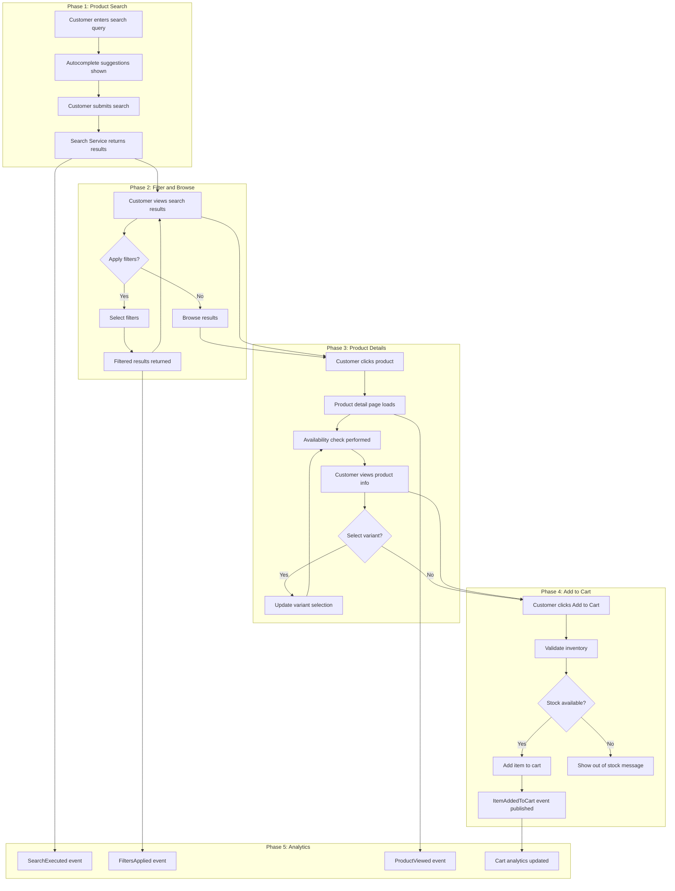

---

## Detailed Journey Steps

### Step 1: Customer Searches for Products

**Actor:** Customer
**System:** Web Application, Search Service

The customer enters a search query to find products they are interested in purchasing.

#### Sequence Diagram

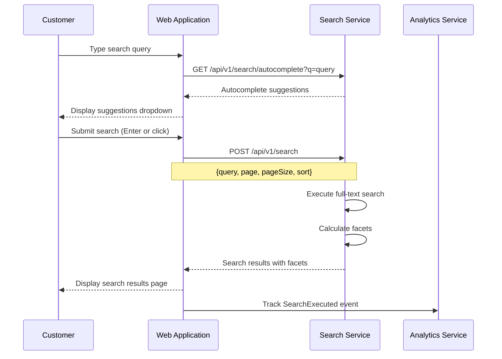

#### UI Requirements

- Search input field with placeholder text
- Real-time autocomplete suggestions (debounced, 150ms delay)
- Search suggestions include product names, categories, and recent searches
- Clear search button
- Search history for authenticated users
- Loading indicator during search
- Result count displayed prominently

#### API Contract: Autocomplete

**Request:**
```
GET /api/v1/search/autocomplete?q=wire&limit=8
Accept: application/json
```

**Response:**
```json
{
  "query": "wire",
  "suggestions": [
    {
      "type": "product",
      "text": "Wireless Mouse",
      "productId": "01941234-5678-7abc-def0-123456789001",
      "imageUrl": "https://cdn.acme.com/products/wireless-mouse-thumb.jpg"
    },
    {
      "type": "product",
      "text": "Wireless Keyboard",
      "productId": "01941234-5678-7abc-def0-123456789002",
      "imageUrl": "https://cdn.acme.com/products/wireless-keyboard-thumb.jpg"
    },
    {
      "type": "category",
      "text": "Wireless Accessories",
      "categorySlug": "wireless-accessories"
    },
    {
      "type": "query",
      "text": "wireless headphones"
    }
  ]
}
```

#### API Contract: Search

**Request:**
```
POST /api/v1/search
Content-Type: application/json

{
  "query": "wireless mouse",
  "page": 1,
  "pageSize": 24,
  "sort": "relevance",
  "filters": {}
}
```

**Response:**
```json
{
  "query": "wireless mouse",
  "totalResults": 47,
  "page": 1,
  "pageSize": 24,
  "totalPages": 2,
  "results": [
    {
      "productId": "01941234-5678-7abc-def0-123456789001",
      "name": "ACME Pro Wireless Mouse",
      "slug": "acme-pro-wireless-mouse",
      "description": "Ergonomic wireless mouse with precision tracking",
      "price": {
        "amount": 49.99,
        "currency": "USD",
        "originalAmount": 59.99,
        "discountPercentage": 17
      },
      "primaryImage": "https://cdn.acme.com/products/wireless-mouse.jpg",
      "rating": {
        "average": 4.5,
        "count": 128
      },
      "availability": "IN_STOCK",
      "badges": ["Sale", "Best Seller"]
    }
  ],
  "facets": {
    "category": [
      {"value": "Computer Accessories", "count": 32, "slug": "computer-accessories"},
      {"value": "Gaming", "count": 15, "slug": "gaming"}
    ],
    "brand": [
      {"value": "ACME", "count": 25},
      {"value": "TechPro", "count": 12},
      {"value": "ErgoMax", "count": 10}
    ],
    "price": {
      "min": 19.99,
      "max": 149.99,
      "ranges": [
        {"label": "Under $25", "min": 0, "max": 25, "count": 8},
        {"label": "$25 - $50", "min": 25, "max": 50, "count": 22},
        {"label": "$50 - $100", "min": 50, "max": 100, "count": 12},
        {"label": "Over $100", "min": 100, "max": null, "count": 5}
      ]
    },
    "color": [
      {"value": "Black", "count": 28},
      {"value": "White", "count": 15},
      {"value": "Gray", "count": 4}
    ],
    "connectivity": [
      {"value": "Bluetooth", "count": 30},
      {"value": "USB Receiver", "count": 35},
      {"value": "Both", "count": 18}
    ]
  },
  "spellingSuggestion": null,
  "executionTimeMs": 45
}
```

#### Domain Event: SearchExecuted

```json
{
  "eventId": "01941234-5678-7abc-def0-123456789100",
  "eventType": "SearchExecuted",
  "eventVersion": "1.0",
  "timestamp": "2026-01-17T14:30:00Z",
  "correlationId": "01941234-5678-7abc-def0-123456789101",
  "payload": {
    "sessionId": "sess_01941234-5678-7abc-def0-123456789102",
    "customerId": null,
    "query": "wireless mouse",
    "totalResults": 47,
    "page": 1,
    "executionTimeMs": 45,
    "filters": {},
    "source": "SEARCH_BAR"
  }
}
```

#### Acceptance Criteria

| ID | Criterion | Priority |
|----|-----------|----------|
| AC-1.1 | Search results return within 200ms (p95) | Must Have |
| AC-1.2 | Autocomplete suggestions appear within 150ms of typing pause | Must Have |
| AC-1.3 | Facet counts are accurate and reflect available filters | Must Have |
| AC-1.4 | Search handles common misspellings and offers suggestions | Should Have |
| AC-1.5 | Empty search results display helpful alternatives | Must Have |
| AC-1.6 | Search respects product visibility rules (unpublished products hidden) | Must Have |
| AC-1.7 | Search query is URL-encoded and bookmarkable | Should Have |
| AC-1.8 | Recent searches are stored for authenticated users | Should Have |

---

### Step 2: Customer Filters Search Results

**Actor:** Customer
**System:** Web Application, Search Service

The customer refines search results using faceted filters to narrow down products.

#### Sequence Diagram

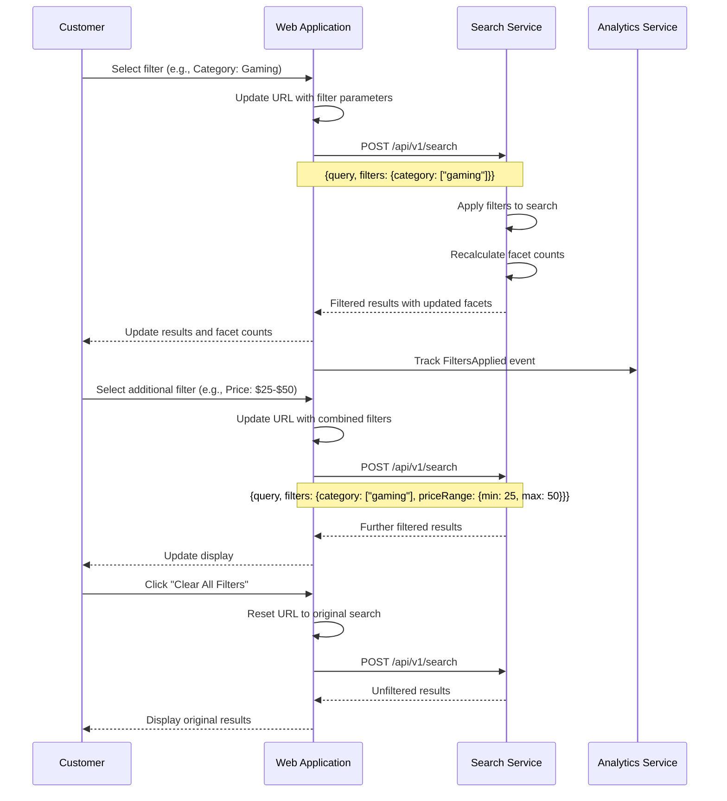

#### UI Requirements

- Filter panel with collapsible sections
- Checkbox filters for multi-select options (category, brand, color)
- Price range slider or predefined ranges
- Active filter badges with remove option
- "Clear All Filters" button when filters are active
- Filter counts showing number of matching products
- Mobile-friendly filter drawer
- URL updates reflect applied filters for bookmarking/sharing

#### API Contract: Search with Filters

**Request:**
```
POST /api/v1/search
Content-Type: application/json

{
  "query": "wireless mouse",
  "page": 1,
  "pageSize": 24,
  "sort": "price_asc",
  "filters": {
    "category": ["gaming"],
    "brand": ["ACME", "TechPro"],
    "priceRange": {
      "min": 25,
      "max": 75
    },
    "color": ["Black"],
    "availability": ["IN_STOCK"]
  }
}
```

**Response:**
```json
{
  "query": "wireless mouse",
  "totalResults": 8,
  "page": 1,
  "pageSize": 24,
  "totalPages": 1,
  "appliedFilters": {
    "category": ["gaming"],
    "brand": ["ACME", "TechPro"],
    "priceRange": {"min": 25, "max": 75},
    "color": ["Black"],
    "availability": ["IN_STOCK"]
  },
  "results": [
    {
      "productId": "01941234-5678-7abc-def0-123456789003",
      "name": "ACME Gaming Mouse Pro",
      "slug": "acme-gaming-mouse-pro",
      "price": {
        "amount": 69.99,
        "currency": "USD"
      },
      "primaryImage": "https://cdn.acme.com/products/gaming-mouse-pro.jpg",
      "rating": {"average": 4.8, "count": 256},
      "availability": "IN_STOCK"
    }
  ],
  "facets": {
    "category": [
      {"value": "Gaming", "count": 8, "slug": "gaming", "selected": true}
    ],
    "brand": [
      {"value": "ACME", "count": 5, "selected": true},
      {"value": "TechPro", "count": 3, "selected": true}
    ],
    "price": {
      "min": 29.99,
      "max": 74.99,
      "selectedMin": 25,
      "selectedMax": 75
    },
    "color": [
      {"value": "Black", "count": 8, "selected": true}
    ]
  }
}
```

#### Domain Event: FiltersApplied

```json
{
  "eventId": "01941234-5678-7abc-def0-123456789110",
  "eventType": "FiltersApplied",
  "eventVersion": "1.0",
  "timestamp": "2026-01-17T14:31:00Z",
  "correlationId": "01941234-5678-7abc-def0-123456789101",
  "payload": {
    "sessionId": "sess_01941234-5678-7abc-def0-123456789102",
    "customerId": null,
    "query": "wireless mouse",
    "filters": {
      "category": ["gaming"],
      "brand": ["ACME", "TechPro"],
      "priceRange": {"min": 25, "max": 75},
      "color": ["Black"]
    },
    "resultCount": 8
  }
}
```

#### Acceptance Criteria

| ID | Criterion | Priority |
|----|-----------|----------|
| AC-2.1 | Filter application returns results within 300ms (p95) | Must Have |
| AC-2.2 | URL parameters preserve filter state for bookmarking | Must Have |
| AC-2.3 | Individual filters can be cleared without affecting others | Must Have |
| AC-2.4 | "Clear All Filters" resets to original search results | Must Have |
| AC-2.5 | Facet counts update to reflect current filter context | Must Have |
| AC-2.6 | Category filters support hierarchical selection | Should Have |
| AC-2.7 | Price range filter supports both slider and manual input | Should Have |
| AC-2.8 | Filters with zero results are disabled or hidden | Should Have |

---

### Step 3: Customer Views Product Details

**Actor:** Customer
**System:** Web Application, Product Catalog Service, Inventory Service, Pricing Service

The customer navigates to a product detail page to view complete information.

#### Sequence Diagram

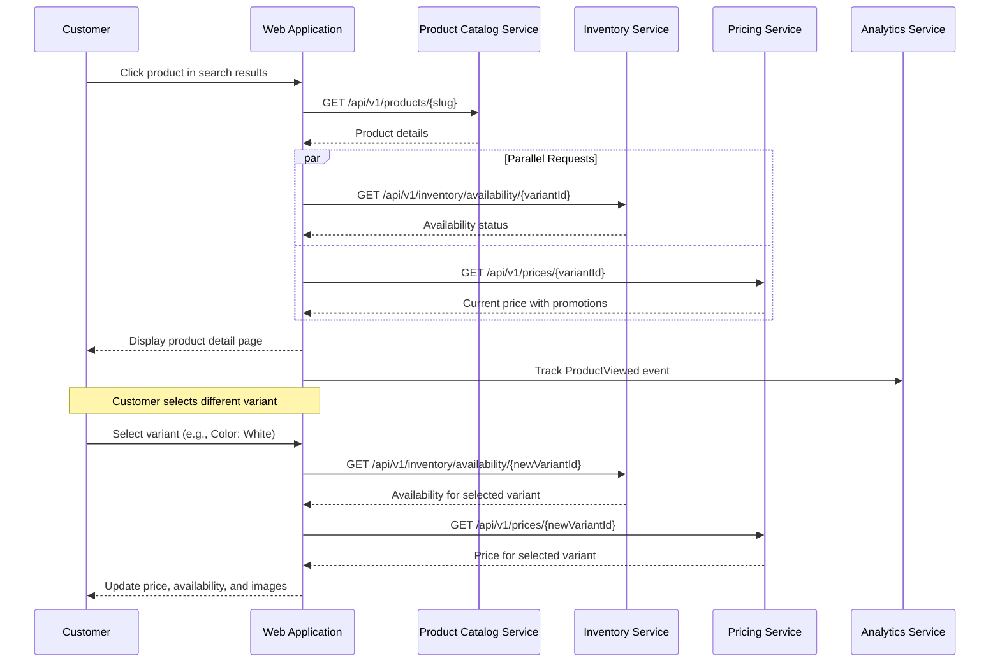

#### UI Requirements

- Product image gallery with zoom capability
- Product name, description, and specifications
- Price display with sale price highlighting
- Variant selectors (size, color, etc.)
- Real-time availability indicator
- Low stock warning when applicable
- Quantity selector with validation
- Add to Cart button (disabled when unavailable)
- Breadcrumb navigation
- Related products section
- Customer reviews summary

#### API Contract: Get Product Details

**Request:**
```
GET /api/v1/products/acme-gaming-mouse-pro
Accept: application/json
```

**Response:**
```json
{
  "productId": "01941234-5678-7abc-def0-123456789003",
  "name": "ACME Gaming Mouse Pro",
  "slug": "acme-gaming-mouse-pro",
  "sku": "ACME-GM-PRO",
  "description": "Professional-grade gaming mouse with 16,000 DPI sensor and customizable RGB lighting.",
  "shortDescription": "Pro gaming mouse with precision tracking",
  "brand": "ACME",
  "category": {
    "id": "01941234-5678-7abc-def0-123456789200",
    "name": "Gaming",
    "slug": "gaming",
    "breadcrumbs": [
      {"name": "Electronics", "slug": "electronics"},
      {"name": "Computer Accessories", "slug": "computer-accessories"},
      {"name": "Gaming", "slug": "gaming"}
    ]
  },
  "images": [
    {
      "id": "img-001",
      "url": "https://cdn.acme.com/products/gaming-mouse-pro-1.jpg",
      "altText": "ACME Gaming Mouse Pro - Front View",
      "isPrimary": true
    },
    {
      "id": "img-002",
      "url": "https://cdn.acme.com/products/gaming-mouse-pro-2.jpg",
      "altText": "ACME Gaming Mouse Pro - Side View",
      "isPrimary": false
    }
  ],
  "variants": [
    {
      "variantId": "01941234-5678-7abc-def0-123456789301",
      "sku": "ACME-GM-PRO-BLK",
      "name": "Black",
      "options": {
        "color": "Black"
      },
      "images": ["img-001", "img-002"],
      "isDefault": true
    },
    {
      "variantId": "01941234-5678-7abc-def0-123456789302",
      "sku": "ACME-GM-PRO-WHT",
      "name": "White",
      "options": {
        "color": "White"
      },
      "images": ["img-003", "img-004"],
      "isDefault": false
    }
  ],
  "attributes": [
    {"name": "DPI", "value": "16,000"},
    {"name": "Buttons", "value": "8 Programmable"},
    {"name": "Connectivity", "value": "USB Receiver / Bluetooth"},
    {"name": "Battery Life", "value": "70 hours"},
    {"name": "Weight", "value": "95g"}
  ],
  "rating": {
    "average": 4.8,
    "count": 256,
    "distribution": {
      "5": 180,
      "4": 52,
      "3": 15,
      "2": 6,
      "1": 3
    }
  },
  "relatedProducts": [
    {
      "productId": "01941234-5678-7abc-def0-123456789400",
      "name": "ACME Gaming Mousepad XL",
      "slug": "acme-gaming-mousepad-xl",
      "price": {"amount": 29.99, "currency": "USD"},
      "primaryImage": "https://cdn.acme.com/products/mousepad-xl.jpg"
    }
  ],
  "status": "ACTIVE",
  "createdAt": "2025-06-15T10:00:00Z",
  "updatedAt": "2026-01-10T14:30:00Z"
}
```

#### API Contract: Check Availability

**Request:**
```
GET /api/v1/inventory/availability/01941234-5678-7abc-def0-123456789301
Accept: application/json
```

**Response:**
```json
{
  "variantId": "01941234-5678-7abc-def0-123456789301",
  "sku": "ACME-GM-PRO-BLK",
  "status": "IN_STOCK",
  "quantityAvailable": 45,
  "lowStockThreshold": 10,
  "isLowStock": false,
  "maxOrderQuantity": 5,
  "leadTimeDays": null,
  "locations": [
    {
      "locationId": "loc-warehouse-01",
      "name": "East Coast Warehouse",
      "available": 30
    },
    {
      "locationId": "loc-warehouse-02",
      "name": "West Coast Warehouse",
      "available": 15
    }
  ],
  "checkedAt": "2026-01-17T14:32:00Z"
}
```

#### API Contract: Get Price

**Request:**
```
GET /api/v1/prices/01941234-5678-7abc-def0-123456789301
Accept: application/json
```

**Response:**
```json
{
  "variantId": "01941234-5678-7abc-def0-123456789301",
  "sku": "ACME-GM-PRO-BLK",
  "price": {
    "amount": 69.99,
    "currency": "USD"
  },
  "originalPrice": {
    "amount": 89.99,
    "currency": "USD"
  },
  "discount": {
    "percentage": 22,
    "amount": 20.00,
    "promotionId": "promo-winter-sale-2026",
    "promotionName": "Winter Sale",
    "endsAt": "2026-01-31T23:59:59Z"
  },
  "tierPricing": [
    {"minQuantity": 1, "maxQuantity": 2, "price": 69.99},
    {"minQuantity": 3, "maxQuantity": 5, "price": 64.99}
  ],
  "validUntil": "2026-01-17T15:32:00Z"
}
```

#### Domain Event: ProductViewed

```json
{
  "eventId": "01941234-5678-7abc-def0-123456789120",
  "eventType": "ProductViewed",
  "eventVersion": "1.0",
  "timestamp": "2026-01-17T14:32:00Z",
  "correlationId": "01941234-5678-7abc-def0-123456789101",
  "payload": {
    "sessionId": "sess_01941234-5678-7abc-def0-123456789102",
    "customerId": null,
    "productId": "01941234-5678-7abc-def0-123456789003",
    "variantId": "01941234-5678-7abc-def0-123456789301",
    "source": "SEARCH_RESULTS",
    "searchQuery": "wireless mouse",
    "position": 3
  }
}
```

#### Acceptance Criteria

| ID | Criterion | Priority |
|----|-----------|----------|
| AC-3.1 | Product detail page loads within 500ms (p95) | Must Have |
| AC-3.2 | Variant selection updates price and availability in real-time | Must Have |
| AC-3.3 | Availability check completes within 100ms (p99) | Must Have |
| AC-3.4 | Low stock warning displays when quantity below threshold | Should Have |
| AC-3.5 | Out of stock variants are visually indicated but selectable | Must Have |
| AC-3.6 | Image gallery supports zoom and multiple images | Should Have |
| AC-3.7 | Breadcrumb navigation reflects product category hierarchy | Must Have |
| AC-3.8 | Related products section displays relevant alternatives | Should Have |

---

### Step 4: Customer Adds Item to Cart

**Actor:** Customer
**System:** Web Application, Shopping Cart Service, Inventory Service

The customer adds a product to their shopping cart after validating availability.

#### Sequence Diagram

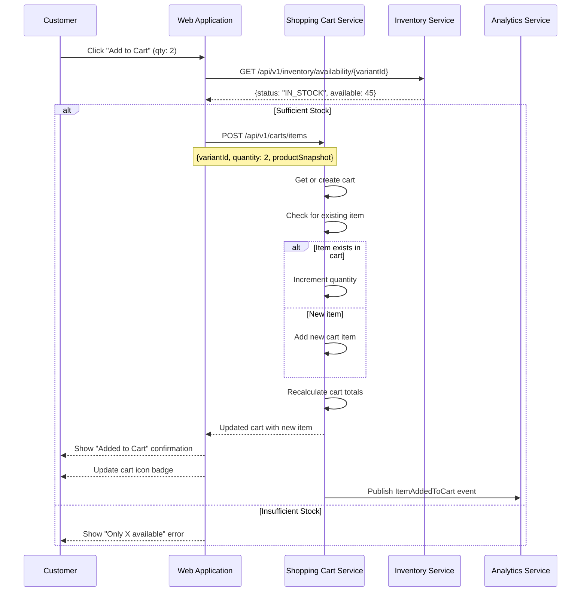

#### Sequence Diagram: Guest vs Authenticated Cart

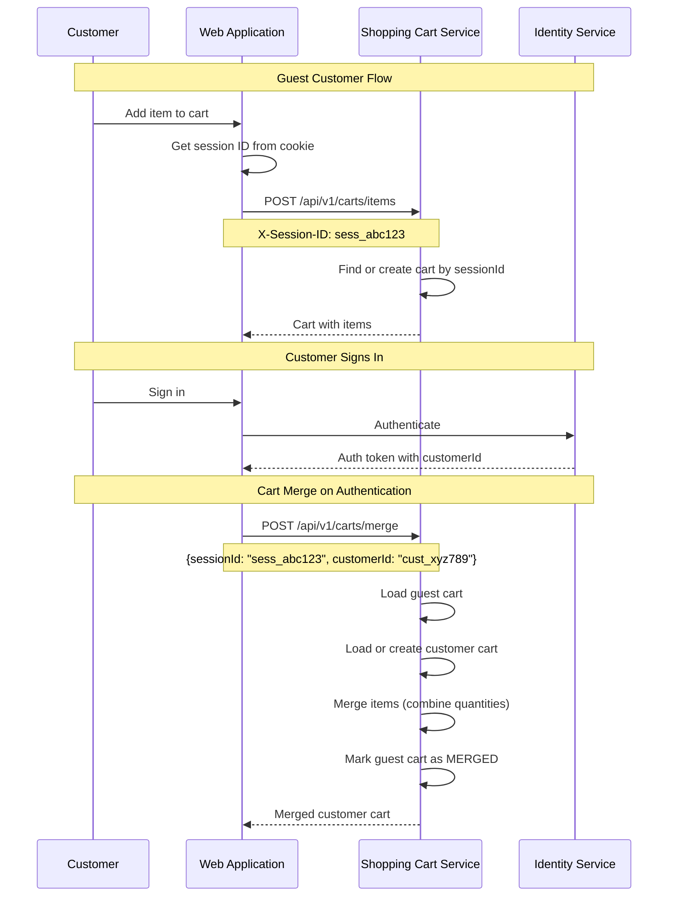

#### UI Requirements

- Quantity selector (1-5, respecting max order quantity)
- Add to Cart button with loading state
- Success confirmation (mini-cart preview or toast)
- Cart icon badge showing item count
- Quick "View Cart" link after adding
- Error message for insufficient stock
- Clear indication of which variant is being added

#### API Contract: Add Item to Cart

**Request:**
```
POST /api/v1/carts/items
Content-Type: application/json
X-Session-ID: sess_01941234-5678-7abc-def0-123456789102
Authorization: Bearer <jwt> (optional for authenticated users)

{
  "variantId": "01941234-5678-7abc-def0-123456789301",
  "quantity": 2,
  "productSnapshot": {
    "productId": "01941234-5678-7abc-def0-123456789003",
    "name": "ACME Gaming Mouse Pro",
    "sku": "ACME-GM-PRO-BLK",
    "variantName": "Black",
    "imageUrl": "https://cdn.acme.com/products/gaming-mouse-pro-1.jpg",
    "attributes": {
      "color": "Black"
    }
  }
}
```

**Response (Success):**
```json
{
  "cartId": "01941234-5678-7abc-def0-123456789500",
  "status": "ACTIVE",
  "items": [
    {
      "cartItemId": "01941234-5678-7abc-def0-123456789501",
      "variantId": "01941234-5678-7abc-def0-123456789301",
      "productSnapshot": {
        "productId": "01941234-5678-7abc-def0-123456789003",
        "name": "ACME Gaming Mouse Pro",
        "sku": "ACME-GM-PRO-BLK",
        "variantName": "Black",
        "imageUrl": "https://cdn.acme.com/products/gaming-mouse-pro-1.jpg"
      },
      "quantity": 2,
      "unitPrice": {
        "amount": 69.99,
        "currency": "USD"
      },
      "lineTotal": {
        "amount": 139.98,
        "currency": "USD"
      },
      "addedAt": "2026-01-17T14:33:00Z"
    }
  ],
  "summary": {
    "itemCount": 2,
    "subtotal": {
      "amount": 139.98,
      "currency": "USD"
    },
    "discountTotal": {
      "amount": 0,
      "currency": "USD"
    },
    "estimatedTotal": {
      "amount": 139.98,
      "currency": "USD"
    }
  },
  "updatedAt": "2026-01-17T14:33:00Z"
}
```

**Response (Insufficient Stock):**
```json
{
  "error": "INSUFFICIENT_STOCK",
  "message": "Only 3 items available",
  "availableQuantity": 3,
  "requestedQuantity": 5
}
```

#### API Contract: Update Cart Item Quantity

**Request:**
```
PATCH /api/v1/carts/{cartId}/items/{cartItemId}
Content-Type: application/json
Authorization: Bearer <jwt>

{
  "quantity": 3
}
```

**Response:**
```json
{
  "cartId": "01941234-5678-7abc-def0-123456789500",
  "items": [
    {
      "cartItemId": "01941234-5678-7abc-def0-123456789501",
      "variantId": "01941234-5678-7abc-def0-123456789301",
      "quantity": 3,
      "unitPrice": {"amount": 64.99, "currency": "USD"},
      "lineTotal": {"amount": 194.97, "currency": "USD"}
    }
  ],
  "summary": {
    "itemCount": 3,
    "subtotal": {"amount": 194.97, "currency": "USD"},
    "estimatedTotal": {"amount": 194.97, "currency": "USD"}
  },
  "updatedAt": "2026-01-17T14:35:00Z"
}
```

#### API Contract: Merge Carts

**Request:**
```
POST /api/v1/carts/merge
Content-Type: application/json
Authorization: Bearer <jwt>

{
  "guestSessionId": "sess_01941234-5678-7abc-def0-123456789102"
}
```

**Response:**
```json
{
  "cartId": "01941234-5678-7abc-def0-123456789600",
  "status": "ACTIVE",
  "mergeResult": {
    "itemsMerged": 2,
    "quantitiesAdjusted": [
      {
        "variantId": "01941234-5678-7abc-def0-123456789301",
        "requestedTotal": 7,
        "adjustedTo": 5,
        "reason": "MAX_ORDER_QUANTITY"
      }
    ]
  },
  "items": [...],
  "summary": {...}
}
```

#### Domain Event: CartCreated

```json
{
  "eventId": "01941234-5678-7abc-def0-123456789130",
  "eventType": "CartCreated",
  "eventVersion": "1.0",
  "timestamp": "2026-01-17T14:33:00Z",
  "aggregateId": "01941234-5678-7abc-def0-123456789500",
  "aggregateType": "Cart",
  "payload": {
    "cartId": "01941234-5678-7abc-def0-123456789500",
    "sessionId": "sess_01941234-5678-7abc-def0-123456789102",
    "customerId": null,
    "createdAt": "2026-01-17T14:33:00Z"
  }
}
```

#### Domain Event: ItemAddedToCart

```json
{
  "eventId": "01941234-5678-7abc-def0-123456789131",
  "eventType": "ItemAddedToCart",
  "eventVersion": "1.0",
  "timestamp": "2026-01-17T14:33:00Z",
  "aggregateId": "01941234-5678-7abc-def0-123456789500",
  "aggregateType": "Cart",
  "correlationId": "01941234-5678-7abc-def0-123456789101",
  "payload": {
    "cartId": "01941234-5678-7abc-def0-123456789500",
    "cartItemId": "01941234-5678-7abc-def0-123456789501",
    "productId": "01941234-5678-7abc-def0-123456789003",
    "variantId": "01941234-5678-7abc-def0-123456789301",
    "sku": "ACME-GM-PRO-BLK",
    "productName": "ACME Gaming Mouse Pro",
    "quantity": 2,
    "unitPrice": {
      "amount": 69.99,
      "currency": "USD"
    },
    "sessionId": "sess_01941234-5678-7abc-def0-123456789102",
    "customerId": null
  }
}
```

#### Domain Event: CartItemQuantityUpdated

```json
{
  "eventId": "01941234-5678-7abc-def0-123456789132",
  "eventType": "CartItemQuantityUpdated",
  "eventVersion": "1.0",
  "timestamp": "2026-01-17T14:35:00Z",
  "aggregateId": "01941234-5678-7abc-def0-123456789500",
  "aggregateType": "Cart",
  "payload": {
    "cartId": "01941234-5678-7abc-def0-123456789500",
    "cartItemId": "01941234-5678-7abc-def0-123456789501",
    "variantId": "01941234-5678-7abc-def0-123456789301",
    "previousQuantity": 2,
    "newQuantity": 3,
    "reason": "CUSTOMER_UPDATE"
  }
}
```

#### Domain Event: CartMerged

```json
{
  "eventId": "01941234-5678-7abc-def0-123456789133",
  "eventType": "CartMerged",
  "eventVersion": "1.0",
  "timestamp": "2026-01-17T14:40:00Z",
  "aggregateId": "01941234-5678-7abc-def0-123456789600",
  "aggregateType": "Cart",
  "payload": {
    "targetCartId": "01941234-5678-7abc-def0-123456789600",
    "sourceCartId": "01941234-5678-7abc-def0-123456789500",
    "customerId": "01941234-5678-7abc-def0-123456789700",
    "itemsMerged": 2,
    "quantitiesAdjusted": 1
  }
}
```

#### Acceptance Criteria

| ID | Criterion | Priority |
|----|-----------|----------|
| AC-4.1 | Add to cart operation completes within 200ms (p95) | Must Have |
| AC-4.2 | Inventory is validated before adding item to cart | Must Have |
| AC-4.3 | Product snapshot is captured at time of add | Must Have |
| AC-4.4 | Adding duplicate item increments quantity instead of creating new line | Must Have |
| AC-4.5 | Maximum order quantity (5 per item) is enforced | Must Have |
| AC-4.6 | Guest carts are persisted via session ID in cookie | Must Have |
| AC-4.7 | Authenticated customer carts are associated with customer ID | Must Have |
| AC-4.8 | Guest cart merges with customer cart upon authentication | Must Have |
| AC-4.9 | Cart badge updates immediately after add operation | Should Have |
| AC-4.10 | Tier pricing applies when quantity thresholds are met | Should Have |

---

## Error Scenarios

### E1: Search Service Unavailable

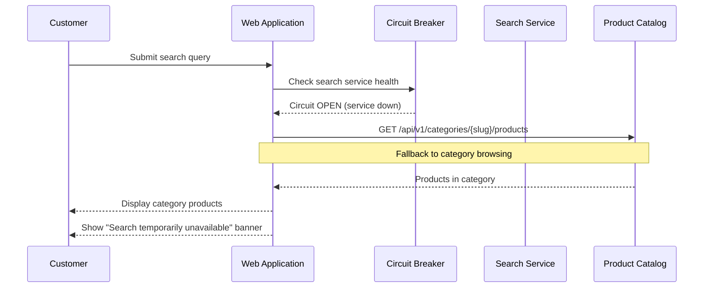

| ID | Criterion | Priority |
|----|-----------|----------|
| AC-E1.1 | Circuit breaker opens after 5 consecutive failures | Must Have |
| AC-E1.2 | Fallback to category browsing is available | Must Have |
| AC-E1.3 | Clear message indicates search is temporarily unavailable | Must Have |
| AC-E1.4 | Circuit breaker attempts reset after 30 seconds | Should Have |

### E2: Product Out of Stock During Add to Cart

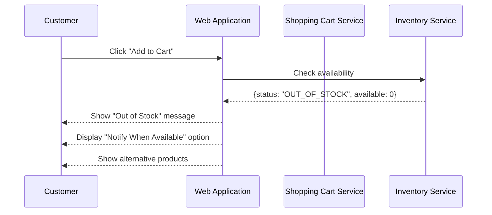

| ID | Criterion | Priority |
|----|-----------|----------|
| AC-E2.1 | Clear out of stock message is displayed | Must Have |
| AC-E2.2 | Option to receive back-in-stock notification is offered | Should Have |
| AC-E2.3 | Alternative products are suggested | Should Have |
| AC-E2.4 | Add to Cart button is disabled for out of stock items | Must Have |

### E3: Price Changed Between View and Cart

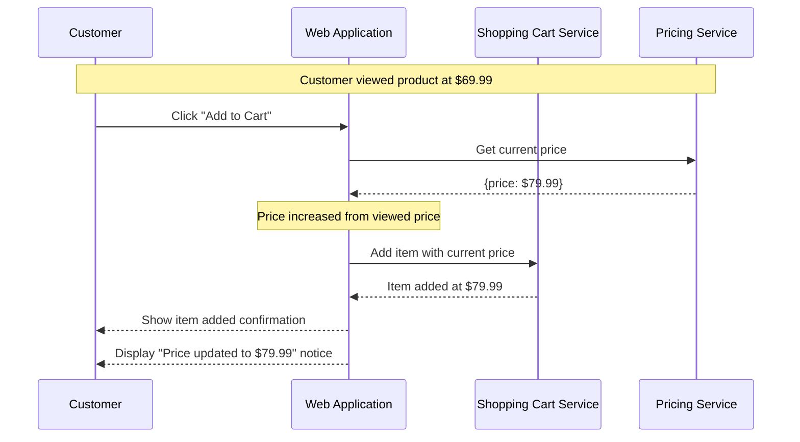

| ID | Criterion | Priority |
|----|-----------|----------|
| AC-E3.1 | Current price is always used when adding to cart | Must Have |
| AC-E3.2 | Customer is notified if price changed from displayed | Should Have |
| AC-E3.3 | Price changes do not block add to cart operation | Must Have |

### E4: Cart Session Expired

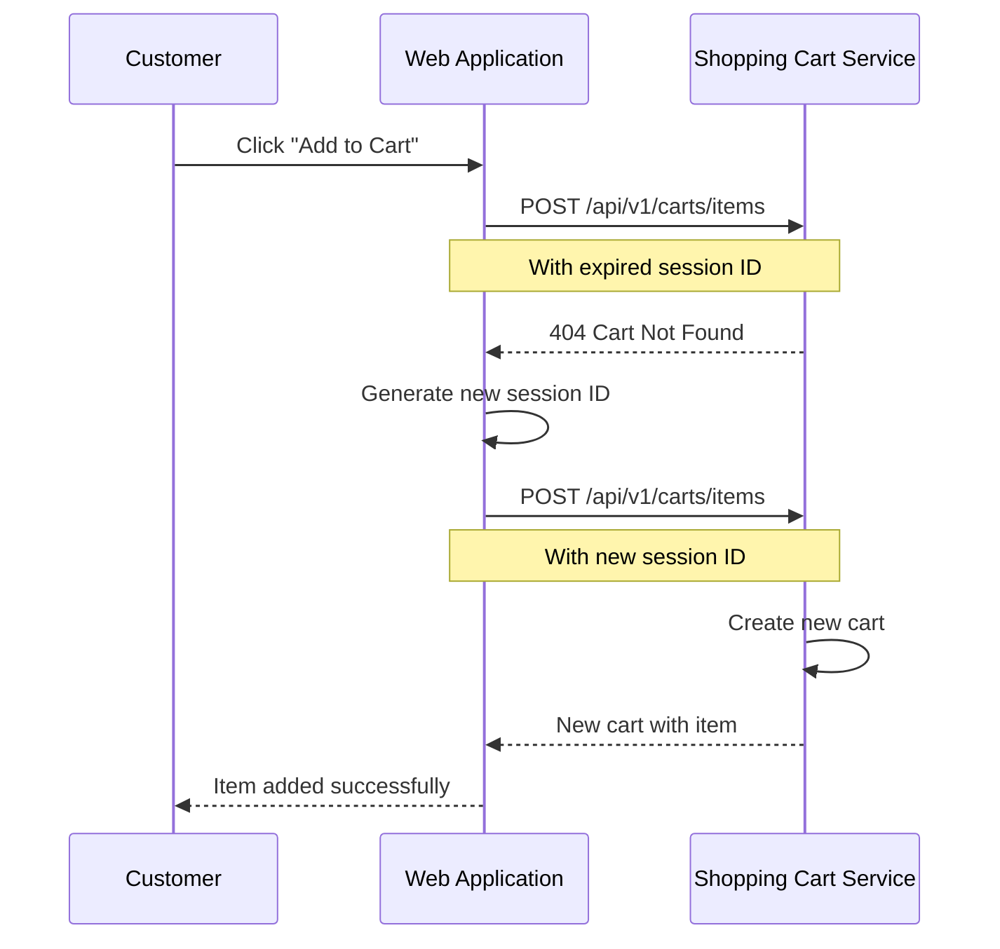

| ID | Criterion | Priority |
|----|-----------|----------|
| AC-E4.1 | New cart is created transparently when session expired | Must Have |
| AC-E4.2 | Customer is not blocked from adding items | Must Have |
| AC-E4.3 | New session cookie is set automatically | Must Have |

### E5: Inventory Service Degraded

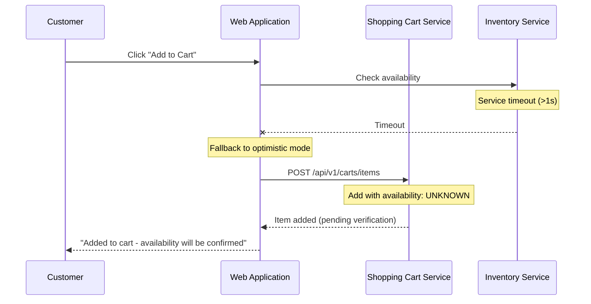

| ID | Criterion | Priority |
|----|-----------|----------|
| AC-E5.1 | Timeout threshold for inventory check is 1 second | Must Have |
| AC-E5.2 | Optimistic add is allowed with pending verification | Should Have |
| AC-E5.3 | Customer is informed availability will be confirmed | Must Have |
| AC-E5.4 | Background job verifies inventory and notifies customer | Should Have |

---

## Performance Requirements

| Operation | Target | Measurement |
|-----------|--------|-------------|
| Search query execution | p95 < 200ms | Time from request to response |
| Autocomplete response | < 150ms | Time from keystroke to suggestions |
| Filter application | p95 < 300ms | Time to return filtered results |
| Product detail page load | p95 < 500ms | Time to render complete page |
| Availability check | p99 < 100ms | Time to return stock status |
| Price resolution | p99 < 100ms | Time to return current price |
| Add to cart | p95 < 200ms | Time to complete cart operation |
| Cart read | p95 < 100ms | Time to retrieve cart contents |

---

## Analytics Events

The following events are tracked by the Analytics Service:

| Event | Trigger | Key Metrics |
|-------|---------|-------------|
| SearchPageViewed | User opens search page | Page views, entry source |
| SearchExecuted | User submits search query | Query volume, result counts |
| AutocompleteSuggestionClicked | User clicks autocomplete item | Suggestion click-through rate |
| FiltersApplied | User applies filters | Filter usage patterns |
| FilterCleared | User removes a filter | Filter removal frequency |
| SearchResultClicked | User clicks search result | Click-through rate, position |
| ProductViewed | User views product detail | Product view count, source |
| VariantSelected | User selects variant | Variant popularity |
| AddToCartClicked | User clicks Add to Cart | Add to cart attempts |
| AddToCartSucceeded | Item successfully added | Conversion rate |
| AddToCartFailed | Add to cart failed | Failure reasons |
| CartViewed | User views cart | Cart view frequency |
| CartQuantityUpdated | User changes quantity | Quantity change patterns |
| CartItemRemoved | User removes item | Removal patterns |
| CartMerged | Guest cart merged | Merge frequency |

---

## Observability Requirements

### Distributed Tracing

All requests across this journey must propagate trace context:

```
traceparent: 00-{trace-id}-{span-id}-01
```

| Span | Service | Purpose |
|------|---------|---------|
| search_request | Web App | Top-level search request |
| autocomplete_query | Search Service | Autocomplete execution |
| search_query | Search Service | Full-text search execution |
| facet_calculation | Search Service | Facet computation |
| product_detail_request | Web App | Product page request |
| get_product | Product Catalog | Product data retrieval |
| check_availability | Inventory Service | Stock check |
| get_price | Pricing Service | Price lookup |
| add_to_cart_request | Web App | Add to cart request |
| create_cart | Shopping Cart | Cart creation |
| add_cart_item | Shopping Cart | Item addition |

### Key Metrics

| Metric | Type | Labels |
|--------|------|--------|
| `search_requests_total` | Counter | status, has_results |
| `search_duration_seconds` | Histogram | type (autocomplete, full) |
| `search_results_count` | Histogram | - |
| `filter_applications_total` | Counter | filter_type |
| `product_views_total` | Counter | source |
| `availability_checks_total` | Counter | status, result |
| `availability_check_duration_seconds` | Histogram | - |
| `cart_operations_total` | Counter | operation, status |
| `cart_operation_duration_seconds` | Histogram | operation |
| `cart_items_count` | Gauge | - |
| `cart_value_dollars` | Histogram | - |

### Health Checks

Each service exposes:
- `GET /actuator/health/liveness` - Process is running
- `GET /actuator/health/readiness` - Dependencies available

### Alerting Thresholds

| Alert | Condition | Severity |
|-------|-----------|----------|
| Search latency degraded | p95 > 500ms for 5 minutes | Warning |
| Search service errors | > 1% error rate for 5 minutes | Critical |
| Inventory check failures | > 5% failures for 5 minutes | Warning |
| Cart operation failures | > 1% failures for 5 minutes | Critical |
| Add to cart conversion drop | > 20% drop from baseline | Warning |

---

## Testing Strategy

### Unit Tests

- Search query parsing and validation
- Filter combination logic
- Product snapshot generation
- Cart total calculations
- Inventory validation rules
- Price tier calculations

### Integration Tests

- Search API endpoint contracts
- Product Catalog API contracts
- Inventory Service availability checks
- Pricing Service price lookups
- Shopping Cart API operations
- Event publishing verification

### End-to-End Tests (Cucumber/Playwright)

```gherkin
Feature: Customer Shopping Experience

  @customer
  Scenario: Customer searches for products and filters results
    Given I am on the home page
    When I search for "wireless mouse"
    Then I should see search results for "wireless mouse"
    And I should see filter options for category, brand, and price

    When I filter by category "Gaming"
    Then I should see only gaming products
    And the URL should contain the filter parameters

    When I clear all filters
    Then I should see all search results again

  @customer
  Scenario: Customer views product details and selects variant
    Given I am viewing the product "ACME Gaming Mouse Pro"
    Then I should see the product name, description, and price
    And I should see the availability status
    And I should see variant options for color

    When I select the "White" color variant
    Then the displayed price should update
    And the availability status should update
    And the product images should update

  @customer
  Scenario: Customer adds item to cart
    Given I am viewing an in-stock product
    When I set the quantity to 2
    And I click "Add to Cart"
    Then I should see a confirmation message
    And the cart icon should show 2 items
    And the cart should contain the product with quantity 2

  @customer
  Scenario: Customer cannot add out of stock item
    Given I am viewing an out-of-stock product
    Then the "Add to Cart" button should be disabled
    And I should see "Out of Stock" message
    And I should see "Notify When Available" option

  @customer
  Scenario: Guest cart persists across page navigation
    Given I am a guest user
    And I add "ACME Gaming Mouse Pro" to my cart
    When I navigate to another page and return
    Then my cart should still contain "ACME Gaming Mouse Pro"

  @customer
  Scenario: Guest cart merges with user cart on signin
    Given I am a guest user
    And I add "ACME Gaming Mouse Pro" to my cart
    And I have an existing account with "ACME Keyboard" in my cart
    When I sign in to my account
    Then my cart should contain both "ACME Gaming Mouse Pro" and "ACME Keyboard"

  @customer
  Scenario: Maximum order quantity is enforced
    Given I am viewing a product with max order quantity of 5
    When I try to add 7 items to my cart
    Then I should see an error message about maximum quantity
    And only 5 items should be allowed

  @customer
  Scenario: Adding duplicate item increments quantity
    Given I have 2 "ACME Gaming Mouse Pro" in my cart
    When I add 1 more "ACME Gaming Mouse Pro" to my cart
    Then my cart should show quantity 3 for "ACME Gaming Mouse Pro"
    And I should not see duplicate line items

  @customer
  Scenario: Search handles misspellings
    When I search for "wirelss mouse"
    Then I should see search results
    And I should see "Did you mean: wireless mouse?"

  @customer
  Scenario: Autocomplete shows suggestions
    When I type "wire" in the search box
    Then I should see autocomplete suggestions
    And the suggestions should include product names and categories

  @customer
  Scenario: Price updates when tier threshold is met
    Given I am viewing a product with tier pricing
    And the tier price is $64.99 for 3+ items
    When I add 3 items to my cart
    Then the unit price should be $64.99
    And the line total should be $194.97

  @api
  Scenario: Search API returns proper response structure
    When I call the search API with query "mouse"
    Then the response should include results, facets, and pagination
    And the response should complete within 200ms
```

### Performance Tests

| Test | Target | Tool |
|------|--------|------|
| Search throughput | 500 req/s | k6 |
| Search latency under load | p95 < 300ms | k6 |
| Product detail page | p95 < 500ms | k6 |
| Add to cart throughput | 200 req/s | k6 |
| Cart operations | p95 < 200ms | k6 |
| Concurrent cart updates | 100 concurrent users | k6 |

---

## Security Considerations

| Concern | Mitigation |
|---------|------------|
| Search injection | Sanitize and escape search queries before processing |
| Cart manipulation | Validate cart ownership via session ID or customer ID |
| Price tampering | Server-side price lookup; never trust client-provided prices |
| Inventory bypass | Server-side inventory validation before adding to cart |
| Session hijacking | Secure, HttpOnly, SameSite cookies for session management |
| Rate limiting | Limit search and add to cart requests per session/IP |
| CSRF protection | CSRF tokens on all cart modification operations |

---

## Implementation Phases

### Phase 1: MVP Search and Browse
- Basic full-text search
- Category navigation
- Product listing with pagination
- Product detail page
- Basic availability display

### Phase 2: Enhanced Search
- Autocomplete suggestions
- Faceted filtering
- Price range filtering
- Spelling suggestions
- Search result sorting

### Phase 3: Cart Foundation
- Guest cart creation and persistence
- Add to cart with inventory validation
- Cart item quantity updates
- Cart item removal
- Product snapshot capture

### Phase 4: Cart Enhancement
- Authenticated customer carts
- Guest to customer cart merge
- Tier pricing support
- Cart expiration handling
- Low stock warnings

### Phase 5: Advanced Features
- Search personalization
- Recently viewed products
- Related products recommendations
- Back-in-stock notifications
- Cart abandonment detection

---

## Related Documents

- [Architecture Overview](../ARCHITECTURE.md)
- [Implementation Guidelines](../IMPLEMENTATION.md)
- [Product Catalog Epic](../epics/002-product-catalog.md)
- [Product Inventory Epic](../epics/003-product-inventory.md)
- [Shopping Cart Management Epic](../epics/009-shopping-cart-management.md)
- [User Journey: Create Customer Profile](./0002-create-customer-profile.md)
- [User Journey: Customer Signin](./0003-customer-signin.md)

---

## Appendix: Event Catalog

| Event | Producer | Consumers |
|-------|----------|-----------|
| SearchExecuted | Search Service | Analytics |
| FiltersApplied | Search Service | Analytics |
| ProductViewed | Web Application | Analytics, Recommendations |
| CartCreated | Shopping Cart Service | Analytics |
| ItemAddedToCart | Shopping Cart Service | Analytics, Inventory (optional reservation) |
| CartItemQuantityUpdated | Shopping Cart Service | Analytics |
| CartItemRemoved | Shopping Cart Service | Analytics |
| CartMerged | Shopping Cart Service | Analytics |
| CartAbandoned | Shopping Cart Service | Notifications, Marketing |
| LowStockWarningDisplayed | Web Application | Analytics |
| OutOfStockEncountered | Web Application | Analytics, Notifications |
