# User Journey: Customer Shopping Cart Checkout Experience

**Journey ID:** UJ-0004
**Version:** 1.0
**Status:** Draft
**Created:** 2026-01-17
**Last Updated:** 2026-01-17

## Overview

This user journey documents the complete flow for a customer completing the checkout process on the ACME e-commerce platform. The journey covers cart validation, shipping selection, payment entry, order review, order placement, and confirmation. This is a critical conversion path that directly impacts revenue and customer satisfaction.

### Business Value

- **Revenue Capture**: Convert shopping intent into completed orders
- **Conversion Optimization**: Minimize checkout abandonment through frictionless experience
- **Payment Security**: Protect customer financial data through PCI-compliant handling
- **Customer Confidence**: Provide transparency into pricing, delivery, and order details
- **Order Accuracy**: Validate inventory, pricing, and shipping before commitment

### Journey Scope

This journey covers:
1. Checkout initiation from shopping cart
2. Shipping address entry and method selection
3. Payment information entry and tokenization
4. Order review and final validation
5. Order placement with saga orchestration
6. Order confirmation and notification

---

## Actors and Systems

### Primary Actor
- **Customer**: A guest or authenticated customer ready to complete a purchase on the ACME platform

### Participating Services

| Service | Bounded Context | Responsibility |
|---------|-----------------|----------------|
| **Web Application** | Frontend | Checkout UI, form handling, order review display |
| **Shopping Cart Service** | Shopping Cart | Cart validation, locking, checkout token generation, cart-to-order conversion |
| **Order Management Service** | Order | Order creation, status transitions, saga orchestration |
| **Payment Management Service** | Payment | Fraud screening, payment authorization, card tokenization |
| **Shipping & Fulfillment Service** | Shipping | Address validation, rate shopping, delivery estimation |
| **Pricing Service** | Pricing | Final calculations, promotion validation, tax estimation |
| **Inventory Service** | Inventory | Stock reservation during checkout |
| **Customer Service** | Customer | Saved addresses, saved payment methods |
| **Identity Service** | Identity | Authentication state verification |
| **Notification Service** | Notification | Order confirmation emails |

---

## Journey Flow

### High-Level Flow

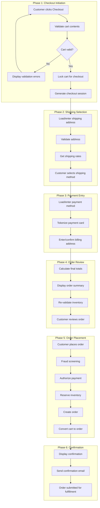

---

## Detailed Journey Steps

### Step 1: Customer Initiates Checkout

**Actor:** Customer
**System:** Web Application, Shopping Cart Service

The customer clicks the checkout button from their shopping cart to begin the checkout process.

#### Sequence Diagram

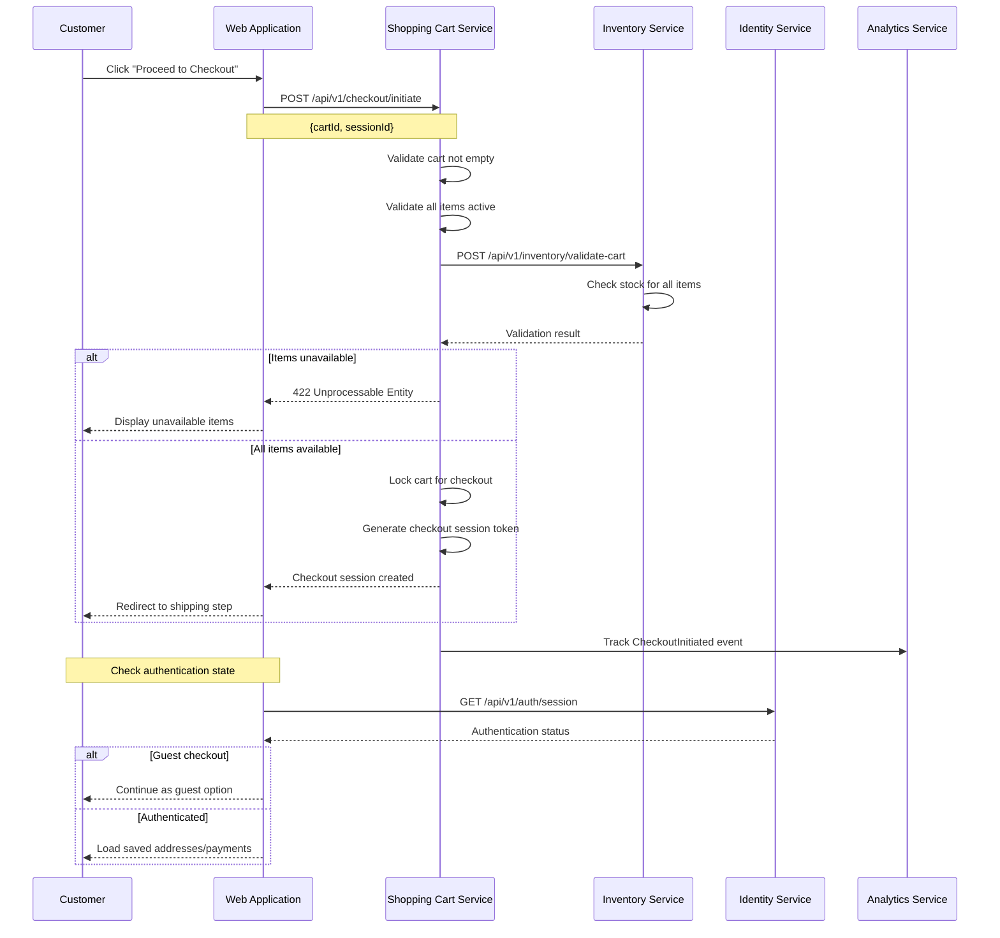

#### UI Requirements

- Checkout button prominently displayed on cart page
- Loading indicator during checkout initiation
- Clear error messages for validation failures
- Guest checkout option visible
- Sign in prompt for guests with existing accounts
- Cart summary visible during transition
- Back to cart navigation available

#### API Contract: Initiate Checkout

**Request:**
```
POST /api/v1/checkout/initiate
Content-Type: application/json
X-Session-ID: sess_01941234-5678-7abc-def0-123456789102
Authorization: Bearer <jwt> (optional for authenticated users)

{
  "cartId": "01941234-5678-7abc-def0-123456789500"
}
```

**Response (Success):**
```json
{
  "checkoutSessionId": "chk_01941234-5678-7abc-def0-123456789600",
  "cartId": "01941234-5678-7abc-def0-123456789500",
  "status": "INITIATED",
  "expiresAt": "2026-01-17T15:30:00Z",
  "cart": {
    "itemCount": 3,
    "subtotal": {
      "amount": 249.97,
      "currency": "USD"
    }
  },
  "customer": {
    "type": "AUTHENTICATED",
    "customerId": "01941234-5678-7abc-def0-123456789700",
    "hasSavedAddresses": true,
    "hasSavedPayments": true
  }
}
```

**Response (Cart Validation Failed):**
```json
{
  "error": "CART_VALIDATION_FAILED",
  "message": "Some items in your cart are no longer available",
  "validationErrors": [
    {
      "cartItemId": "01941234-5678-7abc-def0-123456789501",
      "productName": "ACME Widget Pro",
      "issue": "OUT_OF_STOCK",
      "availableQuantity": 0,
      "requestedQuantity": 2
    },
    {
      "cartItemId": "01941234-5678-7abc-def0-123456789502",
      "productName": "ACME Gadget",
      "issue": "INSUFFICIENT_STOCK",
      "availableQuantity": 1,
      "requestedQuantity": 3
    }
  ]
}
```

#### API Contract: Lock Cart

**Request:**
```
POST /api/v1/carts/{cartId}/lock
Content-Type: application/json

{
  "checkoutSessionId": "chk_01941234-5678-7abc-def0-123456789600",
  "lockDurationMinutes": 30
}
```

**Response:**
```json
{
  "cartId": "01941234-5678-7abc-def0-123456789500",
  "locked": true,
  "lockedAt": "2026-01-17T15:00:00Z",
  "lockedUntil": "2026-01-17T15:30:00Z",
  "checkoutSessionId": "chk_01941234-5678-7abc-def0-123456789600"
}
```

#### Domain Event: CheckoutInitiated

```json
{
  "eventId": "01941234-5678-7abc-def0-123456789800",
  "eventType": "CheckoutInitiated",
  "eventVersion": "1.0",
  "timestamp": "2026-01-17T15:00:00Z",
  "aggregateId": "chk_01941234-5678-7abc-def0-123456789600",
  "aggregateType": "CheckoutSession",
  "correlationId": "01941234-5678-7abc-def0-123456789801",
  "payload": {
    "checkoutSessionId": "chk_01941234-5678-7abc-def0-123456789600",
    "cartId": "01941234-5678-7abc-def0-123456789500",
    "customerId": "01941234-5678-7abc-def0-123456789700",
    "sessionId": "sess_01941234-5678-7abc-def0-123456789102",
    "itemCount": 3,
    "cartSubtotal": {
      "amount": 249.97,
      "currency": "USD"
    },
    "customerType": "AUTHENTICATED"
  }
}
```

#### Domain Event: CartLocked

```json
{
  "eventId": "01941234-5678-7abc-def0-123456789802",
  "eventType": "CartLocked",
  "eventVersion": "1.0",
  "timestamp": "2026-01-17T15:00:01Z",
  "aggregateId": "01941234-5678-7abc-def0-123456789500",
  "aggregateType": "Cart",
  "payload": {
    "cartId": "01941234-5678-7abc-def0-123456789500",
    "checkoutSessionId": "chk_01941234-5678-7abc-def0-123456789600",
    "lockedUntil": "2026-01-17T15:30:00Z"
  }
}
```

#### Acceptance Criteria

| ID | Criterion | Priority |
|----|-----------|----------|
| AC-1.1 | Empty carts cannot proceed to checkout | Must Have |
| AC-1.2 | Cart is locked during checkout preventing concurrent modifications | Must Have |
| AC-1.3 | Checkout session expires after 30 minutes of inactivity | Must Have |
| AC-1.4 | Guest customers can checkout without creating an account | Must Have |
| AC-1.5 | All cart items are validated for availability before checkout starts | Must Have |
| AC-1.6 | Checkout initiation responds within 500ms (p95) | Must Have |
| AC-1.7 | Unavailable items are clearly identified with available quantities | Should Have |
| AC-1.8 | CheckoutInitiated event is published for analytics | Must Have |

---

### Step 2: Customer Selects Shipping Method

**Actor:** Customer
**System:** Web Application, Shipping & Fulfillment Service, Customer Service

The customer enters or selects a shipping address and chooses a delivery method.

#### Sequence Diagram

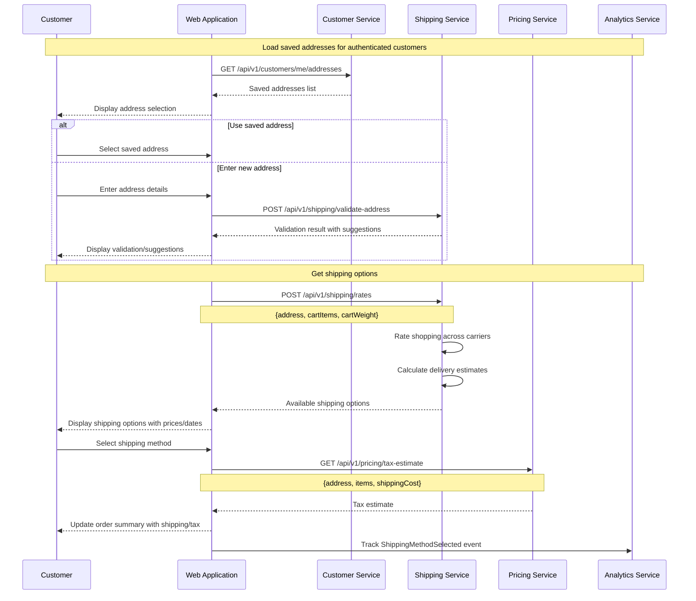

#### UI Requirements

- Saved addresses displayed for authenticated customers
- Address form with validation feedback
- Address suggestions for corrections
- Residential/commercial address indicator
- Multiple shipping options with prices and dates
- Delivery date ranges clearly shown
- Shipping cost breakdown
- Real-time order total updates
- Edit address capability

#### API Contract: Validate Shipping Address

**Request:**
```
POST /api/v1/shipping/validate-address
Content-Type: application/json

{
  "address": {
    "recipientName": "Jane Doe",
    "line1": "123 Main Street",
    "line2": "Apt 4B",
    "city": "New York",
    "state": "NY",
    "postalCode": "10001",
    "country": "US",
    "phone": "+1-555-123-4567"
  }
}
```

**Response (Valid):**
```json
{
  "status": "VALID",
  "validatedAddress": {
    "recipientName": "Jane Doe",
    "line1": "123 Main St",
    "line2": "Apt 4B",
    "city": "New York",
    "state": "NY",
    "postalCode": "10001-1234",
    "country": "US",
    "phone": "+1-555-123-4567"
  },
  "addressType": "RESIDENTIAL",
  "deliverable": true,
  "metadata": {
    "dpvConfirmation": "Y",
    "deliveryPointBarcode": "100011234045"
  }
}
```

**Response (Suggestions):**
```json
{
  "status": "SUGGESTIONS",
  "message": "Address may be incomplete or incorrect",
  "originalAddress": {
    "line1": "123 Main",
    "city": "New York",
    "state": "NY",
    "postalCode": "10001"
  },
  "suggestions": [
    {
      "line1": "123 Main St",
      "city": "New York",
      "state": "NY",
      "postalCode": "10001-1234",
      "confidence": 0.95
    },
    {
      "line1": "123 Main Ave",
      "city": "New York",
      "state": "NY",
      "postalCode": "10001-5678",
      "confidence": 0.75
    }
  ]
}
```

#### API Contract: Get Shipping Rates

**Request:**
```
POST /api/v1/shipping/rates
Content-Type: application/json

{
  "checkoutSessionId": "chk_01941234-5678-7abc-def0-123456789600",
  "destination": {
    "line1": "123 Main St",
    "line2": "Apt 4B",
    "city": "New York",
    "state": "NY",
    "postalCode": "10001-1234",
    "country": "US"
  },
  "packages": [
    {
      "weight": {
        "value": 2.5,
        "unit": "LB"
      },
      "dimensions": {
        "length": 12,
        "width": 8,
        "height": 6,
        "unit": "IN"
      }
    }
  ]
}
```

**Response:**
```json
{
  "shippingOptions": [
    {
      "id": "ship_standard_01941234",
      "carrier": "ACME_LOGISTICS",
      "serviceLevel": "STANDARD",
      "displayName": "Standard Shipping",
      "rate": {
        "amount": 5.99,
        "currency": "USD"
      },
      "estimatedDelivery": {
        "minDate": "2026-01-22",
        "maxDate": "2026-01-24",
        "businessDays": "5-7"
      },
      "transitDays": 7
    },
    {
      "id": "ship_express_01941234",
      "carrier": "ACME_LOGISTICS",
      "serviceLevel": "EXPRESS",
      "displayName": "Express Shipping",
      "rate": {
        "amount": 12.99,
        "currency": "USD"
      },
      "estimatedDelivery": {
        "minDate": "2026-01-20",
        "maxDate": "2026-01-21",
        "businessDays": "2-3"
      },
      "transitDays": 3
    },
    {
      "id": "ship_overnight_01941234",
      "carrier": "PREMIUM_COURIER",
      "serviceLevel": "OVERNIGHT",
      "displayName": "Next Day Delivery",
      "rate": {
        "amount": 24.99,
        "currency": "USD"
      },
      "estimatedDelivery": {
        "minDate": "2026-01-18",
        "maxDate": "2026-01-18",
        "businessDays": "1"
      },
      "transitDays": 1,
      "cutoffTime": "14:00:00",
      "cutoffTimezone": "America/New_York"
    }
  ],
  "freeShippingEligible": true,
  "freeShippingThreshold": {
    "amount": 75.00,
    "currency": "USD"
  },
  "currentCartValue": {
    "amount": 249.97,
    "currency": "USD"
  }
}
```

#### Domain Event: ShippingAddressSelected

```json
{
  "eventId": "01941234-5678-7abc-def0-123456789810",
  "eventType": "ShippingAddressSelected",
  "eventVersion": "1.0",
  "timestamp": "2026-01-17T15:02:00Z",
  "aggregateId": "chk_01941234-5678-7abc-def0-123456789600",
  "aggregateType": "CheckoutSession",
  "correlationId": "01941234-5678-7abc-def0-123456789801",
  "payload": {
    "checkoutSessionId": "chk_01941234-5678-7abc-def0-123456789600",
    "addressType": "SAVED",
    "addressId": "addr_01941234-5678-7abc-def0-123456789900",
    "destination": {
      "city": "New York",
      "state": "NY",
      "postalCode": "10001",
      "country": "US"
    },
    "isResidential": true
  }
}
```

#### Domain Event: ShippingMethodSelected

```json
{
  "eventId": "01941234-5678-7abc-def0-123456789811",
  "eventType": "ShippingMethodSelected",
  "eventVersion": "1.0",
  "timestamp": "2026-01-17T15:03:00Z",
  "aggregateId": "chk_01941234-5678-7abc-def0-123456789600",
  "aggregateType": "CheckoutSession",
  "correlationId": "01941234-5678-7abc-def0-123456789801",
  "payload": {
    "checkoutSessionId": "chk_01941234-5678-7abc-def0-123456789600",
    "shippingOptionId": "ship_standard_01941234",
    "carrier": "ACME_LOGISTICS",
    "serviceLevel": "STANDARD",
    "rate": {
      "amount": 5.99,
      "currency": "USD"
    },
    "estimatedDeliveryDate": "2026-01-24"
  }
}
```

#### Acceptance Criteria

| ID | Criterion | Priority |
|----|-----------|----------|
| AC-2.1 | Saved addresses are displayed for authenticated customers | Must Have |
| AC-2.2 | Address validation provides suggested corrections for invalid addresses | Must Have |
| AC-2.3 | At least 3 shipping options are presented when available | Should Have |
| AC-2.4 | Rate shopping completes within 3 seconds (p95) | Must Have |
| AC-2.5 | Delivery estimates account for fulfillment center location and cutoff times | Must Have |
| AC-2.6 | International addresses include duty and tax estimates | Should Have |
| AC-2.7 | Free shipping eligibility is clearly indicated | Should Have |
| AC-2.8 | Address validation responds within 1 second (p95) | Must Have |

---

### Step 3: Customer Enters Payment Information

**Actor:** Customer
**System:** Web Application, Payment Management Service, Customer Service

The customer enters or selects a payment method for the order.

#### Sequence Diagram

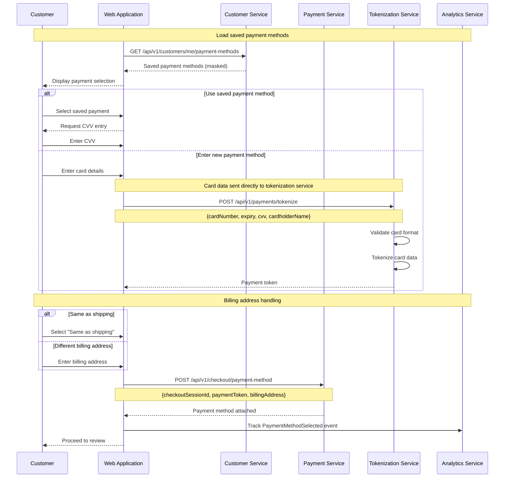

#### UI Requirements

- Saved payment methods with masked card numbers
- Card brand icons for recognition
- Secure card entry form (PCI compliant iframe)
- CVV field required for all transactions
- Card validation feedback (Luhn check, expiry)
- Billing address form or "same as shipping" option
- Security badges and trust indicators
- Option to save payment method for future use

#### API Contract: Tokenize Payment Card

**Request:**
```
POST /api/v1/payments/tokenize
Content-Type: application/json

{
  "cardNumber": "4111111111111111",
  "expirationMonth": "12",
  "expirationYear": "2028",
  "cvv": "123",
  "cardholderName": "Jane Doe"
}
```

**Response:**
```json
{
  "paymentToken": "tok_01941234-5678-7abc-def0-123456789950",
  "card": {
    "brand": "VISA",
    "last4": "1111",
    "expirationMonth": "12",
    "expirationYear": "2028",
    "fingerprint": "fp_abc123xyz789"
  },
  "tokenExpiresAt": "2026-01-17T15:30:00Z"
}
```

#### API Contract: Attach Payment Method

**Request:**
```
POST /api/v1/checkout/payment-method
Content-Type: application/json
Authorization: Bearer <jwt>

{
  "checkoutSessionId": "chk_01941234-5678-7abc-def0-123456789600",
  "paymentToken": "tok_01941234-5678-7abc-def0-123456789950",
  "billingAddress": {
    "name": "Jane Doe",
    "line1": "123 Main St",
    "line2": "Apt 4B",
    "city": "New York",
    "state": "NY",
    "postalCode": "10001",
    "country": "US"
  },
  "savePaymentMethod": false
}
```

**Response:**
```json
{
  "checkoutSessionId": "chk_01941234-5678-7abc-def0-123456789600",
  "paymentMethod": {
    "type": "CREDIT_CARD",
    "card": {
      "brand": "VISA",
      "last4": "1111",
      "expirationMonth": "12",
      "expirationYear": "2028"
    },
    "billingAddress": {
      "name": "Jane Doe",
      "city": "New York",
      "state": "NY",
      "postalCode": "10001"
    }
  },
  "status": "READY_FOR_REVIEW"
}
```

#### Domain Event: PaymentMethodSelected

```json
{
  "eventId": "01941234-5678-7abc-def0-123456789820",
  "eventType": "PaymentMethodSelected",
  "eventVersion": "1.0",
  "timestamp": "2026-01-17T15:05:00Z",
  "aggregateId": "chk_01941234-5678-7abc-def0-123456789600",
  "aggregateType": "CheckoutSession",
  "correlationId": "01941234-5678-7abc-def0-123456789801",
  "payload": {
    "checkoutSessionId": "chk_01941234-5678-7abc-def0-123456789600",
    "paymentType": "CREDIT_CARD",
    "cardBrand": "VISA",
    "cardLast4": "1111",
    "isNewPaymentMethod": true,
    "saveRequested": false
  }
}
```

#### Acceptance Criteria

| ID | Criterion | Priority |
|----|-----------|----------|
| AC-3.1 | Saved payment methods display masked card number (last 4 digits) | Must Have |
| AC-3.2 | CVV is required for all transactions including saved cards | Must Have |
| AC-3.3 | Card tokenization completes within 2 seconds (p95) | Must Have |
| AC-3.4 | Raw card data is never stored in ACME systems (PCI compliance) | Must Have |
| AC-3.5 | 3D Secure authentication is supported for eligible transactions | Should Have |
| AC-3.6 | Billing address can differ from shipping address | Must Have |
| AC-3.7 | Card validation provides immediate feedback on format errors | Must Have |
| AC-3.8 | Payment tokenization errors show user-friendly messages | Must Have |

---

### Step 4: Customer Reviews Order Summary

**Actor:** Customer
**System:** Web Application, Pricing Service, Inventory Service

The customer reviews the complete order details before placement.

#### Sequence Diagram

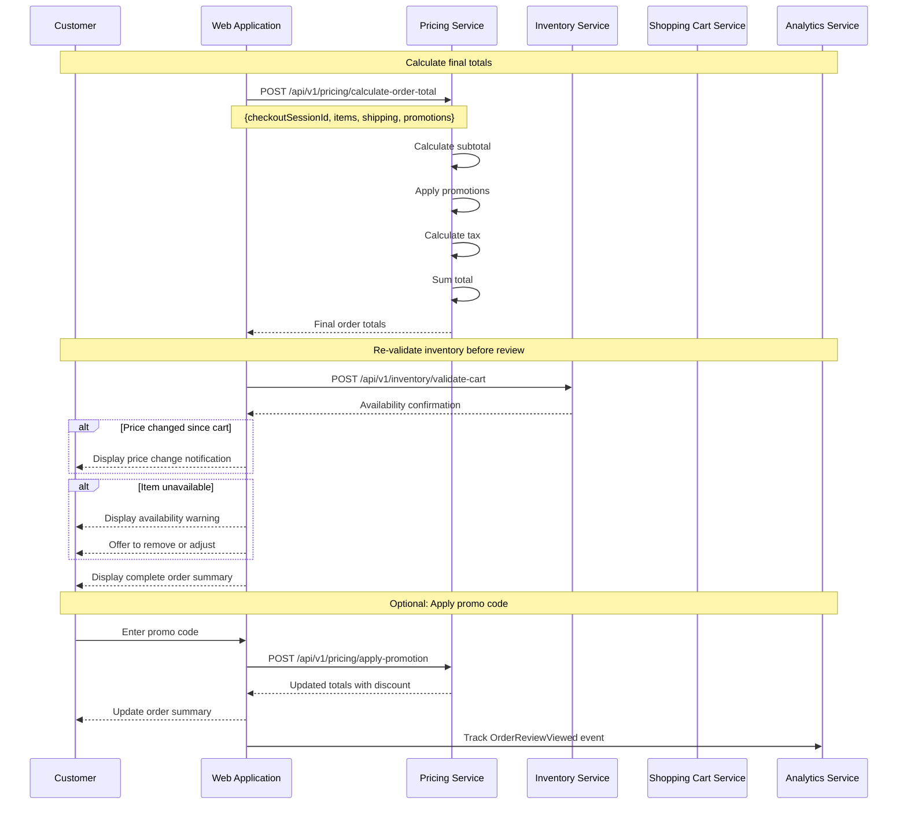

#### UI Requirements

- Complete line item list with images and details
- Clear price breakdown (subtotal, shipping, tax, discounts)
- Promotion code entry field
- Applied promotions with discount amounts
- Shipping address summary with edit link
- Shipping method with delivery estimate
- Payment method summary with edit link
- Order total prominently displayed
- Terms and conditions acknowledgment
- Place Order button with clear call to action

#### API Contract: Calculate Order Total

**Request:**
```
POST /api/v1/pricing/calculate-order-total
Content-Type: application/json

{
  "checkoutSessionId": "chk_01941234-5678-7abc-def0-123456789600",
  "items": [
    {
      "productId": "01941234-5678-7abc-def0-123456789003",
      "variantId": "01941234-5678-7abc-def0-123456789301",
      "quantity": 2,
      "unitPrice": {
        "amount": 69.99,
        "currency": "USD"
      }
    },
    {
      "productId": "01941234-5678-7abc-def0-123456789004",
      "variantId": "01941234-5678-7abc-def0-123456789401",
      "quantity": 1,
      "unitPrice": {
        "amount": 109.99,
        "currency": "USD"
      }
    }
  ],
  "shippingCost": {
    "amount": 5.99,
    "currency": "USD"
  },
  "shippingAddress": {
    "state": "NY",
    "postalCode": "10001",
    "country": "US"
  },
  "promotionCodes": ["SAVE10"]
}
```

**Response:**
```json
{
  "summary": {
    "subtotal": {
      "amount": 249.97,
      "currency": "USD"
    },
    "shipping": {
      "amount": 5.99,
      "currency": "USD"
    },
    "discount": {
      "amount": 24.99,
      "currency": "USD"
    },
    "taxEstimate": {
      "amount": 20.12,
      "currency": "USD"
    },
    "total": {
      "amount": 251.09,
      "currency": "USD"
    }
  },
  "lineItems": [
    {
      "productId": "01941234-5678-7abc-def0-123456789003",
      "productName": "ACME Gaming Mouse Pro",
      "variantName": "Black",
      "quantity": 2,
      "unitPrice": {
        "amount": 69.99,
        "currency": "USD"
      },
      "lineTotal": {
        "amount": 139.98,
        "currency": "USD"
      }
    },
    {
      "productId": "01941234-5678-7abc-def0-123456789004",
      "productName": "ACME Mechanical Keyboard",
      "variantName": "Blue Switches",
      "quantity": 1,
      "unitPrice": {
        "amount": 109.99,
        "currency": "USD"
      },
      "lineTotal": {
        "amount": 109.99,
        "currency": "USD"
      }
    }
  ],
  "appliedPromotions": [
    {
      "promotionId": "promo_01941234-5678",
      "code": "SAVE10",
      "description": "10% off your order",
      "discount": {
        "amount": 24.99,
        "currency": "USD"
      }
    }
  ],
  "taxBreakdown": {
    "taxableAmount": {
      "amount": 224.98,
      "currency": "USD"
    },
    "taxRate": 0.08945,
    "jurisdiction": "New York, NY"
  },
  "calculatedAt": "2026-01-17T15:06:00Z",
  "validUntil": "2026-01-17T15:16:00Z"
}
```

#### Acceptance Criteria

| ID | Criterion | Priority |
|----|-----------|----------|
| AC-4.1 | Order summary shows all line items with prices | Must Have |
| AC-4.2 | Subtotal, shipping, tax, and discounts displayed separately | Must Have |
| AC-4.3 | Promo codes can be applied at the review stage | Must Have |
| AC-4.4 | Inventory is re-validated before order submission | Must Have |
| AC-4.5 | Price changes during checkout notify the customer | Must Have |
| AC-4.6 | Tax calculation responds within 500ms (p95) | Must Have |
| AC-4.7 | Invalid promo codes show clear error messages | Should Have |
| AC-4.8 | Edit links allow navigation back to previous steps | Must Have |

---

### Step 5: Customer Places Order

**Actor:** Customer
**System:** Web Application, Order Management Service, Payment Management Service, Inventory Service

The customer confirms the order, triggering the order placement saga.

#### Sequence Diagram

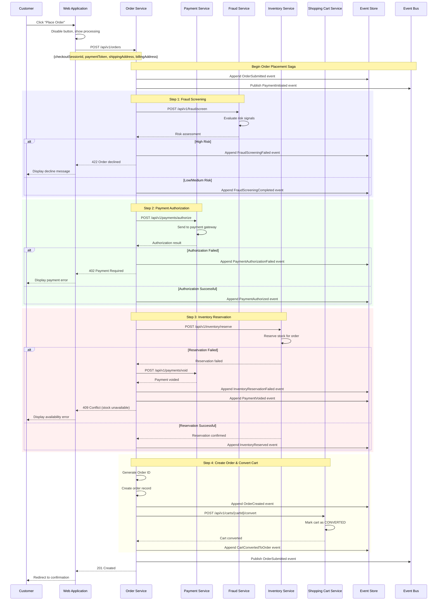

#### Order Placement Saga Compensation

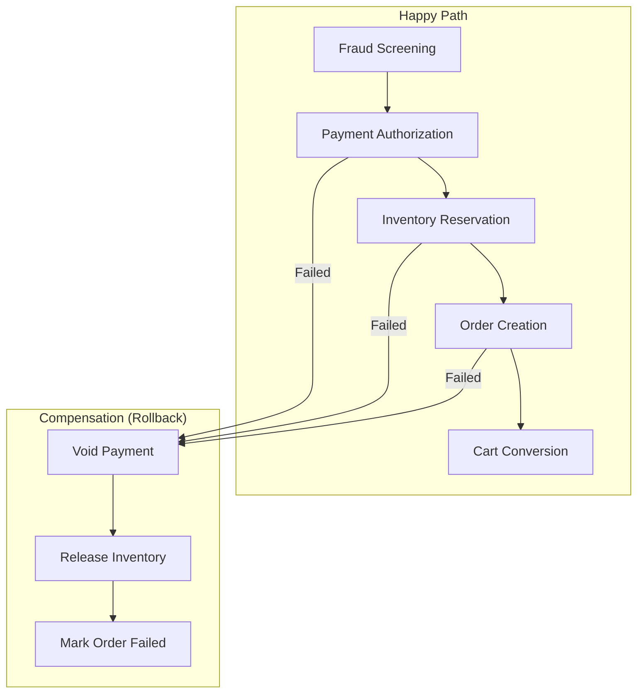

#### API Contract: Create Order

**Request:**
```
POST /api/v1/orders
Content-Type: application/json
Authorization: Bearer <jwt>
Idempotency-Key: idem_01941234-5678-7abc-def0-123456789999

{
  "checkoutSessionId": "chk_01941234-5678-7abc-def0-123456789600",
  "paymentToken": "tok_01941234-5678-7abc-def0-123456789950",
  "cvv": "123",
  "shippingAddress": {
    "recipientName": "Jane Doe",
    "line1": "123 Main St",
    "line2": "Apt 4B",
    "city": "New York",
    "state": "NY",
    "postalCode": "10001",
    "country": "US",
    "phone": "+1-555-123-4567"
  },
  "billingAddress": {
    "name": "Jane Doe",
    "line1": "123 Main St",
    "line2": "Apt 4B",
    "city": "New York",
    "state": "NY",
    "postalCode": "10001",
    "country": "US"
  },
  "shippingOptionId": "ship_standard_01941234",
  "acceptedTerms": true
}
```

**Response (Success):**
```json
{
  "orderId": "01941234-5678-7cde-def0-123456790001",
  "orderNumber": "ACME-20260117-000142",
  "status": "SUBMITTED",
  "createdAt": "2026-01-17T15:08:00Z",
  "summary": {
    "subtotal": {
      "amount": 249.97,
      "currency": "USD"
    },
    "shipping": {
      "amount": 5.99,
      "currency": "USD"
    },
    "discount": {
      "amount": 24.99,
      "currency": "USD"
    },
    "tax": {
      "amount": 20.12,
      "currency": "USD"
    },
    "total": {
      "amount": 251.09,
      "currency": "USD"
    }
  },
  "estimatedDelivery": {
    "minDate": "2026-01-22",
    "maxDate": "2026-01-24"
  },
  "payment": {
    "status": "AUTHORIZED",
    "method": "VISA ****1111"
  }
}
```

**Response (Payment Failed):**
```json
{
  "error": "PAYMENT_FAILED",
  "message": "Your payment could not be processed. Please try a different payment method.",
  "code": "CARD_DECLINED",
  "retryable": true
}
```

#### API Contract: Authorize Payment

**Request:**
```
POST /api/v1/payments/authorize
Content-Type: application/json

{
  "orderId": "01941234-5678-7cde-def0-123456790001",
  "paymentToken": "tok_01941234-5678-7abc-def0-123456789950",
  "cvv": "123",
  "amount": {
    "value": 251.09,
    "currency": "USD"
  },
  "billingAddress": {
    "name": "Jane Doe",
    "line1": "123 Main St",
    "city": "New York",
    "state": "NY",
    "postalCode": "10001",
    "country": "US"
  },
  "metadata": {
    "orderNumber": "ACME-20260117-000142",
    "customerId": "01941234-5678-7abc-def0-123456789700"
  }
}
```

**Response:**
```json
{
  "paymentId": "pay_01941234-5678-7abc-def0-123456790100",
  "status": "AUTHORIZED",
  "authorizationCode": "AUTH123456",
  "amount": {
    "value": 251.09,
    "currency": "USD"
  },
  "avsResult": "Y",
  "cvvResult": "M",
  "riskScore": 15,
  "authorizedAt": "2026-01-17T15:08:02Z",
  "expiresAt": "2026-01-24T15:08:02Z"
}
```

#### API Contract: Reserve Inventory

**Request:**
```
POST /api/v1/inventory/reserve
Content-Type: application/json

{
  "orderId": "01941234-5678-7cde-def0-123456790001",
  "reservationType": "ORDER",
  "items": [
    {
      "variantId": "01941234-5678-7abc-def0-123456789301",
      "quantity": 2,
      "locationPreference": "NEAREST"
    },
    {
      "variantId": "01941234-5678-7abc-def0-123456789401",
      "quantity": 1,
      "locationPreference": "NEAREST"
    }
  ],
  "expiresAt": "2026-01-17T15:38:00Z"
}
```

**Response:**
```json
{
  "reservationId": "res_01941234-5678-7abc-def0-123456790200",
  "orderId": "01941234-5678-7cde-def0-123456790001",
  "status": "CONFIRMED",
  "items": [
    {
      "variantId": "01941234-5678-7abc-def0-123456789301",
      "quantity": 2,
      "locationId": "loc-warehouse-01",
      "locationName": "East Coast Warehouse"
    },
    {
      "variantId": "01941234-5678-7abc-def0-123456789401",
      "quantity": 1,
      "locationId": "loc-warehouse-01",
      "locationName": "East Coast Warehouse"
    }
  ],
  "reservedAt": "2026-01-17T15:08:03Z",
  "expiresAt": "2026-01-17T15:38:00Z"
}
```

#### API Contract: Convert Cart to Order

**Request:**
```
POST /api/v1/carts/{cartId}/convert
Content-Type: application/json

{
  "orderId": "01941234-5678-7cde-def0-123456790001",
  "checkoutSessionId": "chk_01941234-5678-7abc-def0-123456789600"
}
```

**Response:**
```json
{
  "cartId": "01941234-5678-7abc-def0-123456789500",
  "status": "CONVERTED",
  "orderId": "01941234-5678-7cde-def0-123456790001",
  "convertedAt": "2026-01-17T15:08:04Z"
}
```

#### Domain Event: FraudScreeningCompleted

```json
{
  "eventId": "01941234-5678-7abc-def0-123456789830",
  "eventType": "FraudScreeningCompleted",
  "eventVersion": "1.0",
  "timestamp": "2026-01-17T15:08:01Z",
  "aggregateId": "01941234-5678-7cde-def0-123456790001",
  "aggregateType": "Order",
  "correlationId": "01941234-5678-7abc-def0-123456789801",
  "payload": {
    "orderId": "01941234-5678-7cde-def0-123456790001",
    "riskScore": 15,
    "riskLevel": "LOW",
    "decision": "APPROVE",
    "signals": ["NEW_CUSTOMER", "VERIFIED_ADDRESS", "KNOWN_DEVICE"]
  }
}
```

#### Domain Event: PaymentAuthorized

```json
{
  "eventId": "01941234-5678-7abc-def0-123456789831",
  "eventType": "PaymentAuthorized",
  "eventVersion": "1.0",
  "timestamp": "2026-01-17T15:08:02Z",
  "aggregateId": "pay_01941234-5678-7abc-def0-123456790100",
  "aggregateType": "Payment",
  "correlationId": "01941234-5678-7abc-def0-123456789801",
  "payload": {
    "paymentId": "pay_01941234-5678-7abc-def0-123456790100",
    "orderId": "01941234-5678-7cde-def0-123456790001",
    "amount": {
      "value": 251.09,
      "currency": "USD"
    },
    "authorizationCode": "AUTH123456",
    "paymentMethod": {
      "type": "CREDIT_CARD",
      "brand": "VISA",
      "last4": "1111"
    }
  }
}
```

#### Domain Event: PaymentAuthorizationFailed

```json
{
  "eventId": "01941234-5678-7abc-def0-123456789832",
  "eventType": "PaymentAuthorizationFailed",
  "eventVersion": "1.0",
  "timestamp": "2026-01-17T15:08:02Z",
  "aggregateId": "pay_01941234-5678-7abc-def0-123456790100",
  "aggregateType": "Payment",
  "correlationId": "01941234-5678-7abc-def0-123456789801",
  "payload": {
    "paymentId": "pay_01941234-5678-7abc-def0-123456790100",
    "orderId": "01941234-5678-7cde-def0-123456790001",
    "reason": "CARD_DECLINED",
    "declineCode": "insufficient_funds",
    "retryable": true
  }
}
```

#### Domain Event: InventoryReserved

```json
{
  "eventId": "01941234-5678-7abc-def0-123456789833",
  "eventType": "InventoryReserved",
  "eventVersion": "1.0",
  "timestamp": "2026-01-17T15:08:03Z",
  "aggregateId": "res_01941234-5678-7abc-def0-123456790200",
  "aggregateType": "Reservation",
  "correlationId": "01941234-5678-7abc-def0-123456789801",
  "payload": {
    "reservationId": "res_01941234-5678-7abc-def0-123456790200",
    "orderId": "01941234-5678-7cde-def0-123456790001",
    "items": [
      {
        "variantId": "01941234-5678-7abc-def0-123456789301",
        "quantity": 2,
        "locationId": "loc-warehouse-01"
      }
    ]
  }
}
```

#### Domain Event: InventoryReservationFailed

```json
{
  "eventId": "01941234-5678-7abc-def0-123456789834",
  "eventType": "InventoryReservationFailed",
  "eventVersion": "1.0",
  "timestamp": "2026-01-17T15:08:03Z",
  "aggregateId": "res_01941234-5678-7abc-def0-123456790200",
  "aggregateType": "Reservation",
  "correlationId": "01941234-5678-7abc-def0-123456789801",
  "payload": {
    "orderId": "01941234-5678-7cde-def0-123456790001",
    "failedItems": [
      {
        "variantId": "01941234-5678-7abc-def0-123456789301",
        "requestedQuantity": 2,
        "availableQuantity": 0,
        "reason": "OUT_OF_STOCK"
      }
    ]
  }
}
```

#### Domain Event: OrderCreated

```json
{
  "eventId": "01941234-5678-7abc-def0-123456789835",
  "eventType": "OrderCreated",
  "eventVersion": "1.0",
  "timestamp": "2026-01-17T15:08:04Z",
  "aggregateId": "01941234-5678-7cde-def0-123456790001",
  "aggregateType": "Order",
  "correlationId": "01941234-5678-7abc-def0-123456789801",
  "payload": {
    "orderId": "01941234-5678-7cde-def0-123456790001",
    "orderNumber": "ACME-20260117-000142",
    "customerId": "01941234-5678-7abc-def0-123456789700",
    "status": "SUBMITTED",
    "total": {
      "amount": 251.09,
      "currency": "USD"
    },
    "itemCount": 3
  }
}
```

#### Domain Event: OrderSubmitted

```json
{
  "eventId": "01941234-5678-7abc-def0-123456789836",
  "eventType": "OrderSubmitted",
  "eventVersion": "1.0",
  "timestamp": "2026-01-17T15:08:04Z",
  "aggregateId": "01941234-5678-7cde-def0-123456790001",
  "aggregateType": "Order",
  "correlationId": "01941234-5678-7abc-def0-123456789801",
  "payload": {
    "orderId": "01941234-5678-7cde-def0-123456790001",
    "orderNumber": "ACME-20260117-000142",
    "customerId": "01941234-5678-7abc-def0-123456789700",
    "paymentId": "pay_01941234-5678-7abc-def0-123456790100",
    "reservationId": "res_01941234-5678-7abc-def0-123456790200",
    "submittedAt": "2026-01-17T15:08:04Z"
  }
}
```

#### Domain Event: CartConvertedToOrder

```json
{
  "eventId": "01941234-5678-7abc-def0-123456789837",
  "eventType": "CartConvertedToOrder",
  "eventVersion": "1.0",
  "timestamp": "2026-01-17T15:08:04Z",
  "aggregateId": "01941234-5678-7abc-def0-123456789500",
  "aggregateType": "Cart",
  "correlationId": "01941234-5678-7abc-def0-123456789801",
  "payload": {
    "cartId": "01941234-5678-7abc-def0-123456789500",
    "orderId": "01941234-5678-7cde-def0-123456790001",
    "orderNumber": "ACME-20260117-000142",
    "itemCount": 3,
    "convertedAt": "2026-01-17T15:08:04Z"
  }
}
```

#### Acceptance Criteria

| ID | Criterion | Priority |
|----|-----------|----------|
| AC-5.1 | Order placement is atomic (all-or-nothing via saga pattern) | Must Have |
| AC-5.2 | Fraud screening completes within 1 second (p95) | Must Have |
| AC-5.3 | Payment authorization completes within 3 seconds (p95) | Must Have |
| AC-5.4 | Order ID generated as UUID v7, number format: ACME-YYYYMMDD-NNNNNN | Must Have |
| AC-5.5 | Failed payments display generic decline message (no detailed reason) | Must Have |
| AC-5.6 | Saga compensations execute reliably on any step failure | Must Have |
| AC-5.7 | Total order placement completes within 5 seconds (p95) | Must Have |
| AC-5.8 | Idempotency key prevents duplicate order submissions | Must Have |

---

### Step 6: Order Confirmation

**Actor:** Customer
**System:** Web Application, Notification Service

The customer sees the order confirmation and receives an email notification.

#### Sequence Diagram

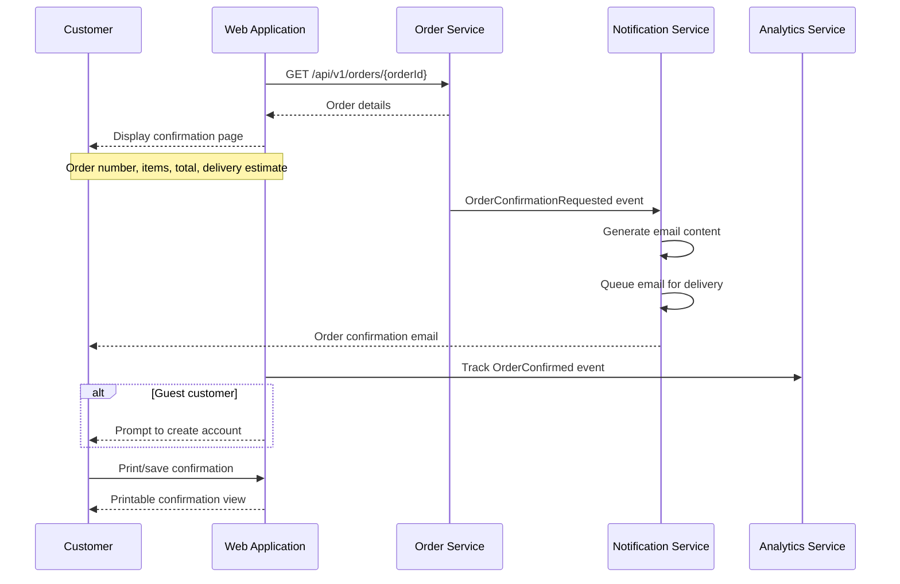

#### UI Requirements

- Order number prominently displayed
- Complete order summary with line items
- Estimated delivery date
- Shipping address confirmation
- Payment method used (masked)
- "Continue Shopping" button
- "View Order" link for order tracking
- Print confirmation option
- Create account prompt for guests
- Share/email confirmation option

#### API Contract: Get Order Details

**Request:**
```
GET /api/v1/orders/01941234-5678-7cde-def0-123456790001
Authorization: Bearer <jwt>
```

**Response:**
```json
{
  "orderId": "01941234-5678-7cde-def0-123456790001",
  "orderNumber": "ACME-20260117-000142",
  "status": "SUBMITTED",
  "createdAt": "2026-01-17T15:08:04Z",
  "customer": {
    "customerId": "01941234-5678-7abc-def0-123456789700",
    "email": "jane.doe@example.com",
    "name": "Jane Doe"
  },
  "lineItems": [
    {
      "lineItemId": "li_01941234-5678-7abc-def0-123456790301",
      "productId": "01941234-5678-7abc-def0-123456789003",
      "productName": "ACME Gaming Mouse Pro",
      "variantName": "Black",
      "sku": "ACME-GM-PRO-BLK",
      "imageUrl": "https://cdn.acme.com/products/gaming-mouse-pro-1.jpg",
      "quantity": 2,
      "unitPrice": {
        "amount": 69.99,
        "currency": "USD"
      },
      "lineTotal": {
        "amount": 139.98,
        "currency": "USD"
      }
    },
    {
      "lineItemId": "li_01941234-5678-7abc-def0-123456790302",
      "productId": "01941234-5678-7abc-def0-123456789004",
      "productName": "ACME Mechanical Keyboard",
      "variantName": "Blue Switches",
      "sku": "ACME-KB-MECH-BLU",
      "imageUrl": "https://cdn.acme.com/products/mechanical-keyboard-1.jpg",
      "quantity": 1,
      "unitPrice": {
        "amount": 109.99,
        "currency": "USD"
      },
      "lineTotal": {
        "amount": 109.99,
        "currency": "USD"
      }
    }
  ],
  "pricing": {
    "subtotal": {
      "amount": 249.97,
      "currency": "USD"
    },
    "shipping": {
      "amount": 5.99,
      "currency": "USD"
    },
    "discount": {
      "amount": 24.99,
      "currency": "USD"
    },
    "tax": {
      "amount": 20.12,
      "currency": "USD"
    },
    "total": {
      "amount": 251.09,
      "currency": "USD"
    }
  },
  "shippingAddress": {
    "recipientName": "Jane Doe",
    "line1": "123 Main St",
    "line2": "Apt 4B",
    "city": "New York",
    "state": "NY",
    "postalCode": "10001",
    "country": "US"
  },
  "shippingMethod": {
    "carrier": "ACME_LOGISTICS",
    "serviceLevel": "STANDARD",
    "displayName": "Standard Shipping",
    "cost": {
      "amount": 5.99,
      "currency": "USD"
    }
  },
  "estimatedDelivery": {
    "minDate": "2026-01-22",
    "maxDate": "2026-01-24"
  },
  "payment": {
    "method": "CREDIT_CARD",
    "brand": "VISA",
    "last4": "1111",
    "status": "AUTHORIZED"
  },
  "appliedPromotions": [
    {
      "code": "SAVE10",
      "description": "10% off your order",
      "discount": {
        "amount": 24.99,
        "currency": "USD"
      }
    }
  ]
}
```

#### Domain Event: OrderConfirmationEmailSent

```json
{
  "eventId": "01941234-5678-7abc-def0-123456789840",
  "eventType": "OrderConfirmationEmailSent",
  "eventVersion": "1.0",
  "timestamp": "2026-01-17T15:08:30Z",
  "aggregateId": "01941234-5678-7cde-def0-123456790001",
  "aggregateType": "Order",
  "correlationId": "01941234-5678-7abc-def0-123456789801",
  "payload": {
    "orderId": "01941234-5678-7cde-def0-123456790001",
    "orderNumber": "ACME-20260117-000142",
    "recipientEmail": "jane.doe@example.com",
    "emailId": "email_01941234-5678-7abc-def0-123456790400",
    "sentAt": "2026-01-17T15:08:30Z"
  }
}
```

#### Acceptance Criteria

| ID | Criterion | Priority |
|----|-----------|----------|
| AC-6.1 | Confirmation page displays order number prominently | Must Have |
| AC-6.2 | Estimated delivery date is shown clearly | Must Have |
| AC-6.3 | Confirmation email is sent within 60 seconds of order placement | Must Have |
| AC-6.4 | Guest customers are prompted to create an account | Should Have |
| AC-6.5 | Confirmation page is idempotent on refresh (no duplicate orders) | Must Have |
| AC-6.6 | Order confirmation page loads within 1 second (p95) | Must Have |
| AC-6.7 | Print-friendly confirmation format is available | Should Have |
| AC-6.8 | Order tracking link is provided in confirmation email | Must Have |

---

## Error Scenarios

### E1: Cart Validation Failure

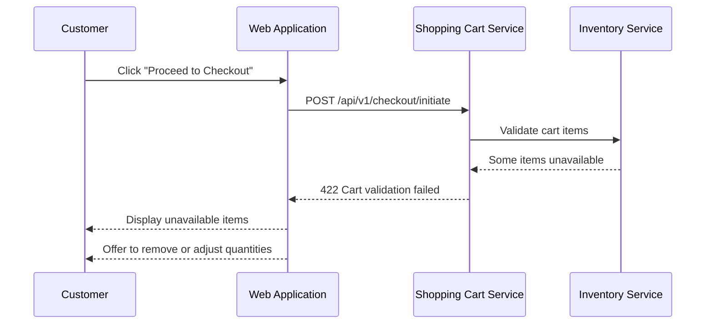

| ID | Criterion | Priority |
|----|-----------|----------|
| AC-E1.1 | Unavailable items are clearly identified | Must Have |
| AC-E1.2 | Available quantities are shown for low-stock items | Must Have |
| AC-E1.3 | Customer can remove items and retry checkout | Must Have |
| AC-E1.4 | Similar products are suggested as alternatives | Should Have |

### E2: Address Validation Failure

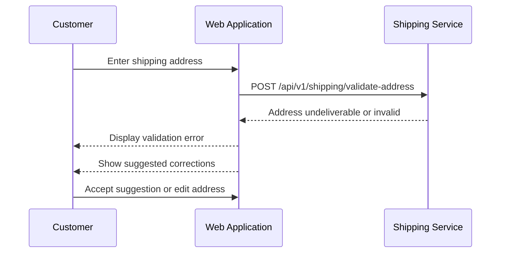

| ID | Criterion | Priority |
|----|-----------|----------|
| AC-E2.1 | Clear error message explains the address issue | Must Have |
| AC-E2.2 | Suggested corrections are offered when available | Must Have |
| AC-E2.3 | Customer can override validation with confirmation | Should Have |
| AC-E2.4 | Unserviceable areas are clearly indicated | Must Have |

### E3: Shipping Rate Unavailable

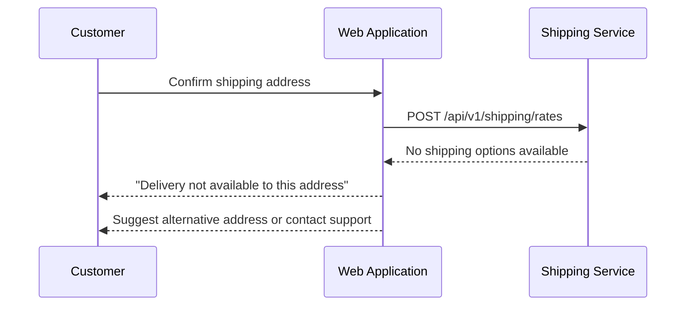

| ID | Criterion | Priority |
|----|-----------|----------|
| AC-E3.1 | Clear message explains delivery is unavailable | Must Have |
| AC-E3.2 | Alternative delivery options are suggested if available | Should Have |
| AC-E3.3 | Customer can change address and retry | Must Have |

### E4: Payment Authorization Failed

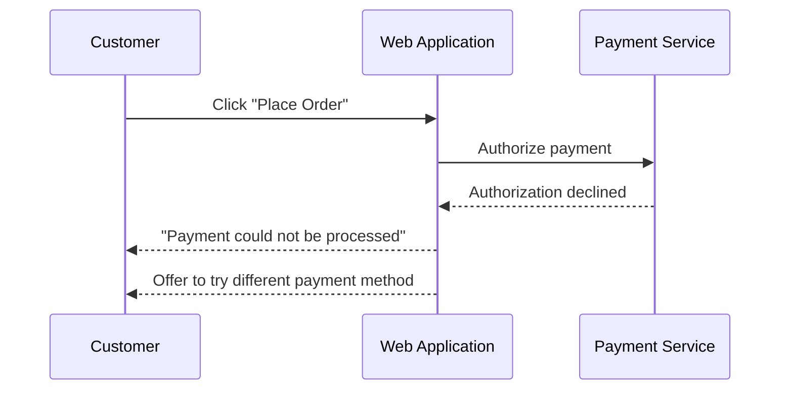

| ID | Criterion | Priority |
|----|-----------|----------|
| AC-E4.1 | Generic decline message shown (not detailed reason) | Must Have |
| AC-E4.2 | Customer can retry with different payment method | Must Have |
| AC-E4.3 | Payment errors do not create partial orders | Must Have |
| AC-E4.4 | Checkout session remains valid for retry | Must Have |

### E5: Inventory Reservation Failed

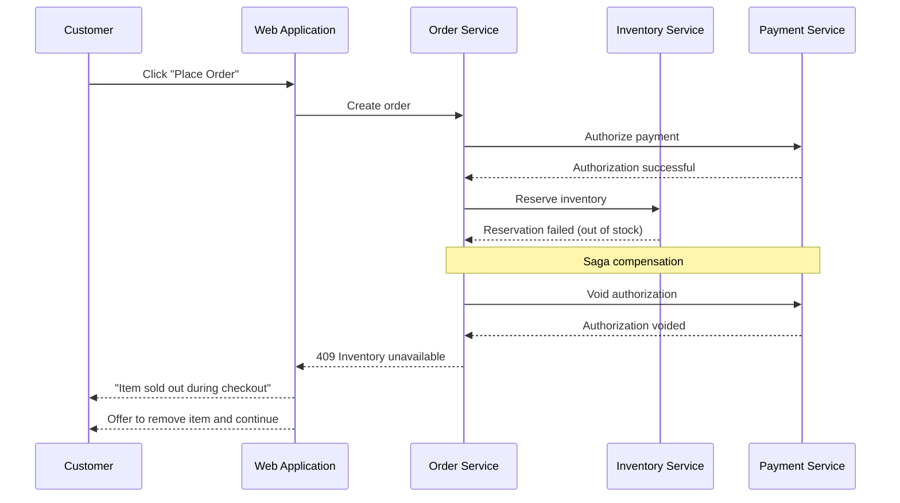

| ID | Criterion | Priority |
|----|-----------|----------|
| AC-E5.1 | Payment authorization is voided on inventory failure | Must Have |
| AC-E5.2 | Clear message identifies which items are unavailable | Must Have |
| AC-E5.3 | Customer can remove unavailable items and retry | Must Have |
| AC-E5.4 | Available items remain in cart | Must Have |

### E6: Checkout Session Expired

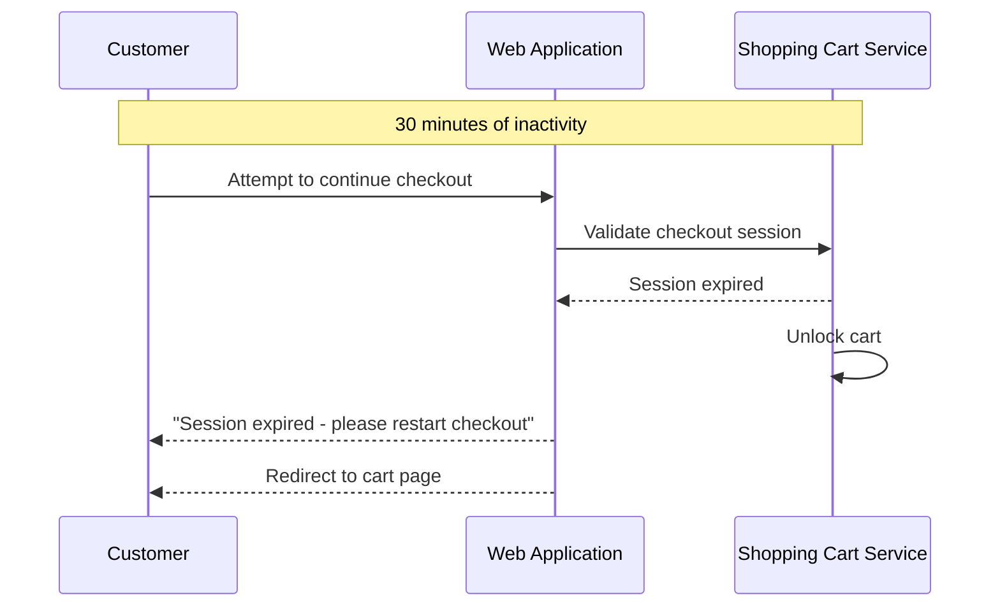

| ID | Criterion | Priority |
|----|-----------|----------|
| AC-E6.1 | Clear message explains session expiration | Must Have |
| AC-E6.2 | Cart is unlocked and items preserved | Must Have |
| AC-E6.3 | Customer can restart checkout process | Must Have |
| AC-E6.4 | Warning displayed before session expires | Should Have |

### E7: Order Creation Failed

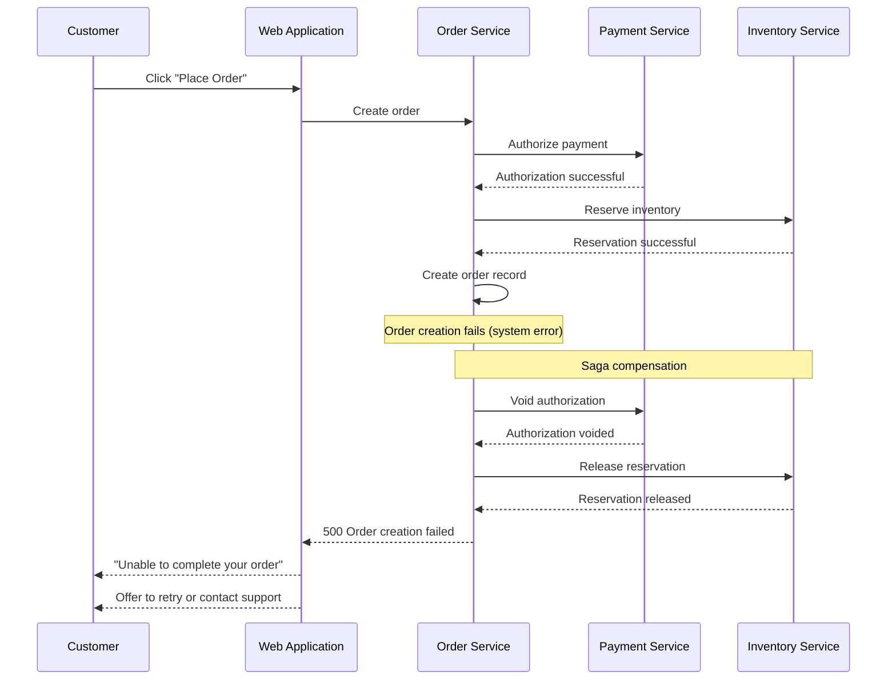

| ID | Criterion | Priority |
|----|-----------|----------|
| AC-E7.1 | Payment is voided on order creation failure | Must Have |
| AC-E7.2 | Inventory reservation is released on failure | Must Have |
| AC-E7.3 | Customer can retry the order | Must Have |
| AC-E7.4 | Support contact information is provided | Must Have |
| AC-E7.5 | Error is logged with full context for investigation | Must Have |

---

## Performance Requirements

| Operation | Target | Measurement |
|-----------|--------|-------------|
| Checkout initiation | p95 < 500ms | Time from request to checkout session created |
| Address validation | p95 < 1s | Time from address submit to validation result |
| Rate shopping | p95 < 3s | Time to retrieve all shipping options |
| Tax calculation | p95 < 500ms | Time to calculate tax estimate |
| Payment tokenization | p95 < 2s | Time to tokenize card data |
| Payment authorization | p95 < 3s | Time to authorize payment |
| Fraud screening | p95 < 1s | Time to complete fraud check |
| Inventory reservation | p95 < 500ms | Time to reserve inventory |
| Order creation | p95 < 1s | Time to create order record |
| Total checkout flow | p95 < 10s | End-to-end from initiate to confirmation |
| Confirmation email | < 60s | Time from order creation to email delivery |

---

## Analytics Events

The following events are tracked by the Analytics Service:

| Event | Trigger | Key Metrics |
|-------|---------|-------------|
| CheckoutInitiated | Customer starts checkout | Checkout attempts, cart value |
| CheckoutStepViewed | Customer views checkout step | Step views, drop-off points |
| ShippingAddressEntered | Address entered/selected | Address entry method, validation rate |
| ShippingMethodSelected | Shipping method chosen | Method popularity, cost distribution |
| PaymentMethodEntered | Payment entered/selected | Payment method types, new vs saved |
| OrderReviewViewed | Review page displayed | Time on review, promo code usage |
| PromoCodeApplied | Promo code entered | Code usage, discount amounts |
| PromoCodeFailed | Invalid promo code | Failure reasons |
| OrderPlaced | Order successfully placed | Conversion rate, order value |
| OrderFailed | Order placement failed | Failure reasons, step of failure |
| CheckoutAbandoned | Customer leaves checkout | Abandonment rate, step abandoned |
| PaymentDeclined | Payment authorization failed | Decline rate, retry rate |
| InventoryShortage | Items unavailable at checkout | Shortage frequency, lost revenue |
| CheckoutSessionExpired | Session timeout | Timeout rate, time before timeout |
| GuestCheckoutUsed | Guest completes checkout | Guest vs authenticated rate |
| AccountCreatedPostCheckout | Guest creates account after order | Conversion to account rate |

---

## Observability Requirements

### Distributed Tracing

All requests across this journey must propagate trace context:

```
traceparent: 00-{trace-id}-{span-id}-01
```

| Span | Service | Purpose |
|------|---------|---------|
| checkout_initiate | Shopping Cart | Checkout session creation |
| validate_cart | Inventory Service | Cart validation |
| lock_cart | Shopping Cart | Cart locking |
| validate_address | Shipping Service | Address validation |
| get_shipping_rates | Shipping Service | Rate shopping |
| calculate_tax | Pricing Service | Tax estimation |
| tokenize_payment | Payment Service | Card tokenization |
| calculate_totals | Pricing Service | Final pricing |
| place_order | Order Service | Order placement saga |
| fraud_screening | Fraud Service | Risk assessment |
| authorize_payment | Payment Service | Payment authorization |
| reserve_inventory | Inventory Service | Stock reservation |
| create_order | Order Service | Order record creation |
| convert_cart | Shopping Cart | Cart-to-order conversion |
| send_confirmation | Notification Service | Email delivery |

### Key Metrics

| Metric | Type | Labels |
|--------|------|--------|
| `checkout_initiated_total` | Counter | customer_type |
| `checkout_completed_total` | Counter | customer_type, payment_method |
| `checkout_failed_total` | Counter | failure_reason, step |
| `checkout_abandoned_total` | Counter | step |
| `checkout_duration_seconds` | Histogram | step |
| `order_total_amount` | Histogram | currency |
| `payment_authorization_total` | Counter | status, card_brand |
| `payment_authorization_duration` | Histogram | - |
| `inventory_reservation_total` | Counter | status |
| `shipping_rate_requests_total` | Counter | carrier |
| `address_validation_total` | Counter | status |
| `fraud_screening_total` | Counter | decision |
| `promo_code_usage_total` | Counter | status |

### Health Checks

Each service exposes:
- `GET /actuator/health/liveness` - Process is running
- `GET /actuator/health/readiness` - Dependencies available

### Alerting Thresholds

| Alert | Condition | Severity |
|-------|-----------|----------|
| Checkout conversion drop | > 20% drop from baseline | Critical |
| Payment authorization failures | > 5% failure rate for 5 minutes | Warning |
| Payment latency degraded | p95 > 5s for 5 minutes | Warning |
| Order creation failures | > 1% failure rate for 5 minutes | Critical |
| Inventory reservation failures | > 3% failure rate for 5 minutes | Warning |
| Fraud screening latency | p95 > 2s for 5 minutes | Warning |
| Checkout session timeout spike | > 50% increase from baseline | Warning |
| Address validation service down | Health check fails | Critical |

---

## Testing Strategy

### Unit Tests

- Cart validation logic
- Checkout session state management
- Order total calculations
- Promo code validation rules
- Address format validation
- Payment token handling
- Saga step orchestration
- Compensation logic

### Integration Tests

- Checkout initiation API contracts
- Shipping rate shopping across carriers
- Address validation service integration
- Payment gateway integration
- Inventory reservation API
- Order creation API
- Event publishing verification
- Saga compensation flows

### End-to-End Tests (Cucumber/Playwright)

```gherkin
Feature: Customer Shopping Cart Checkout Experience

  @customer
  Scenario: Customer completes checkout with new payment method
    Given I am an authenticated customer
    And I have items in my cart totaling $149.99
    When I proceed to checkout
    Then I should see the shipping step

    When I enter a new shipping address
    And I select "Standard Shipping" for $5.99
    Then I should see the payment step

    When I enter a new credit card
    And I proceed to review
    Then I should see the order summary with total $155.98 plus tax

    When I place the order
    Then I should see the order confirmation
    And I should receive an order confirmation email

  @customer
  Scenario: Guest customer completes checkout
    Given I am a guest customer
    And I have items in my cart
    When I proceed to checkout as guest
    And I complete the shipping information
    And I enter my payment information
    And I place the order
    Then I should see the order confirmation
    And I should be prompted to create an account

  @customer
  Scenario: Customer uses saved address and payment method
    Given I am an authenticated customer with saved addresses and payments
    And I have items in my cart
    When I proceed to checkout
    And I select my saved shipping address
    And I select my saved payment method
    And I enter my CVV
    And I place the order
    Then I should see the order confirmation

  @customer
  Scenario: Customer applies promo code at checkout
    Given I am at the order review step
    When I enter promo code "SAVE10"
    Then I should see a 10% discount applied
    And the order total should be reduced

  @customer
  Scenario: Invalid promo code is rejected
    Given I am at the order review step
    When I enter promo code "EXPIRED"
    Then I should see "This promo code is no longer valid"
    And no discount should be applied

  @customer
  Scenario: Payment authorization fails
    Given I am at the order review step with a card that will be declined
    When I place the order
    Then I should see "Your payment could not be processed"
    And I should be able to enter a different payment method

  @customer
  Scenario: Item becomes unavailable during checkout
    Given I am at the order review step
    And the last unit of an item in my cart is purchased by another customer
    When I place the order
    Then I should see "Item sold out during checkout"
    And I should be offered to remove the item and continue

  @customer
  Scenario: Checkout session expires
    Given I started checkout 30 minutes ago
    When I try to place the order
    Then I should see "Your session has expired"
    And I should be redirected to my cart
    And my cart items should be preserved

  @customer
  Scenario: Address validation suggests correction
    Given I am on the shipping step
    When I enter "123 Main" without street type
    Then I should see a suggested address "123 Main St"
    And I should be able to accept the suggestion

  @customer
  Scenario: Free shipping threshold reached
    Given I have items totaling $75 in my cart
    When I view shipping options
    Then I should see "Free Standard Shipping" as an option

  @customer
  Scenario: International shipping with duty estimate
    Given I am shipping to Canada
    When I view shipping options
    Then I should see estimated duties and taxes

  @api
  Scenario: Checkout API idempotency
    Given I have a valid checkout session
    When I place the same order twice with the same idempotency key
    Then only one order should be created
    And both requests should return the same order ID
```

### Performance Tests

| Test | Target | Tool |
|------|--------|------|
| Checkout initiation throughput | 200 req/s | k6 |
| Checkout completion throughput | 100 req/s | k6 |
| Concurrent checkouts | 500 simultaneous | k6 |
| Rate shopping latency | p95 < 3s | k6 |
| Payment authorization latency | p95 < 3s | k6 |
| Order creation latency | p95 < 1s | k6 |
| End-to-end checkout | p95 < 10s | k6 |
| Saga compensation | 100% completion | k6 |

---

## Security Considerations

| Concern | Mitigation |
|---------|------------|
| PCI-DSS Compliance | Card data tokenized immediately; raw data never stored or logged |
| Card Tokenization | Payment data sent directly to PCI-compliant tokenization service |
| Fraud Prevention | Pre-authorization fraud screening with risk scoring |
| Session Security | Checkout sessions expire after 30 minutes; bound to user session |
| Cart Locking | Concurrent modification prevented during checkout |
| Rate Limiting | Checkout initiation limited to 10 requests/minute per session |
| Input Validation | All inputs validated server-side; XSS prevention |
| CSRF Protection | CSRF tokens on all state-changing operations |
| Price Tampering | Server-side price calculation; client values never trusted |
| Idempotency | Idempotency keys prevent duplicate orders |
| Data Encryption | All data encrypted in transit (TLS 1.3) and at rest |

---

## Implementation Phases

### Phase 1: MVP Checkout
- Basic checkout flow (address, shipping, payment)
- Single payment method (credit card)
- Single carrier for shipping
- Guest checkout only
- Order creation and confirmation
- Basic email confirmation

### Phase 2: Enhanced Payment
- Saved payment methods for authenticated users
- Multiple payment gateways with failover
- 3D Secure authentication support
- Fraud screening integration
- Improved decline handling

### Phase 3: Enhanced Shipping
- Multi-carrier rate shopping
- Address validation and correction
- Delivery date estimation based on fulfillment location
- International shipping support with duty estimation
- Free shipping threshold

### Phase 4: Optimizations
- Authenticated customer checkout with saved preferences
- Promotion code support at checkout
- Express checkout (skip steps with saved info)
- Checkout session recovery
- Abandonment detection and recovery emails

### Phase 5: Advanced Features
- Split shipment support (multiple fulfillment locations)
- Subscription orders and recurring payments
- Gift wrapping options
- Buy Online Pickup In Store (BOPIS)
- Apple Pay / Google Pay integration

---

## Related Documents

- [Architecture Overview](../ARCHITECTURE.md)
- [Implementation Guidelines](../IMPLEMENTATION.md)
- [Order Management Epic](../epics/005-order-management.md)
- [Payment Management Epic](../epics/008-payment-management.md)
- [Shipping & Fulfillment Epic](../epics/007-shipping-fulfillment-management.md)
- [Shopping Cart Management Epic](../epics/009-shopping-cart-management.md)
- [Pricing Management Epic](../epics/011-pricing-management.md)
- [Product Inventory Epic](../epics/003-product-inventory.md)
- [User Journey: Customer Signin](./0003-customer-signin.md)
- [User Journey: Customer Shopping Experience](./0004-customer-shopping-experience.md)

---

## Appendix: Event Catalog

| Event | Producer | Consumers |
|-------|----------|-----------|
| CheckoutInitiated | Shopping Cart Service | Analytics |
| CartLocked | Shopping Cart Service | Analytics |
| ShippingAddressSelected | Checkout Session | Analytics |
| ShippingMethodSelected | Checkout Session | Analytics |
| PaymentMethodSelected | Checkout Session | Analytics |
| PaymentInitiated | Order Service | Analytics |
| FraudScreeningCompleted | Fraud Service | Order Service, Analytics |
| PaymentAuthorized | Payment Service | Order Service, Analytics |
| PaymentAuthorizationFailed | Payment Service | Order Service, Analytics, Notification |
| InventoryReserved | Inventory Service | Order Service, Analytics |
| InventoryReservationFailed | Inventory Service | Order Service, Analytics |
| OrderCreated | Order Service | Analytics, Customer Service |
| OrderSubmitted | Order Service | Shipping Service, Analytics |
| CartConvertedToOrder | Shopping Cart Service | Analytics |
| OrderConfirmationEmailSent | Notification Service | Analytics |
| CheckoutAbandoned | Shopping Cart Service | Notification Service, Marketing |
| CheckoutSessionExpired | Shopping Cart Service | Analytics |
