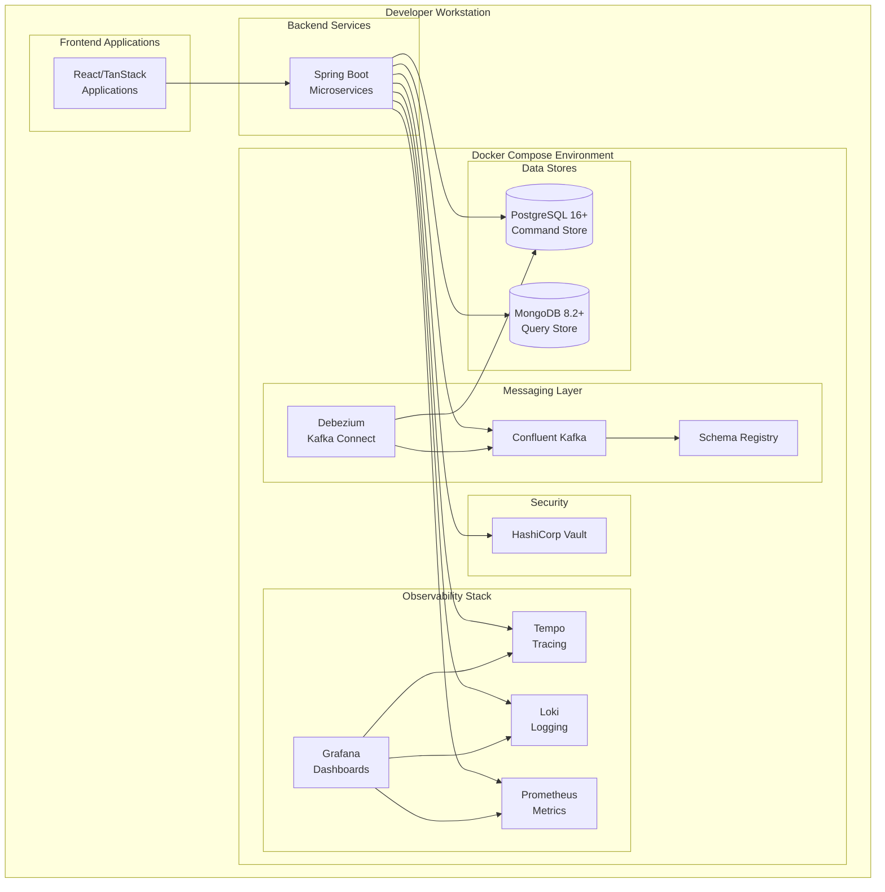
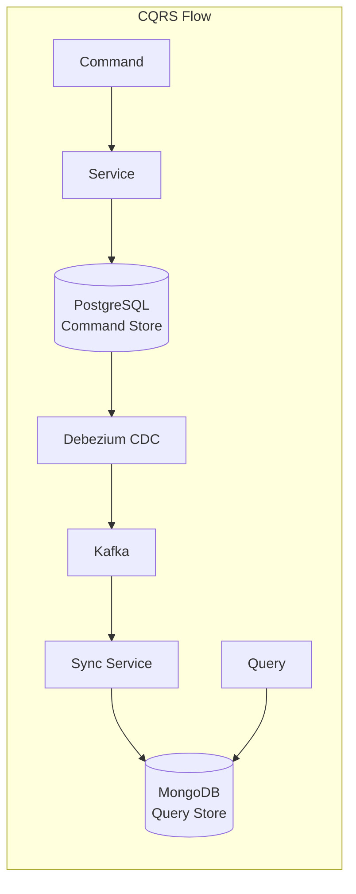
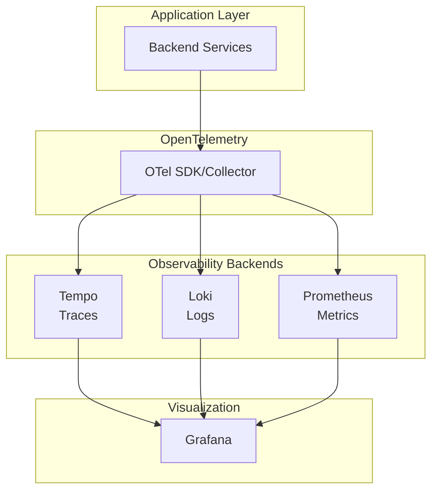

# User Story 0000: Core Infrastructure Setup

## User Story

**As a** development team member,
**I want** a fully containerized local development infrastructure,
**So that** I can develop, test, and debug all platform services locally with production-like dependencies.

## Overview

This user story establishes the foundational infrastructure for the ACME Inc. e-commerce platform. The infrastructure uses Docker Compose to orchestrate all required services, enabling developers to run the complete platform locally with a single command.

## Business Value

- **Developer Productivity**: Eliminates "works on my machine" issues by providing consistent environments
- **Fast Onboarding**: New team members can start contributing within minutes
- **Production Parity**: Local environment mirrors production, reducing deployment surprises
- **Cost Efficiency**: No cloud resources needed for local development and testing

## Infrastructure Components

### Data Stores

| Component | Version | Docker Image | Purpose |
|-----------|---------|--------------|---------|
| PostgreSQL | 16+ | `quay.io/debezium/postgres:latest` | Command store (read-write) for CQRS pattern |
| MongoDB | 8.2+ | `mongo:8.2` | Query store (read-only) for optimized reads |

### Messaging & Event Streaming

| Component | Docker Image | Purpose |
|-----------|--------------|---------|
| Confluent Kafka | `confluentinc/cp-kafka:latest` | Event streaming and async messaging between services |
| Confluent Schema Registry | `confluentinc/cp-schema-registry:latest` | Avro schema management for Kafka messages |
| Debezium Kafka Connect | `quay.io/debezium/connect:latest` | Change Data Capture from PostgreSQL to Kafka |

### Security

| Component | Purpose |
|-----------|---------|
| HashiCorp Vault | Secrets management, API keys, database credentials |

### Observability Stack

| Component | Purpose |
|-----------|---------|
| Grafana | Observability dashboards and visualization |
| Tempo | Distributed tracing backend (OpenTelemetry) |
| Loki | Log aggregation backend (OpenTelemetry) |
| Prometheus | Metrics collection and storage (OpenTelemetry) |

## Architecture Diagram



## Data Flow Diagram



## Observability Flow



## Directory Structure

```
acme-inc-2026/
├── docker-compose.yml           # Main compose file
├── docker/
│   ├── postgres/
│   │   └── init/               # PostgreSQL initialization scripts
│   ├── mongodb/
│   │   └── init/               # MongoDB initialization scripts
│   ├── kafka/
│   │   └── config/             # Kafka configuration
│   ├── debezium/
│   │   └── connectors/         # Debezium connector configurations
│   ├── vault/
│   │   ├── config/             # Vault configuration
│   │   └── policies/           # Vault access policies
│   ├── grafana/
│   │   ├── provisioning/       # Dashboard and datasource provisioning
│   │   └── dashboards/         # Pre-built dashboards
│   ├── tempo/
│   │   └── config/             # Tempo configuration
│   ├── loki/
│   │   └── config/             # Loki configuration
│   └── prometheus/
│       └── config/             # Prometheus configuration and rules
```

## Implementation Notes

### Docker Compose Configuration

The `docker-compose.yml` file should be placed in the repository root for easy access. Key considerations:

1. **Service Dependencies**: Define proper `depends_on` conditions to ensure services start in correct order
2. **Health Checks**: All services should have health checks for readiness
3. **Named Volumes**: Use named volumes for data persistence across restarts
4. **Networks**: Use a dedicated bridge network for service isolation
5. **Environment Variables**: Support `.env` file for local configuration overrides

### PostgreSQL Setup

- **Use Debezium-sourced image**: `quay.io/debezium/postgres:latest`
  - Pre-configured with logical replication enabled
  - Replication slots already configured for CDC
- Create separate databases for each backend service
- Configure appropriate connection pooling settings
- Include initialization scripts for schema setup

### MongoDB Setup

- Configure as a single-node replica set (required for change streams)
- Create collections with appropriate indexes for query patterns
- Set up users with minimal required permissions

### Kafka Setup

- Configure with multiple partitions for scalability testing
- Enable schema registry integration
- Set up appropriate retention policies
- Configure for development (relaxed replication settings)

### Debezium Configuration

- **Use Debezium Connect image**: `quay.io/debezium/connect:latest`
  - Includes PostgreSQL connector plugin pre-installed
- Configure connectors for each PostgreSQL database
- Use Avro format with Schema Registry integration
- Set up appropriate topic naming conventions
- Configure for CDC on relevant tables

### Vault Setup

- Initialize in development mode for local use
- Pre-seed with development secrets
- Configure appropriate auth methods
- Set up policies for service access

### Observability Stack

- Pre-configure Grafana with datasources (Tempo, Loki, Prometheus)
- Include default dashboards for infrastructure health
- Configure appropriate retention periods for local development
- Set up correlation between traces, logs, and metrics

## Related Documents

- [Architecture Overview](../../ARCHITECTURE.md)
- [Implementation Guidelines](../../IMPLEMENTATION.md)
- [Acceptance Criteria](./acceptance-criteria.md)
