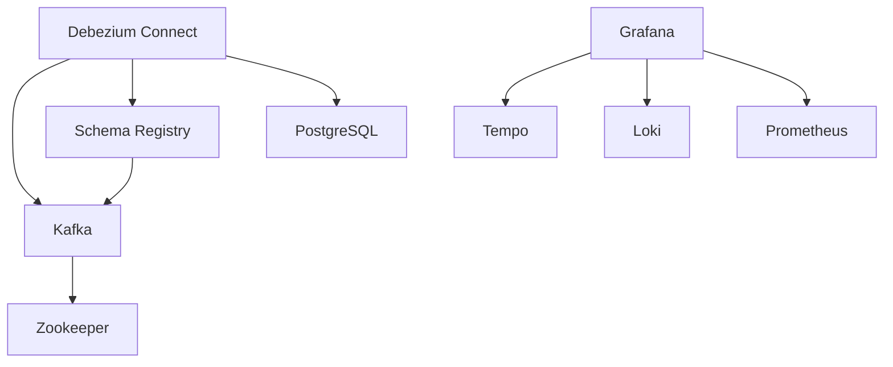

# Acceptance Criteria: Core Infrastructure Setup

## Overview

This document defines the acceptance criteria for User Story 0000: Core Infrastructure Setup. Each criterion includes verification steps and expected outcomes.

## AC-001: Docker Compose Orchestration

**Given** the repository is cloned and Docker is running
**When** I run `docker compose up -d` from the repository root
**Then** all infrastructure services start successfully within 5 minutes

### Verification

```bash
# Start all services
docker compose up -d

# Verify all services are running
docker compose ps

# Expected: All services show "Up" or "Up (healthy)" status
```

### Sub-criteria

- [ ] Docker Compose file exists at repository root (`docker-compose.yml`)
- [ ] All services define health checks
- [ ] Services start in correct dependency order
- [ ] Named volumes persist data across restarts
- [ ] A `.env.example` file documents required environment variables

## AC-002: PostgreSQL Command Store

**Given** the Docker Compose environment is running
**When** I connect to PostgreSQL
**Then** the database is accessible and configured for CDC

### Verification

```bash
# Connect to PostgreSQL
docker compose exec postgres psql -U postgres -c "SELECT version();"

# Verify logical replication is enabled
docker compose exec postgres psql -U postgres -c "SHOW wal_level;"
# Expected: logical

# Verify replica identity is set
docker compose exec postgres psql -U postgres -c "SHOW max_replication_slots;"
# Expected: >= 4
```

### Sub-criteria

- [ ] PostgreSQL 16+ is running
- [ ] Logical replication is enabled (`wal_level = logical`)
- [ ] Sufficient replication slots are configured
- [ ] Initialization scripts execute on first startup
- [ ] Connection credentials are managed via environment variables

## AC-003: MongoDB Query Store

**Given** the Docker Compose environment is running
**When** I connect to MongoDB
**Then** the database is accessible and configured as a replica set

### Verification

```bash
# Connect to MongoDB
docker compose exec mongodb mongosh --eval "db.version()"

# Verify replica set status
docker compose exec mongodb mongosh --eval "rs.status()"
# Expected: Replica set initialized with one member
```

### Sub-criteria

- [ ] MongoDB 8.2+ is running
- [ ] Configured as a single-node replica set
- [ ] Change streams are enabled (requires replica set)
- [ ] Initialization scripts execute on first startup
- [ ] Connection credentials are managed via environment variables

## AC-004: Confluent Kafka Messaging

**Given** the Docker Compose environment is running
**When** I interact with Kafka
**Then** I can create topics and produce/consume messages

### Verification

```bash
# List existing topics
docker compose exec kafka kafka-topics --bootstrap-server localhost:9092 --list

# Create a test topic
docker compose exec kafka kafka-topics --bootstrap-server localhost:9092 \
  --create --topic test-topic --partitions 3 --replication-factor 1

# Produce a message
echo "test message" | docker compose exec -T kafka \
  kafka-console-producer --bootstrap-server localhost:9092 --topic test-topic

# Consume the message
docker compose exec kafka kafka-console-consumer \
  --bootstrap-server localhost:9092 --topic test-topic --from-beginning --max-messages 1
```

### Sub-criteria

- [ ] Kafka broker is running and accessible
- [ ] Default topics are pre-created if specified
- [ ] Broker is configured for development (single broker, relaxed settings)
- [ ] Logs are accessible for debugging

## AC-005: Schema Registry

**Given** the Docker Compose environment is running
**When** I access the Schema Registry API
**Then** I can register and retrieve Avro schemas

### Verification

```bash
# Check Schema Registry health
curl -s http://localhost:8081/subjects | jq .

# Register a test schema
curl -X POST -H "Content-Type: application/vnd.schemaregistry.v1+json" \
  --data '{"schema": "{\"type\": \"record\", \"name\": \"Test\", \"fields\": [{\"name\": \"id\", \"type\": \"string\"}]}"}' \
  http://localhost:8081/subjects/test-value/versions

# Retrieve the schema
curl -s http://localhost:8081/subjects/test-value/versions/latest | jq .
```

### Sub-criteria

- [ ] Schema Registry is running and accessible on port 8081
- [ ] Connected to Kafka for schema storage
- [ ] Supports Avro schema registration
- [ ] Schema compatibility mode is configurable

## AC-006: Debezium CDC Connector

**Given** the Docker Compose environment is running
**When** data changes occur in PostgreSQL
**Then** change events are published to Kafka topics

### Verification

```bash
# Check Kafka Connect status
curl -s http://localhost:8083/connectors | jq .

# List available connector plugins
curl -s http://localhost:8083/connector-plugins | jq '.[] | .class'
# Expected: Should include io.debezium.connector.postgresql.PostgresConnector

# Register a PostgreSQL connector (example)
# Connector configuration files should be provided in docker/debezium/connectors/
```

### Sub-criteria

- [ ] Kafka Connect is running with Debezium plugins
- [ ] PostgreSQL connector plugin is available
- [ ] Connector configuration templates are provided
- [ ] Connectors can be registered via REST API
- [ ] CDC events use Avro format with Schema Registry

## AC-007: HashiCorp Vault Secrets Management

**Given** the Docker Compose environment is running
**When** I access Vault
**Then** I can authenticate and retrieve secrets

### Verification

```bash
# Check Vault status
docker compose exec vault vault status

# Login (dev mode uses root token)
docker compose exec vault vault login token=root

# Write a secret
docker compose exec vault vault kv put secret/test key=value

# Read the secret
docker compose exec vault vault kv get secret/test
```

### Sub-criteria

- [ ] Vault is running in development mode
- [ ] Root token is set to a known value for local development
- [ ] KV secrets engine is enabled
- [ ] Pre-seeded with development secrets (database credentials, etc.)
- [ ] UI is accessible on port 8200

## AC-008: Grafana Dashboards

**Given** the Docker Compose environment is running
**When** I access the Grafana UI
**Then** I can view pre-configured dashboards with data from all observability backends

### Verification

```bash
# Access Grafana UI
open http://localhost:3000
# Default credentials: admin/admin

# Check datasource provisioning via API
curl -s -u admin:admin http://localhost:3000/api/datasources | jq '.[].name'
# Expected: Prometheus, Loki, Tempo
```

### Sub-criteria

- [ ] Grafana is accessible on port 3000
- [ ] Prometheus datasource is pre-configured
- [ ] Loki datasource is pre-configured
- [ ] Tempo datasource is pre-configured
- [ ] Infrastructure health dashboard is provisioned
- [ ] Dashboard JSON files are version controlled

## AC-009: Tempo Distributed Tracing

**Given** the Docker Compose environment is running
**When** services send trace data
**Then** traces are stored and queryable via Grafana

### Verification

```bash
# Check Tempo readiness
curl -s http://localhost:3200/ready
# Expected: ready

# Tempo API endpoint
curl -s http://localhost:3200/api/status/buildinfo | jq .
```

### Sub-criteria

- [ ] Tempo is running and healthy
- [ ] Accepts OTLP traces (gRPC on 4317, HTTP on 4318)
- [ ] Traces are queryable via Grafana Tempo datasource
- [ ] Appropriate retention is configured for local development

## AC-010: Loki Log Aggregation

**Given** the Docker Compose environment is running
**When** services send log data
**Then** logs are stored and queryable via Grafana

### Verification

```bash
# Check Loki readiness
curl -s http://localhost:3100/ready
# Expected: ready

# Query logs via Loki API
curl -s "http://localhost:3100/loki/api/v1/labels" | jq .
```

### Sub-criteria

- [ ] Loki is running and healthy
- [ ] Accepts logs via OTLP (through OTel Collector) or Loki push API
- [ ] Logs are queryable via Grafana Loki datasource
- [ ] Appropriate retention is configured for local development

## AC-011: Prometheus Metrics

**Given** the Docker Compose environment is running
**When** services expose metrics
**Then** Prometheus scrapes and stores the metrics

### Verification

```bash
# Check Prometheus status
curl -s http://localhost:9090/-/ready
# Expected: Prometheus is Ready.

# Query Prometheus targets
curl -s http://localhost:9090/api/v1/targets | jq '.data.activeTargets | length'

# Run a simple query
curl -s 'http://localhost:9090/api/v1/query?query=up' | jq '.data.result'
```

### Sub-criteria

- [ ] Prometheus is running and healthy
- [ ] Configured to scrape infrastructure services
- [ ] Accepts metrics via OTLP (through OTel Collector) or Prometheus remote write
- [ ] Metrics are queryable via Grafana Prometheus datasource
- [ ] Appropriate retention is configured for local development

## AC-012: Service Dependencies and Startup Order

**Given** all services are stopped
**When** I start the Docker Compose environment
**Then** services start in the correct order based on dependencies

### Verification

```bash
# Stop all services
docker compose down

# Start and observe startup order
docker compose up -d
docker compose logs -f --until=60s 2>&1 | head -100
```

### Dependency Graph



### Sub-criteria

- [ ] `depends_on` with health check conditions for all dependencies
- [ ] No circular dependencies
- [ ] Services wait for dependencies to be healthy, not just started
- [ ] Graceful handling of dependency failures

## AC-013: Data Persistence

**Given** the Docker Compose environment has been running with data
**When** I stop and restart the environment
**Then** all data persists across restarts

### Verification

```bash
# Create test data
docker compose exec postgres psql -U postgres -c "CREATE TABLE test_persist(id int);"
docker compose exec postgres psql -U postgres -c "INSERT INTO test_persist VALUES (1);"

# Restart services
docker compose down
docker compose up -d

# Verify data persistence
docker compose exec postgres psql -U postgres -c "SELECT * FROM test_persist;"
# Expected: Returns the inserted row
```

### Sub-criteria

- [ ] PostgreSQL data persists via named volume
- [ ] MongoDB data persists via named volume
- [ ] Kafka data persists via named volume
- [ ] Prometheus data persists via named volume
- [ ] Grafana configuration persists via named volume

## AC-014: Network Isolation

**Given** the Docker Compose environment is running
**When** services communicate
**Then** all communication occurs over the dedicated Docker network

### Verification

```bash
# List networks
docker network ls | grep acme

# Inspect network
docker network inspect acme-inc-network
```

### Sub-criteria

- [ ] Dedicated bridge network is created
- [ ] All services are attached to the network
- [ ] Services can resolve each other by container name
- [ ] Appropriate ports are exposed to host for development access

## AC-015: Documentation and Developer Experience

**Given** I am a new developer joining the project
**When** I read the infrastructure documentation
**Then** I can start the environment and understand the architecture

### Sub-criteria

- [ ] README documents how to start the environment
- [ ] All environment variables are documented in `.env.example`
- [ ] Common troubleshooting scenarios are documented
- [ ] Architecture diagrams explain service relationships
- [ ] Each service's purpose is documented

## Summary Checklist

| AC | Description | Status |
|----|-------------|--------|
| AC-001 | Docker Compose Orchestration | [ ] |
| AC-002 | PostgreSQL Command Store | [ ] |
| AC-003 | MongoDB Query Store | [ ] |
| AC-004 | Confluent Kafka Messaging | [ ] |
| AC-005 | Schema Registry | [ ] |
| AC-006 | Debezium CDC Connector | [ ] |
| AC-007 | HashiCorp Vault Secrets | [ ] |
| AC-008 | Grafana Dashboards | [ ] |
| AC-009 | Tempo Distributed Tracing | [ ] |
| AC-010 | Loki Log Aggregation | [ ] |
| AC-011 | Prometheus Metrics | [ ] |
| AC-012 | Service Dependencies | [ ] |
| AC-013 | Data Persistence | [ ] |
| AC-014 | Network Isolation | [ ] |
| AC-015 | Documentation | [ ] |
