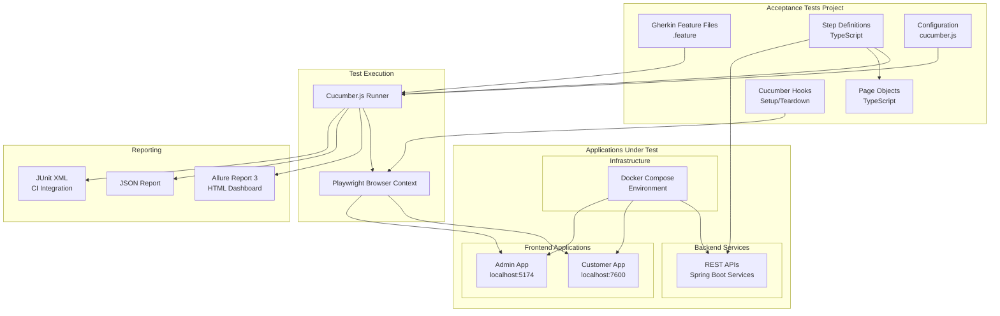
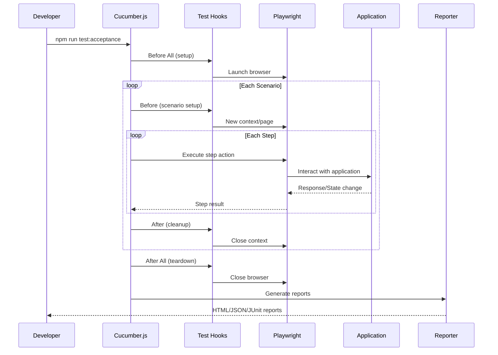
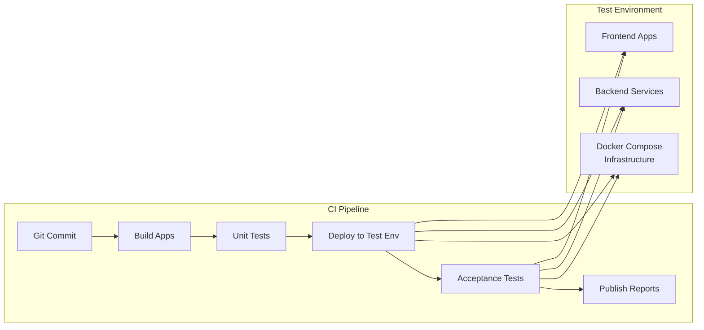

# User Story 0001: Acceptance Testing Infrastructure

## User Story

**As a** QA engineer or developer,
**I want** an automated acceptance testing framework integrated into the project,
**So that** I can validate user story acceptance criteria through executable specifications and ensure the platform
meets business requirements.

## Overview

This user story establishes the acceptance testing infrastructure for the ACME Inc. e-commerce platform. The framework
uses Cucumber.js for behavior-driven development (BDD) style tests and Playwright for browser automation, enabling teams
to write executable specifications that verify both frontend applications and backend services meet their acceptance
criteria.

## Business Value

- **Quality Assurance**: Automated verification of user story acceptance criteria reduces manual testing effort
- **Living Documentation**: Gherkin feature files serve as both tests and documentation
- **Regression Prevention**: Automated tests catch regressions early in the development cycle
- **Stakeholder Communication**: Non-technical stakeholders can read and validate Gherkin scenarios
- **Continuous Integration**: Tests can run automatically on every commit or pull request

## Technology Stack

| Component   | Technology        | Purpose                                        |
|-------------|-------------------|------------------------------------------------|
| Test Runner | Cucumber.js       | BDD framework for executing Gherkin specs      |
| Browser     | Playwright        | Cross-browser automation and E2E testing       |
| Language    | TypeScript        | Type-safe test implementation                  |
| Assertions  | Playwright Expect | Built-in assertion library                     |
| Reporting   | Allure Report 3   | Rich HTML test reports with history and trends |

## Architecture Diagram



## Test Flow Diagram



## Directory Structure

```
acme-inc-2026/
├── acceptance-tests/
│   ├── package.json                 # Project dependencies
│   ├── tsconfig.json                # TypeScript configuration
│   ├── cucumber.js                  # Cucumber configuration
│   ├── playwright.config.ts         # Playwright configuration
│   ├── .env.example                 # Environment variables template
│   │
│   ├── features/                    # Gherkin feature files
│   │   ├── customer/                # Customer app features
│   │   │   ├── authentication.feature
│   │   │   ├── product-catalog.feature
│   │   │   ├── shopping-cart.feature
│   │   │   └── checkout.feature
│   │   └── admin/                   # Admin app features
│   │       ├── product-management.feature
│   │       ├── order-management.feature
│   │       └── user-management.feature
│   │
│   ├── steps/                       # Step definitions
│   │   ├── common/                  # Shared step definitions
│   │   │   ├── navigation.steps.ts
│   │   │   └── assertions.steps.ts
│   │   ├── customer/                # Customer app steps
│   │   │   ├── authentication.steps.ts
│   │   │   ├── product-catalog.steps.ts
│   │   │   ├── shopping-cart.steps.ts
│   │   │   └── checkout.steps.ts
│   │   └── admin/                   # Admin app steps
│   │       ├── product-management.steps.ts
│   │       ├── order-management.steps.ts
│   │       └── user-management.steps.ts
│   │
│   ├── pages/                       # Page Object Models
│   │   ├── customer/                # Customer app pages
│   │   │   ├── home.page.ts
│   │   │   ├── login.page.ts
│   │   │   ├── product-list.page.ts
│   │   │   ├── product-detail.page.ts
│   │   │   ├── cart.page.ts
│   │   │   └── checkout.page.ts
│   │   └── admin/                   # Admin app pages
│   │       ├── dashboard.page.ts
│   │       ├── products.page.ts
│   │       ├── orders.page.ts
│   │       └── users.page.ts
│   │
│   ├── support/                     # Test support utilities
│   │   ├── hooks.ts                 # Cucumber hooks (Before/After)
│   │   ├── world.ts                 # Custom World class
│   │   ├── api-client.ts            # API interaction utilities
│   │   └── test-data.ts             # Test data factories
│   │
│   ├── allure-results/              # Allure test result files
│   │   └── *.json                   # Individual test results
│   │
│   ├── allure-report/               # Generated Allure HTML report
│   │   └── index.html               # Report entry point
│   │
│   └── reports/                     # Additional test reports
│       ├── cucumber-report.json     # JSON report for programmatic access
│       └── junit.xml                # JUnit XML for CI integration
```

## Implementation Notes

### Cucumber.js Configuration

The `cucumber.js` file configures the test runner:

- **Feature paths**: Location of `.feature` files
- **Step definitions**: TypeScript step definition files
- **Formatters**: Allure, JSON, and JUnit reporters
- **Parallel execution**: Configure worker processes
- **Tags**: Filter scenarios by tags (e.g., `@smoke`, `@regression`)

### Allure Report 3 Integration

Allure Report 3 provides rich test reporting:

- **Test history**: Track test results over time
- **Trend charts**: Visualize pass/fail trends
- **Categories**: Group failures by type
- **Attachments**: Screenshots, logs, and traces attached to test results
- **Environment info**: Display test environment details
- **Documentation**: https://allurereport.org/docs/v3/

### Playwright Integration

Playwright provides browser automation capabilities:

- **Multiple browsers**: Test on Chromium, Firefox, and WebKit
- **Headless mode**: Run tests without visible browser for CI
- **Screenshots**: Capture on failure for debugging
- **Video recording**: Optional video capture of test runs
- **Network interception**: Mock API responses when needed

### Page Object Pattern

Page objects encapsulate UI interactions:

- Each page has a corresponding Page Object class
- Locators are centralized in the page object
- Actions are exposed as methods
- Assertions can use Playwright's built-in expect

### Custom World Class

The Cucumber World class provides:

- Shared state between steps
- Access to Playwright page and context
- API client for backend interactions
- Test data management utilities

### Environment Configuration

Tests support multiple environments:

- **Local**: Tests against local Docker Compose environment
- **CI**: Tests against CI/CD deployed environment
- **Staging**: Tests against staging environment

### Test Data Management

Strategies for test data:

- **API seeding**: Create test data via API before tests
- **Database fixtures**: Direct database seeding for complex scenarios
- **Data factories**: Generate test data programmatically
- **Cleanup hooks**: Remove test data after scenarios

## Integration with CI/CD



## NPM Scripts

| Script                    | Description                               |
|---------------------------|-------------------------------------------|
| `npm run test`            | Run all acceptance tests                  |
| `npm run test:smoke`      | Run smoke test suite (@smoke tag)         |
| `npm run test:regression` | Run full regression suite                 |
| `npm run test:customer`   | Run customer app tests only               |
| `npm run test:admin`      | Run admin app tests only                  |
| `npm run test:headed`     | Run tests with visible browser            |
| `npm run allure:generate` | Generate Allure HTML report from results  |
| `npm run allure:open`     | Open Allure report in browser             |
| `npm run allure:serve`    | Generate and serve Allure report          |

## Related Documents

- [Implementation Guidelines](../../IMPLEMENTATION.md)
- [Core Infrastructure Setup](../0000-infrastructure/README.md)
- [Acceptance Criteria](./acceptance-criteria.md)
