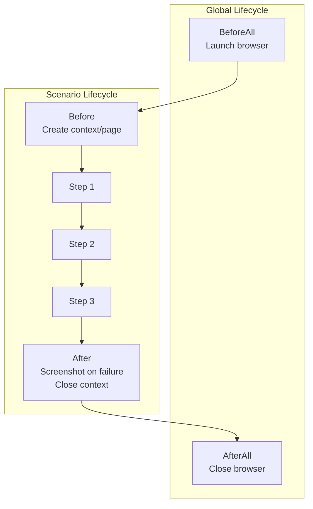

# Acceptance Criteria: Acceptance Testing Infrastructure

## Overview

This document defines the acceptance criteria for User Story 0001: Acceptance Testing Infrastructure. Each criterion includes verification steps and expected outcomes.

## AC-001: Project Structure and Dependencies

**Given** the repository is cloned
**When** I navigate to the `acceptance-tests` directory
**Then** the project is properly structured with all required dependencies

### Verification

```bash
# Navigate to acceptance-tests directory
cd acceptance-tests

# Verify package.json exists and install dependencies
npm install

# Verify TypeScript compilation
npm run build
```

### Sub-criteria

- [ ] `acceptance-tests` directory exists at repository root
- [ ] `package.json` includes Cucumber.js dependency (`@cucumber/cucumber`)
- [ ] `package.json` includes Playwright dependency (`@playwright/test`)
- [ ] `package.json` includes TypeScript dependencies
- [ ] `tsconfig.json` is properly configured for Node.js and ES modules
- [ ] `cucumber.js` configuration file exists
- [ ] `.env.example` documents all required environment variables

## AC-002: Cucumber.js Configuration

**Given** the acceptance tests project is set up
**When** I run Cucumber.js
**Then** it discovers and executes feature files correctly

### Verification

```bash
# Run Cucumber with dry-run to verify configuration
npx cucumber-js --dry-run

# Expected: Lists all scenarios without execution errors
```

### Sub-criteria

- [ ] `cucumber.js` exports valid configuration object
- [ ] Feature file paths are correctly configured
- [ ] Step definition paths are correctly configured
- [ ] Support file (hooks, world) paths are configured
- [ ] TypeScript loader is properly configured (`ts-node/register`)
- [ ] Multiple formatters are configured (progress, HTML, JSON, JUnit)
- [ ] Parallel execution is configurable via `--parallel` option

## AC-003: Playwright Integration

**Given** the acceptance tests project is set up
**When** I run a test that requires browser automation
**Then** Playwright launches the browser and interacts with the application

### Verification

```bash
# Install Playwright browsers
npx playwright install chromium

# Run a simple browser test
npm run test -- --tags @smoke
```

### Sub-criteria

- [ ] Playwright browsers are installable via `npx playwright install`
- [ ] Custom World class provides access to Playwright page and context
- [ ] Hooks properly launch browser before tests and close after
- [ ] Multiple browsers are configurable (Chromium, Firefox, WebKit)
- [ ] Headless mode is configurable via environment variable
- [ ] Screenshots are captured on test failure
- [ ] Browser context isolation prevents state leakage between scenarios

## AC-004: Feature File Structure

**Given** the acceptance tests project is set up
**When** I examine the features directory
**Then** feature files are organized by application domain

### Verification

```bash
# List feature files
find features -name "*.feature"

# Verify Gherkin syntax
npx cucumber-js --dry-run features/
```

### Sub-criteria

- [ ] `features/customer/` directory exists for customer app tests
- [ ] `features/admin/` directory exists for admin app tests
- [ ] Feature files use proper Gherkin syntax (Feature, Scenario, Given/When/Then)
- [ ] Scenarios have meaningful names that describe the behavior
- [ ] Tags are used for test categorization (`@smoke`, `@regression`, `@wip`)
- [ ] Background sections reduce step duplication where appropriate
- [ ] Scenario Outlines with Examples are used for data-driven tests

## AC-005: Step Definitions

**Given** the feature files exist
**When** I run the acceptance tests
**Then** all steps are matched to step definitions

### Verification

```bash
# Check for undefined steps
npx cucumber-js --dry-run 2>&1 | grep -i "undefined"

# Expected: No undefined steps found
```

### Sub-criteria

- [ ] Step definitions are written in TypeScript
- [ ] Step definitions are organized by domain (common, customer, admin)
- [ ] Regular expressions or Cucumber expressions match steps correctly
- [ ] Step definitions use async/await for asynchronous operations
- [ ] Step definitions are reusable across multiple scenarios
- [ ] Step definitions interact with page objects, not raw Playwright APIs
- [ ] Step definitions include appropriate assertions

## AC-006: Page Object Model Implementation

**Given** the acceptance tests project is set up
**When** I examine the pages directory
**Then** page objects encapsulate UI interactions for all application pages

### Verification

```bash
# List page object files
find pages -name "*.page.ts"

# Verify TypeScript compilation of page objects
npx tsc --noEmit
```

### Sub-criteria

- [ ] Each significant UI page has a corresponding page object
- [ ] Page objects encapsulate element locators as private properties
- [ ] Page objects expose user actions as public methods
- [ ] Page objects use Playwright locators (not raw selectors where possible)
- [ ] Page objects support waiting for page readiness
- [ ] Page objects are instantiated with Playwright Page object
- [ ] Page objects follow consistent naming convention (`*.page.ts`)

## AC-007: Test Hooks and Lifecycle

**Given** the acceptance tests project is set up
**When** tests execute
**Then** proper setup and teardown occurs at all lifecycle stages

### Verification

```bash
# Run tests and observe hook execution
npm run test -- --tags @smoke 2>&1 | head -50
```

### Lifecycle Diagram



### Sub-criteria

- [ ] `BeforeAll` hook launches Playwright browser
- [ ] `AfterAll` hook closes Playwright browser
- [ ] `Before` hook creates new browser context and page
- [ ] `After` hook captures screenshot on failure
- [ ] `After` hook closes browser context
- [ ] Hooks handle errors gracefully without hanging
- [ ] Hooks support tagged execution (e.g., `@api` skips browser setup)

## AC-008: Custom World Class

**Given** the acceptance tests project is set up
**When** steps execute
**Then** they have access to shared state and utilities via World

### Verification

```bash
# Verify World class is properly typed
npx tsc --noEmit support/world.ts
```

### Sub-criteria

- [ ] Custom World class extends Cucumber World
- [ ] World provides access to Playwright page object
- [ ] World provides access to Playwright browser context
- [ ] World provides API client for backend interactions
- [ ] World provides test data utilities
- [ ] World supports scenario-scoped state sharing
- [ ] World is properly typed with TypeScript interfaces

## AC-009: API Testing Support

**Given** the acceptance tests project is set up
**When** I need to interact with backend APIs
**Then** an API client is available for making HTTP requests

### Verification

```bash
# Verify API client can make requests (requires running backend)
npm run test -- --tags @api
```

### Sub-criteria

- [ ] API client supports all HTTP methods (GET, POST, PUT, DELETE, PATCH)
- [ ] API client handles authentication headers
- [ ] API client supports JSON request/response bodies
- [ ] API client provides typed responses
- [ ] API client is available via World class
- [ ] API client base URL is configurable via environment variables
- [ ] API client can be used for test data setup/teardown

## AC-010: Test Reports

**Given** acceptance tests have been executed
**When** tests complete
**Then** comprehensive reports are generated

### Verification

```bash
# Run tests and generate reports
npm run test

# Verify reports exist
ls -la reports/
# Expected: cucumber-report.html, cucumber-report.json, junit.xml
```

### Sub-criteria

- [ ] HTML report is generated in `reports/` directory
- [ ] JSON report is generated for programmatic access
- [ ] JUnit XML report is generated for CI integration
- [ ] Reports include scenario names and status
- [ ] Reports include step details and duration
- [ ] Reports include failure messages and stack traces
- [ ] Reports include screenshots for failed scenarios
- [ ] Report generation does not fail even if tests fail

## AC-011: Environment Configuration

**Given** the acceptance tests project is set up
**When** I configure environment variables
**Then** tests run against the specified environment

### Verification

```bash
# Copy environment template
cp .env.example .env

# Edit environment variables
# Run tests against specific environment
BASE_URL=http://localhost:5173 npm run test
```

### Sub-criteria

- [ ] `.env.example` documents all environment variables
- [ ] `BASE_URL` configures the customer app URL
- [ ] `ADMIN_URL` configures the admin app URL
- [ ] `API_URL` configures the backend API URL
- [ ] `HEADLESS` controls browser visibility (true/false)
- [ ] `BROWSER` selects browser (chromium, firefox, webkit)
- [ ] `SLOWMO` adds delay for debugging
- [ ] Environment variables can be overridden via command line

## AC-012: NPM Scripts

**Given** the acceptance tests project is set up
**When** I examine package.json
**Then** convenient npm scripts are available for common operations

### Verification

```bash
# List available scripts
npm run

# Expected scripts:
# - test, test:smoke, test:regression
# - test:customer, test:admin
# - test:headed, report
```

### Sub-criteria

- [ ] `npm run test` runs all acceptance tests
- [ ] `npm run test:smoke` runs smoke tests only (`@smoke` tag)
- [ ] `npm run test:regression` runs full regression suite
- [ ] `npm run test:customer` runs customer app tests only
- [ ] `npm run test:admin` runs admin app tests only
- [ ] `npm run test:headed` runs tests with visible browser
- [ ] `npm run report` opens the HTML report
- [ ] Scripts use appropriate Cucumber CLI options

## AC-013: Sample Feature Implementation

**Given** the acceptance tests project is set up
**When** I examine the sample tests
**Then** at least one complete feature demonstrates the testing pattern

### Sample Feature Structure

```gherkin
@smoke @customer
Feature: Customer Authentication
  As a customer
  I want to log in to my account
  So that I can access my order history and personal information

  Background:
    Given I am on the customer application

  Scenario: Successful login with valid credentials
    Given I am on the login page
    When I enter valid credentials
    And I click the login button
    Then I should be redirected to my account dashboard
    And I should see a welcome message

  Scenario: Failed login with invalid credentials
    Given I am on the login page
    When I enter invalid credentials
    And I click the login button
    Then I should see an error message
    And I should remain on the login page
```

### Sub-criteria

- [ ] At least one complete feature file exists with multiple scenarios
- [ ] Corresponding step definitions are implemented
- [ ] Page objects are created for pages used in scenarios
- [ ] Tests pass when run against a running application
- [ ] Feature demonstrates Background usage
- [ ] Feature demonstrates Given/When/Then pattern
- [ ] Feature includes appropriate tags

## AC-014: Documentation

**Given** a developer wants to write acceptance tests
**When** they read the project documentation
**Then** they understand how to write and run tests

### Sub-criteria

- [ ] README.md explains the testing framework and approach
- [ ] README.md includes setup instructions
- [ ] README.md documents npm scripts and their purposes
- [ ] README.md explains the directory structure
- [ ] README.md provides examples of writing new tests
- [ ] README.md includes troubleshooting guidance
- [ ] Code includes JSDoc comments for complex utilities

## AC-015: CI/CD Integration Readiness

**Given** the acceptance tests project is set up
**When** integrated into a CI/CD pipeline
**Then** tests can run automatically and report results

### Verification

```bash
# Simulate CI execution
CI=true npm run test

# Verify JUnit report for CI systems
cat reports/junit.xml
```

### Sub-criteria

- [ ] Tests can run in headless mode
- [ ] JUnit XML report is generated for CI integration
- [ ] Exit code reflects test success/failure
- [ ] Tests complete within reasonable timeout
- [ ] Environment variables support CI configuration
- [ ] Playwright browsers can be installed in CI
- [ ] Tests are deterministic (no flaky tests)

## Summary Checklist

| AC     | Description                      | Status |
|--------|----------------------------------|--------|
| AC-001 | Project Structure and Dependencies | [ ]  |
| AC-002 | Cucumber.js Configuration        | [ ]    |
| AC-003 | Playwright Integration           | [ ]    |
| AC-004 | Feature File Structure           | [ ]    |
| AC-005 | Step Definitions                 | [ ]    |
| AC-006 | Page Object Model                | [ ]    |
| AC-007 | Test Hooks and Lifecycle         | [ ]    |
| AC-008 | Custom World Class               | [ ]    |
| AC-009 | API Testing Support              | [ ]    |
| AC-010 | Test Reports                     | [ ]    |
| AC-011 | Environment Configuration        | [ ]    |
| AC-012 | NPM Scripts                      | [ ]    |
| AC-013 | Sample Feature Implementation    | [ ]    |
| AC-014 | Documentation                    | [ ]    |
| AC-015 | CI/CD Integration Readiness      | [ ]    |
