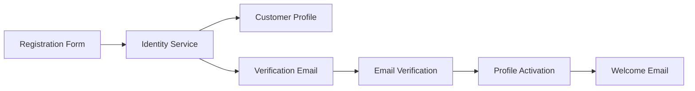
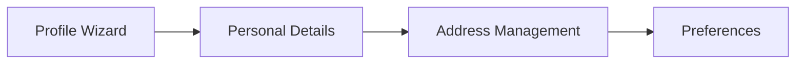
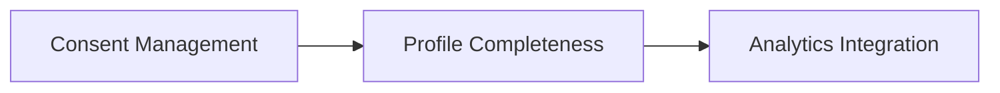
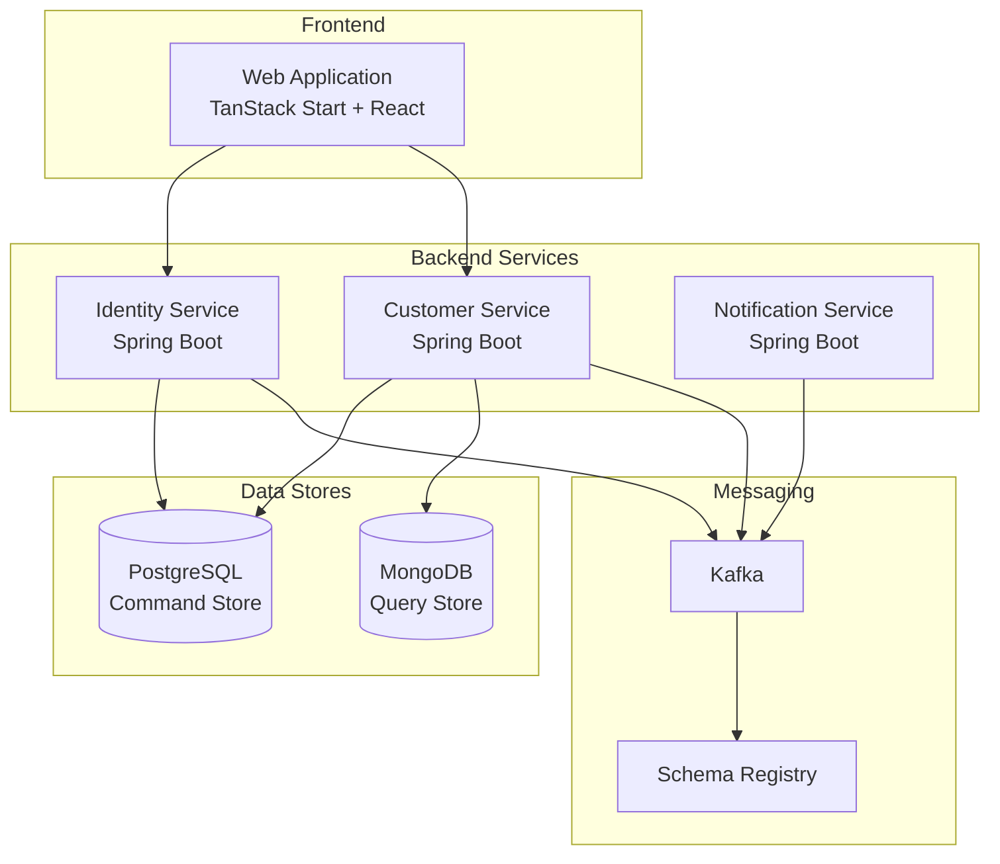

# User Story Epic: Create Customer Profile

**Epic ID:** US-0002
**Source Journey:** [UJ-0001: Create Customer Profile](../../journeys/0001-create-customer-profile.md)
**Status:** Draft
**Created:** 2026-01-03

## Overview

This epic contains user stories derived from the Create Customer Profile user journey. The stories implement the complete customer onboarding flow, including registration, email verification, profile completion, and consent management.

## Business Value

- **Customer Acquisition**: Enable new customers to onboard quickly and start shopping
- **Personalization Foundation**: Collect profile data to enable personalized experiences
- **Compliance Readiness**: Establish consent and preference records from the start
- **Marketing Enablement**: Capture customer data for segmentation and targeting

## User Stories

| Story ID | Title | Priority | Phase |
|----------|-------|----------|-------|
| [US-0002-01](./US-0002-01-registration-form-ui.md) | Registration Form UI | Must Have | Phase 1 |
| [US-0002-02](./US-0002-02-user-registration-processing.md) | User Registration Processing | Must Have | Phase 1 |
| [US-0002-03](./US-0002-03-customer-profile-creation.md) | Customer Profile Creation | Must Have | Phase 1 |
| [US-0002-04](./US-0002-04-verification-email-notification.md) | Verification Email Notification | Must Have | Phase 1 |
| [US-0002-05](./US-0002-05-email-verification-processing.md) | Email Verification Processing | Must Have | Phase 1 |
| [US-0002-06](./US-0002-06-customer-profile-activation.md) | Customer Profile Activation | Must Have | Phase 1 |
| [US-0002-07](./US-0002-07-welcome-notification.md) | Welcome Notification | Must Have | Phase 1 |
| [US-0002-08](./US-0002-08-profile-completion-wizard.md) | Profile Completion Wizard | Must Have | Phase 2 |
| [US-0002-09](./US-0002-09-address-management.md) | Address Management | Must Have | Phase 2 |
| [US-0002-10](./US-0002-10-preference-configuration.md) | Preference Configuration | Must Have | Phase 2 |
| [US-0002-11](./US-0002-11-consent-management.md) | Consent Management | Must Have | Phase 3 |
| [US-0002-12](./US-0002-12-profile-completeness-tracking.md) | Profile Completeness Tracking | Should Have | Phase 3 |

## Implementation Phases

### Phase 1: Core Registration (MVP)

Stories US-0002-01 through US-0002-07 implement the minimum viable registration flow:

### Phase 2: Profile Completion

Stories US-0002-08 through US-0002-10 enable customers to complete their profiles:

### Phase 3: Enhanced Features

Stories US-0002-11 through US-0002-12 add compliance and tracking features:

## Architecture Overview

## Domain Events

| Event | Producer | Consumers |
|-------|----------|-----------|
| UserRegistered | Identity Service | Customer Service, Notification Service, Analytics |
| EmailVerified | Identity Service | Customer Service |
| UserActivated | Identity Service | Customer Service, Marketing, Analytics |
| CustomerRegistered | Customer Service | Analytics, Marketing |
| CustomerActivated | Customer Service | Order Service, Cart Service |
| ProfileUpdated | Customer Service | Analytics |
| AddressAdded | Customer Service | Order Service, Cart Service |
| PreferencesUpdated | Customer Service | Notification Service, Marketing |
| ConsentGranted | Customer Service | Marketing, Analytics, Compliance |
| ConsentRevoked | Customer Service | Marketing, Analytics, Compliance |

## Related Documents

- [User Journey: Create Customer Profile](../../journeys/0001-create-customer-profile.md)
- [Implementation Guidelines](../../IMPLEMENTATION.md)
- [Identity Management Epic](../../epics/000-identity-management.md)
- [Customer Management Epic](../../epics/004-customer-management.md)
