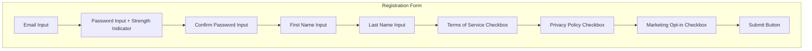

# US-0002-01: Registration Form UI

## User Story

**As a** new customer visiting the ACME platform,
**I want** a clear and user-friendly registration form,
**So that** I can quickly create an account and start shopping.

## Story Details

| Field | Value |
|-------|-------|
| Story ID | US-0002-01 |
| Epic | [US-0002: Create Customer Profile](./README.md) |
| Priority | Must Have |
| Phase | Phase 1 (MVP) |
| Story Points | 5 |

## Description

This story implements the customer-facing registration form in the web application. The form collects essential information for account creation and provides real-time validation feedback to ensure data quality before submission.

## UI Requirements

### Form Fields

| Field | Type | Required | Validation |
|-------|------|----------|------------|
| Email | Text Input | Yes | Valid email format |
| Password | Password Input | Yes | Min 8 chars, 1 uppercase, 1 lowercase, 1 digit, 1 special |
| Confirm Password | Password Input | Yes | Must match password |
| First Name | Text Input | Yes | Max 50 characters |
| Last Name | Text Input | Yes | Max 50 characters |
| Terms of Service | Checkbox | Yes | Must be checked |
| Privacy Policy | Checkbox | Yes | Must be checked |
| Marketing Opt-in | Checkbox | No | Default unchecked |

### UI Components



### Password Strength Indicator

The password strength indicator provides visual feedback:

| Strength | Criteria | Color |
|----------|----------|-------|
| Weak | < 8 characters | Red |
| Fair | 8+ chars, missing 2+ requirements | Orange |
| Good | 8+ chars, missing 1 requirement | Yellow |
| Strong | All requirements met | Green |

## Acceptance Criteria

### AC-0002-01-01: Email Validation

**Given** I am on the registration form
**When** I enter an invalid email format (e.g., "invalid-email")
**Then** an inline error message "Please enter a valid email address" appears within 200ms of field blur
**And** the email field is highlighted with an error state

**Given** I am on the registration form
**When** I enter a valid email format (e.g., "user@example.com")
**Then** the error state is cleared
**And** a success indicator appears on the field

### AC-0002-01-02: Password Requirements

**Given** I am on the registration form
**When** I enter a password that does not meet requirements
**Then** the password strength indicator shows the current strength level
**And** unfulfilled requirements are listed below the field:
  - Minimum 8 characters
  - At least one uppercase letter
  - At least one lowercase letter
  - At least one digit
  - At least one special character (!@#$%^&*()_+-=[]{}|;:,.<>?)

**Given** I enter a password meeting all requirements
**Then** the strength indicator shows "Strong" in green
**And** all requirement checkmarks show as complete

### AC-0002-01-03: Confirm Password Match

**Given** I have entered a password
**When** I enter a different value in the confirm password field
**Then** an inline error "Passwords do not match" appears within 200ms of field blur

**Given** I enter matching passwords
**Then** the error is cleared and a success indicator appears

### AC-0002-01-04: Name Field Validation

**Given** I am on the registration form
**When** I leave the first name or last name field empty and blur
**Then** an inline error "This field is required" appears

**Given** I enter more than 50 characters in a name field
**Then** the input is truncated to 50 characters
**And** a character counter shows "50/50"

### AC-0002-01-05: Terms of Service Requirement

**Given** I have filled all required fields correctly
**When** I attempt to submit without checking Terms of Service
**Then** the form does not submit
**And** the Terms of Service checkbox is highlighted with error state
**And** an error message "You must accept the Terms of Service to continue" appears

### AC-0002-01-06: Submit Button State

**Given** I am on the registration form with incomplete/invalid fields
**Then** the submit button is disabled
**And** the button shows a muted/inactive visual state

**Given** all required validations pass
**Then** the submit button becomes enabled
**And** the button shows an active/primary visual state

### AC-0002-01-07: Inline Validation Timing

**Given** I am filling out the registration form
**When** I blur any field (move focus away)
**Then** validation occurs and feedback appears within 200ms
**And** validation does not occur while I am actively typing

### AC-0002-01-08: Password Show/Hide Toggle

**Given** I am entering a password
**When** I click the show/hide toggle icon
**Then** the password field toggles between masked (dots) and visible (text)
**And** the toggle icon changes to reflect the current state

## Technical Implementation

### Frontend Stack

- **Framework**: TanStack Start with React 19.2
- **Form Library**: React Hook Form
- **Validation**: Zod schemas
- **UI Components**: shadcn/ui
- **Styling**: Tailwind CSS 4

### Form Schema (Zod)

```typescript
import { z } from 'zod';

const passwordSchema = z
  .string()
  .min(8, 'Password must be at least 8 characters')
  .regex(/[A-Z]/, 'Password must contain at least one uppercase letter')
  .regex(/[a-z]/, 'Password must contain at least one lowercase letter')
  .regex(/[0-9]/, 'Password must contain at least one digit')
  .regex(/[!@#$%^&*()_+\-=\[\]{}|;:,.<>?]/, 'Password must contain at least one special character');

const registrationSchema = z.object({
  email: z.string().email('Please enter a valid email address'),
  password: passwordSchema,
  confirmPassword: z.string(),
  firstName: z.string().min(1, 'First name is required').max(50, 'First name cannot exceed 50 characters'),
  lastName: z.string().min(1, 'Last name is required').max(50, 'Last name cannot exceed 50 characters'),
  tosAccepted: z.literal(true, {
    errorMap: () => ({ message: 'You must accept the Terms of Service to continue' }),
  }),
  privacyPolicyAccepted: z.literal(true, {
    errorMap: () => ({ message: 'You must accept the Privacy Policy to continue' }),
  }),
  marketingOptIn: z.boolean().default(false),
}).refine((data) => data.password === data.confirmPassword, {
  message: 'Passwords do not match',
  path: ['confirmPassword'],
});
```

### Component Structure

```
frontend-apps/customer/src/
├── components/
│   └── registration/
│       ├── RegistrationForm.tsx
│       ├── PasswordStrengthIndicator.tsx
│       ├── PasswordInput.tsx
│       └── FormField.tsx
├── schemas/
│   └── registration.schema.ts
└── routes/
    └── register.tsx
```

### Accessibility Requirements

- All form fields have associated labels
- Error messages are announced by screen readers (aria-live)
- Focus management moves to first error on submission failure
- Color is not the only indicator of state (icons accompany colors)
- Tab order follows visual order

## Definition of Done

- [ ] Registration form renders with all required fields
- [ ] Real-time validation works for all fields within 200ms of blur
- [ ] Password strength indicator updates dynamically
- [ ] Submit button enables/disables based on form validity
- [ ] Form submits valid data to Identity Service API
- [ ] Error states display correctly with proper styling
- [ ] Accessibility audit passes (WCAG 2.1 AA)
- [ ] Unit tests cover validation logic (>90% coverage)
- [ ] Integration tests verify form submission flow
- [ ] Responsive design works on mobile, tablet, desktop
- [ ] Code reviewed and approved
- [ ] Documentation updated

## Dependencies

- shadcn/ui components installed and configured
- TanStack Router configured with `/register` route
- API client configured for Identity Service

## Related Documents

- [Journey Step 1: Customer Initiates Registration](../../journeys/0001-create-customer-profile.md#step-1-customer-initiates-registration)
- [US-0002-02: User Registration Processing](./US-0002-02-user-registration-processing.md)
