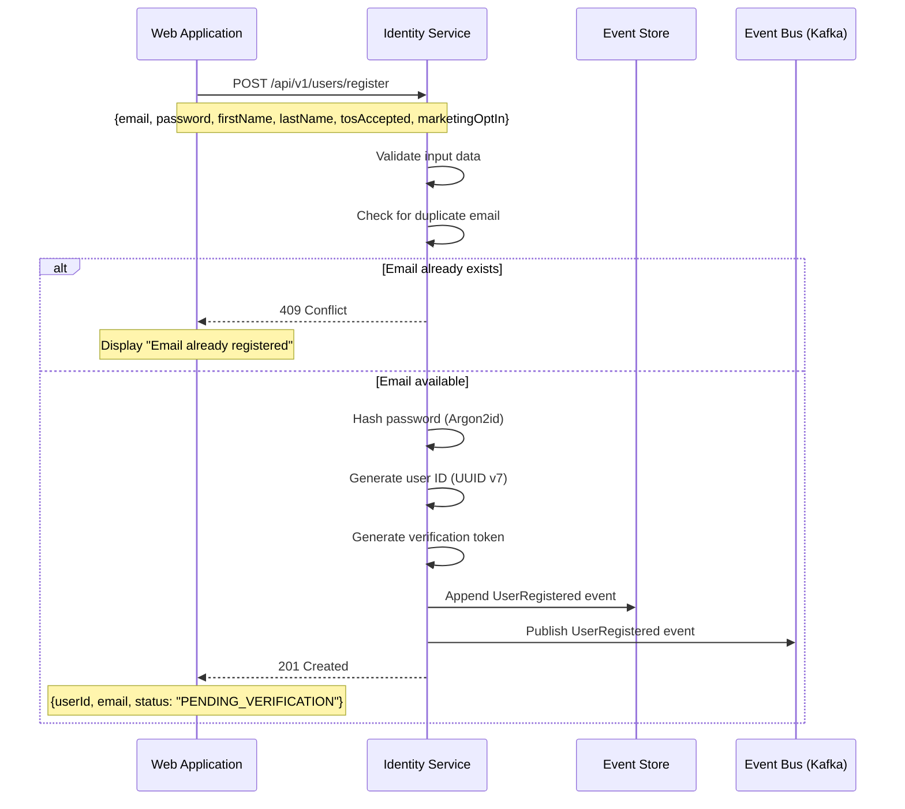

# US-0002-02: User Registration Processing

## User Story

**As a** web application,
**I want** to submit registration data to the Identity Service,
**So that** a new user account is securely created and verified.

## Story Details

| Field        | Value                                           |
|--------------|-------------------------------------------------|
| Story ID     | US-0002-02                                      |
| Epic         | [US-0002: Create Customer Profile](./README.md) |
| Priority     | Must Have                                       |
| Phase        | Phase 1 (MVP)                                   |
| Story Points | 8                                               |

## Description

This story implements the backend registration processing in the Identity Management Service. It handles user creation,
secure password hashing, verification token generation, and publishes the `UserRegistered` domain event to trigger
downstream processes.

## System Context



## API Contract

### Request

```http
POST /api/v1/users/register
Content-Type: application/json

{
  "email": "customer@example.com",
  "password": "SecureP@ss123",
  "firstName": "Jane",
  "lastName": "Doe",
  "tosAccepted": true,
  "tosAcceptedAt": "2026-01-02T10:30:00Z",
  "marketingOptIn": false
}
```

### Response (Success - 201 Created)

```json
{
  "userId": "01941234-5678-7abc-def0-123456789abc",
  "email": "customer@example.com",
  "status": "PENDING_VERIFICATION",
  "createdAt": "2026-01-02T10:30:01Z"
}
```

### Response (Conflict - 409)

```json
{
  "error": "DUPLICATE_EMAIL",
  "message": "An account with this email already exists",
  "timestamp": "2026-01-02T10:30:01Z"
}
```

### Response (Validation Error - 400)

```json
{
  "error": "VALIDATION_ERROR",
  "message": "Request validation failed",
  "details": [
    {
      "field": "email",
      "message": "Invalid email format"
    }
  ],
  "timestamp": "2026-01-02T10:30:01Z"
}
```

## Domain Event: UserRegistered

```json
{
  "eventId": "01941234-5678-7abc-def0-123456789001",
  "eventType": "UserRegistered",
  "eventVersion": "1.0",
  "timestamp": "2026-01-02T10:30:01Z",
  "aggregateId": "01941234-5678-7abc-def0-123456789abc",
  "aggregateType": "User",
  "correlationId": "01941234-5678-7abc-def0-123456789002",
  "payload": {
    "userId": "01941234-5678-7abc-def0-123456789abc",
    "email": "customer@example.com",
    "firstName": "Jane",
    "lastName": "Doe",
    "tosAcceptedAt": "2026-01-02T10:30:00Z",
    "marketingOptIn": false,
    "registrationSource": "WEB"
  }
}
```

## Acceptance Criteria

### AC-0002-02-01: Duplicate Email Detection

**Given** a user with email "existing@example.com" already exists
**When** a registration request is submitted with the same email
**Then** the system returns HTTP 409 Conflict within 100ms (p99)
**And** the response contains error code "DUPLICATE_EMAIL"
**And** no new user record is created

### AC-0002-02-02: Password Hashing

**Given** a valid registration request is submitted
**When** the user record is created
**Then** the password is hashed using Argon2id algorithm
**And** the hash parameters are:

- Memory cost: 64 MB (65536 KB)
- Time cost: 3 iterations
- Parallelism: 4 threads
  **And** the plain text password is never stored or logged

### AC-0002-02-03: User ID Generation

**Given** a valid registration request is submitted
**When** a new user is created
**Then** the user ID is generated as UUID v7 (time-ordered)
**And** the ID is globally unique across all users

### AC-0002-02-04: Event Store Persistence

**Given** a valid registration request is processed
**When** the user is created
**Then** a `UserRegistered` event is persisted to the event store
**And** the event is persisted before the HTTP response is sent
**And** the event contains all required payload fields

### AC-0002-02-05: Event Bus Publishing

**Given** a user is successfully registered
**When** the event store write completes
**Then** the `UserRegistered` event is published to Kafka topic `identity.user.events`
**And** the event uses Avro serialization with Schema Registry
**And** the event includes the correlation ID for distributed tracing

### AC-0002-02-06: Verification Token Generation

**Given** a user is successfully registered
**When** the account is created
**Then** a verification token is generated (cryptographically secure random)
**And** the token is stored with a 24-hour expiration timestamp
**And** the token is unique and single-use

### AC-0002-02-07: Response Time

**Given** the Identity Service is under normal load
**When** a registration request is processed
**Then** the endpoint responds within 500ms (p95)

### AC-0002-02-08: Terms of Service Recording

**Given** a registration request includes tosAccepted: true
**When** the user is created
**Then** the tosAcceptedAt timestamp is recorded immutably in the event
**And** the timestamp cannot be modified after creation

### AC-0002-02-09: Registration Source Tracking

**Given** a registration request is submitted
**When** the UserRegistered event is created
**Then** the registrationSource field captures the origin:

- "WEB" for web application requests
- "MOBILE" for mobile app requests
- "API" for direct API integrations

## Technical Implementation

### Backend Stack

- **Language**: Kotlin 2.2
- **Runtime**: Java 24 with Project Loom (virtual threads)
- **Framework**: Spring Boot 4 with Spring MVC
- **Database**: PostgreSQL 16+ (Command Store)
- **Messaging**: Confluent Kafka with Avro/Schema Registry
- **Password Hashing**: Argon2id via BouncyCastle or Spring Security Crypto

### Service Structure

```
backend-services/identity/src/main/kotlin/com/acme/identity/
├── api/
│   └── v1/
│       ├── UserController.kt
│       └── dto/
│           ├── RegisterUserRequest.kt
│           └── RegisterUserResponse.kt
├── domain/
│   ├── User.kt
│   ├── UserId.kt
│   └── events/
│       └── UserRegistered.kt
├── application/
│   └── RegisterUserUseCase.kt
├── infrastructure/
│   ├── persistence/
│   │   ├── UserRepository.kt
│   │   └── EventStoreRepository.kt
│   ├── security/
│   │   └── PasswordHasher.kt
│   └── messaging/
│       └── UserEventPublisher.kt
└── config/
    └── SecurityConfig.kt
```

### Database Schema

```sql
CREATE TABLE users (
    id UUID PRIMARY KEY,
    email VARCHAR(255) NOT NULL UNIQUE,
    password_hash VARCHAR(255) NOT NULL,
    first_name VARCHAR(50) NOT NULL,
    last_name VARCHAR(50) NOT NULL,
    status VARCHAR(50) NOT NULL DEFAULT 'PENDING_VERIFICATION',
    tos_accepted_at TIMESTAMP WITH TIME ZONE NOT NULL,
    marketing_opt_in BOOLEAN NOT NULL DEFAULT FALSE,
    registration_source VARCHAR(20) NOT NULL,
    created_at TIMESTAMP WITH TIME ZONE NOT NULL DEFAULT NOW(),
    updated_at TIMESTAMP WITH TIME ZONE NOT NULL DEFAULT NOW()
);

CREATE TABLE verification_tokens (
    id UUID PRIMARY KEY,
    user_id UUID NOT NULL REFERENCES users(id),
    token VARCHAR(255) NOT NULL UNIQUE,
    expires_at TIMESTAMP WITH TIME ZONE NOT NULL,
    used_at TIMESTAMP WITH TIME ZONE,
    created_at TIMESTAMP WITH TIME ZONE NOT NULL DEFAULT NOW()
);

CREATE INDEX idx_users_email ON users(email);
CREATE INDEX idx_verification_tokens_token ON verification_tokens(token);
CREATE INDEX idx_verification_tokens_user_id ON verification_tokens(user_id);
```

### Avro Schema (UserRegistered)

```avro
{
  "type": "record",
  "name": "UserRegistered",
  "namespace": "com.acme.identity.events",
  "fields": [
    {"name": "eventId", "type": "string"},
    {"name": "eventType", "type": "string"},
    {"name": "eventVersion", "type": "string"},
    {"name": "timestamp", "type": "string"},
    {"name": "aggregateId", "type": "string"},
    {"name": "aggregateType", "type": "string"},
    {"name": "correlationId", "type": "string"},
    {"name": "payload", "type": {
      "type": "record",
      "name": "UserRegisteredPayload",
      "fields": [
        {"name": "userId", "type": "string"},
        {"name": "email", "type": "string"},
        {"name": "firstName", "type": "string"},
        {"name": "lastName", "type": "string"},
        {"name": "tosAcceptedAt", "type": "string"},
        {"name": "marketingOptIn", "type": "boolean"},
        {"name": "registrationSource", "type": "string"}
      ]
    }}
  ]
}
```

## Security Considerations

| Concern                       | Mitigation                                  |
|-------------------------------|---------------------------------------------|
| Password in logs              | Password field excluded from all logging    |
| Timing attacks on email check | Constant-time comparison for email lookup   |
| Brute force registration      | Rate limiting: 5 requests per IP per minute |
| Email enumeration             | Generic error message for duplicate emails  |
| SQL injection                 | Parameterized queries via JPA               |

## Observability

### Metrics

| Metric                           | Type      | Labels                             |
|----------------------------------|-----------|------------------------------------|
| `registration_attempts_total`    | Counter   | status (success, duplicate, error) |
| `registration_duration_seconds`  | Histogram | -                                  |
| `password_hash_duration_seconds` | Histogram | -                                  |

### Tracing Spans

- `POST /api/v1/users/register` (HTTP span)
- `check_duplicate_email` (database query)
- `hash_password` (crypto operation)
- `persist_user` (database write)
- `publish_event` (Kafka publish)

### Health Check

```http
GET /actuator/health/readiness
```

Checks:

- PostgreSQL connectivity
- Kafka broker connectivity
- Schema Registry availability

## Definition of Done

- [ ] API endpoint accepts registration requests
- [ ] Password hashing uses Argon2id with specified parameters
- [ ] UUID v7 generation for user IDs
- [ ] Event store persistence before response
- [ ] Kafka event publishing with Avro schema
- [ ] Duplicate email returns 409 within 100ms (p99)
- [ ] Response time < 500ms (p95)
- [ ] Rate limiting implemented (5/min/IP)
- [ ] Unit tests (>90% coverage)
- [ ] Integration tests for API and event publishing
- [ ] OpenAPI documentation generated
- [ ] Tracing spans and metrics implemented
- [ ] Security review completed
- [ ] Code reviewed and approved

## Dependencies

- PostgreSQL database provisioned (US-0000)
- Kafka and Schema Registry available (US-0000)
- Event store schema defined

## Related Documents

- [Journey Step 2: Identity Service Processes Registration](../../journeys/0002-create-customer-profile.md#step-2-identity-service-processes-registration)
- [US-0002-01: Registration Form UI](./US-0002-01-registration-form-ui.md)
- [US-0002-03: Customer Profile Creation](./US-0002-03-customer-profile-creation.md)
- [US-0002-04: Verification Email Notification](./US-0002-04-verification-email-notification.md)
