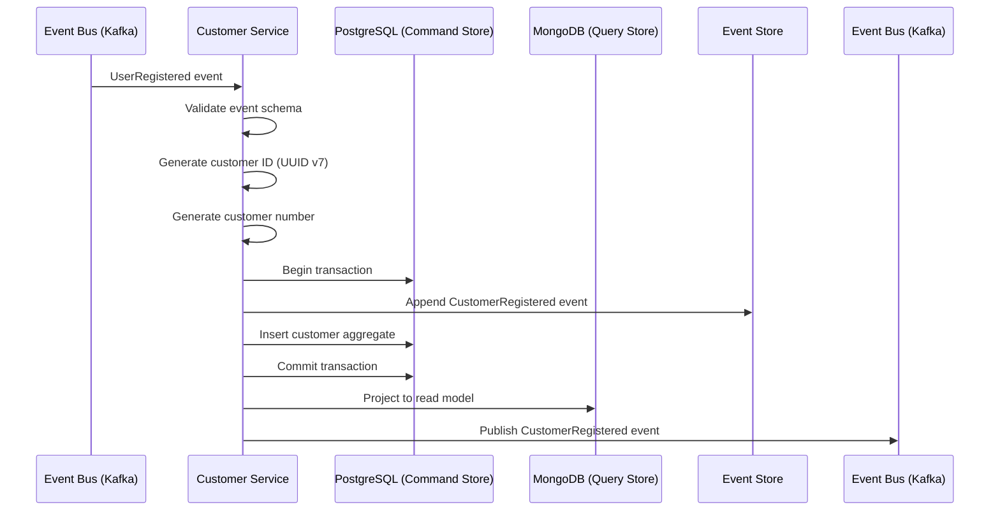
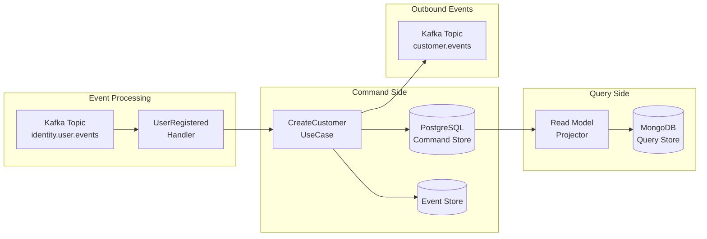

# US-0002-03: Customer Profile Creation

## User Story

**As a** Customer Management Service,
**I want** to automatically create a customer profile when a user registers,
**So that** the customer has a complete profile record for shopping and personalization.

## Story Details

| Field | Value |
|-------|-------|
| Story ID | US-0002-03 |
| Epic | [US-0002: Create Customer Profile](./README.md) |
| Priority | Must Have |
| Phase | Phase 1 (MVP) |
| Story Points | 8 |

## Description

This story implements the event-driven customer profile creation in the Customer Management Service. When a `UserRegistered` event is consumed from Kafka, the service automatically creates an initial customer profile with default settings and publishes a `CustomerRegistered` event for downstream consumers.

## System Context



## Customer Number Format

Customer numbers follow a human-readable format for support and order references:

```
ACME-YYYYMM-NNNNNN
```

| Component | Description | Example |
|-----------|-------------|---------|
| `ACME` | Platform prefix | ACME |
| `YYYYMM` | Year and month of registration | 202601 |
| `NNNNNN` | Sequential 6-digit number (zero-padded) | 000142 |

Example: `ACME-202601-000142`

## Domain Event: CustomerRegistered

```json
{
  "eventId": "01941234-5678-7abc-def0-123456789010",
  "eventType": "CustomerRegistered",
  "eventVersion": "1.0",
  "timestamp": "2026-01-02T10:30:02Z",
  "aggregateId": "01941234-5678-7abc-def0-123456789020",
  "aggregateType": "Customer",
  "correlationId": "01941234-5678-7abc-def0-123456789002",
  "causationId": "01941234-5678-7abc-def0-123456789001",
  "payload": {
    "customerId": "01941234-5678-7abc-def0-123456789020",
    "userId": "01941234-5678-7abc-def0-123456789abc",
    "customerNumber": "ACME-202601-000142",
    "email": "customer@example.com",
    "firstName": "Jane",
    "lastName": "Doe",
    "status": "PENDING_VERIFICATION",
    "type": "INDIVIDUAL",
    "registeredAt": "2026-01-02T10:30:02Z"
  }
}
```

## Initial Profile State

```json
{
  "customerId": "01941234-5678-7abc-def0-123456789020",
  "userId": "01941234-5678-7abc-def0-123456789abc",
  "customerNumber": "ACME-202601-000142",
  "name": {
    "firstName": "Jane",
    "lastName": "Doe",
    "displayName": "Jane Doe"
  },
  "email": {
    "address": "customer@example.com",
    "verified": false
  },
  "phone": null,
  "status": "PENDING_VERIFICATION",
  "type": "INDIVIDUAL",
  "profile": {
    "dateOfBirth": null,
    "gender": null,
    "preferredLocale": "en-US",
    "timezone": "UTC",
    "preferredCurrency": "USD"
  },
  "preferences": {
    "communication": {
      "email": true,
      "sms": false,
      "push": false,
      "marketing": false
    },
    "privacy": {
      "shareDataWithPartners": false,
      "allowAnalytics": true
    }
  },
  "addresses": [],
  "segments": [],
  "registeredAt": "2026-01-02T10:30:02Z",
  "lastActivityAt": "2026-01-02T10:30:02Z",
  "profileCompleteness": 25
}
```

## Acceptance Criteria

### AC-0002-03-01: Event Processing Timeliness

**Given** a `UserRegistered` event is published to Kafka
**When** the Customer Service consumes the event
**Then** the customer profile is created within 5 seconds of event timestamp

### AC-0002-03-02: Customer ID Generation

**Given** a valid `UserRegistered` event is processed
**When** a new customer profile is created
**Then** the customer ID is generated as UUID v7 (time-ordered)
**And** the customer ID is distinct from the user ID

### AC-0002-03-03: Customer Number Uniqueness

**Given** multiple customers register in the same month
**When** customer numbers are generated
**Then** each customer number is unique
**And** numbers are sequential within each month (ACME-YYYYMM-NNNNNN)
**And** the sequence resets to 000001 at the start of each month

### AC-0002-03-04: Transactional Consistency

**Given** a customer profile is being created
**When** the event store write and command store write occur
**Then** both writes are in the same database transaction
**And** if either fails, both are rolled back

### AC-0002-03-05: Read Model Projection

**Given** a customer profile is created in PostgreSQL
**When** the transaction commits
**Then** the read model is projected to MongoDB within 2 seconds
**And** the MongoDB document contains all queryable fields

### AC-0002-03-06: Event Causation Linking

**Given** a `CustomerRegistered` event is created
**When** the event is published
**Then** the causationId field contains the eventId of the triggering `UserRegistered` event
**And** the correlationId is propagated from the original request

### AC-0002-03-07: Default Preferences Based on Marketing Opt-in

**Given** a `UserRegistered` event with `marketingOptIn: true`
**When** the customer profile is created
**Then** `preferences.communication.marketing` is set to `true`

**Given** a `UserRegistered` event with `marketingOptIn: false`
**When** the customer profile is created
**Then** `preferences.communication.marketing` is set to `false`

### AC-0002-03-08: Profile Completeness Score

**Given** a new customer profile is created
**When** the profile only has basic info (name, email)
**Then** the profileCompleteness score is 25%

### AC-0002-03-09: Retry with Exponential Backoff

**Given** event processing fails (e.g., database error)
**When** the service retries
**Then** retries occur with exponential backoff
**And** maximum of 5 retry attempts
**And** backoff delays: 1s, 2s, 4s, 8s, 16s

### AC-0002-03-10: Idempotent Processing

**Given** the same `UserRegistered` event is received multiple times
**When** the service processes duplicate events
**Then** only one customer profile is created
**And** subsequent events are acknowledged without error

## Technical Implementation

### Backend Stack

- **Language**: Kotlin 2.2
- **Runtime**: Java 24 with Project Loom (virtual threads)
- **Framework**: Spring Boot 4 with Spring MVC
- **Command Store**: PostgreSQL 16+
- **Query Store**: MongoDB 8.2+
- **Messaging**: Confluent Kafka with Avro/Schema Registry

### Service Structure

```
backend-services/customer/src/main/kotlin/com/acme/customer/
├── api/
│   └── v1/
│       ├── CustomerController.kt
│       └── dto/
│           └── CustomerResponse.kt
├── domain/
│   ├── Customer.kt
│   ├── CustomerId.kt
│   ├── CustomerNumber.kt
│   └── events/
│       └── CustomerRegistered.kt
├── application/
│   ├── CreateCustomerUseCase.kt
│   └── eventhandlers/
│       └── UserRegisteredHandler.kt
├── infrastructure/
│   ├── persistence/
│   │   ├── CustomerRepository.kt
│   │   ├── CustomerNumberSequenceRepository.kt
│   │   └── EventStoreRepository.kt
│   ├── projection/
│   │   └── CustomerReadModelProjector.kt
│   └── messaging/
│       ├── UserRegisteredConsumer.kt
│       └── CustomerEventPublisher.kt
└── config/
    ├── KafkaConfig.kt
    └── MongoConfig.kt
```

### Database Schema (PostgreSQL)

```sql
CREATE TABLE customers (
    id UUID PRIMARY KEY,
    user_id UUID NOT NULL UNIQUE,
    customer_number VARCHAR(20) NOT NULL UNIQUE,
    first_name VARCHAR(50) NOT NULL,
    last_name VARCHAR(50) NOT NULL,
    display_name VARCHAR(100) NOT NULL,
    email VARCHAR(255) NOT NULL,
    email_verified BOOLEAN NOT NULL DEFAULT FALSE,
    phone_country_code VARCHAR(5),
    phone_number VARCHAR(20),
    phone_verified BOOLEAN DEFAULT FALSE,
    status VARCHAR(50) NOT NULL DEFAULT 'PENDING_VERIFICATION',
    type VARCHAR(50) NOT NULL DEFAULT 'INDIVIDUAL',
    date_of_birth DATE,
    gender VARCHAR(20),
    preferred_locale VARCHAR(10) NOT NULL DEFAULT 'en-US',
    timezone VARCHAR(50) NOT NULL DEFAULT 'UTC',
    preferred_currency VARCHAR(3) NOT NULL DEFAULT 'USD',
    profile_completeness INTEGER NOT NULL DEFAULT 25,
    registered_at TIMESTAMP WITH TIME ZONE NOT NULL,
    last_activity_at TIMESTAMP WITH TIME ZONE NOT NULL,
    created_at TIMESTAMP WITH TIME ZONE NOT NULL DEFAULT NOW(),
    updated_at TIMESTAMP WITH TIME ZONE NOT NULL DEFAULT NOW()
);

CREATE TABLE customer_preferences (
    customer_id UUID PRIMARY KEY REFERENCES customers(id),
    email_notifications BOOLEAN NOT NULL DEFAULT TRUE,
    sms_notifications BOOLEAN NOT NULL DEFAULT FALSE,
    push_notifications BOOLEAN NOT NULL DEFAULT FALSE,
    marketing_communications BOOLEAN NOT NULL DEFAULT FALSE,
    share_data_with_partners BOOLEAN NOT NULL DEFAULT FALSE,
    allow_analytics BOOLEAN NOT NULL DEFAULT TRUE,
    updated_at TIMESTAMP WITH TIME ZONE NOT NULL DEFAULT NOW()
);

CREATE TABLE customer_number_sequences (
    year_month VARCHAR(6) PRIMARY KEY,  -- YYYYMM format
    current_value INTEGER NOT NULL DEFAULT 0
);

CREATE INDEX idx_customers_user_id ON customers(user_id);
CREATE INDEX idx_customers_email ON customers(email);
CREATE INDEX idx_customers_customer_number ON customers(customer_number);
CREATE INDEX idx_customers_status ON customers(status);
```

### MongoDB Read Model Schema

```javascript
{
  "_id": "01941234-5678-7abc-def0-123456789020",
  "userId": "01941234-5678-7abc-def0-123456789abc",
  "customerNumber": "ACME-202601-000142",
  "name": {
    "firstName": "Jane",
    "lastName": "Doe",
    "displayName": "Jane Doe"
  },
  "email": {
    "address": "customer@example.com",
    "verified": false
  },
  "phone": null,
  "status": "PENDING_VERIFICATION",
  "type": "INDIVIDUAL",
  "profile": {
    "dateOfBirth": null,
    "gender": null,
    "preferredLocale": "en-US",
    "timezone": "UTC",
    "preferredCurrency": "USD"
  },
  "preferences": {
    "communication": {
      "email": true,
      "sms": false,
      "push": false,
      "marketing": false
    },
    "privacy": {
      "shareDataWithPartners": false,
      "allowAnalytics": true
    }
  },
  "addresses": [],
  "segments": [],
  "registeredAt": "2026-01-02T10:30:02Z",
  "lastActivityAt": "2026-01-02T10:30:02Z",
  "profileCompleteness": 25,
  "_version": 1
}
```

### Kafka Consumer Configuration

```yaml
spring:
  kafka:
    consumer:
      group-id: customer-service
      auto-offset-reset: earliest
      enable-auto-commit: false
      properties:
        isolation.level: read_committed
    listener:
      ack-mode: manual
      concurrency: 3
```

## CQRS Data Flow



## Observability

### Metrics

| Metric | Type | Labels |
|--------|------|--------|
| `customer_created_total` | Counter | status |
| `customer_creation_duration_seconds` | Histogram | - |
| `event_processing_lag_seconds` | Histogram | event_type |
| `read_model_projection_duration_seconds` | Histogram | - |

### Tracing Spans

- `consume_user_registered_event` (Kafka consumer)
- `create_customer_profile` (use case)
- `generate_customer_number` (sequence generation)
- `persist_customer` (PostgreSQL write)
- `persist_event` (event store write)
- `project_read_model` (MongoDB write)
- `publish_customer_registered` (Kafka publish)

## Definition of Done

- [ ] Kafka consumer processes UserRegistered events
- [ ] Customer profile created within 5 seconds of event
- [ ] UUID v7 customer ID generation
- [ ] Sequential customer number generation per month
- [ ] Transactional consistency (event store + command store)
- [ ] Read model projection to MongoDB within 2 seconds
- [ ] Idempotent event processing (deduplication)
- [ ] Retry with exponential backoff (max 5 attempts)
- [ ] Default preferences applied based on marketing opt-in
- [ ] Profile completeness calculated (25% initial)
- [ ] Unit tests (>90% coverage)
- [ ] Integration tests for event processing
- [ ] Tracing spans and metrics implemented
- [ ] Code reviewed and approved

## Dependencies

- Identity Service publishing UserRegistered events (US-0002-02)
- PostgreSQL and MongoDB provisioned (US-0000)
- Kafka consumer group configured

## Related Documents

- [Journey Step 3: Customer Profile Creation](../../journeys/0002-create-customer-profile.md#step-3-customer-profile-creation)
- [US-0002-02: User Registration Processing](./US-0002-02-user-registration-processing.md)
- [US-0002-06: Customer Profile Activation](./US-0002-06-customer-profile-activation.md)
