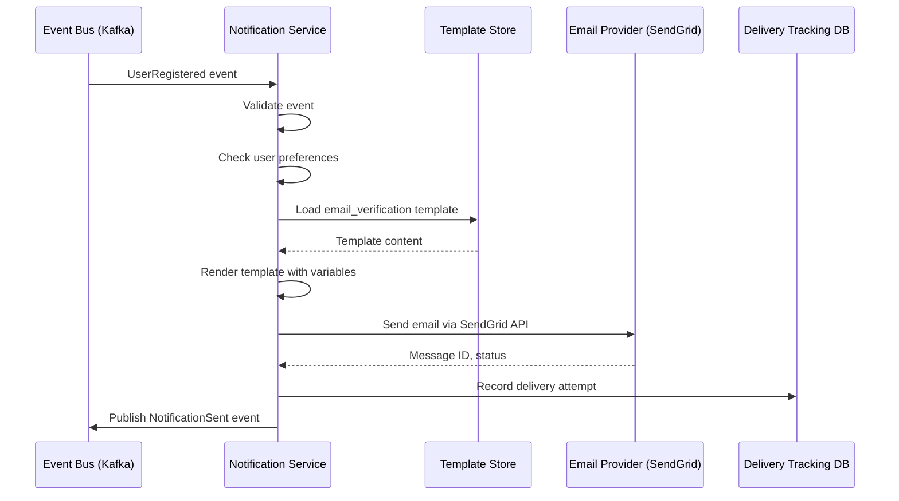

# US-0002-04: Verification Email Notification

## User Story

**As a** Notification Service,
**I want** to send a verification email when a user registers,
**So that** the user can verify their email address and activate their account.

## Story Details

| Field | Value |
|-------|-------|
| Story ID | US-0002-04 |
| Epic | [US-0002: Create Customer Profile](./README.md) |
| Priority | Must Have |
| Phase | Phase 1 (MVP) |
| Story Points | 5 |

## Description

This story implements the verification email notification in the Notification Service. When a `UserRegistered` event is consumed from Kafka, the service renders a personalized email template and sends the verification email through the email provider (SendGrid).

## System Context



## Email Template

### Template Variables

```json
{
  "recipientName": "Jane",
  "recipientEmail": "customer@example.com",
  "verificationUrl": "https://www.acme.com/verify?token=abc123xyz",
  "expirationHours": 24,
  "supportEmail": "support@acme.com",
  "companyName": "ACME Inc.",
  "currentYear": 2026
}
```

### Email Content Structure

| Section | Content |
|---------|---------|
| Subject | "Verify your ACME account" |
| Preheader | "Click to verify your email and start shopping" |
| Header | ACME logo + "Welcome to ACME!" |
| Body | Personalized greeting, verification instructions |
| CTA Button | "Verify Email Address" (links to verificationUrl) |
| Footer | Support contact, expiration notice, company info |

## Acceptance Criteria

### AC-0002-04-01: Email Delivery Timeliness

**Given** a `UserRegistered` event is published to Kafka
**When** the Notification Service processes the event
**Then** the verification email is sent within 30 seconds of event timestamp

### AC-0002-04-02: Personalized Recipient Name

**Given** a verification email is being prepared
**When** the template is rendered
**Then** the email greeting includes the user's first name
**And** the email is addressed to the user's registered email

### AC-0002-04-03: Unique Verification Link

**Given** a verification email is sent
**When** the user clicks the verification link
**Then** the link contains a unique, single-use token
**And** the token is cryptographically secure (min 32 bytes)

### AC-0002-04-04: Expiration Notice

**Given** a verification email is being prepared
**When** the template is rendered
**Then** the email clearly states "This link expires in 24 hours"
**And** the expiration time is visible in both header and footer

### AC-0002-04-05: Email Authentication

**Given** a verification email is sent
**When** the recipient's email server validates the email
**Then** the email passes SPF validation
**And** the email passes DKIM validation
**And** the email passes DMARC validation

### AC-0002-04-06: Delivery Tracking

**Given** a verification email is sent
**When** the email provider responds
**Then** the delivery status is recorded:
  - `SENT`: Email accepted by provider
  - `DELIVERED`: Email delivered to recipient
  - `BOUNCED`: Email bounced (hard or soft)
  - `FAILED`: Send attempt failed

### AC-0002-04-07: Retry on Failure

**Given** email sending fails (provider error)
**When** the service retries
**Then** retries occur up to 3 times
**And** retry intervals are 5 minutes apart
**And** each retry is logged with attempt number

### AC-0002-04-08: Localization Support

**Given** a verification email is being prepared
**When** the template is rendered
**Then** the email uses the user's preferred locale (default: en-US)
**And** the template system supports future locale additions

### AC-0002-04-09: No Unsubscribe Link

**Given** a verification email is being prepared
**When** the email is rendered
**Then** no unsubscribe link is included
**And** the email is classified as "transactional" (not marketing)

## Technical Implementation

### Backend Stack

- **Language**: Kotlin 2.2
- **Runtime**: Java 24 with Project Loom (virtual threads)
- **Framework**: Spring Boot 4
- **Email Provider**: SendGrid API v3
- **Template Engine**: Thymeleaf or FreeMarker
- **Database**: PostgreSQL (delivery tracking)

### Service Structure

```
backend-services/notification/src/main/kotlin/com/acme/notification/
├── api/
│   └── v1/
│       ├── NotificationController.kt
│       └── dto/
│           └── NotificationStatusResponse.kt
├── domain/
│   ├── Notification.kt
│   ├── NotificationStatus.kt
│   └── events/
│       └── NotificationSent.kt
├── application/
│   ├── SendVerificationEmailUseCase.kt
│   └── eventhandlers/
│       └── UserRegisteredHandler.kt
├── infrastructure/
│   ├── email/
│   │   ├── SendGridEmailSender.kt
│   │   └── EmailTemplate.kt
│   ├── persistence/
│   │   └── DeliveryTrackingRepository.kt
│   ├── templates/
│   │   └── TemplateStore.kt
│   └── messaging/
│       ├── UserRegisteredConsumer.kt
│       └── NotificationEventPublisher.kt
└── config/
    ├── SendGridConfig.kt
    └── TemplateConfig.kt
```

### Database Schema

```sql
CREATE TABLE notification_deliveries (
    id UUID PRIMARY KEY,
    notification_type VARCHAR(50) NOT NULL,
    recipient_id UUID NOT NULL,
    recipient_email VARCHAR(255) NOT NULL,
    provider_message_id VARCHAR(255),
    status VARCHAR(50) NOT NULL,
    attempt_count INTEGER NOT NULL DEFAULT 1,
    sent_at TIMESTAMP WITH TIME ZONE,
    delivered_at TIMESTAMP WITH TIME ZONE,
    bounced_at TIMESTAMP WITH TIME ZONE,
    bounce_reason VARCHAR(500),
    correlation_id VARCHAR(100),
    created_at TIMESTAMP WITH TIME ZONE NOT NULL DEFAULT NOW(),
    updated_at TIMESTAMP WITH TIME ZONE NOT NULL DEFAULT NOW()
);

CREATE INDEX idx_deliveries_recipient ON notification_deliveries(recipient_id);
CREATE INDEX idx_deliveries_status ON notification_deliveries(status);
CREATE INDEX idx_deliveries_correlation ON notification_deliveries(correlation_id);
```

### Email Template (HTML)

```html
<!DOCTYPE html>
<html>
<head>
  <meta charset="UTF-8">
  <title>Verify your ACME account</title>
</head>
<body>
  <div class="container">
    <header>
      
      <h1>Welcome to ACME!</h1>
    </header>

    <main>
      <p>Hi {{recipientName}},</p>
      <p>Thanks for signing up! Please verify your email address to activate your account and start shopping.</p>

      <a href="{{verificationUrl}}" class="button">Verify Email Address</a>

      <p class="expiration">This link expires in {{expirationHours}} hours.</p>

      <p>If you didn't create an account, you can safely ignore this email.</p>
    </main>

    <footer>
      <p>Need help? Contact us at <a href="mailto:{{supportEmail}}">{{supportEmail}}</a></p>
      <p>&copy; {{currentYear}} {{companyName}}. All rights reserved.</p>
    </footer>
  </div>
</body>
</html>
```

### SendGrid Integration

```kotlin
@Service
class SendGridEmailSender(
    private val sendGridClient: SendGrid,
    private val templateStore: TemplateStore
) {
    suspend fun sendVerificationEmail(
        recipientEmail: String,
        recipientName: String,
        verificationUrl: String,
        correlationId: String
    ): SendResult {
        val template = templateStore.load("email_verification")
        val content = template.render(mapOf(
            "recipientName" to recipientName,
            "verificationUrl" to verificationUrl,
            "expirationHours" to 24,
            "supportEmail" to "support@acme.com",
            "companyName" to "ACME Inc.",
            "currentYear" to Year.now().value
        ))

        val mail = Mail().apply {
            from = Email("noreply@acme.com", "ACME")
            subject = "Verify your ACME account"
            addPersonalization(Personalization().apply {
                addTo(Email(recipientEmail, recipientName))
            })
            addContent(Content("text/html", content))
            addHeader("X-Correlation-ID", correlationId)
        }

        val response = sendGridClient.api(Request().apply {
            method = Method.POST
            endpoint = "mail/send"
            body = mail.build()
        })

        return SendResult(
            success = response.statusCode in 200..299,
            messageId = response.headers["X-Message-Id"]?.firstOrNull(),
            statusCode = response.statusCode
        )
    }
}
```

## Domain Event: NotificationSent

```json
{
  "eventId": "01941234-5678-7abc-def0-123456789100",
  "eventType": "NotificationSent",
  "eventVersion": "1.0",
  "timestamp": "2026-01-02T10:30:05Z",
  "aggregateId": "01941234-5678-7abc-def0-123456789101",
  "aggregateType": "Notification",
  "correlationId": "01941234-5678-7abc-def0-123456789002",
  "payload": {
    "notificationId": "01941234-5678-7abc-def0-123456789101",
    "type": "EMAIL_VERIFICATION",
    "recipientId": "01941234-5678-7abc-def0-123456789abc",
    "recipientEmail": "customer@example.com",
    "providerMessageId": "sg-msg-123456",
    "status": "SENT",
    "sentAt": "2026-01-02T10:30:05Z"
  }
}
```

## Observability

### Metrics

| Metric | Type | Labels |
|--------|------|--------|
| `verification_email_sent_total` | Counter | status |
| `verification_email_duration_seconds` | Histogram | - |
| `email_delivery_status_total` | Counter | status, type |
| `email_retry_attempts_total` | Counter | attempt |

### Tracing Spans

- `consume_user_registered_event` (Kafka consumer)
- `load_email_template` (template store)
- `render_email_template` (template engine)
- `send_email_sendgrid` (SendGrid API call)
- `record_delivery_status` (database write)
- `publish_notification_sent` (Kafka publish)

## Definition of Done

- [ ] Kafka consumer processes UserRegistered events
- [ ] Verification email sent within 30 seconds
- [ ] Personalized email with recipient name
- [ ] Unique, single-use verification link
- [ ] 24-hour expiration clearly stated
- [ ] Email passes SPF, DKIM, DMARC validation
- [ ] Delivery status tracked (sent, delivered, bounced)
- [ ] Retry on failure (3 attempts, 5-min intervals)
- [ ] No unsubscribe link (transactional email)
- [ ] NotificationSent event published
- [ ] Unit tests (>90% coverage)
- [ ] Integration tests with SendGrid sandbox
- [ ] Tracing spans and metrics implemented
- [ ] Code reviewed and approved

## Dependencies

- Identity Service publishing UserRegistered events (US-0002-02)
- SendGrid account configured with verified domain
- Email templates created and stored

## Related Documents

- [Journey Step 4: Verification Email Sent](../../journeys/0002-create-customer-profile.md#step-4-verification-email-sent)
- [US-0002-02: User Registration Processing](./US-0002-02-user-registration-processing.md)
- [US-0002-05: Email Verification Processing](./US-0002-05-email-verification-processing.md)
