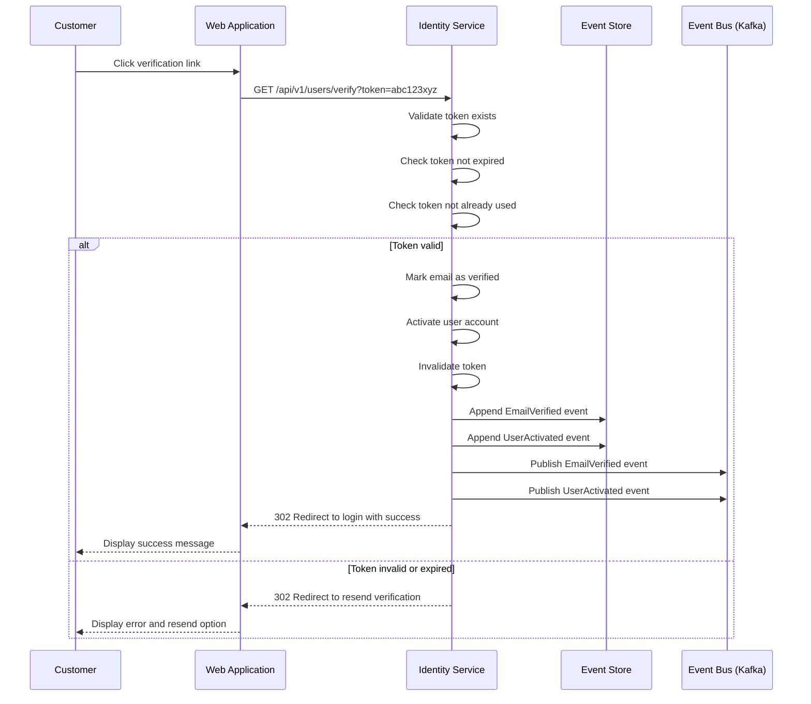
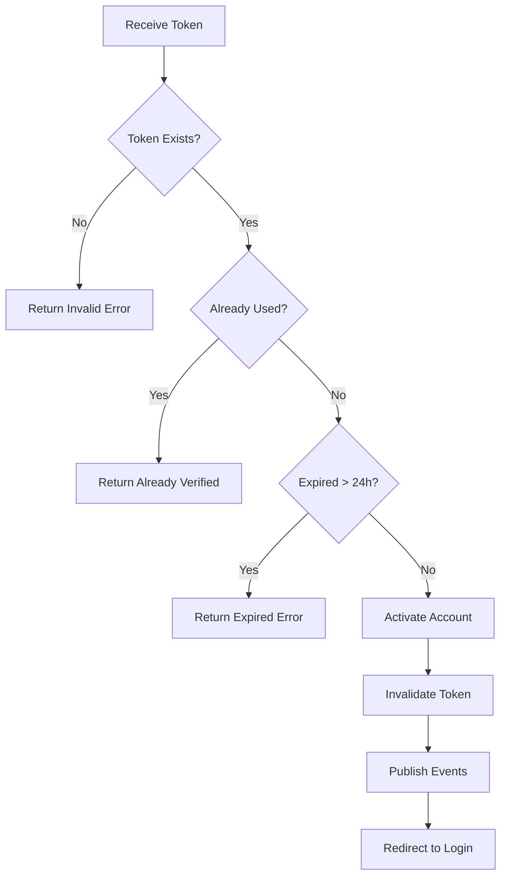

# US-0002-05: Email Verification Processing

## User Story

**As a** new customer,
**I want** to verify my email by clicking the verification link,
**So that** my account is activated and I can start using the platform.

## Story Details

| Field | Value |
|-------|-------|
| Story ID | US-0002-05 |
| Epic | [US-0002: Create Customer Profile](./README.md) |
| Priority | Must Have |
| Phase | Phase 1 (MVP) |
| Story Points | 5 |

## Description

This story implements the email verification flow in the Identity Management Service. When a customer clicks the verification link, the service validates the token, activates the account, and publishes `EmailVerified` and `UserActivated` domain events.

## System Context



## API Contract

### Verify Email Request

```http
GET /api/v1/users/verify?token=abc123xyz789def456
```

### Response (Success - Redirect)

```http
HTTP/1.1 302 Found
Location: https://www.acme.com/login?verified=true
```

### Response (Expired Token - Redirect)

```http
HTTP/1.1 302 Found
Location: https://www.acme.com/verify/resend?error=expired
```

### Response (Invalid Token - Redirect)

```http
HTTP/1.1 302 Found
Location: https://www.acme.com/verify/resend?error=invalid
```

### Response (Already Verified - Redirect)

```http
HTTP/1.1 302 Found
Location: https://www.acme.com/login?already_verified=true
```

### Resend Verification Request

```http
POST /api/v1/users/verify/resend
Content-Type: application/json

{
  "email": "customer@example.com"
}
```

### Resend Response (Success)

```json
{
  "message": "If an account exists with this email, a verification link has been sent.",
  "timestamp": "2026-01-02T11:20:00Z"
}
```

## Domain Events

### EmailVerified

```json
{
  "eventId": "01941234-5678-7abc-def0-123456789030",
  "eventType": "EmailVerified",
  "eventVersion": "1.0",
  "timestamp": "2026-01-02T11:15:00Z",
  "aggregateId": "01941234-5678-7abc-def0-123456789abc",
  "aggregateType": "User",
  "correlationId": "01941234-5678-7abc-def0-123456789002",
  "payload": {
    "userId": "01941234-5678-7abc-def0-123456789abc",
    "email": "customer@example.com",
    "verifiedAt": "2026-01-02T11:15:00Z"
  }
}
```

### UserActivated

```json
{
  "eventId": "01941234-5678-7abc-def0-123456789031",
  "eventType": "UserActivated",
  "eventVersion": "1.0",
  "timestamp": "2026-01-02T11:15:00Z",
  "aggregateId": "01941234-5678-7abc-def0-123456789abc",
  "aggregateType": "User",
  "correlationId": "01941234-5678-7abc-def0-123456789002",
  "payload": {
    "userId": "01941234-5678-7abc-def0-123456789abc",
    "activatedAt": "2026-01-02T11:15:00Z",
    "activationMethod": "EMAIL_VERIFICATION"
  }
}
```

## Acceptance Criteria

### AC-0002-05-01: Valid Token Activation

**Given** I have a valid, unused verification token
**When** I click the verification link
**Then** my email is marked as verified
**And** my account status changes to ACTIVE
**And** I am redirected to the login page with a success message

### AC-0002-05-02: Expired Token Handling

**Given** I have a verification token older than 24 hours
**When** I click the verification link
**Then** I am redirected to a resend verification page
**And** I see the message "Your verification link has expired. Request a new one."
**And** I can enter my email to request a new link

### AC-0002-05-03: Already Used Token

**Given** I have already verified my email
**When** I click the same verification link again
**Then** I am redirected to the login page
**And** I see the message "Your email is already verified. Please log in."

### AC-0002-05-04: Invalid Token (Security)

**Given** I visit a verification URL with an invalid or tampered token
**When** the system processes the request
**Then** I am redirected to the resend verification page
**And** I see a generic message "Invalid verification link. Request a new one."
**And** no information is revealed about whether the token exists

### AC-0002-05-05: Response Time

**Given** the Identity Service is under normal load
**When** a verification request is processed
**Then** the endpoint responds within 200ms (p95)

### AC-0002-05-06: Atomic Event Publishing

**Given** a valid verification token is processed
**When** the account is activated
**Then** both `EmailVerified` and `UserActivated` events are published atomically
**And** either both succeed or both fail (transactional)

### AC-0002-05-07: Resend Rate Limiting

**Given** I request to resend verification email
**When** I have already requested 3 times in the last hour
**Then** my request is rejected with HTTP 429 Too Many Requests
**And** I see the message "Too many requests. Please try again in X minutes."

### AC-0002-05-08: Resend Rate Limit Communication

**Given** I am on the resend verification page
**When** I submit my email
**Then** I see information about the rate limit (max 3 per hour)
**And** if approaching the limit, I see how many requests remain

## Token Validation Flow



## Technical Implementation

### Backend Stack

- **Language**: Kotlin 2.2
- **Runtime**: Java 24 with Project Loom (virtual threads)
- **Framework**: Spring Boot 4 with Spring MVC
- **Database**: PostgreSQL 16+
- **Messaging**: Confluent Kafka

### Service Structure

```
backend-services/identity/src/main/kotlin/com/acme/identity/
├── api/
│   └── v1/
│       ├── VerificationController.kt
│       └── dto/
│           └── ResendVerificationRequest.kt
├── domain/
│   ├── VerificationToken.kt
│   └── events/
│       ├── EmailVerified.kt
│       └── UserActivated.kt
├── application/
│   ├── VerifyEmailUseCase.kt
│   └── ResendVerificationUseCase.kt
├── infrastructure/
│   ├── persistence/
│   │   └── VerificationTokenRepository.kt
│   └── ratelimit/
│       └── RateLimiter.kt
└── config/
    └── VerificationConfig.kt
```

### Database Updates

```sql
-- Mark token as used
UPDATE verification_tokens
SET used_at = NOW()
WHERE token = :token
  AND used_at IS NULL
  AND expires_at > NOW();

-- Update user status
UPDATE users
SET status = 'ACTIVE',
    email_verified = TRUE,
    updated_at = NOW()
WHERE id = :userId
  AND status = 'PENDING_VERIFICATION';

-- Rate limiting table
CREATE TABLE verification_resend_requests (
    id UUID PRIMARY KEY,
    email VARCHAR(255) NOT NULL,
    requested_at TIMESTAMP WITH TIME ZONE NOT NULL DEFAULT NOW(),
    ip_address VARCHAR(45)
);

CREATE INDEX idx_resend_email_time ON verification_resend_requests(email, requested_at);
```

### Rate Limiting Logic

```kotlin
@Service
class VerificationRateLimiter(
    private val resendRepository: ResendRequestRepository
) {
    companion object {
        const val MAX_REQUESTS_PER_HOUR = 3
    }

    fun checkRateLimit(email: String): RateLimitResult {
        val oneHourAgo = Instant.now().minus(1, ChronoUnit.HOURS)
        val recentRequests = resendRepository.countByEmailSince(email, oneHourAgo)

        return if (recentRequests >= MAX_REQUESTS_PER_HOUR) {
            val oldestRequest = resendRepository.findOldestByEmailSince(email, oneHourAgo)
            val retryAfter = oldestRequest.requestedAt.plus(1, ChronoUnit.HOURS)
            RateLimitResult.Exceeded(
                remaining = 0,
                retryAfter = retryAfter
            )
        } else {
            RateLimitResult.Allowed(
                remaining = MAX_REQUESTS_PER_HOUR - recentRequests
            )
        }
    }
}
```

## Security Considerations

| Concern | Mitigation |
|---------|------------|
| Token guessing | 256-bit cryptographically secure random tokens |
| Timing attacks | Constant-time token comparison |
| Email enumeration | Generic responses for resend requests |
| Token replay | Single-use tokens, marked as used immediately |
| Rate limiting bypass | Rate limit by email AND IP address |

## Observability

### Metrics

| Metric | Type | Labels |
|--------|------|--------|
| `email_verification_total` | Counter | result (success, expired, invalid, already_verified) |
| `email_verification_duration_seconds` | Histogram | - |
| `resend_verification_total` | Counter | result (success, rate_limited) |
| `rate_limit_exceeded_total` | Counter | type |

### Tracing Spans

- `GET /api/v1/users/verify` (HTTP span)
- `validate_token` (token lookup and validation)
- `activate_user` (database update)
- `publish_events` (Kafka publish)
- `POST /api/v1/users/verify/resend` (HTTP span)
- `check_rate_limit` (rate limit check)

## Definition of Done

- [ ] Verification endpoint validates tokens correctly
- [ ] Valid tokens activate accounts immediately
- [ ] Expired tokens (>24h) show resend option
- [ ] Already-used tokens show "already verified" message
- [ ] Invalid tokens show generic error (security)
- [ ] Response time < 200ms (p95)
- [ ] EmailVerified and UserActivated events published atomically
- [ ] Resend rate limiting (3/hour) implemented
- [ ] Rate limit clearly communicated to user
- [ ] Unit tests (>90% coverage)
- [ ] Integration tests for all scenarios
- [ ] Security review completed
- [ ] Code reviewed and approved

## Dependencies

- Verification tokens created during registration (US-0002-02)
- Verification email sent with token URL (US-0002-04)

## Related Documents

- [Journey Step 5: Customer Verifies Email](../../journeys/0002-create-customer-profile.md#step-5-customer-verifies-email)
- [US-0002-04: Verification Email Notification](./US-0002-04-verification-email-notification.md)
- [US-0002-06: Customer Profile Activation](./US-0002-06-customer-profile-activation.md)
