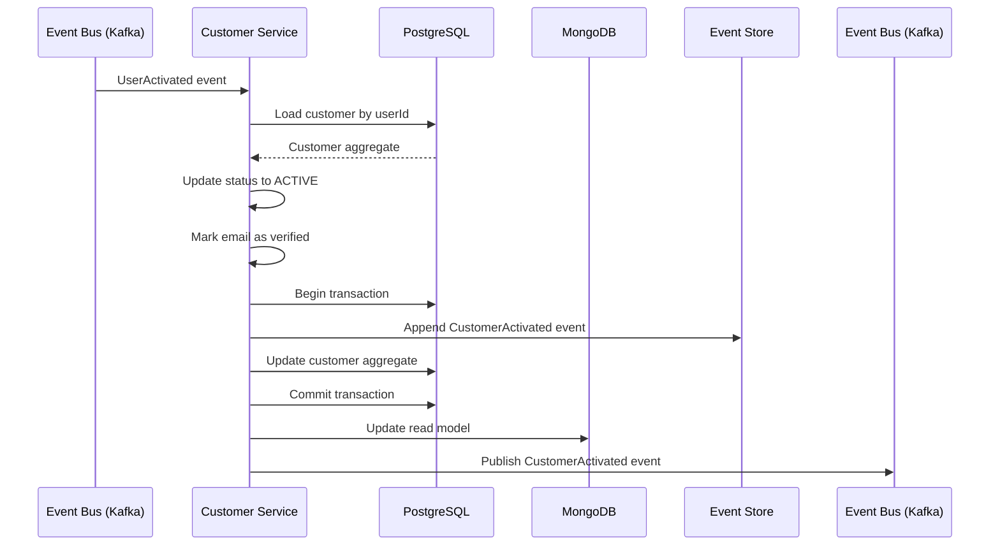
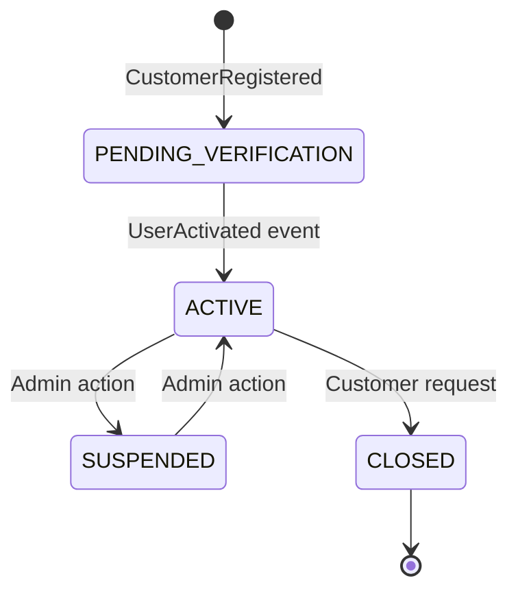

# US-0002-06: Customer Profile Activation

## User Story

**As a** Customer Management Service,
**I want** to activate the customer profile when the user's email is verified,
**So that** the customer can access all platform features.

## Story Details

| Field        | Value                                           |
|--------------|-------------------------------------------------|
| Story ID     | US-0002-06                                      |
| Epic         | [US-0002: Create Customer Profile](./README.md) |
| Priority     | Must Have                                       |
| Phase        | Phase 1 (MVP)                                   |
| Story Points | 3                                               |

## Description

This story implements the customer profile activation in the Customer Management Service. When a `UserActivated` event
is consumed from Kafka, the service updates the customer status from `PENDING_VERIFICATION` to `ACTIVE` and publishes a
`CustomerActivated` event.

## System Context



## Domain Event: CustomerActivated

```json
{
    "eventId": "01941234-5678-7abc-def0-123456789040",
    "eventType": "CustomerActivated",
    "eventVersion": "1.0",
    "timestamp": "2026-01-02T11:15:01Z",
    "aggregateId": "01941234-5678-7abc-def0-123456789020",
    "aggregateType": "Customer",
    "correlationId": "01941234-5678-7abc-def0-123456789002",
    "causationId": "01941234-5678-7abc-def0-123456789031",
    "payload": {
        "customerId": "01941234-5678-7abc-def0-123456789020",
        "activatedAt": "2026-01-02T11:15:01Z",
        "emailVerified": true
    }
}
```

## Acceptance Criteria

### AC-0002-06-01: Status Transition Timeliness

**Given** a `UserActivated` event is published to Kafka
**When** the Customer Service processes the event
**Then** the customer status transitions from `PENDING_VERIFICATION` to `ACTIVE` within 5 seconds

### AC-0002-06-02: Email Verification Flag

**Given** a `UserActivated` event is processed
**When** the customer profile is updated
**Then** the `emailVerified` flag is set to `true`
**And** the email address in the profile is marked as verified

### AC-0002-06-03: Event Publishing

**Given** a customer profile is activated
**When** the transaction commits
**Then** a `CustomerActivated` event is published to Kafka topic `customer.events`
**And** the event includes the causationId linking to the `UserActivated` event

### AC-0002-06-04: Platform Access

**Given** a customer profile is activated
**When** the customer attempts to log in
**Then** the customer can access all platform features
**And** no activation-pending restrictions are applied

### AC-0002-06-05: Activity Timestamp Update

**Given** a customer profile is activated
**When** the profile is updated
**Then** the `lastActivityAt` timestamp is updated to the activation time

### AC-0002-06-06: Idempotent Processing

**Given** the same `UserActivated` event is received multiple times
**When** the service processes duplicate events
**Then** the customer remains in `ACTIVE` status
**And** no duplicate events are published

## Technical Implementation

### Backend Stack

- **Language**: Kotlin 2.2
- **Runtime**: Java 24 with Project Loom
- **Framework**: Spring Boot 4
- **Command Store**: PostgreSQL 16+
- **Query Store**: MongoDB 8.2+
- **Messaging**: Confluent Kafka

### Event Handler

```kotlin
@Component
class UserActivatedHandler(
    private val customerRepository: CustomerRepository,
    private val eventStoreRepository: EventStoreRepository,
    private val readModelProjector: CustomerReadModelProjector,
    private val eventPublisher: CustomerEventPublisher
) {
    @KafkaListener(
        topics = ["identity.user.events"],
        filter = "userActivatedFilter"
    )
    @Transactional
    fun handle(event: UserActivatedEvent) {
        val customer = customerRepository.findByUserId(event.payload.userId)
            ?: throw CustomerNotFoundException(event.payload.userId)

        // Idempotency check
        if (customer.status == CustomerStatus.ACTIVE) {
            log.info("Customer already active, skipping: ${customer.id}")
            return
        }

        // Update customer
        val updatedCustomer = customer.copy(
            status = CustomerStatus.ACTIVE,
            emailVerified = true,
            lastActivityAt = event.timestamp
        )

        // Create domain event
        val activatedEvent = CustomerActivatedEvent(
            eventId = UuidV7.generate(),
            timestamp = Instant.now(),
            aggregateId = customer.id,
            correlationId = event.correlationId,
            causationId = event.eventId,
            payload = CustomerActivatedPayload(
                customerId = customer.id,
                activatedAt = event.timestamp,
                emailVerified = true
            )
        )

        // Persist (transactional)
        eventStoreRepository.append(activatedEvent)
        customerRepository.save(updatedCustomer)

        // Project to read model
        readModelProjector.project(updatedCustomer)

        // Publish event
        eventPublisher.publish(activatedEvent)
    }
}
```

### Database Updates

```sql
-- Update customer status
UPDATE customers
SET status = 'ACTIVE',
    email_verified = TRUE,
    last_activity_at = :activatedAt,
    updated_at = NOW()
WHERE user_id = :userId
  AND status = 'PENDING_VERIFICATION';
```

## State Transition Diagram



## Observability

### Metrics

| Metric                                 | Type      | Labels     |
|----------------------------------------|-----------|------------|
| `customer_activated_total`             | Counter   | -          |
| `customer_activation_duration_seconds` | Histogram | -          |
| `event_processing_lag_seconds`         | Histogram | event_type |

### Tracing Spans

- `consume_user_activated_event` (Kafka consumer)
- `load_customer` (database read)
- `update_customer_status` (database write)
- `persist_event` (event store write)
- `project_read_model` (MongoDB write)
- `publish_customer_activated` (Kafka publish)

## Definition of Done

- [ ] Kafka consumer processes UserActivated events
- [ ] Status transitions within 5 seconds
- [ ] Email verified flag set to true
- [ ] CustomerActivated event published
- [ ] Last activity timestamp updated
- [ ] Idempotent processing (no duplicates)
- [ ] Transactional consistency
- [ ] Read model updated in MongoDB
- [ ] Unit tests (>90% coverage)
- [ ] Integration tests
- [ ] Tracing and metrics implemented
- [ ] Code reviewed and approved

## Dependencies

- Identity Service publishing UserActivated events (US-0002-05)
- Customer profile exists (US-0002-03)

## Related Documents

- [Journey Step 6: Customer Profile Activated](../../journeys/0002-create-customer-profile.md#step-6-customer-profile-activated)
- [US-0002-05: Email Verification Processing](./US-0002-05-email-verification-processing.md)
- [US-0002-07: Welcome Notification](./US-0002-07-welcome-notification.md)
