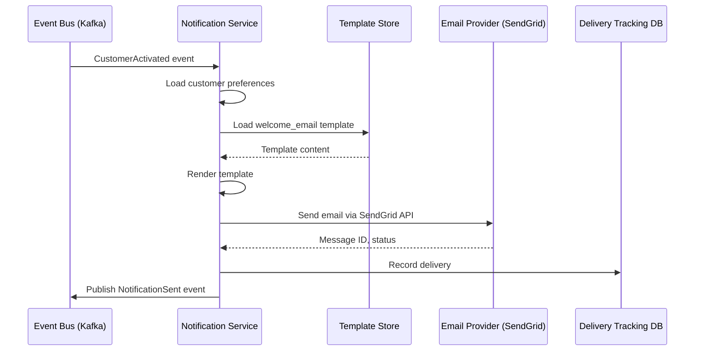
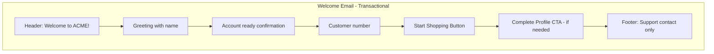
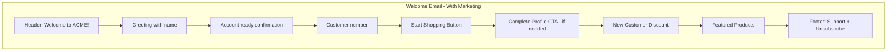

# US-0002-07: Welcome Notification

## User Story

**As a** Notification Service,
**I want** to send a welcome email when a customer is activated,
**So that** the customer feels welcomed and knows their account is ready.

## Story Details

| Field        | Value                                           |
|--------------|-------------------------------------------------|
| Story ID     | US-0002-07                                      |
| Epic         | [US-0002: Create Customer Profile](./README.md) |
| Priority     | Must Have                                       |
| Phase        | Phase 1 (MVP)                                   |
| Story Points | 3                                               |

## Description

This story implements the welcome email notification in the Notification Service. When a `CustomerActivated` event is
consumed from Kafka, the service sends a personalized welcome email that includes account information and a
call-to-action to start shopping.

## System Context



## Email Template

### Template Variables

```json
{
    "recipientName": "Jane",
    "recipientEmail": "customer@example.com",
    "customerNumber": "ACME-202601-000142",
    "shopUrl": "https://www.acme.com/shop",
    "profileUrl": "https://www.acme.com/profile",
    "supportEmail": "support@acme.com",
    "companyName": "ACME Inc.",
    "currentYear": 2026,
    "marketingOptIn": false
}
```

### Email Structure

| Section           | Content                                                   |
|-------------------|-----------------------------------------------------------|
| Subject           | "Welcome to ACME, Jane!"                                  |
| Preheader         | "Your account is ready. Start shopping now!"              |
| Header            | ACME logo + "You're all set!"                             |
| Body              | Welcome message, customer number, quick start guide       |
| CTA Button        | "Start Shopping" (links to shopUrl)                       |
| Secondary CTA     | "Complete Your Profile" (if profile < 100%)               |
| Marketing Section | Promotional content (only if marketingOptIn: true)        |
| Footer            | Support contact, social links, unsubscribe (if marketing) |

## Acceptance Criteria

### AC-0002-07-01: Delivery Timeliness

**Given** a `CustomerActivated` event is published to Kafka
**When** the Notification Service processes the event
**Then** the welcome email is sent within 60 seconds of event timestamp

### AC-0002-07-02: Personalized Content

**Given** a welcome email is being prepared
**When** the template is rendered
**Then** the email includes the customer's first name in the greeting
**And** the email includes the customer number for reference

### AC-0002-07-03: Marketing Preference Respect

**Given** a customer has `marketingOptIn: false`
**When** the welcome email is sent
**Then** the transactional portion (welcome, account info) is always included
**And** the promotional/marketing section is NOT included

**Given** a customer has `marketingOptIn: true`
**When** the welcome email is sent
**Then** the promotional/marketing section IS included
**And** an unsubscribe link is included in the footer

### AC-0002-07-04: Promotional Content for Opt-in

**Given** a customer has opted in to marketing communications
**When** the welcome email is rendered
**Then** the email includes a promotional section with:

- Current offers or discounts
- Featured products
- "New customer" special offer (if applicable)

### AC-0002-07-05: Call-to-Action

**Given** a welcome email is rendered
**When** the customer views the email
**Then** there is a prominent "Start Shopping" button
**And** the button links to the main shop page

### AC-0002-07-06: Profile Completion Prompt

**Given** a customer's profile completeness is less than 100%
**When** the welcome email is rendered
**Then** a secondary CTA "Complete Your Profile" is included
**And** it links to the profile completion wizard

## Technical Implementation

### Backend Stack

- **Language**: Kotlin 2.2
- **Runtime**: Java 24 with Project Loom
- **Framework**: Spring Boot 4
- **Email Provider**: SendGrid API v3
- **Template Engine**: Thymeleaf

### Event Handler

```kotlin
@Component
class CustomerActivatedHandler(
    private val customerService: CustomerQueryService,
    private val emailSender: EmailSender,
    private val templateStore: TemplateStore,
    private val deliveryRepository: DeliveryRepository
) {
    @KafkaListener(
        topics = ["customer.events"],
        filter = "customerActivatedFilter"
    )
    suspend fun handle(event: CustomerActivatedEvent) {
        val customer = customerService.getById(event.payload.customerId)

        val templateVariables = mapOf(
            "recipientName" to customer.name.firstName,
            "recipientEmail" to customer.email.address,
            "customerNumber" to customer.customerNumber,
            "shopUrl" to "https://www.acme.com/shop",
            "profileUrl" to "https://www.acme.com/profile",
            "supportEmail" to "support@acme.com",
            "companyName" to "ACME Inc.",
            "currentYear" to Year.now().value,
            "marketingOptIn" to customer.preferences.communication.marketing,
            "profileCompleteness" to customer.profileCompleteness,
            "showProfileCta" to (customer.profileCompleteness < 100)
        )

        val template = if (customer.preferences.communication.marketing) {
            templateStore.load("welcome_email_marketing")
        } else {
            templateStore.load("welcome_email_transactional")
        }

        val content = template.render(templateVariables)

        val result = emailSender.send(
            to = customer.email.address,
            toName = customer.name.displayName,
            subject = "Welcome to ACME, ${customer.name.firstName}!",
            htmlContent = content,
            category = if (customer.preferences.communication.marketing) "marketing" else "transactional"
        )

        deliveryRepository.save(
            DeliveryRecord(
                notificationType = "WELCOME_EMAIL",
                recipientId = customer.id,
                recipientEmail = customer.email.address,
                providerMessageId = result.messageId,
                status = result.status,
                correlationId = event.correlationId
            )
        )
    }
}
```

## Email Content Variants

### Transactional Only (No Marketing)



### With Marketing Content



## Observability

### Metrics

| Metric                           | Type      | Labels             |
|----------------------------------|-----------|--------------------|
| `welcome_email_sent_total`       | Counter   | marketing_included |
| `welcome_email_duration_seconds` | Histogram | -                  |

### Tracing Spans

- `consume_customer_activated_event` (Kafka consumer)
- `load_customer` (customer query)
- `load_template` (template store)
- `render_template` (template engine)
- `send_email` (SendGrid API)
- `record_delivery` (database write)

## Definition of Done

- [ ] Kafka consumer processes CustomerActivated events
- [ ] Welcome email sent within 60 seconds
- [ ] Personalized content (name, customer number)
- [ ] Marketing preference respected
- [ ] Promotional content for opt-in customers only
- [ ] Start Shopping CTA included
- [ ] Profile completion CTA when profile < 100%
- [ ] Delivery tracked in database
- [ ] Unit tests (>90% coverage)
- [ ] Integration tests with email sandbox
- [ ] Tracing and metrics implemented
- [ ] Code reviewed and approved

## Dependencies

- Customer Service publishing CustomerActivated events (US-0002-06)
- Email templates designed and approved
- SendGrid configuration

## Related Documents

- [Journey Step 7: Welcome Notification Sent](../../journeys/0002-create-customer-profile.md#step-7-welcome-notification-sent)
- [US-0002-06: Customer Profile Activation](./US-0002-06-customer-profile-activation.md)
- [US-0002-08: Profile Completion Wizard](./US-0002-08-profile-completion-wizard.md)
