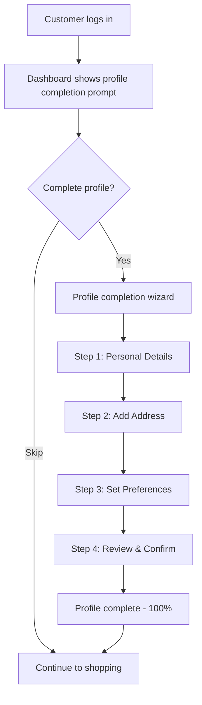
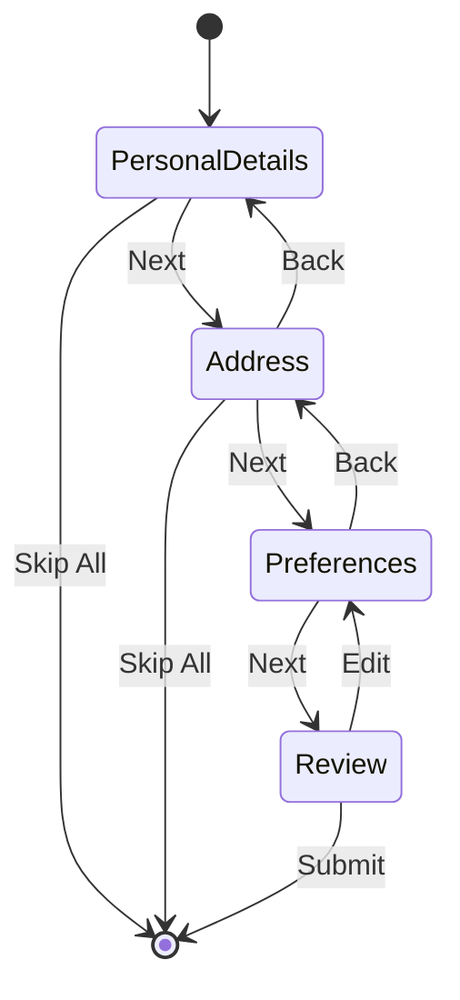

# US-0002-08: Profile Completion Wizard

## User Story

**As an** activated customer,
**I want** a guided wizard to complete my profile,
**So that** I can provide additional information for a personalized shopping experience.

## Story Details

| Field | Value |
|-------|-------|
| Story ID | US-0002-08 |
| Epic | [US-0002: Create Customer Profile](./README.md) |
| Priority | Must Have |
| Phase | Phase 2 (Profile Completion) |
| Story Points | 8 |

## Description

This story implements the profile completion wizard in the web application and the profile update API in the Customer Management Service. The wizard guides customers through providing personal details, adding addresses, setting preferences, and managing consent.

## User Flow



## Wizard Steps

### Step 1: Personal Details

| Field | Type | Required | Validation |
|-------|------|----------|------------|
| Phone Number | Phone Input | No | Valid format per country code |
| Date of Birth | Date Picker | No | Age >= 13 years |
| Gender | Select | No | Options: Male, Female, Non-binary, Prefer not to say |
| Preferred Language | Select | No | en-US, es, fr, de, etc. |
| Timezone | Select | No | IANA timezone list |

### Step 2: Add Address

| Field | Type | Required | Validation |
|-------|------|----------|------------|
| Address Type | Select | Yes | SHIPPING, BILLING, BOTH |
| Label | Text | No | e.g., "Home", "Office" |
| Street Line 1 | Text | Yes | Max 100 chars |
| Street Line 2 | Text | No | Max 100 chars |
| City | Text | Yes | Max 50 chars |
| State/Province | Text/Select | Yes | Based on country |
| Postal Code | Text | Yes | Format per country |
| Country | Select | Yes | ISO 3166-1 alpha-2 |
| Set as Default | Checkbox | No | Default: true if first |

### Step 3: Preferences

| Preference | Type | Default |
|------------|------|---------|
| Email Notifications | Toggle | On |
| SMS Notifications | Toggle | Off |
| Push Notifications | Toggle | Off |
| Marketing Communications | Toggle | Based on registration |
| Notification Frequency | Select | Immediate |

### Step 4: Review & Confirm

Summary of all provided information with option to edit each section.

## API Contract

### Update Profile

```http
PATCH /api/v1/customers/{customerId}/profile
Content-Type: application/json
Authorization: Bearer <jwt>

{
  "phone": {
    "countryCode": "+1",
    "number": "5551234567"
  },
  "dateOfBirth": "1990-05-15",
  "gender": "FEMALE",
  "preferredLocale": "en-US",
  "timezone": "America/New_York"
}
```

### Response

```json
{
  "customerId": "01941234-5678-7abc-def0-123456789020",
  "profile": {
    "phone": {
      "countryCode": "+1",
      "number": "5551234567",
      "verified": false
    },
    "dateOfBirth": "1990-05-15",
    "gender": "FEMALE",
    "preferredLocale": "en-US",
    "timezone": "America/New_York"
  },
  "profileCompleteness": 65,
  "updatedAt": "2026-01-02T11:30:00Z"
}
```

## Domain Event: ProfileUpdated

```json
{
  "eventId": "01941234-5678-7abc-def0-123456789050",
  "eventType": "ProfileUpdated",
  "eventVersion": "1.0",
  "timestamp": "2026-01-02T11:30:00Z",
  "aggregateId": "01941234-5678-7abc-def0-123456789020",
  "aggregateType": "Customer",
  "correlationId": "01941234-5678-7abc-def0-123456789051",
  "payload": {
    "customerId": "01941234-5678-7abc-def0-123456789020",
    "changedFields": ["phone", "dateOfBirth", "gender", "preferredLocale", "timezone"],
    "profileCompleteness": 65
  }
}
```

## Acceptance Criteria

### AC-0002-08-01: Authentication Required

**Given** I am not logged in
**When** I attempt to access the profile update endpoint
**Then** I receive HTTP 401 Unauthorized

### AC-0002-08-02: Authorization - Own Profile Only

**Given** I am logged in as customer A
**When** I attempt to update customer B's profile
**Then** I receive HTTP 403 Forbidden

### AC-0002-08-03: Phone Number Validation

**Given** I am updating my profile with a phone number
**When** I enter a phone number
**Then** the format is validated based on the country code
**And** invalid formats are rejected with a helpful message

### AC-0002-08-04: Age Validation

**Given** I am updating my profile with a date of birth
**When** the date indicates age less than 13 years
**Then** the update is rejected with message "You must be at least 13 years old"

### AC-0002-08-05: Profile Completeness Update

**Given** I update my profile
**When** the update is successful
**Then** the profileCompleteness score is recalculated
**And** the new score is returned in the response

### AC-0002-08-06: Changed Fields in Event

**Given** I update multiple profile fields
**When** the ProfileUpdated event is created
**Then** the changedFields array lists only the fields that were modified

### AC-0002-08-07: Response Time

**Given** the Customer Service is under normal load
**When** a profile update is processed
**Then** the endpoint responds within 300ms (p95)

### AC-0002-08-08: Partial Updates (PATCH)

**Given** I want to update only my phone number
**When** I send a PATCH request with only the phone field
**Then** only the phone field is updated
**And** other fields retain their existing values

### AC-0002-08-09: Audit Trail

**Given** I update my profile
**When** the update is processed
**Then** the change is captured in the event store for audit purposes
**And** the previous and new values are traceable

### AC-0002-08-10: Wizard Skip Option

**Given** I am on the profile wizard
**When** I choose to skip a step or the entire wizard
**Then** I am allowed to proceed without providing optional information
**And** I can return to complete the profile later

## Technical Implementation

### Frontend Stack

- **Framework**: TanStack Start with React 19.2
- **Form Library**: React Hook Form
- **Validation**: Zod schemas
- **UI Components**: shadcn/ui
- **State Management**: Zustand (wizard state)

### Frontend Component Structure

```
frontend-apps/customer/src/
├── components/
│   └── profile/
│       ├── ProfileWizard.tsx
│       ├── PersonalDetailsStep.tsx
│       ├── AddressStep.tsx
│       ├── PreferencesStep.tsx
│       ├── ReviewStep.tsx
│       └── WizardProgress.tsx
├── schemas/
│   └── profile.schema.ts
├── stores/
│   └── profileWizard.store.ts
└── routes/
    └── profile/
        └── complete.tsx
```

### Backend Service Structure

```
backend-services/customer/src/main/kotlin/com/acme/customer/
├── api/
│   └── v1/
│       ├── ProfileController.kt
│       └── dto/
│           ├── UpdateProfileRequest.kt
│           └── ProfileResponse.kt
├── domain/
│   ├── Profile.kt
│   └── events/
│       └── ProfileUpdated.kt
├── application/
│   └── UpdateProfileUseCase.kt
└── infrastructure/
    └── validation/
        └── PhoneNumberValidator.kt
```

### Phone Number Validation

```kotlin
@Component
class PhoneNumberValidator {
    private val phoneUtil = PhoneNumberUtil.getInstance()

    fun validate(countryCode: String, number: String): ValidationResult {
        return try {
            val phoneNumber = phoneUtil.parse("$countryCode$number", null)
            if (phoneUtil.isValidNumber(phoneNumber)) {
                ValidationResult.Valid
            } else {
                ValidationResult.Invalid("Invalid phone number format")
            }
        } catch (e: NumberParseException) {
            ValidationResult.Invalid("Unable to parse phone number")
        }
    }
}
```

## Wizard State Management



## Observability

### Metrics

| Metric | Type | Labels |
|--------|------|--------|
| `profile_update_total` | Counter | status |
| `profile_update_duration_seconds` | Histogram | - |
| `wizard_step_completion_total` | Counter | step |
| `wizard_abandonment_total` | Counter | step |

### Tracing Spans

- `PATCH /api/v1/customers/{id}/profile` (HTTP span)
- `validate_phone_number` (validation)
- `validate_age` (validation)
- `update_profile` (database write)
- `calculate_completeness` (business logic)
- `publish_profile_updated` (Kafka publish)

## Definition of Done

- [ ] Profile wizard UI with all 4 steps
- [ ] PATCH endpoint for profile updates
- [ ] Authentication and authorization enforced
- [ ] Phone number validation by country
- [ ] Age validation (>= 13 years)
- [ ] Profile completeness recalculated
- [ ] ProfileUpdated event with changed fields
- [ ] Response time < 300ms (p95)
- [ ] Partial updates supported
- [ ] Event store audit trail
- [ ] Skip option works correctly
- [ ] Unit tests (>90% coverage)
- [ ] Integration tests
- [ ] Accessibility audit passed
- [ ] Code reviewed and approved

## Dependencies

- Customer profile exists and is active (US-0002-06)
- Authentication system in place

## Related Documents

- [Journey Step 8: Customer Completes Profile](../../journeys/0002-create-customer-profile.md#step-8-customer-completes-profile)
- [US-0002-09: Address Management](./US-0002-09-address-management.md)
- [US-0002-10: Preference Configuration](./US-0002-10-preference-configuration.md)
