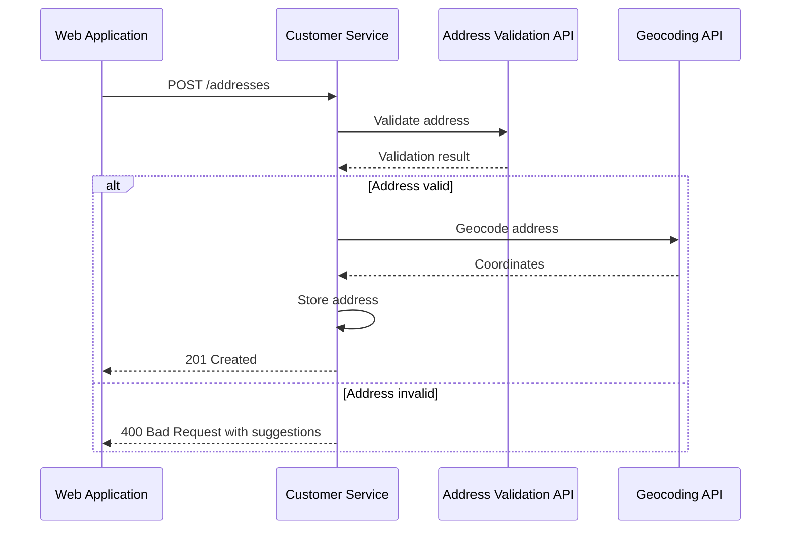
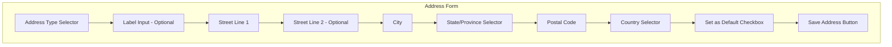

# US-0002-09: Address Management

## User Story

**As an** activated customer,
**I want** to add, edit, and manage my addresses,
**So that** I can have accurate shipping and billing information for orders.

## Story Details

| Field        | Value                                           |
|--------------|-------------------------------------------------|
| Story ID     | US-0002-09                                      |
| Epic         | [US-0002: Create Customer Profile](./README.md) |
| Priority     | Must Have                                       |
| Phase        | Phase 2 (Profile Completion)                    |
| Story Points | 8                                               |

## Description

This story implements address management functionality in both the web application and the Customer Management Service.
Customers can add multiple addresses, validate them against postal standards, set defaults, and manage address types (
shipping/billing).

## Address Validation Flow



## API Contracts

### Add Address

```http
POST /api/v1/customers/{customerId}/addresses
Content-Type: application/json
Authorization: Bearer <jwt>

{
  "type": "SHIPPING",
  "label": "Home",
  "street": {
    "line1": "123 Main Street",
    "line2": "Apt 4B"
  },
  "city": "New York",
  "state": "NY",
  "postalCode": "10001",
  "country": "US",
  "isDefault": true
}
```

### Response (Success)

```json
{
  "addressId": "01941234-5678-7abc-def0-123456789060",
  "customerId": "01941234-5678-7abc-def0-123456789020",
  "type": "SHIPPING",
  "label": "Home",
  "street": {
    "line1": "123 Main Street",
    "line2": "Apt 4B"
  },
  "city": "New York",
  "state": "NY",
  "postalCode": "10001",
  "country": "US",
  "isDefault": true,
  "isValidated": true,
  "coordinates": {
    "latitude": 40.7484,
    "longitude": -73.9967
  },
  "createdAt": "2026-01-02T11:35:00Z"
}
```

### Response (Validation Failed)

```json
{
  "error": "ADDRESS_VALIDATION_FAILED",
  "message": "The address could not be verified",
  "suggestions": [
    {
      "street": {
        "line1": "123 Main St",
        "line2": "Apt 4B"
      },
      "city": "New York",
      "state": "NY",
      "postalCode": "10001-1234",
      "country": "US"
    }
  ],
  "validationDetails": {
    "streetNumber": "CONFIRMED",
    "streetName": "CORRECTED",
    "city": "CONFIRMED",
    "state": "CONFIRMED",
    "postalCode": "CORRECTED"
  }
}
```

### Update Address

```http
PUT /api/v1/customers/{customerId}/addresses/{addressId}
```

### Delete Address

```http
DELETE /api/v1/customers/{customerId}/addresses/{addressId}
```

### List Addresses

```http
GET /api/v1/customers/{customerId}/addresses
```

## Domain Event: AddressAdded

```json
{
  "eventId": "01941234-5678-7abc-def0-123456789061",
  "eventType": "AddressAdded",
  "eventVersion": "1.0",
  "timestamp": "2026-01-02T11:35:00Z",
  "aggregateId": "01941234-5678-7abc-def0-123456789020",
  "aggregateType": "Customer",
  "correlationId": "01941234-5678-7abc-def0-123456789062",
  "payload": {
    "customerId": "01941234-5678-7abc-def0-123456789020",
    "addressId": "01941234-5678-7abc-def0-123456789060",
    "type": "SHIPPING",
    "isDefault": true,
    "isValidated": true
  }
}
```

## Acceptance Criteria

### AC-0002-09-01: Address Validation

**Given** I submit a new address
**When** the address is processed
**Then** it is validated against postal standards (USPS for US, etc.)
**And** validation status is stored with the address

### AC-0002-09-02: Invalid Address Suggestions

**Given** I submit an address that cannot be verified
**When** the validation API returns corrections
**Then** I receive suggested corrections in the response
**And** I can choose to accept a suggestion or override

### AC-0002-09-03: Default Address Management

**Given** I set a new address as default for shipping
**When** the address is saved
**Then** any previous default shipping address is set to non-default
**And** only one address can be default per type

### AC-0002-09-04: Geocoordinates Storage

**Given** I add a validated address
**When** the address passes validation
**Then** latitude and longitude coordinates are stored
**And** coordinates are available for shipping calculations

### AC-0002-09-05: Address Limit

**Given** I have 10 addresses of a specific type
**When** I try to add another address of that type
**Then** I receive an error "Maximum of 10 addresses per type allowed"
**And** the address is not created

### AC-0002-09-06: Unique Labels

**Given** I have an address labeled "Home"
**When** I try to add another address with label "Home"
**Then** I receive an error "Address label already exists"
**And** the address is not created

### AC-0002-09-07: Event Publishing

**Given** I add a new address
**When** the address is saved
**Then** an `AddressAdded` event is published to Kafka
**And** dependent services (Order, Cart) are notified

### AC-0002-09-08: Response Time

**Given** the Customer Service is under normal load
**When** an address is added (including validation)
**Then** the endpoint responds within 1 second (p95)

### AC-0002-09-09: PO Box Restrictions

**Given** I add a PO Box address
**When** the address type is SHIPPING
**Then** I receive a warning "PO Box addresses cannot be used for shipping"
**And** the address is allowed for BILLING type only

### AC-0002-09-10: Address Override

**Given** an address fails validation
**When** I choose to override validation
**Then** the address is saved with `isValidated: false`
**And** a warning is displayed during checkout

## Technical Implementation

### Backend Stack

- **Language**: Kotlin 2.2
- **Framework**: Spring Boot 4
- **Address Validation**: SmartyStreets or Google Address Validation API
- **Geocoding**: Google Maps Geocoding API

### Service Structure

```
backend-services/customer/src/main/kotlin/com/acme/customer/
├── api/
│   └── v1/
│       ├── AddressController.kt
│       └── dto/
│           ├── AddAddressRequest.kt
│           ├── AddressResponse.kt
│           └── AddressValidationResult.kt
├── domain/
│   ├── Address.kt
│   ├── AddressType.kt
│   └── events/
│       ├── AddressAdded.kt
│       ├── AddressUpdated.kt
│       └── AddressRemoved.kt
├── application/
│   ├── AddAddressUseCase.kt
│   ├── UpdateAddressUseCase.kt
│   └── RemoveAddressUseCase.kt
└── infrastructure/
    ├── validation/
    │   ├── AddressValidator.kt
    │   └── SmartyStreetsClient.kt
    └── geocoding/
        └── GeocodingClient.kt
```

### Database Schema

```sql
CREATE TABLE customer_addresses (
    id UUID PRIMARY KEY,
    customer_id UUID NOT NULL REFERENCES customers(id),
    type VARCHAR(20) NOT NULL,  -- SHIPPING, BILLING
    label VARCHAR(50),
    street_line1 VARCHAR(100) NOT NULL,
    street_line2 VARCHAR(100),
    city VARCHAR(50) NOT NULL,
    state VARCHAR(50) NOT NULL,
    postal_code VARCHAR(20) NOT NULL,
    country VARCHAR(2) NOT NULL,  -- ISO 3166-1 alpha-2
    is_default BOOLEAN NOT NULL DEFAULT FALSE,
    is_validated BOOLEAN NOT NULL DEFAULT FALSE,
    latitude DECIMAL(10, 8),
    longitude DECIMAL(11, 8),
    validation_details JSONB,
    created_at TIMESTAMP WITH TIME ZONE NOT NULL DEFAULT NOW(),
    updated_at TIMESTAMP WITH TIME ZONE NOT NULL DEFAULT NOW()
);

CREATE INDEX idx_addresses_customer ON customer_addresses(customer_id);
CREATE INDEX idx_addresses_type ON customer_addresses(customer_id, type);
CREATE UNIQUE INDEX idx_addresses_label ON customer_addresses(customer_id, label)
    WHERE label IS NOT NULL;
```

### Address Validation Integration

```kotlin
@Service
class AddressValidator(
  private val smartyClient: SmartyStreetsClient
) {
  suspend fun validate(address: AddressInput): ValidationResult {
    val lookup = UsStreetLookup().apply {
      street = address.street.line1
      street2 = address.street.line2
      city = address.city
      state = address.state
      zipCode = address.postalCode
    }

    smartyClient.send(lookup)

    return when {
      lookup.result.isEmpty() -> ValidationResult.Invalid(
        message = "Address not found",
        suggestions = emptyList()
      )
      lookup.result[0].analysis.dpvMatchCode == "Y" -> ValidationResult.Valid(
        normalizedAddress = lookup.result[0].toNormalizedAddress(),
        coordinates = Coordinates(
          latitude = lookup.result[0].metadata.latitude,
          longitude = lookup.result[0].metadata.longitude
        )
      )
      else -> ValidationResult.NeedsCorrection(
        suggestions = lookup.result.map { it.toSuggestion() }
      )
    }
  }
}
```

## Address Form UI



## Observability

### Metrics

| Metric                                | Type      | Labels                             |
|---------------------------------------|-----------|------------------------------------|
| `address_added_total`                 | Counter   | type, validated                    |
| `address_validation_total`            | Counter   | result (valid, invalid, corrected) |
| `address_validation_duration_seconds` | Histogram | -                                  |
| `geocoding_duration_seconds`          | Histogram | -                                  |

### Tracing Spans

- `POST /api/v1/customers/{id}/addresses` (HTTP span)
- `validate_address` (external API call)
- `geocode_address` (external API call)
- `save_address` (database write)
- `publish_address_added` (Kafka publish)

## Definition of Done

- [ ] Address CRUD endpoints implemented
- [ ] Address validation integration
- [ ] Invalid address suggestions returned
- [ ] Default address management
- [ ] Geocoordinates stored for valid addresses
- [ ] Max 10 addresses per type enforced
- [ ] Unique labels per customer
- [ ] AddressAdded/Updated/Removed events published
- [ ] Response time < 1 second (p95)
- [ ] PO Box restrictions for shipping
- [ ] Validation override option
- [ ] Unit tests (>90% coverage)
- [ ] Integration tests
- [ ] Code reviewed and approved

## Dependencies

- Customer profile exists and is active (US-0002-06)
- Address validation API configured (SmartyStreets)
- Geocoding API configured (Google Maps)

## Related Documents

- [Journey Step 9: Customer Adds Address](../../journeys/0002-create-customer-profile.md#step-9-customer-adds-address)
- [US-0002-08: Profile Completion Wizard](./US-0002-08-profile-completion-wizard.md)
- [US-0002-10: Preference Configuration](./US-0002-10-preference-configuration.md)
