# US-0002-10: Preference Configuration

## User Story

**As an** activated customer,
**I want** to configure my communication and privacy preferences,
**So that** I receive notifications in my preferred way and control my data.

## Story Details

| Field | Value |
|-------|-------|
| Story ID | US-0002-10 |
| Epic | [US-0002: Create Customer Profile](./README.md) |
| Priority | Must Have |
| Phase | Phase 2 (Profile Completion) |
| Story Points | 5 |

## Description

This story implements preference management in the Customer Management Service. Customers can configure communication channels (email, SMS, push), marketing preferences, notification frequency, and privacy settings.

## Preference Categories

### Communication Preferences

| Preference | Type | Default | Description |
|------------|------|---------|-------------|
| Email Notifications | Boolean | true | Receive transactional emails |
| SMS Notifications | Boolean | false | Receive SMS messages |
| Push Notifications | Boolean | false | Receive push notifications |
| Marketing Communications | Boolean | false | Receive promotional content |
| Notification Frequency | Enum | IMMEDIATE | How often to batch notifications |

### Notification Frequency Options

- `IMMEDIATE` - Send notifications as they occur
- `DAILY_DIGEST` - Batch into daily summary (9 AM local)
- `WEEKLY_DIGEST` - Batch into weekly summary (Monday 9 AM local)

### Privacy Preferences

| Preference | Type | Default | Description |
|------------|------|---------|-------------|
| Share Data With Partners | Boolean | false | Allow third-party data sharing |
| Allow Analytics | Boolean | true | Allow usage analytics |
| Allow Personalization | Boolean | true | Allow personalized recommendations |

### Display Preferences

| Preference | Type | Default | Description |
|------------|------|---------|-------------|
| Language | String | en-US | Preferred display language |
| Currency | String | USD | Preferred currency for prices |
| Timezone | String | UTC | Preferred timezone |

## API Contract

### Update Preferences

```http
PUT /api/v1/customers/{customerId}/preferences
Content-Type: application/json
Authorization: Bearer <jwt>

{
  "communication": {
    "email": true,
    "sms": true,
    "push": false,
    "marketing": true,
    "frequency": "WEEKLY_DIGEST"
  },
  "privacy": {
    "shareDataWithPartners": false,
    "allowAnalytics": true,
    "allowPersonalization": true
  },
  "display": {
    "language": "en-US",
    "currency": "USD",
    "timezone": "America/New_York"
  }
}
```

### Response

```json
{
  "customerId": "01941234-5678-7abc-def0-123456789020",
  "preferences": {
    "communication": {
      "email": true,
      "sms": true,
      "push": false,
      "marketing": true,
      "frequency": "WEEKLY_DIGEST"
    },
    "privacy": {
      "shareDataWithPartners": false,
      "allowAnalytics": true,
      "allowPersonalization": true
    },
    "display": {
      "language": "en-US",
      "currency": "USD",
      "timezone": "America/New_York"
    }
  },
  "updatedAt": "2026-01-02T11:40:00Z"
}
```

### Get Preferences

```http
GET /api/v1/customers/{customerId}/preferences
Authorization: Bearer <jwt>
```

## Domain Event: PreferencesUpdated

```json
{
  "eventId": "01941234-5678-7abc-def0-123456789070",
  "eventType": "PreferencesUpdated",
  "eventVersion": "1.0",
  "timestamp": "2026-01-02T11:40:00Z",
  "aggregateId": "01941234-5678-7abc-def0-123456789020",
  "aggregateType": "Customer",
  "correlationId": "01941234-5678-7abc-def0-123456789071",
  "payload": {
    "customerId": "01941234-5678-7abc-def0-123456789020",
    "changedPreferences": {
      "communication.sms": {"old": false, "new": true},
      "communication.marketing": {"old": false, "new": true},
      "communication.frequency": {"old": "IMMEDIATE", "new": "WEEKLY_DIGEST"}
    }
  }
}
```

## Acceptance Criteria

### AC-0002-10-01: Immediate Effect

**Given** I update my preferences
**When** the update is saved
**Then** the changes take effect immediately
**And** subsequent requests reflect the new preferences

### AC-0002-10-02: Audit Trail

**Given** I update my preferences
**When** the PreferencesUpdated event is created
**Then** the event includes both old and new values for each changed preference
**And** unchanged preferences are not included in the event

### AC-0002-10-03: SMS Requires Verified Phone

**Given** I try to enable SMS notifications
**When** my phone number is not verified
**Then** I receive an error "Phone number must be verified to enable SMS"
**And** SMS preference remains disabled

**Given** I try to enable SMS notifications
**When** my phone number is verified
**Then** SMS preference is enabled successfully

### AC-0002-10-04: Push Requires Device Token

**Given** I try to enable push notifications
**When** no device token is registered
**Then** I receive an error "Please allow notifications in your device settings"
**And** push preference remains disabled

### AC-0002-10-05: Marketing Opt-out Compliance

**Given** I opt out of marketing communications
**When** the change is processed
**Then** all marketing channels stop sending within 24 hours
**And** transactional communications continue unaffected

### AC-0002-10-06: GDPR Compliance Logging

**Given** I update privacy preferences
**When** the update is processed
**Then** the change is logged with timestamp, IP address, and previous value
**And** logs are retained for compliance audit purposes

### AC-0002-10-07: Partial Updates

**Given** I want to change only my notification frequency
**When** I send a request with only the frequency field
**Then** only that field is updated
**And** other preferences retain their current values

### AC-0002-10-08: Language Validation

**Given** I try to set language to an unsupported locale
**When** the request is processed
**Then** I receive an error "Unsupported language: {locale}"
**And** the preference is not changed

### AC-0002-10-09: Event Publishing

**Given** I update my preferences
**When** the changes are saved
**Then** a PreferencesUpdated event is published
**And** the Notification Service receives the event to adjust delivery

## Technical Implementation

### Backend Stack

- **Language**: Kotlin 2.2
- **Framework**: Spring Boot 4
- **Database**: PostgreSQL 16+
- **Messaging**: Confluent Kafka

### Service Structure

```
backend-services/customer/src/main/kotlin/com/acme/customer/
├── api/
│   └── v1/
│       ├── PreferencesController.kt
│       └── dto/
│           ├── UpdatePreferencesRequest.kt
│           └── PreferencesResponse.kt
├── domain/
│   ├── Preferences.kt
│   ├── CommunicationPreferences.kt
│   ├── PrivacyPreferences.kt
│   ├── DisplayPreferences.kt
│   └── events/
│       └── PreferencesUpdated.kt
├── application/
│   ├── UpdatePreferencesUseCase.kt
│   └── GetPreferencesUseCase.kt
└── infrastructure/
    └── compliance/
        └── PreferenceChangeLogger.kt
```

### Database Schema

```sql
CREATE TABLE customer_preferences (
    customer_id UUID PRIMARY KEY REFERENCES customers(id),
    -- Communication
    email_notifications BOOLEAN NOT NULL DEFAULT TRUE,
    sms_notifications BOOLEAN NOT NULL DEFAULT FALSE,
    push_notifications BOOLEAN NOT NULL DEFAULT FALSE,
    marketing_communications BOOLEAN NOT NULL DEFAULT FALSE,
    notification_frequency VARCHAR(20) NOT NULL DEFAULT 'IMMEDIATE',
    -- Privacy
    share_data_with_partners BOOLEAN NOT NULL DEFAULT FALSE,
    allow_analytics BOOLEAN NOT NULL DEFAULT TRUE,
    allow_personalization BOOLEAN NOT NULL DEFAULT TRUE,
    -- Display
    language VARCHAR(10) NOT NULL DEFAULT 'en-US',
    currency VARCHAR(3) NOT NULL DEFAULT 'USD',
    timezone VARCHAR(50) NOT NULL DEFAULT 'UTC',
    -- Audit
    updated_at TIMESTAMP WITH TIME ZONE NOT NULL DEFAULT NOW()
);

-- Audit log for GDPR compliance
CREATE TABLE preference_change_log (
    id UUID PRIMARY KEY,
    customer_id UUID NOT NULL REFERENCES customers(id),
    preference_name VARCHAR(50) NOT NULL,
    old_value TEXT,
    new_value TEXT NOT NULL,
    changed_at TIMESTAMP WITH TIME ZONE NOT NULL DEFAULT NOW(),
    ip_address VARCHAR(45),
    user_agent TEXT
);

CREATE INDEX idx_pref_log_customer ON preference_change_log(customer_id);
CREATE INDEX idx_pref_log_time ON preference_change_log(changed_at);
```

### Preference Change Detection

```kotlin
@Service
class UpdatePreferencesUseCase(
    private val preferencesRepository: PreferencesRepository,
    private val changeLogger: PreferenceChangeLogger,
    private val eventPublisher: CustomerEventPublisher
) {
    @Transactional
    suspend fun execute(
        customerId: CustomerId,
        request: UpdatePreferencesRequest,
        requestContext: RequestContext
    ): Preferences {
        val current = preferencesRepository.findByCustomerId(customerId)
            ?: throw CustomerNotFoundException(customerId)

        // Detect changes
        val changes = mutableMapOf<String, PreferenceChange>()

        request.communication?.let { comm ->
            comm.sms?.let {
                if (it != current.communication.sms) {
                    validateSmsEligibility(customerId, it)
                    changes["communication.sms"] = PreferenceChange(current.communication.sms, it)
                }
            }
            // ... other fields
        }

        if (changes.isEmpty()) {
            return current
        }

        // Apply changes
        val updated = current.applyChanges(request)

        // Log for compliance
        changes.forEach { (name, change) ->
            changeLogger.log(
                customerId = customerId,
                preferenceName = name,
                oldValue = change.old.toString(),
                newValue = change.new.toString(),
                ipAddress = requestContext.ipAddress,
                userAgent = requestContext.userAgent
            )
        }

        // Persist
        preferencesRepository.save(updated)

        // Publish event
        eventPublisher.publish(PreferencesUpdatedEvent(
            customerId = customerId,
            changedPreferences = changes
        ))

        return updated
    }
}
```

## Preferences UI

```mermaid
flowchart TB
    subgraph "Preferences Page"
        subgraph "Communication"
            E[Email Notifications Toggle]
            S[SMS Notifications Toggle]
            P[Push Notifications Toggle]
            M[Marketing Toggle]
            F[Frequency Selector]
        end

        subgraph "Privacy"
            SHARE[Share with Partners Toggle]
            ANAL[Analytics Toggle]
            PERS[Personalization Toggle]
        end

        subgraph "Display"
            LANG[Language Selector]
            CURR[Currency Selector]
            TZ[Timezone Selector]
        end

        SAVE[Save Preferences Button]
    end

    E --> S --> P --> M --> F --> SHARE --> ANAL --> PERS --> LANG --> CURR --> TZ --> SAVE
```



## Observability

### Metrics

| Metric | Type | Labels |
|--------|------|--------|
| `preferences_updated_total` | Counter | category |
| `marketing_opt_out_total` | Counter | - |
| `sms_enabled_total` | Counter | - |
| `privacy_setting_changed_total` | Counter | setting, value |

### Tracing Spans

- `PUT /api/v1/customers/{id}/preferences` (HTTP span)
- `detect_changes` (business logic)
- `validate_eligibility` (validation)
- `log_compliance` (audit logging)
- `save_preferences` (database write)
- `publish_preferences_updated` (Kafka publish)

## Definition of Done

- [ ] Preferences GET/PUT endpoints implemented
- [ ] Changes take effect immediately
- [ ] Audit trail with old/new values in event
- [ ] SMS requires verified phone
- [ ] Push requires device token
- [ ] Marketing opt-out within 24 hours
- [ ] GDPR compliance logging
- [ ] Partial updates supported
- [ ] Language validation
- [ ] PreferencesUpdated event published
- [ ] Unit tests (>90% coverage)
- [ ] Integration tests
- [ ] Code reviewed and approved

## Dependencies

- Customer profile exists and is active (US-0002-06)
- Phone verification (if SMS enabled)
- Device token registration (if push enabled)

## Related Documents

- [Journey Step 10: Customer Sets Preferences](../../journeys/0002-create-customer-profile.md#step-10-customer-sets-preferences)
- [US-0002-08: Profile Completion Wizard](./US-0002-08-profile-completion-wizard.md)
- [US-0002-11: Consent Management](./US-0002-11-consent-management.md)
