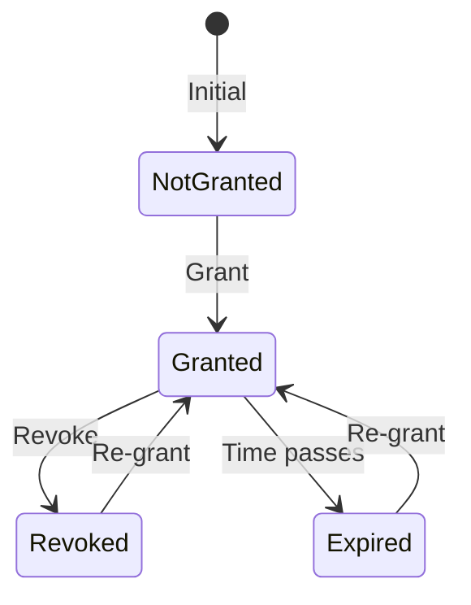
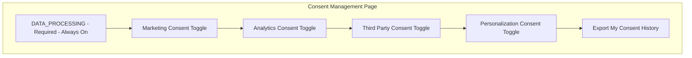

# US-0002-11: Consent Management

## User Story

**As an** activated customer,
**I want** to manage my consent for data processing and marketing,
**So that** I have control over how my data is used and comply with privacy regulations.

## Story Details

| Field | Value |
|-------|-------|
| Story ID | US-0002-11 |
| Epic | [US-0002: Create Customer Profile](./README.md) |
| Priority | Must Have |
| Phase | Phase 3 (Enhanced Features) |
| Story Points | 8 |

## Description

This story implements GDPR-compliant consent management in the Customer Management Service. Customers can grant, revoke, and review their consents for various data processing activities. All consent changes are immutable (append-only) and exportable for data subject requests.

## Consent Types

| Consent Type | Description | Required | Default |
|--------------|-------------|----------|---------|
| DATA_PROCESSING | Basic data processing for service delivery | Yes | Granted at registration |
| MARKETING | Marketing communications and promotions | No | Per registration choice |
| ANALYTICS | Usage analytics and behavior tracking | No | Not granted |
| THIRD_PARTY | Data sharing with partners | No | Not granted |
| PERSONALIZATION | Personalized recommendations | No | Not granted |

## API Contracts

### Grant Consent

```http
POST /api/v1/customers/{customerId}/consents
Content-Type: application/json
Authorization: Bearer <jwt>

{
  "consentType": "MARKETING",
  "granted": true,
  "source": "PROFILE_WIZARD",
  "ipAddress": "192.168.1.100",
  "userAgent": "Mozilla/5.0..."
}
```

### Response (Success)

```json
{
  "consentId": "01941234-5678-7abc-def0-123456789081",
  "customerId": "01941234-5678-7abc-def0-123456789020",
  "consentType": "MARKETING",
  "granted": true,
  "grantedAt": "2026-01-02T11:45:00Z",
  "source": "PROFILE_WIZARD",
  "expiresAt": "2027-01-02T11:45:00Z",
  "version": 1
}
```

### Revoke Consent

```http
POST /api/v1/customers/{customerId}/consents
Content-Type: application/json
Authorization: Bearer <jwt>

{
  "consentType": "MARKETING",
  "granted": false,
  "source": "PRIVACY_SETTINGS",
  "ipAddress": "192.168.1.100",
  "userAgent": "Mozilla/5.0..."
}
```

### List Consents

```http
GET /api/v1/customers/{customerId}/consents
Authorization: Bearer <jwt>
```

### Response

```json
{
  "customerId": "01941234-5678-7abc-def0-123456789020",
  "consents": [
    {
      "consentType": "DATA_PROCESSING",
      "currentStatus": true,
      "grantedAt": "2026-01-02T10:30:00Z",
      "expiresAt": null,
      "source": "REGISTRATION",
      "required": true
    },
    {
      "consentType": "MARKETING",
      "currentStatus": true,
      "grantedAt": "2026-01-02T11:45:00Z",
      "expiresAt": "2027-01-02T11:45:00Z",
      "source": "PROFILE_WIZARD",
      "required": false
    }
  ]
}
```

### Export Consent History (GDPR Data Subject Request)

```http
GET /api/v1/customers/{customerId}/consents/history?format=json
Authorization: Bearer <jwt>
```

### Response

```json
{
  "customerId": "01941234-5678-7abc-def0-123456789020",
  "exportedAt": "2026-01-03T14:00:00Z",
  "consentHistory": [
    {
      "consentId": "01941234-5678-7abc-def0-123456789080",
      "consentType": "DATA_PROCESSING",
      "granted": true,
      "timestamp": "2026-01-02T10:30:00Z",
      "source": "REGISTRATION",
      "ipAddress": "192.168.1.100",
      "userAgent": "Mozilla/5.0..."
    },
    {
      "consentId": "01941234-5678-7abc-def0-123456789081",
      "consentType": "MARKETING",
      "granted": true,
      "timestamp": "2026-01-02T11:45:00Z",
      "source": "PROFILE_WIZARD",
      "ipAddress": "192.168.1.100",
      "userAgent": "Mozilla/5.0..."
    }
  ]
}
```

## Domain Events

### ConsentGranted

```json
{
  "eventId": "01941234-5678-7abc-def0-123456789080",
  "eventType": "ConsentGranted",
  "eventVersion": "1.0",
  "timestamp": "2026-01-02T11:45:00Z",
  "aggregateId": "01941234-5678-7abc-def0-123456789020",
  "aggregateType": "Customer",
  "correlationId": "01941234-5678-7abc-def0-123456789082",
  "payload": {
    "customerId": "01941234-5678-7abc-def0-123456789020",
    "consentId": "01941234-5678-7abc-def0-123456789081",
    "consentType": "MARKETING",
    "granted": true,
    "grantedAt": "2026-01-02T11:45:00Z",
    "source": "PROFILE_WIZARD",
    "expiresAt": "2027-01-02T11:45:00Z"
  }
}
```

### ConsentRevoked

```json
{
  "eventId": "01941234-5678-7abc-def0-123456789090",
  "eventType": "ConsentRevoked",
  "eventVersion": "1.0",
  "timestamp": "2026-01-03T09:00:00Z",
  "aggregateId": "01941234-5678-7abc-def0-123456789020",
  "aggregateType": "Customer",
  "correlationId": "01941234-5678-7abc-def0-123456789091",
  "payload": {
    "customerId": "01941234-5678-7abc-def0-123456789020",
    "consentId": "01941234-5678-7abc-def0-123456789092",
    "consentType": "MARKETING",
    "revokedAt": "2026-01-03T09:00:00Z",
    "source": "PRIVACY_SETTINGS"
  }
}
```

## Acceptance Criteria

### AC-0002-11-01: Immutable Consent Records

**Given** I grant or revoke a consent
**When** the record is created
**Then** it is stored as an append-only record
**And** previous consent records are never modified or deleted

### AC-0002-11-02: Consent Audit Trail

**Given** I update a consent
**When** the record is created
**Then** it includes timestamp, source, and IP address
**And** user agent is captured for audit purposes

### AC-0002-11-03: Implicit DATA_PROCESSING Consent

**Given** I complete registration
**When** my account is created
**Then** DATA_PROCESSING consent is implicitly granted
**And** it is recorded with source "REGISTRATION"
**And** this consent has no expiration

### AC-0002-11-04: Consent Revocation

**Given** I have granted a consent
**When** I revoke that consent
**Then** the revocation is effective immediately
**And** downstream systems are notified within 24 hours

### AC-0002-11-05: Configurable Expiration

**Given** I grant a consent
**When** the consent is created
**Then** it has a configurable expiration period (default: 1 year)
**And** expiration is recorded in the consent record

### AC-0002-11-06: Event Publishing for Compliance

**Given** I grant or revoke a consent
**When** the change is saved
**Then** a ConsentGranted or ConsentRevoked event is published
**And** Marketing, Analytics, and Compliance systems receive the event

### AC-0002-11-07: GDPR Export

**Given** I request my consent history (data subject request)
**When** the export is generated
**Then** all consent records are included
**And** the export is available in JSON format
**And** the export includes all required GDPR fields

### AC-0002-11-08: Required Consent Protection

**Given** I try to revoke DATA_PROCESSING consent
**When** the request is processed
**Then** I receive an error "This consent is required for service delivery"
**And** the consent remains granted
**And** I am informed I can close my account instead

### AC-0002-11-09: Consent Version Tracking

**Given** I update a consent multiple times
**When** the history is viewed
**Then** each change has an incrementing version number
**And** the current effective consent is clearly identified

## Technical Implementation

### Backend Stack

- **Language**: Kotlin 2.2
- **Framework**: Spring Boot 4
- **Database**: PostgreSQL 16+
- **Messaging**: Confluent Kafka

### Service Structure

```
backend-services/customer/src/main/kotlin/com/acme/customer/
├── api/
│   └── v1/
│       ├── ConsentController.kt
│       └── dto/
│           ├── GrantConsentRequest.kt
│           ├── ConsentResponse.kt
│           └── ConsentHistoryExport.kt
├── domain/
│   ├── Consent.kt
│   ├── ConsentType.kt
│   ├── ConsentRecord.kt
│   └── events/
│       ├── ConsentGranted.kt
│       └── ConsentRevoked.kt
├── application/
│   ├── GrantConsentUseCase.kt
│   ├── RevokeConsentUseCase.kt
│   ├── GetConsentsUseCase.kt
│   └── ExportConsentHistoryUseCase.kt
└── infrastructure/
    └── persistence/
        └── ConsentRepository.kt
```

### Database Schema (Append-Only)

```sql
-- Immutable consent records
CREATE TABLE consent_records (
    id UUID PRIMARY KEY,
    customer_id UUID NOT NULL REFERENCES customers(id),
    consent_type VARCHAR(50) NOT NULL,
    granted BOOLEAN NOT NULL,
    source VARCHAR(50) NOT NULL,
    ip_address VARCHAR(45) NOT NULL,
    user_agent TEXT,
    expires_at TIMESTAMP WITH TIME ZONE,
    created_at TIMESTAMP WITH TIME ZONE NOT NULL DEFAULT NOW(),
    version INTEGER NOT NULL
);

-- No UPDATE or DELETE allowed - this is enforced at application level
-- and can be protected with database policies

CREATE INDEX idx_consent_customer ON consent_records(customer_id);
CREATE INDEX idx_consent_type ON consent_records(customer_id, consent_type);
CREATE INDEX idx_consent_time ON consent_records(created_at);

-- Materialized view for current consent status
CREATE MATERIALIZED VIEW current_consents AS
SELECT DISTINCT ON (customer_id, consent_type)
    customer_id,
    consent_type,
    granted,
    source,
    expires_at,
    created_at as last_updated,
    version
FROM consent_records
ORDER BY customer_id, consent_type, created_at DESC;

CREATE UNIQUE INDEX idx_current_consent ON current_consents(customer_id, consent_type);
```

### Consent State Machine



### Consent Record Creation

```kotlin
@Service
class GrantConsentUseCase(
    private val consentRepository: ConsentRepository,
    private val eventPublisher: CustomerEventPublisher
) {
    @Transactional
    suspend fun execute(
        customerId: CustomerId,
        request: GrantConsentRequest
    ): ConsentRecord {
        // Validate consent type exists
        val consentType = ConsentType.valueOf(request.consentType)

        // Check if required consent revocation
        if (consentType == ConsentType.DATA_PROCESSING && !request.granted) {
            throw RequiredConsentException(
                "DATA_PROCESSING consent is required. To remove it, please close your account."
            )
        }

        // Get current version
        val currentVersion = consentRepository.getCurrentVersion(customerId, consentType) ?: 0

        // Calculate expiration
        val expiresAt = if (request.granted && consentType != ConsentType.DATA_PROCESSING) {
            Instant.now().plus(365, ChronoUnit.DAYS)
        } else {
            null
        }

        // Create immutable record
        val record = ConsentRecord(
            id = UuidV7.generate(),
            customerId = customerId,
            consentType = consentType,
            granted = request.granted,
            source = request.source,
            ipAddress = request.ipAddress,
            userAgent = request.userAgent,
            expiresAt = expiresAt,
            version = currentVersion + 1
        )

        // Append (never update)
        consentRepository.append(record)

        // Refresh materialized view
        consentRepository.refreshCurrentConsents()

        // Publish event
        val event = if (request.granted) {
            ConsentGrantedEvent(
                customerId = customerId,
                consentId = record.id,
                consentType = consentType,
                grantedAt = record.createdAt,
                source = record.source,
                expiresAt = record.expiresAt
            )
        } else {
            ConsentRevokedEvent(
                customerId = customerId,
                consentId = record.id,
                consentType = consentType,
                revokedAt = record.createdAt,
                source = record.source
            )
        }

        eventPublisher.publish(event)

        return record
    }
}
```

## Consent UI



## Observability

### Metrics

| Metric | Type | Labels |
|--------|------|--------|
| `consent_granted_total` | Counter | consent_type, source |
| `consent_revoked_total` | Counter | consent_type, source |
| `consent_export_total` | Counter | format |

### Tracing Spans

- `POST /api/v1/customers/{id}/consents` (HTTP span)
- `validate_consent_type` (validation)
- `append_consent_record` (database write)
- `refresh_materialized_view` (database operation)
- `publish_consent_event` (Kafka publish)

## Definition of Done

- [ ] Consent CRUD endpoints implemented
- [ ] Immutable append-only records
- [ ] Audit trail with IP, timestamp, user agent
- [ ] Implicit DATA_PROCESSING at registration
- [ ] Consent revocation effective immediately
- [ ] Configurable expiration (default 1 year)
- [ ] ConsentGranted/Revoked events published
- [ ] GDPR export endpoint (JSON format)
- [ ] Required consent protection
- [ ] Version tracking
- [ ] Unit tests (>90% coverage)
- [ ] Integration tests
- [ ] Compliance review completed
- [ ] Code reviewed and approved

## Dependencies

- Customer profile exists and is active (US-0002-06)
- Compliance team approval on consent types
- Legal review of consent language

## Related Documents

- [Journey Step 11: Customer Grants Consent](../../journeys/0002-create-customer-profile.md#step-11-customer-grants-consent)
- [US-0002-10: Preference Configuration](./US-0002-10-preference-configuration.md)
- [US-0002-12: Profile Completeness Tracking](./US-0002-12-profile-completeness-tracking.md)
