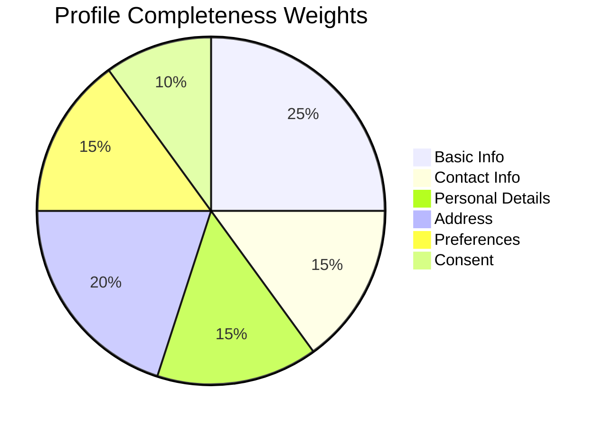
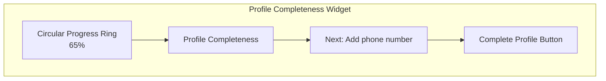
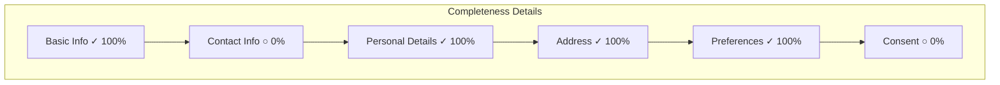

# US-0002-12: Profile Completeness Tracking

## User Story

**As an** activated customer,
**I want** to see my profile completeness score and what's missing,
**So that** I am motivated to complete my profile for a better experience.

## Story Details

| Field | Value |
|-------|-------|
| Story ID | US-0002-12 |
| Epic | [US-0002: Create Customer Profile](./README.md) |
| Priority | Should Have |
| Phase | Phase 3 (Enhanced Features) |
| Story Points | 5 |

## Description

This story implements profile completeness tracking and visualization. The completeness score is calculated based on weighted sections and displayed to customers with guidance on what to complete next. A `ProfileCompleted` event is published when a customer reaches 100%.

## Completeness Calculation

Profile completeness is calculated based on weighted sections:

| Section | Weight | Criteria for 100% |
|---------|--------|-------------------|
| Basic Info (name, email) | 25% | First name, last name, verified email |
| Contact Info | 15% | Phone number added |
| Personal Details | 15% | Date of birth OR gender provided |
| Address | 20% | At least one validated address |
| Preferences | 15% | Communication preferences set |
| Consent | 10% | All required consents granted |



## API Contract

### Get Profile Completeness

```http
GET /api/v1/customers/{customerId}/profile/completeness
Authorization: Bearer <jwt>
```

### Response

```json
{
  "customerId": "01941234-5678-7abc-def0-123456789020",
  "overallScore": 65,
  "sections": [
    {
      "name": "basicInfo",
      "displayName": "Basic Information",
      "weight": 25,
      "score": 100,
      "isComplete": true,
      "items": [
        {"name": "firstName", "complete": true},
        {"name": "lastName", "complete": true},
        {"name": "emailVerified", "complete": true}
      ]
    },
    {
      "name": "contactInfo",
      "displayName": "Contact Information",
      "weight": 15,
      "score": 0,
      "isComplete": false,
      "items": [
        {"name": "phoneNumber", "complete": false, "action": "Add phone number"}
      ]
    },
    {
      "name": "personalDetails",
      "displayName": "Personal Details",
      "weight": 15,
      "score": 100,
      "isComplete": true,
      "items": [
        {"name": "dateOfBirth", "complete": true},
        {"name": "gender", "complete": false}
      ]
    },
    {
      "name": "address",
      "displayName": "Address",
      "weight": 20,
      "score": 100,
      "isComplete": true,
      "items": [
        {"name": "validatedAddress", "complete": true}
      ]
    },
    {
      "name": "preferences",
      "displayName": "Preferences",
      "weight": 15,
      "score": 100,
      "isComplete": true,
      "items": [
        {"name": "communicationPreferences", "complete": true}
      ]
    },
    {
      "name": "consent",
      "displayName": "Consent",
      "weight": 10,
      "score": 0,
      "isComplete": false,
      "items": [
        {"name": "requiredConsents", "complete": false, "action": "Review consent settings"}
      ]
    }
  ],
  "nextAction": {
    "section": "contactInfo",
    "action": "Add phone number",
    "url": "/profile/contact"
  },
  "updatedAt": "2026-01-02T12:00:00Z"
}
```

## Domain Event: ProfileCompleted

```json
{
  "eventId": "01941234-5678-7abc-def0-123456789100",
  "eventType": "ProfileCompleted",
  "eventVersion": "1.0",
  "timestamp": "2026-01-02T12:30:00Z",
  "aggregateId": "01941234-5678-7abc-def0-123456789020",
  "aggregateType": "Customer",
  "correlationId": "01941234-5678-7abc-def0-123456789101",
  "payload": {
    "customerId": "01941234-5678-7abc-def0-123456789020",
    "completedAt": "2026-01-02T12:30:00Z",
    "timeToComplete": "PT2H30M"
  }
}
```

## Acceptance Criteria

### AC-0002-12-01: Real-time Recalculation

**Given** I update any section of my profile
**When** the update is saved
**Then** the profileCompleteness score is recalculated immediately
**And** the new score is returned in the API response

### AC-0002-12-02: UI Visibility

**Given** I am logged in to my account
**When** I view my profile or dashboard
**Then** I can see my current profile completeness percentage
**And** I can see which sections are incomplete

### AC-0002-12-03: ProfileCompleted Event

**Given** my profile completeness is less than 100%
**When** I complete the final missing section
**Then** a `ProfileCompleted` event is published
**And** the event includes the time taken to complete

### AC-0002-12-04: Incomplete Profile Prompt

**Given** my profile completeness is less than 80%
**When** I visit the dashboard
**Then** I see a prominent prompt to complete my profile
**And** the prompt shows the next recommended action

### AC-0002-12-05: Section Progress Details

**Given** I view my profile completeness
**When** I expand a section
**Then** I see which specific items are complete/incomplete
**And** incomplete items show actionable guidance

### AC-0002-12-06: Personal Details OR Logic

**Given** I am completing personal details
**When** I provide date of birth OR gender
**Then** the personal details section is marked 100% complete
**And** providing both does not exceed 100%

### AC-0002-12-07: Weighted Calculation

**Given** I have completed some profile sections
**When** the score is calculated
**Then** the overall score is the weighted sum of section scores
**And** the weights match the documented values

### AC-0002-12-08: Progress Persistence

**Given** I complete profile sections over multiple sessions
**When** I return to the platform
**Then** my previous progress is preserved
**And** the score reflects my cumulative progress

## Technical Implementation

### Completeness Calculator

```kotlin
@Component
class ProfileCompletenessCalculator {

    companion object {
        val SECTION_WEIGHTS = mapOf(
            "basicInfo" to 25,
            "contactInfo" to 15,
            "personalDetails" to 15,
            "address" to 20,
            "preferences" to 15,
            "consent" to 10
        )
    }

    fun calculate(customer: Customer): ProfileCompleteness {
        val sections = listOf(
            calculateBasicInfo(customer),
            calculateContactInfo(customer),
            calculatePersonalDetails(customer),
            calculateAddress(customer),
            calculatePreferences(customer),
            calculateConsent(customer)
        )

        val overallScore = sections.sumOf { section ->
            (section.score * SECTION_WEIGHTS[section.name]!!) / 100
        }

        return ProfileCompleteness(
            customerId = customer.id,
            overallScore = overallScore,
            sections = sections,
            nextAction = determineNextAction(sections)
        )
    }

    private fun calculateBasicInfo(customer: Customer): SectionCompleteness {
        val items = listOf(
            ItemCompleteness("firstName", customer.name.firstName.isNotBlank()),
            ItemCompleteness("lastName", customer.name.lastName.isNotBlank()),
            ItemCompleteness("emailVerified", customer.email.verified)
        )

        val score = if (items.all { it.complete }) 100 else 0

        return SectionCompleteness(
            name = "basicInfo",
            displayName = "Basic Information",
            weight = SECTION_WEIGHTS["basicInfo"]!!,
            score = score,
            isComplete = score == 100,
            items = items
        )
    }

    private fun calculatePersonalDetails(customer: Customer): SectionCompleteness {
        val hasDateOfBirth = customer.profile.dateOfBirth != null
        val hasGender = customer.profile.gender != null

        // OR logic: either one is sufficient
        val score = if (hasDateOfBirth || hasGender) 100 else 0

        val items = listOf(
            ItemCompleteness("dateOfBirth", hasDateOfBirth),
            ItemCompleteness("gender", hasGender)
        )

        return SectionCompleteness(
            name = "personalDetails",
            displayName = "Personal Details",
            weight = SECTION_WEIGHTS["personalDetails"]!!,
            score = score,
            isComplete = score == 100,
            items = items
        )
    }

    private fun calculateAddress(customer: Customer): SectionCompleteness {
        val hasValidatedAddress = customer.addresses.any { it.isValidated }

        return SectionCompleteness(
            name = "address",
            displayName = "Address",
            weight = SECTION_WEIGHTS["address"]!!,
            score = if (hasValidatedAddress) 100 else 0,
            isComplete = hasValidatedAddress,
            items = listOf(
                ItemCompleteness(
                    name = "validatedAddress",
                    complete = hasValidatedAddress,
                    action = if (!hasValidatedAddress) "Add a shipping address" else null
                )
            )
        )
    }

    // ... similar methods for other sections

    private fun determineNextAction(sections: List<SectionCompleteness>): NextAction? {
        val incompleteSection = sections.firstOrNull { !it.isComplete }
            ?: return null

        val incompleteItem = incompleteSection.items.firstOrNull { !it.complete }
            ?: return null

        return NextAction(
            section = incompleteSection.name,
            action = incompleteItem.action ?: "Complete ${incompleteSection.displayName}",
            url = getSectionUrl(incompleteSection.name)
        )
    }
}
```

### Completeness Update Trigger

```kotlin
@Component
class ProfileCompletenessUpdater(
    private val calculator: ProfileCompletenessCalculator,
    private val customerRepository: CustomerRepository,
    private val eventPublisher: CustomerEventPublisher
) {
    @EventListener
    suspend fun onProfileUpdated(event: ProfileUpdatedEvent) {
        updateCompleteness(event.customerId)
    }

    @EventListener
    suspend fun onAddressAdded(event: AddressAddedEvent) {
        updateCompleteness(event.customerId)
    }

    @EventListener
    suspend fun onPreferencesUpdated(event: PreferencesUpdatedEvent) {
        updateCompleteness(event.customerId)
    }

    @EventListener
    suspend fun onConsentGranted(event: ConsentGrantedEvent) {
        updateCompleteness(event.customerId)
    }

    private suspend fun updateCompleteness(customerId: CustomerId) {
        val customer = customerRepository.findById(customerId)
            ?: return

        val previousScore = customer.profileCompleteness
        val completeness = calculator.calculate(customer)

        if (completeness.overallScore != previousScore) {
            val updatedCustomer = customer.copy(
                profileCompleteness = completeness.overallScore
            )
            customerRepository.save(updatedCustomer)

            // Check for 100% completion
            if (previousScore < 100 && completeness.overallScore == 100) {
                eventPublisher.publish(ProfileCompletedEvent(
                    customerId = customerId,
                    completedAt = Instant.now(),
                    timeToComplete = Duration.between(customer.registeredAt, Instant.now())
                ))
            }
        }
    }
}
```

## UI Components

### Completeness Widget



### Detailed Breakdown



## Observability

### Metrics

| Metric | Type | Labels |
|--------|------|--------|
| `profile_completeness_distribution` | Histogram | - |
| `profile_completed_total` | Counter | - |
| `profile_section_completion_total` | Counter | section |
| `time_to_complete_profile_seconds` | Histogram | - |

### Tracing Spans

- `GET /api/v1/customers/{id}/profile/completeness` (HTTP span)
- `calculate_completeness` (business logic)
- `update_completeness` (event handler)

## Definition of Done

- [ ] Completeness endpoint implemented
- [ ] Real-time recalculation on profile changes
- [ ] UI widget shows percentage and breakdown
- [ ] ProfileCompleted event at 100%
- [ ] Incomplete profile prompt (<80%)
- [ ] Section details with actionable guidance
- [ ] Personal details OR logic
- [ ] Weighted calculation correct
- [ ] Progress persists across sessions
- [ ] Unit tests (>90% coverage)
- [ ] Integration tests
- [ ] UI accessibility audit
- [ ] Code reviewed and approved

## Dependencies

- All profile-related stories implemented
- Event listeners configured for profile changes

## Related Documents

- [Journey: Profile Completeness Calculation](../../journeys/0001-create-customer-profile.md#profile-completeness-calculation)
- [US-0002-08: Profile Completion Wizard](./US-0002-08-profile-completion-wizard.md)
- [US-0002-11: Consent Management](./US-0002-11-consent-management.md)
