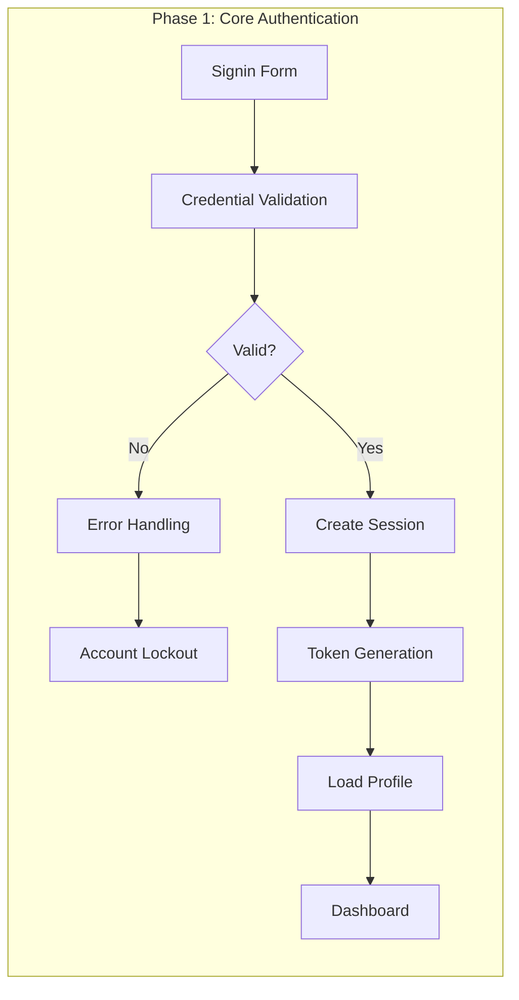
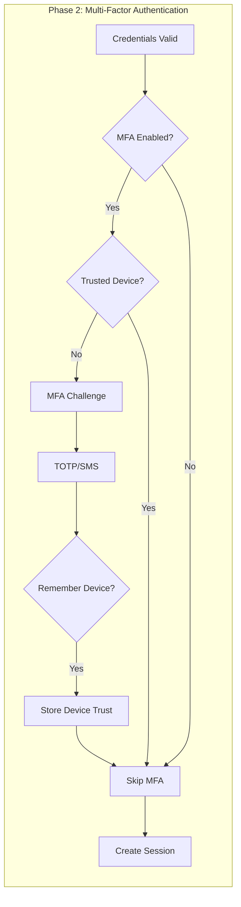
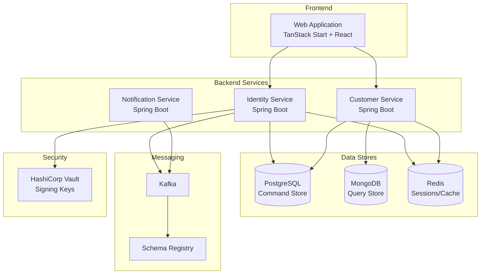

# User Story Epic: Customer Signin

**Epic ID:** US-0003
**Source Journey:** [UJ-0002: Customer Signin](../../journeys/0003-customer-signin.md)
**Status:** Draft
**Created:** 2026-01-18

## Overview

This epic contains user stories derived from the Customer Signin user journey. The stories implement the complete authentication flow, including credential validation, multi-factor authentication, session management, and security measures to protect customer accounts.

## Business Value

- **Customer Retention**: Seamless signin experience encourages repeat visits and purchases
- **Security**: Protect customer accounts and sensitive data through robust authentication
- **Personalization**: Enable personalized experiences by identifying authenticated customers
- **Fraud Prevention**: Detect and prevent unauthorized access attempts
- **Multi-device Support**: Allow customers to access their accounts across devices securely

## User Stories

| Story ID                                                               | Title                        | Priority    | Phase   |
|------------------------------------------------------------------------|------------------------------|-------------|---------|
| [US-0003-01](./US-0003-01-signin-form-ui.md)                           | Signin Form UI               | Must Have   | Phase 1 |
| [US-0003-02](./US-0003-02-credential-validation.md)                    | Credential Validation        | Must Have   | Phase 1 |
| [US-0003-03](./US-0003-03-rate-limiting.md)                            | Rate Limiting                | Must Have   | Phase 1 |
| [US-0003-04](./US-0003-04-account-lockout.md)                          | Account Lockout              | Must Have   | Phase 1 |
| [US-0003-05](./US-0003-05-mfa-totp.md)                                 | MFA Challenge (TOTP)         | Must Have   | Phase 2 |
| [US-0003-06](./US-0003-06-mfa-sms.md)                                  | MFA Challenge (SMS)          | Should Have | Phase 2 |
| [US-0003-07](./US-0003-07-session-token-creation.md)                   | Session and Token Creation   | Must Have   | Phase 1 |
| [US-0003-08](./US-0003-08-remember-device.md)                          | Remember Device              | Should Have | Phase 2 |
| [US-0003-09](./US-0003-09-customer-context-loading.md)                 | Customer Context Loading     | Must Have   | Phase 1 |
| [US-0003-10](./US-0003-10-invalid-credentials-handling.md)             | Invalid Credentials Handling | Must Have   | Phase 1 |
| [US-0003-11](./US-0003-11-inactive-account-handling.md)                | Inactive Account Handling    | Must Have   | Phase 1 |
| [US-0003-12](./US-0003-12-token-refresh.md)                            | Token Refresh Flow           | Must Have   | Phase 1 |
| [US-0003-13](./US-0003-13-password-reset.md)                           | Password Reset Flow          | Must Have   | Phase 1 |
| [US-0003-14](./US-0003-14-customer-logout.md)                          | Customer Logout              | Must Have   | Phase 1 |

## Implementation Phases

### Phase 1: Core Signin (MVP)

Stories US-0003-01 through US-0003-04 and US-0003-07 through US-0003-14 implement the minimum viable signin flow:



**Included in Phase 1:**
- Signin form UI with validation
- Credential validation with Argon2id
- Rate limiting for security
- Account lockout after failed attempts
- JWT session and token management
- Customer profile loading
- Error handling for invalid credentials
- Inactive account handling
- Token refresh flow
- Password reset flow
- Logout functionality

### Phase 2: Enhanced Security

Stories US-0003-05, US-0003-06, and US-0003-08 add MFA and device trust:



**Included in Phase 2:**
- TOTP-based MFA (Google Authenticator, Authy)
- SMS-based MFA (alternative method)
- Device trust and remember functionality

## Architecture Overview



## Domain Events

| Event                    | Producer         | Consumers                                    |
|--------------------------|------------------|----------------------------------------------|
| UserLoggedIn             | Identity Service | Customer Service, Analytics, Fraud Detection |
| AuthenticationFailed     | Identity Service | Analytics, Fraud Detection, Security         |
| MFAChallengeInitiated    | Identity Service | Analytics                                    |
| MFAVerificationSucceeded | Identity Service | Analytics                                    |
| MFAVerificationFailed    | Identity Service | Analytics, Security                          |
| SessionCreated           | Identity Service | Analytics                                    |
| SessionInvalidated       | Identity Service | Analytics                                    |
| DeviceRemembered         | Identity Service | Analytics                                    |
| DeviceRevoked            | Identity Service | Analytics                                    |
| AccountLocked            | Identity Service | Notification Service, Analytics, Security    |
| AccountUnlocked          | Identity Service | Analytics                                    |
| PasswordResetRequested   | Identity Service | Notification Service, Analytics              |
| PasswordChanged          | Identity Service | Notification Service, Analytics              |

## Security Considerations

| Concern               | Mitigation                                                    |
|-----------------------|---------------------------------------------------------------|
| Credential stuffing   | Rate limiting per IP and email, CAPTCHA after failures        |
| Brute force attacks   | Account lockout after 5 failures, progressive delays          |
| Timing attacks        | Constant-time password comparison, consistent response times  |
| Session hijacking     | HttpOnly, Secure, SameSite=Strict cookies                     |
| Token theft           | Short-lived access tokens (15min), refresh token rotation     |
| XSS                   | HttpOnly cookies prevent JavaScript access to tokens          |
| CSRF                  | SameSite=Strict cookies, CSRF tokens on forms                 |
| Replay attacks        | Single-use MFA codes, nonce in tokens                         |
| Password storage      | Argon2id with 64MB memory, 3 iterations, 4 parallelism        |
| Man-in-the-middle     | TLS 1.3 required, HSTS enabled                                |

## Testing Considerations

### Rate Limiting

Rate limiting can be disabled for testing environments via the `RATE_LIMITING_ENABLED` environment variable:

```bash
# Run acceptance tests with rate limiting disabled
RATE_LIMITING_ENABLED=false npm test
```

See [US-0003-03: Rate Limiting](./US-0003-03-rate-limiting.md) for details.

### Acceptance Tests

```gherkin
Feature: Customer Signin

  Scenario: Customer signs in with valid credentials
    Given I am a registered customer with email "customer@example.com"
    And my account is active
    When I navigate to the signin page
    And I enter my email and password
    And I click the "Sign In" button
    Then I should be redirected to the dashboard
    And I should see my name in the header

  Scenario: Customer signs in with MFA enabled
    Given I am a registered customer with MFA enabled
    When I sign in with valid credentials
    Then I should see the MFA verification screen
    When I enter a valid TOTP code
    Then I should be redirected to the dashboard

  Scenario: Customer account is locked after failed attempts
    Given I am a registered customer
    When I fail to sign in 5 times
    Then my account should be locked
    And I should see "Account locked. Try again in 15 minutes"
```

## Performance Requirements

| Metric                      | Target      |
|-----------------------------|-------------|
| Signin page load            | < 1s (p95)  |
| Credential validation       | < 500ms (p95)|
| MFA verification            | < 200ms (p95)|
| Token generation            | < 50ms (p95) |
| Token validation            | < 10ms (p99) |
| Profile loading             | < 500ms (p95)|

## Related Documents

- [User Journey: Customer Signin](../../journeys/0003-customer-signin.md)
- [Implementation Guidelines](../../IMPLEMENTATION.md)
- [Identity Management Epic](../../epics/000-identity-management.md)
- [Customer Management Epic](../../epics/004-customer-management.md)
- [User Journey: Create Customer Profile](../../journeys/0002-create-customer-profile.md)
