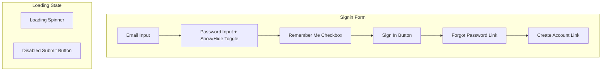
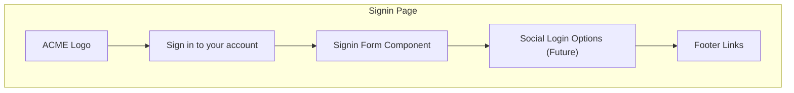
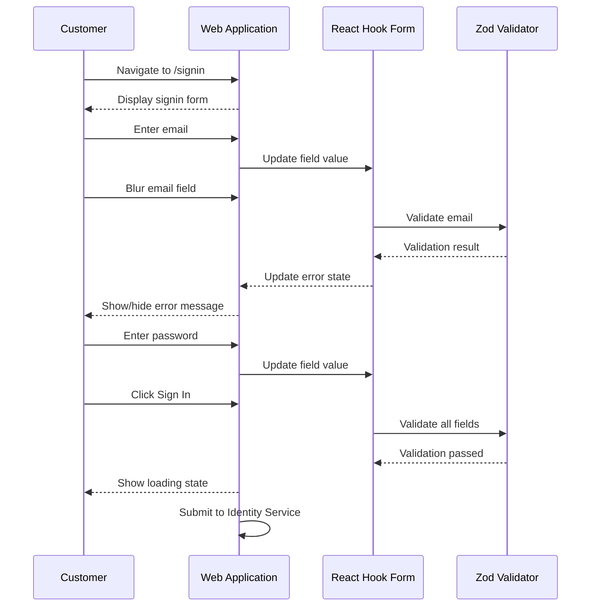

# US-0003-01: Signin Form UI

## User Story

**As a** registered ACME customer,
**I want** a clear and user-friendly signin form,
**So that** I can quickly access my account and continue shopping.

## Story Details

| Field        | Value                                          |
|--------------|------------------------------------------------|
| Story ID     | US-0003-01                                     |
| Epic         | [US-0003: Customer Signin](./README.md)        |
| Priority     | Must Have                                      |
| Phase        | Phase 1 (MVP)                                  |
| Story Points | 5                                              |

## Description

This story implements the customer-facing signin form in the web application. The form collects email and password credentials and provides real-time validation feedback. It also includes options for "Remember me", password visibility toggle, and links to forgot password and registration flows.

## UI Requirements

### Form Fields

| Field          | Type           | Required | Validation                        |
|----------------|----------------|----------|-----------------------------------|
| Email          | Text Input     | Yes      | Valid email format                |
| Password       | Password Input | Yes      | Non-empty                         |
| Remember Me    | Checkbox       | No       | Default unchecked                 |

### UI Components



### Page Layout



## Acceptance Criteria

### AC-0003-01-01: Email Field Validation

**Given** I am on the signin form
**When** I enter an invalid email format (e.g., "invalid-email")
**Then** an inline error message "Please enter a valid email address" appears within 200ms of field blur
**And** the email field is highlighted with an error state

**Given** I am on the signin form
**When** I enter a valid email format (e.g., "customer@example.com")
**Then** the error state is cleared

### AC-0003-01-02: Password Field Required

**Given** I am on the signin form
**When** I leave the password field empty and blur
**Then** an inline error message "Password is required" appears
**And** the password field is highlighted with an error state

### AC-0003-01-03: Password Show/Hide Toggle

**Given** I am entering a password
**When** I click the show/hide toggle icon
**Then** the password field toggles between masked (dots) and visible (text)
**And** the toggle icon changes to reflect the current state (eye/eye-off)

### AC-0003-01-04: Remember Me Default State

**Given** I navigate to the signin page
**Then** the "Remember me" checkbox is unchecked by default

### AC-0003-01-05: Submit Button Disabled State

**Given** I am on the signin form with empty or invalid fields
**Then** the submit button is disabled
**And** the button shows a muted/inactive visual state

**Given** all required fields are filled with valid data
**Then** the submit button becomes enabled
**And** the button shows an active/primary visual state

### AC-0003-01-06: Loading State During Submission

**Given** I have entered valid credentials
**When** I click the "Sign In" button
**Then** the form fields become disabled
**And** a loading spinner appears on the submit button
**And** the button text changes to "Signing in..."

### AC-0003-01-07: Keyboard Navigation

**Given** I am on the signin form
**When** I press Enter in the password field
**Then** the form is submitted (if valid)

**Given** I am on the signin form
**When** I press Tab
**Then** focus moves through fields in logical order: Email → Password → Remember Me → Sign In → Forgot Password → Create Account

### AC-0003-01-08: Page Load Performance

**Given** I navigate to the signin page
**Then** the page loads and becomes interactive within 1 second (p95)

### AC-0003-01-09: Forgot Password Link

**Given** I am on the signin form
**When** I click the "Forgot password?" link
**Then** I am navigated to the password reset page

### AC-0003-01-10: Create Account Link

**Given** I am on the signin form
**When** I click the "Create account" link
**Then** I am navigated to the registration page

## Technical Implementation

### Frontend Stack

- **Framework**: TanStack Start with React 19.2
- **Form Library**: React Hook Form
- **Validation**: Zod schemas
- **UI Components**: shadcn/ui
- **Styling**: Tailwind CSS 4
- **Routing**: TanStack Router

### Form Schema (Zod)

```typescript
import { z } from 'zod';

const signinSchema = z.object({
  email: z.string().email('Please enter a valid email address'),
  password: z.string().min(1, 'Password is required'),
  rememberMe: z.boolean().default(false),
});

type SigninFormData = z.infer<typeof signinSchema>;
```

### Component Structure

```
frontend-apps/customer/src/
├── components/
│   └── auth/
│       ├── SigninForm.tsx
│       ├── PasswordInput.tsx
│       └── RememberMeCheckbox.tsx
├── schemas/
│   └── signin.schema.ts
├── hooks/
│   └── useSignin.ts
└── routes/
    └── signin.tsx
```

### Sequence Diagram



### API Integration

The form submits to the Identity Service signin endpoint:

```typescript
interface SigninRequest {
  email: string;
  password: string;
  rememberMe: boolean;
  deviceFingerprint: string;
}

// POST /api/v1/auth/signin
```

### Accessibility Requirements

- All form fields have associated labels with `htmlFor`
- Error messages are announced by screen readers using `aria-live="polite"`
- Focus management moves to first error field on validation failure
- Color is not the only indicator of state (icons accompany colors)
- Tab order follows visual order
- Password toggle has accessible name "Show password" / "Hide password"
- Form has `aria-describedby` linking to error summary when present

## Definition of Done

- [ ] Signin form renders with all required fields
- [ ] Real-time validation works for all fields within 200ms of blur
- [ ] Submit button enables/disables based on form validity
- [ ] Loading state displays during form submission
- [ ] Password show/hide toggle works correctly
- [ ] Keyboard navigation follows expected order
- [ ] Accessibility audit passes (WCAG 2.1 AA)
- [ ] Unit tests cover validation logic (>90% coverage)
- [ ] Integration tests verify form behavior
- [ ] Responsive design works on mobile, tablet, desktop
- [ ] Code reviewed and approved
- [ ] Documentation updated

## Dependencies

- shadcn/ui components installed and configured
- TanStack Router configured with `/signin` route
- API client configured for Identity Service

## Related Documents

- [Journey Step 1: Customer Initiates Signin](../../journeys/0003-customer-signin.md#step-1-customer-initiates-signin)
- [US-0003-02: Credential Validation](./US-0003-02-credential-validation.md)
- [US-0003-13: Password Reset Flow](./US-0003-13-password-reset.md)
