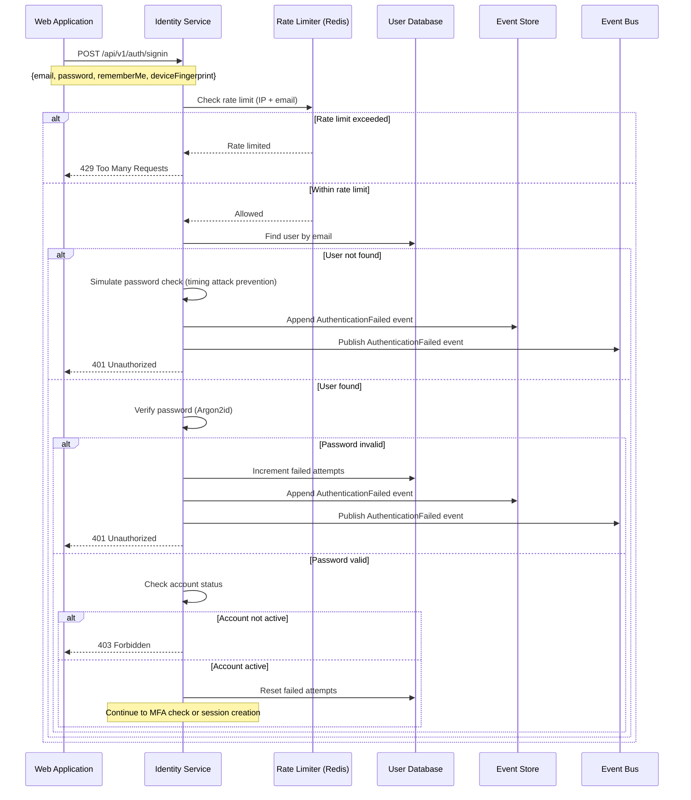
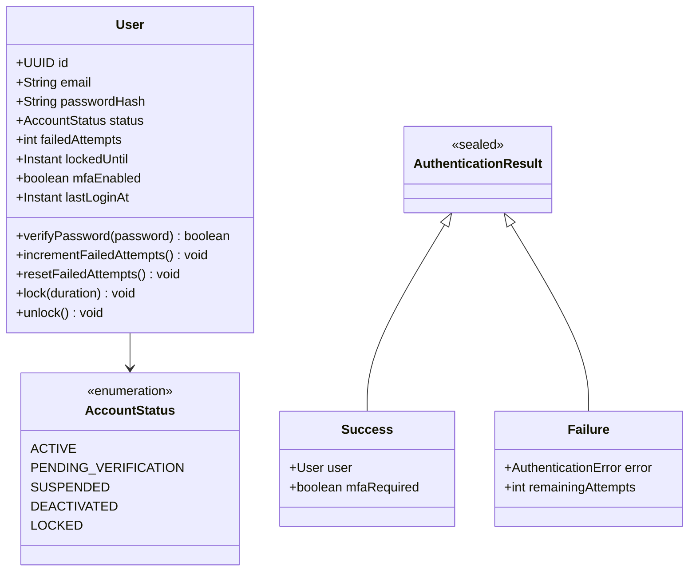

# US-0003-02: Credential Validation

## User Story

**As the** Identity Management Service,
**I want** to securely validate customer credentials,
**So that** only authenticated customers can access their accounts.

## Story Details

| Field        | Value                                          |
|--------------|------------------------------------------------|
| Story ID     | US-0003-02                                     |
| Epic         | [US-0003: Customer Signin](./README.md)        |
| Priority     | Must Have                                      |
| Phase        | Phase 1 (MVP)                                  |
| Story Points | 8                                              |

## Description

This story implements the core credential validation logic in the Identity Management Service. It handles password verification using secure hashing (Argon2id), validates account status, resets failed attempt counters on success, and publishes appropriate domain events.

## Technical Requirements

### Password Hashing

Passwords are verified using Argon2id with the following parameters:

| Parameter   | Value |
|-------------|-------|
| Memory Cost | 64 MB |
| Time Cost   | 3     |
| Parallelism | 4     |

### Account Status Validation

The service must check account status before allowing signin:

| Status               | Action                              |
|----------------------|-------------------------------------|
| ACTIVE               | Allow signin                        |
| PENDING_VERIFICATION | Return 403 with verification prompt |
| SUSPENDED            | Return 403 with support contact     |
| DEACTIVATED          | Return 403 with reactivation option |
| LOCKED               | Return 423 with lockout info        |

## Architecture

### Sequence Diagram



### Domain Model



## API Contract

### Request

```
POST /api/v1/auth/signin
Content-Type: application/json

{
  "email": "customer@example.com",
  "password": "SecureP@ss123",
  "rememberMe": false,
  "deviceFingerprint": "fp_abc123xyz789"
}
```

### Response (Success - No MFA)

```
HTTP/1.1 200 OK
Content-Type: application/json
Set-Cookie: access_token=<jwt>; HttpOnly; Secure; SameSite=Strict; Path=/; Max-Age=900
Set-Cookie: refresh_token=<jwt>; HttpOnly; Secure; SameSite=Strict; Path=/api/v1/auth/refresh; Max-Age=604800

{
  "status": "SUCCESS",
  "userId": "01941234-5678-7abc-def0-123456789abc",
  "expiresIn": 900
}
```

### Response (MFA Required)

```
HTTP/1.1 200 OK
Content-Type: application/json

{
  "status": "MFA_REQUIRED",
  "mfaToken": "mfa_01941234-5678-7abc-def0-123456789abc",
  "mfaMethods": ["TOTP", "SMS"],
  "expiresIn": 300
}
```

### Response (Invalid Credentials)

```
HTTP/1.1 401 Unauthorized
Content-Type: application/json

{
  "error": "INVALID_CREDENTIALS",
  "message": "Invalid email or password",
  "remainingAttempts": 3
}
```

### Response (Account Inactive)

```
HTTP/1.1 403 Forbidden
Content-Type: application/json

{
  "error": "ACCOUNT_INACTIVE",
  "message": "Account is not active",
  "reason": "PENDING_VERIFICATION",
  "supportUrl": "https://www.acme.com/support"
}
```

## Acceptance Criteria

### AC-0003-02-01: Password Verification with Argon2id

**Given** a user with stored password hash exists
**When** the Identity Service receives valid credentials
**Then** the password is verified using Argon2id with memory cost 64MB, time cost 3, parallelism 4
**And** the verification completes within 500ms (p95)

### AC-0003-02-02: Timing Attack Prevention

**Given** a signin request with a non-existent email
**When** the Identity Service processes the request
**Then** a simulated password check is performed
**And** the response time is consistent with valid email requests (within 50ms variance)

### AC-0003-02-03: Failed Attempts Counter

**Given** a user with 0 failed attempts
**When** an invalid password is submitted
**Then** the failed attempts counter is incremented to 1
**And** the response includes remaining attempts (4)

### AC-0003-02-04: Reset Failed Attempts on Success

**Given** a user with 3 failed attempts
**When** valid credentials are submitted
**Then** the failed attempts counter is reset to 0
**And** authentication succeeds

### AC-0003-02-05: Account Status Check

**Given** a user with PENDING_VERIFICATION status
**When** valid credentials are submitted
**Then** a 403 Forbidden response is returned
**And** the response includes reason "PENDING_VERIFICATION"
**And** the response includes instructions to verify email

### AC-0003-02-06: AuthenticationFailed Event

**Given** a signin attempt with invalid credentials
**When** the validation fails
**Then** an AuthenticationFailed event is published
**And** the event includes: email, reason, ipAddress, userAgent, failedAttemptCount

### AC-0003-02-07: MFA Check After Credential Validation

**Given** a user with MFA enabled
**When** valid credentials are submitted
**Then** the response status is "MFA_REQUIRED"
**And** the response includes an MFA token
**And** the response includes available MFA methods

### AC-0003-02-08: Device Fingerprint Capture

**Given** a signin request with device fingerprint
**When** the request is processed
**Then** the device fingerprint is stored for fraud detection
**And** the fingerprint is included in domain events

### AC-0003-02-09: Error Message Security

**Given** a signin request with invalid credentials
**When** the validation fails
**Then** the error message is generic "Invalid email or password"
**And** the message does not reveal whether the email exists

### AC-0003-02-10: Response Time Performance

**Given** the Identity Service is under normal load
**When** credential validation is performed
**Then** the response is returned within 500ms (p95)

## Technical Implementation

### Backend Stack

- **Framework**: Spring Boot 4 with Kotlin 2.2
- **Password Hashing**: Spring Security Argon2PasswordEncoder
- **Database**: PostgreSQL 16+ (Command Store)
- **Caching**: Caffeine for user lookup caching
- **Events**: Kafka with Avro schemas
- **Error Handling**: Arrow Kotlin Either

### Service Layer (Kotlin)

```kotlin
sealed interface AuthenticationError {
    data object InvalidCredentials : AuthenticationError
    data class AccountInactive(val status: AccountStatus) : AuthenticationError
    data object AccountLocked : AuthenticationError
    data object RateLimited : AuthenticationError
}

data class AuthenticationSuccess(
    val user: User,
    val mfaRequired: Boolean,
    val mfaToken: String? = null,
    val mfaMethods: List<MfaMethod> = emptyList()
)

@Service
class AuthenticationUseCase(
    private val userRepository: UserRepository,
    private val passwordEncoder: PasswordEncoder,
    private val rateLimiter: RateLimiter,
    private val eventPublisher: DomainEventPublisher
) {
    fun authenticate(request: SigninRequest): Either<AuthenticationError, AuthenticationSuccess> = either {
        // Check rate limit
        ensure(!rateLimiter.isLimited(request.ipAddress, request.email)) {
            AuthenticationError.RateLimited
        }

        // Find user (with timing attack prevention)
        val user = userRepository.findByEmail(request.email)
            ?: run {
                passwordEncoder.matches("dummy", DUMMY_HASH) // Timing attack prevention
                eventPublisher.publish(AuthenticationFailed(request.email, "USER_NOT_FOUND"))
                raise(AuthenticationError.InvalidCredentials)
            }

        // Verify password
        ensure(passwordEncoder.matches(request.password, user.passwordHash)) {
            user.incrementFailedAttempts()
            userRepository.save(user)
            eventPublisher.publish(AuthenticationFailed(request.email, "INVALID_PASSWORD"))
            AuthenticationError.InvalidCredentials
        }

        // Check account status
        ensure(user.status == AccountStatus.ACTIVE) {
            AuthenticationError.AccountInactive(user.status)
        }

        // Reset failed attempts
        user.resetFailedAttempts()
        userRepository.save(user)

        // Return success with MFA info
        AuthenticationSuccess(
            user = user,
            mfaRequired = user.mfaEnabled,
            mfaToken = if (user.mfaEnabled) generateMfaToken(user) else null,
            mfaMethods = if (user.mfaEnabled) user.mfaMethods else emptyList()
        )
    }
}
```

### Domain Event

```kotlin
data class AuthenticationFailed(
    override val eventId: UUID = UUID.randomUUID(),
    override val eventType: String = "AuthenticationFailed",
    override val eventVersion: String = "1.0",
    override val timestamp: Instant = Instant.now(),
    override val aggregateId: UUID,
    override val aggregateType: String = "User",
    val email: String,
    val reason: String,
    val ipAddress: String,
    val userAgent: String,
    val failedAttemptCount: Int
) : DomainEvent
```

## Definition of Done

- [ ] Password verification uses Argon2id with specified parameters
- [ ] Timing attack prevention implemented for non-existent users
- [ ] Failed attempts counter increments on invalid password
- [ ] Failed attempts reset on successful authentication
- [ ] Account status validation blocks inactive accounts
- [ ] AuthenticationFailed events published for all failures
- [ ] MFA status checked and response formatted appropriately
- [ ] Device fingerprint captured and stored
- [ ] Error messages do not leak account existence
- [ ] Response time within 500ms (p95)
- [ ] Unit tests cover all validation paths (>90% coverage)
- [ ] Integration tests verify database operations
- [ ] Code reviewed and approved

## Dependencies

- PostgreSQL database with users table
- Redis for rate limiting state
- Kafka for event publishing
- Argon2 encoder configured in Spring Security

## Related Documents

- [Journey Step 2: Identity Service Validates Credentials](../../journeys/0003-customer-signin.md#step-2-identity-service-validates-credentials)
- [US-0003-01: Signin Form UI](./US-0003-01-signin-form-ui.md)
- [US-0003-03: Rate Limiting](./US-0003-03-rate-limiting.md)
- [US-0003-04: Account Lockout](./US-0003-04-account-lockout.md)
