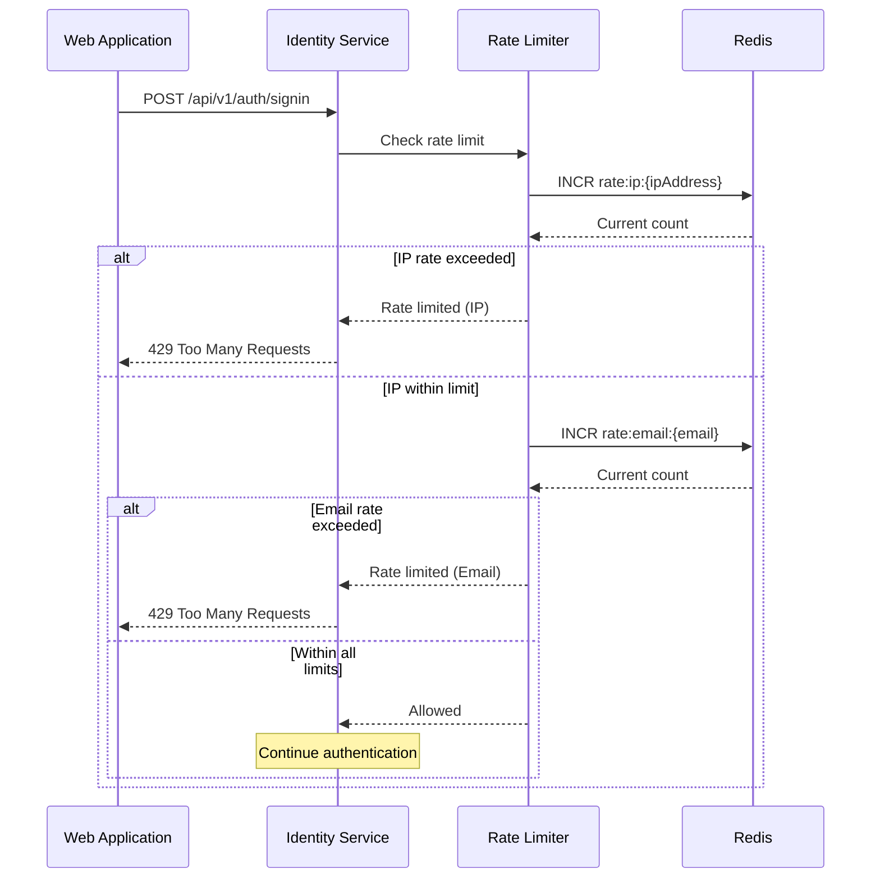
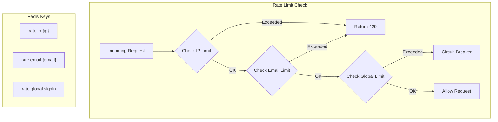

# US-0003-03: Rate Limiting for Signin

## User Story

**As the** Identity Management Service,
**I want** to enforce rate limits on signin attempts,
**So that** the platform is protected against brute force attacks and credential stuffing.

## Story Details

| Field        | Value                                          |
|--------------|------------------------------------------------|
| Story ID     | US-0003-03                                     |
| Epic         | [US-0003: Customer Signin](./README.md)        |
| Priority     | Must Have                                      |
| Phase        | Phase 1 (MVP)                                  |
| Story Points | 5                                              |

## Description

This story implements rate limiting for the signin endpoint to protect against automated attacks. Rate limits are applied both per IP address and per email address to prevent abuse while allowing legitimate users to retry after errors.

## Environment-Based Toggle

Rate limiting can be **disabled for testing environments** via an environment variable. This is critical for running acceptance tests and integration tests where rapid successive requests are necessary.

| Environment Variable       | Property                          | Default | Description                    |
|---------------------------|-----------------------------------|---------|--------------------------------|
| `RATE_LIMITING_ENABLED`   | `identity.rate-limiting.enabled`  | `true`  | Enable/disable rate limiting   |

### Usage in Testing

```bash
# Run acceptance tests with rate limiting disabled
RATE_LIMITING_ENABLED=false npm test

# Start Identity Service with rate limiting disabled
RATE_LIMITING_ENABLED=false ./gradlew bootRun

# Docker Compose override for testing
docker compose -f docker-compose.apps.yml up -d
# with environment: RATE_LIMITING_ENABLED=false
```

### Important Notes

- **Production**: Rate limiting should ALWAYS be enabled (`RATE_LIMITING_ENABLED=true`)
- **Testing**: Disable rate limiting to allow rapid automated test execution
- **Development**: Can be disabled for manual testing convenience
- When disabled, the rate limiter returns `Allowed` for all requests without hitting Redis

## Rate Limiting Rules

| Scope           | Limit                      | Window   | Lockout Duration |
|-----------------|----------------------------|----------|------------------|
| Per IP Address  | 10 requests                | 1 minute | Sliding window   |
| Per Email       | 5 requests                 | 1 minute | Sliding window   |
| Global Fallback | 1000 requests              | 1 minute | Circuit breaker  |

## Architecture

### Sequence Diagram



### Rate Limiter Flow



## API Contract

### Response (Rate Limited)

```
HTTP/1.1 429 Too Many Requests
Content-Type: application/json
Retry-After: 45
X-RateLimit-Limit: 10
X-RateLimit-Remaining: 0
X-RateLimit-Reset: 1705487445

{
  "error": "RATE_LIMITED",
  "message": "Too many signin attempts. Please try again later.",
  "retryAfter": 45
}
```

### Rate Limit Headers

All signin responses include rate limit headers:

| Header                | Description                            |
|-----------------------|----------------------------------------|
| X-RateLimit-Limit     | Maximum requests allowed in the window |
| X-RateLimit-Remaining | Requests remaining in current window   |
| X-RateLimit-Reset     | Unix timestamp when the window resets  |

## Acceptance Criteria

### AC-0003-03-01: IP-Based Rate Limiting

**Given** an IP address has made 10 signin requests in the last minute
**When** an 11th signin request is made from the same IP
**Then** a 429 Too Many Requests response is returned
**And** the response includes Retry-After header
**And** the response body includes the retry time in seconds

### AC-0003-03-02: Email-Based Rate Limiting

**Given** an email has been used in 5 signin requests in the last minute
**When** a 6th signin request is made for the same email
**Then** a 429 Too Many Requests response is returned
**And** the response message indicates too many attempts for this account

### AC-0003-03-03: Sliding Window Implementation

**Given** an IP made 10 requests starting at time T
**When** 30 seconds pass
**Then** the rate limit window has partially expired
**And** some requests are allowed again (sliding window behavior)

### AC-0003-03-04: Rate Limit Headers

**Given** a signin request is made
**When** the response is returned (success or failure)
**Then** the response includes X-RateLimit-Limit header
**And** the response includes X-RateLimit-Remaining header
**And** the response includes X-RateLimit-Reset header

### AC-0003-03-05: Retry-After Header Accuracy

**Given** a rate limit is exceeded
**When** a 429 response is returned
**Then** the Retry-After header contains the correct seconds until the window resets
**And** waiting that duration allows the next request through

### AC-0003-03-06: Different IPs Not Affected

**Given** IP address A has exceeded its rate limit
**When** a signin request comes from IP address B for the same email
**Then** IP B is not rate limited (unless it has its own limit exceeded)

### AC-0003-03-07: Successful Signin Does Not Reset Rate Limit

**Given** a user has made 4 signin attempts in the last minute
**When** the 5th attempt succeeds
**Then** the rate limit counter remains at 5
**And** subsequent requests continue to count against the limit

### AC-0003-03-08: Rate Limit Logging

**Given** a rate limit is exceeded
**When** a 429 response is returned
**Then** a warning log entry is created
**And** the log includes: IP address, email (hashed), limit type, current count

### AC-0003-03-09: Redis Failure Handling

**Given** Redis is unavailable
**When** a signin request is made
**Then** the rate limit check fails open (allows request)
**And** an error is logged
**And** an alert is triggered

### AC-0003-03-10: Configuration Toggling

**Given** rate limiting is disabled via configuration
**When** signin requests are made
**Then** no rate limiting is applied
**And** all requests are allowed through

## Technical Implementation

### Backend Stack

- **Framework**: Spring Boot 4 with Kotlin 2.2
- **Rate Limiter**: Custom implementation with Redis
- **Cache**: Redis for distributed rate limiting state
- **Configuration**: Spring properties for limits

### Configuration

```yaml
identity:
  rate-limiting:
    enabled: true
    signin:
      ip:
        limit: 10
        window-seconds: 60
      email:
        limit: 5
        window-seconds: 60
      global:
        limit: 1000
        window-seconds: 60
```

### Rate Limiter Service (Kotlin)

```kotlin
@Service
class RateLimiter(
    private val redisTemplate: StringRedisTemplate,
    private val config: RateLimitConfig
) {
    fun checkLimit(ipAddress: String, email: String): RateLimitResult {
        if (!config.enabled) {
            return RateLimitResult.Allowed(limit = 0, remaining = 0, resetAt = Instant.now())
        }

        // Check IP limit
        val ipKey = "rate:ip:$ipAddress"
        val ipResult = checkKey(ipKey, config.signin.ip.limit, config.signin.ip.windowSeconds)
        if (ipResult is RateLimitResult.Limited) {
            return ipResult
        }

        // Check email limit
        val emailHash = hashEmail(email)
        val emailKey = "rate:email:$emailHash"
        val emailResult = checkKey(emailKey, config.signin.email.limit, config.signin.email.windowSeconds)
        if (emailResult is RateLimitResult.Limited) {
            return emailResult
        }

        return ipResult
    }

    private fun checkKey(key: String, limit: Int, windowSeconds: Long): RateLimitResult {
        val count = redisTemplate.opsForValue().increment(key) ?: 1

        if (count == 1L) {
            redisTemplate.expire(key, Duration.ofSeconds(windowSeconds))
        }

        val ttl = redisTemplate.getExpire(key, TimeUnit.SECONDS)
        val resetAt = Instant.now().plusSeconds(ttl)

        return if (count > limit) {
            RateLimitResult.Limited(
                limit = limit,
                remaining = 0,
                resetAt = resetAt,
                retryAfter = ttl.toInt()
            )
        } else {
            RateLimitResult.Allowed(
                limit = limit,
                remaining = (limit - count).toInt(),
                resetAt = resetAt
            )
        }
    }

    private fun hashEmail(email: String): String {
        return MessageDigest.getInstance("SHA-256")
            .digest(email.lowercase().toByteArray())
            .fold("") { str, byte -> str + "%02x".format(byte) }
            .take(16)
    }
}

sealed interface RateLimitResult {
    val limit: Int
    val remaining: Int
    val resetAt: Instant

    data class Allowed(
        override val limit: Int,
        override val remaining: Int,
        override val resetAt: Instant
    ) : RateLimitResult

    data class Limited(
        override val limit: Int,
        override val remaining: Int,
        override val resetAt: Instant,
        val retryAfter: Int
    ) : RateLimitResult
}
```

### Response Headers Interceptor

```kotlin
@Component
class RateLimitHeaderInterceptor : HandlerInterceptor {
    override fun postHandle(
        request: HttpServletRequest,
        response: HttpServletResponse,
        handler: Any,
        modelAndView: ModelAndView?
    ) {
        val result = request.getAttribute("rateLimitResult") as? RateLimitResult ?: return

        response.setHeader("X-RateLimit-Limit", result.limit.toString())
        response.setHeader("X-RateLimit-Remaining", result.remaining.toString())
        response.setHeader("X-RateLimit-Reset", result.resetAt.epochSecond.toString())

        if (result is RateLimitResult.Limited) {
            response.setHeader("Retry-After", result.retryAfter.toString())
        }
    }
}
```

### Redis Key Structure

```
rate:ip:192.168.1.100           -> "7"   (TTL: 45s)
rate:email:a1b2c3d4e5f6g7h8     -> "3"   (TTL: 52s)
rate:global:signin              -> "847" (TTL: 38s)
```

## Definition of Done

- [ ] IP-based rate limiting enforces 10 requests per minute
- [ ] Email-based rate limiting enforces 5 requests per minute
- [ ] Sliding window algorithm correctly expires old requests
- [ ] Rate limit headers included in all responses
- [ ] Retry-After header accurate within 1 second
- [ ] Different IPs are independently rate limited
- [ ] Redis failure handling fails open with logging
- [ ] Rate limiting can be disabled via configuration
- [ ] Unit tests cover all rate limiting scenarios (>90% coverage)
- [ ] Integration tests verify Redis operations
- [ ] Load tests verify behavior under high traffic
- [ ] Code reviewed and approved

## Dependencies

- Redis cluster available and configured
- Spring Boot Redis starter configured
- Rate limit configuration properties defined

## Related Documents

- [Journey Step 2: Rate Limiting](../../journeys/0003-customer-signin.md#step-2-identity-service-validates-credentials)
- [US-0003-02: Credential Validation](./US-0003-02-credential-validation.md)
- [US-0003-04: Account Lockout](./US-0003-04-account-lockout.md)
